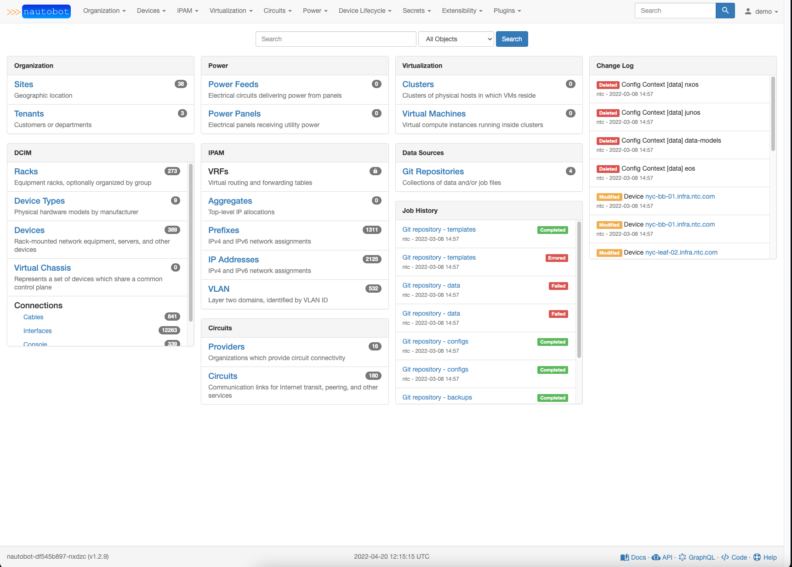
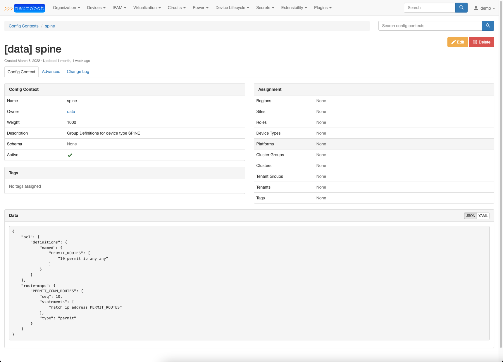
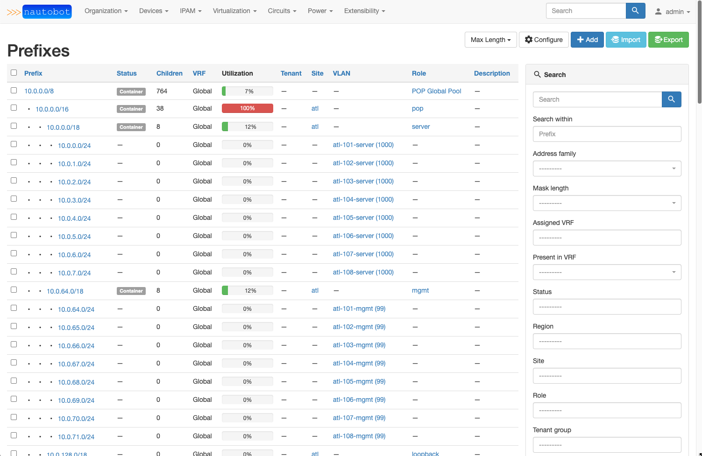

Nautobot is source of truth and automation platform for networks.

Nautobot runs as a web application atop the [Django](https://www.djangoproject.com/)
Python framework with a [PostgreSQL](https://www.postgresql.org/) database. 

The complete documentation for Nautobot can be found at [Read the Docs](https://nautobot.readthedocs.io/en/stable/).

Questions? Comments? Start by perusing our [GitHub discussions](https://github.com/nautobot/nautobot/discussions) for the topic you have in mind,
or join us in the **#nautobot** Slack channel on [NetworkToCode](https://networktocode.slack.com)!

### Build Status

|             | status |
|-------------|------------|
| **master** |  |
| **develop** |  |

### Screenshots

---

---

## Installation

Please see [the documentation](https://nautobot.readthedocs.io/en/stable/) for
instructions on installing Nautobot.

## Providing Feedback

The best platform for general feedback, assistance, and other discussion is our
[GitHub discussions](https://github.com/nautobot/nautobot/discussions).
To report a bug or request a specific feature, please open a GitHub issue using
the [appropriate template](https://github.com/nautobot/nautobot/issues/new/choose).

If you are interested in contributing to the development of Nautobot, please read
our [contributing guide](CONTRIBUTING.md) prior to beginning any work.

## Related projects

Please see [our wiki](https://github.com/nautobot/nautobot/wiki/Community-Contributions)
for a list of relevant community projects.
