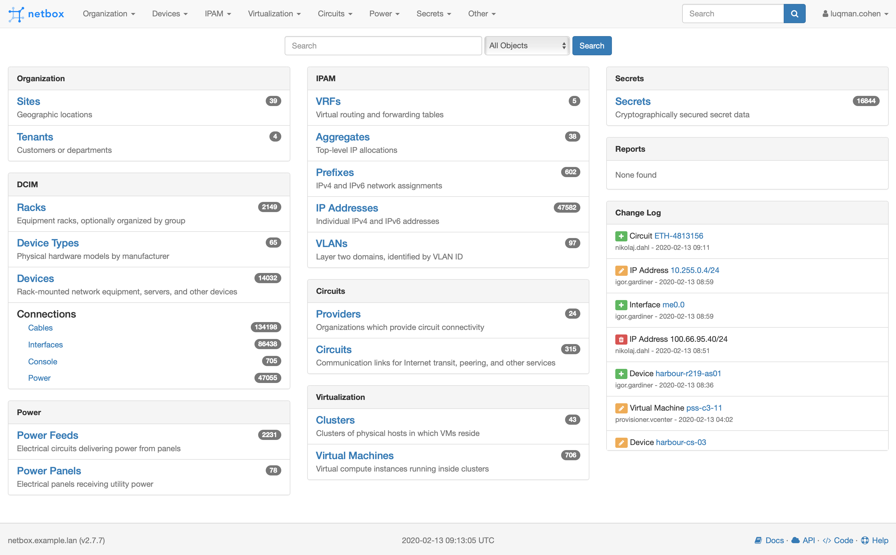
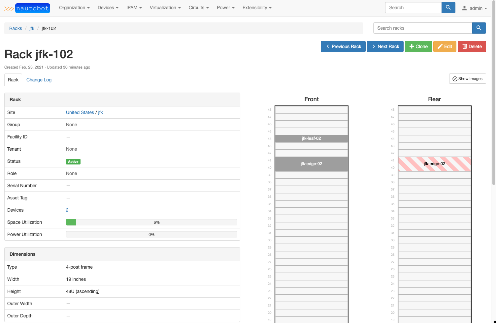
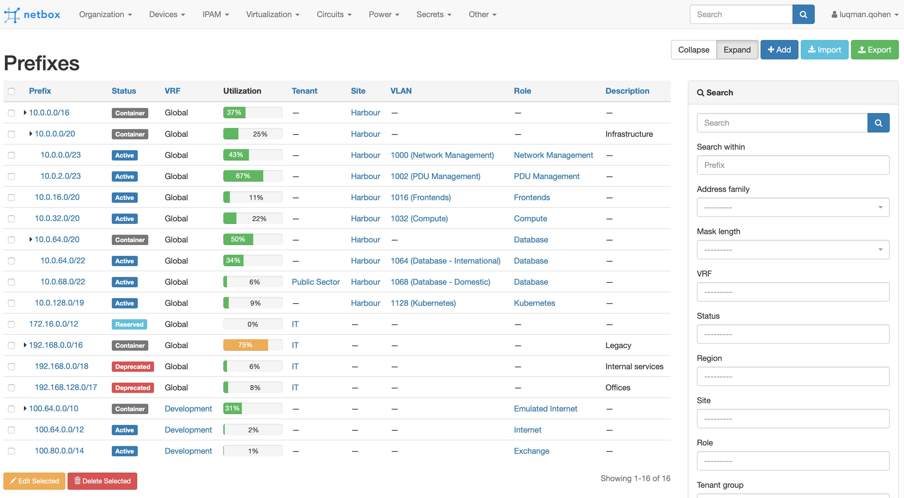

NetBox is an IP address management (IPAM) and data center infrastructure
management (DCIM) tool. Initially conceived by the network engineering team at
[DigitalOcean](https://www.digitalocean.com/), NetBox was developed specifically
to address the needs of network and infrastructure engineers.

NetBox runs as a web application atop the [Django](https://www.djangoproject.com/)
Python framework with a [PostgreSQL](http://www.postgresql.org/) database. For a
complete list of requirements, see `requirements.txt`. The code is available [on GitHub](https://github.com/digitalocean/netbox).

The complete documentation for NetBox can be found at [Read the Docs](http://netbox.readthedocs.io/en/stable/).

Questions? Comments? Please subscribe to [the netbox-discuss mailing list](https://groups.google.com/forum/#!forum/netbox-discuss),
or join us in the #netbox Slack channel on [NetworkToCode](https://networktocode.slack.com/)!

### Build Status

NetBox is built against both Python 2.7 and 3.5. Python 3.5 or higher is strongly recommended.

|             | status |
|-------------|------------|
| **master** |  |
| **develop** |  |

## Screenshots

# Installation

Please see [the documentation](http://netbox.readthedocs.io/en/stable/) for
instructions on installing NetBox. To upgrade NetBox, please download the [latest release](https://github.com/digitalocean/netbox/releases)
and run `upgrade.sh`.

## Alternative Installations

* [Docker container](https://github.com/ninech/netbox-docker) (via [@cimnine](https://github.com/cimnine))
* [Vagrant deployment](https://github.com/ryanmerolle/netbox-vagrant) (via [@ryanmerolle](https://github.com/ryanmerolle))
* [Ansible deployment](https://github.com/lae/ansible-role-netbox) (via [@lae](https://github.com/lae))

# Related projects

## Supported SDK

- [pynetbox](https://github.com/digitalocean/pynetbox) Python API client library for Netbox.

## Community SDK

- [netbox-client-ruby](https://github.com/ninech/netbox-client-ruby) A ruby client library for Netbox v2.

## Ansible Inventory

- [netbox-as-ansible-inventory](https://github.com/AAbouZaid/netbox-as-ansible-inventory) Ansible dynamic inventory script for Netbox.

