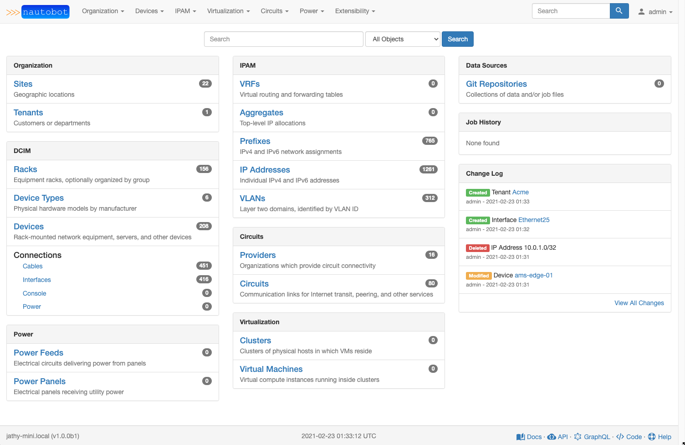

NetBox is an IP address management (IPAM) and data center infrastructure
management (DCIM) tool. Initially conceived by the network engineering team at
[DigitalOcean](https://www.digitalocean.com/), NetBox was developed specifically
to address the needs of network and infrastructure engineers. It is intended to
function as a domain-specific source of truth for network operations.

NetBox runs as a web application atop the [Django](https://www.djangoproject.com/)
Python framework with a [PostgreSQL](http://www.postgresql.org/) database. For a
complete list of requirements, see `requirements.txt`. The code is available [on GitHub](https://github.com/netbox-community/netbox).

The complete documentation for NetBox can be found at [Read the Docs](http://netbox.readthedocs.io/en/stable/).

Questions? Comments? Please start a [discussion on GitHub](https://github.com/netbox-community/netbox/discussions),
or join us in the **#netbox** Slack channel on [NetworkToCode](https://networktocode.slack.com/)!

### Build Status

|             | status |
|-------------|------------|
| **master** |  |
| **develop** |  |

### Screenshots

---

---

## Installation

Please see [the documentation](http://netbox.readthedocs.io/en/stable/) for
instructions on installing NetBox. To upgrade NetBox, please download the [latest release](https://github.com/netbox-community/netbox/releases)
and run `upgrade.sh`.

## Providing Feedback

Feature requests and bug reports must be submitted as GiHub issues. (Please be
sure to use the [appropriate template](https://github.com/netbox-community/netbox/issues/new/choose).)
For general discussion, please consider joining our [mailing list](https://groups.google.com/g/netbox-discuss).

If you are interested in contributing to the development of NetBox, please read
our [contributing guide](CONTRIBUTING.md) prior to beginning any work.

## Related projects

Please see [our wiki](https://github.com/netbox-community/netbox/wiki/Community-Contributions) for a list of relevant community projects.
