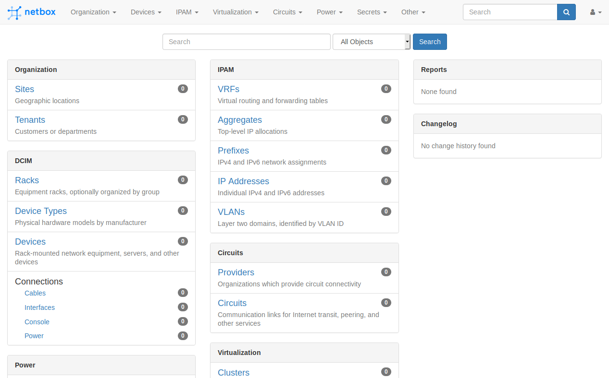

# NetBox Installation

This section of the documentation discusses installing and configuring the NetBox application itself.

## Install System Packages

Begin by installing all system packages required by NetBox and its dependencies.

!!! note
    NetBox v2.8.0 and later require Python 3.6, 3.7, or 3.8. This documentation assumes Python 3.6.

### Ubuntu

```no-highlight
sudo apt install -y python3.6 python3-pip python3-venv python3-dev build-essential libxml2-dev libxslt1-dev libffi-dev libpq-dev libssl-dev zlib1g-dev
```

### CentOS

```no-highlight
sudo yum install -y gcc python36 python36-devel python3-pip libxml2-devel libxslt-devel libffi-devel openssl-devel redhat-rpm-config
```

Before continuing with either platform, update pip (Python's package management tool) to its latest release:

```no-highlight
sudo pip3 install --upgrade pip
```

## Download NetBox

This documentation provides two options for installing NetBox: from a downloadable archive, or from the git repository. Installing from a package (option A below) requires manually fetching and extracting the archive for every future update, whereas installation via git (option B) allows for seamless upgrades by re-pulling the `master` branch.

### Option A: Download a Release Archive

Download the [latest stable release](https://github.com/netbox-community/netbox/releases) from GitHub as a tarball or ZIP archive and extract it to your desired path. In this example, we'll use `/opt/netbox` as the NetBox root.

```no-highlight
$ sudo wget https://github.com/netbox-community/netbox/archive/vX.Y.Z.tar.gz
$ sudo tar -xzf vX.Y.Z.tar.gz -C /opt
$ sudo ln -s /opt/netbox-X.Y.Z/ /opt/netbox
$ ls -l /opt | grep netbox
lrwxrwxrwx  1 root root         13 Jul 20 13:44 netbox -> netbox-2.9.0/
drwxr-xr-x  2 root root       4096 Jul 20 13:44 netbox-2.9.0
```

!!! note
    It is recommended to install NetBox in a directory named for its version number. For example, NetBox v2.9.0 would be installed into `/opt/netbox-2.9.0`, and a symlink from `/opt/netbox/` would point to this location. This allows for future releases to be installed in parallel without interrupting the current installation. When changing to the new release, only the symlink needs to be updated.

### Option B: Clone the Git Repository

Create the base directory for the NetBox installation. For this guide, we'll use `/opt/netbox`.

```no-highlight
sudo mkdir -p /opt/netbox/ && cd /opt/netbox/
```

If `git` is not already installed, install it:

#### Ubuntu

```no-highlight
sudo apt install -y git
```

#### CentOS

```no-highlight
sudo yum install -y git
```

Next, clone the **master** branch of the NetBox GitHub repository into the current directory. (This branch always holds the current stable release.)

```no-highlight
$ sudo git clone -b master https://github.com/netbox-community/netbox.git .
Cloning into '.'...
remote: Counting objects: 1994, done.
remote: Compressing objects: 100% (150/150), done.
remote: Total 1994 (delta 80), reused 0 (delta 0), pack-reused 1842
Receiving objects: 100% (1994/1994), 472.36 KiB | 0 bytes/s, done.
Resolving deltas: 100% (1495/1495), done.
Checking connectivity... done.
```

!!! note
    Installation via git also allows you to easily try out development versions of NetBox. The `develop` branch contains all work underway for the next minor release, and the `develop-x.y` branch (if present) tracks progress on the next major release. 

## Create the NetBox System User

Create a system user account named `netbox`. We'll configure the WSGI and HTTP services to run under this account. We'll also assign this user ownership of the media directory. This ensures that NetBox will be able to save uploaded files.

#### Ubuntu

```
sudo adduser --system --group netbox
sudo chown --recursive netbox /opt/netbox/netbox/media/
```

#### CentOS

```
sudo groupadd --system netbox
sudo adduser --system -g netbox netbox
sudo chown --recursive netbox /opt/netbox/netbox/media/
```

## Configuration

Move into the NetBox configuration directory and make a copy of `configuration.example.py` named `configuration.py`. This file will hold all of your local configuration parameters.

```no-highlight
cd /opt/netbox/netbox/netbox/
sudo cp configuration.example.py configuration.py
```

Open `configuration.py` with your preferred editor to begin configuring NetBox. NetBox offers [many configuration parameters](/configuration/), but only the following four are required for new installations:

* `ALLOWED_HOSTS`
* `DATABASE`
* `REDIS`
* `SECRET_KEY`

### ALLOWED_HOSTS

This is a list of the valid hostnames and IP addresses by which this server can be reached. You must specify at least one name or IP address. (Note that this does not restrict the locations from which NetBox may be accessed: It is merely for [HTTP host header validation](https://docs.djangoproject.com/en/3.0/topics/security/#host-headers-virtual-hosting).)

```python
ALLOWED_HOSTS = ['netbox.example.com', '192.0.2.123']
```

If you are not yet sure what the domain name and/or IP address of the NetBox installation will be, you can set this to a wildcard (asterisk) to allow all host values:

```python
ALLOWED_HOSTS = ['*']
```

### DATABASE

This parameter holds the database configuration details. You must define the username and password used when you configured PostgreSQL. If the service is running on a remote host, update the `HOST` and `PORT` parameters accordingly. See the [configuration documentation](/configuration/required-settings/#database) for more detail on individual parameters.

```python
DATABASE = {
    'NAME': 'netbox',               # Database name
    'USER': 'netbox',               # PostgreSQL username
    'PASSWORD': 'J5brHrAXFLQSif0K', # PostgreSQL password
    'HOST': 'localhost',            # Database server
    'PORT': '',                     # Database port (leave blank for default)
    'CONN_MAX_AGE': 300,            # Max database connection age (seconds)
}
```

### REDIS

Redis is a in-memory key-value store used by NetBox for caching and background task queuing. Redis typically requires minimal configuration; the values below should suffice for most installations. See the [configuration documentation](/configuration/required-settings/#redis) for more detail on individual parameters.

Note that NetBox requires the specification of two separate Redis databases: `tasks` and `caching`. These may both be provided by the same Redis service, however each should have a unique numeric database ID.

```python
REDIS = {
    'tasks': {
        'HOST': 'localhost',      # Redis server
        'PORT': 6379,             # Redis port
        'PASSWORD': '',           # Redis password (optional)
        'DATABASE': 0,            # Database ID
        'SSL': False,             # Use SSL (optional)
    },
    'caching': {
        'HOST': 'localhost',
        'PORT': 6379,
        'PASSWORD': '',
        'DATABASE': 1,            # Unique ID for second database
        'SSL': False,
    }
}
```

### SECRET_KEY

This parameter must be assigned a randomly-generated key employed as a salt for hashing and related cryptographic functions. (Note, however, that it is _never_ directly used in the encryption of secret data.) This key must be unique to this installation and is recommended to be at least 50 characters long. It should not be shared outside the local system.

A simple Python script named `generate_secret_key.py` is provided in the parent directory to assist in generating a suitable key:

```no-highlight
python3 ../generate_secret_key.py
```

!!! warning
    In the case of a highly available installation with multiple web servers, `SECRET_KEY` must be identical among all servers in order to maintain a persistent user session state.

When you have finished modifying the configuration, remember to save the file.

## Optional Requirements

All Python packages required by NetBox are listed in `requirements.txt` and will be installed automatically. NetBox also supports some optional packages. If desired, these packages must be listed in `local_requirements.txt` within the NetBox root directory.

### NAPALM

The [NAPALM automation](https://napalm-automation.net/) library allows NetBox to fetch live data from devices and return it to a requester via its REST API. The `NAPALM_USERNAME` and `NAPALM_PASSWORD` configuration parameters define the credentials to be used when connecting to a device.

```no-highlight
sudo echo napalm >> /opt/netbox/local_requirements.txt
```

### Remote File Storage

By default, NetBox will use the local filesystem to store uploaded files. To use a remote filesystem, install the [`django-storages`](https://django-storages.readthedocs.io/en/stable/) library and configure your [desired storage backend](/configuration/optional-settings/#storage_backend) in `configuration.py`.

```no-highlight
sudo echo django-storages >> /opt/netbox/local_requirements.txt
```

## Run the Upgrade Script

Once NetBox has been configured, we're ready to proceed with the actual installation. We'll run the packaged upgrade script (`upgrade.sh`) to perform the following actions:

* Create a Python virtual environment
* Install all required Python packages
* Run database schema migrations
* Aggregate static resource files on disk

```no-highlight
sudo /opt/netbox/upgrade.sh
```

!!! note
    Upon completion, the upgrade script may warn that no existing virtual environment was detected. As this is a new installation, this warning can be safely ignored.

## Create a Super User

NetBox does not come with any predefined user accounts. You'll need to create a super user (administrative account) to be able to log into NetBox. First, enter the Python virtual environment created by the upgrade script:

```no-highlight
source /opt/netbox/venv/bin/activate
```

Once the virtual environment has been activated, you should notice the string `(venv)` prepended to your console prompt.

Next, we'll create a superuser account using the `createsuperuser` Django management command (via `manage.py`). Specifying an email address for the user is not required, but be sure to use a very strong password.

```no-highlight
(venv) $ cd /opt/netbox/netbox
(venv) $ python3 manage.py createsuperuser
Username: admin
Email address: admin@example.com
Password:
Password (again):
Superuser created successfully.
```

## Test the Application

At this point, we should be able to run NetBox's development server for testing. We can check by starting a development instance:

```no-highlight
(venv) $ python3 manage.py runserver 0.0.0.0:8000 --insecure
Performing system checks...

System check identified no issues (0 silenced).
November 17, 2020 - 16:08:13
Django version 3.1.3, using settings 'netbox.settings'
Starting development server at http://0.0.0.0:8000/
Quit the server with CONTROL-C.
```

Next, connect to the name or IP of the server (as defined in `ALLOWED_HOSTS`) on port 8000; for example, <http://127.0.0.1:8000/>. You should be greeted with the NetBox home page.

!!! warning
    The development server is for development and testing purposes only. It is neither performant nor secure enough for production use. **Do not use it in production.**

!!! warning
    If the test service does not run, or you cannot reach the NetBox home page, something has gone wrong. Do not proceed with the rest of this guide until the installation has been corrected.

Note that the initial user interface will be locked down for non-authenticated users.


Try logging in using the superuser account we just created. Once authenticated, you'll be able to access all areas of the UI:



Type `Ctrl+c` to stop the development server.
