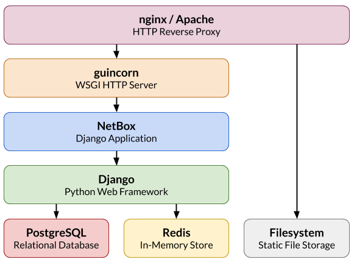

# Installation

The installation instructions provided here have been tested to work on Ubuntu 20.04 and CentOS 8.2. The particular commands needed to install dependencies on other distributions may vary significantly. Unfortunately, this is outside the control of the NetBox maintainers. Please consult your distribution's documentation for assistance with any errors.

The following sections detail how to set up a new instance of NetBox:

1. [PostgreSQL database](1-postgresql.md)
1. [Redis](2-redis.md)
3. [NetBox components](3-netbox.md)
4. [Gunicorn](4-gunicorn.md)
5. [HTTP server](5-http-server.md)
6. [LDAP authentication](6-ldap.md) (optional)

## Requirements

| Dependency | Minimum Version |
|------------|-----------------|
| Python     | 3.6             |
| PostgreSQL | 9.6             |
| Redis      | 4.0             |

Below is a simplified overview of the NetBox application stack for reference:

## Upgrading

If you are upgrading from an existing installation, please consult the [upgrading guide](upgrading.md).

!!! note
    Beginning with v2.5.9, the official documentation calls for systemd to be used for managing the WSGI workers in place of supervisord.  Please see the instructions for [migrating to systemd](migrating-to-systemd.md) if you are still using supervisord.
