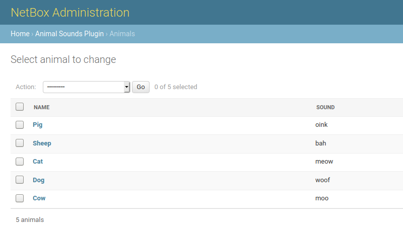

# Plugin Development

This documentation covers the development of custom plugins for NetBox. Plugins are essentially self-contained [Django apps](https://docs.djangoproject.com/en/stable/) which integrate with NetBox to provide custom functionality. Since the development of Django apps is already very well-documented, we'll only be covering the aspects that are specific to NetBox.

Plugins can do a lot, including:

* Create Django models to store data in the database
* Provide their own "pages" (views) in the web user interface
* Inject template content and navigation links
* Establish their own REST API endpoints
* Add custom request/response middleware

However, keep in mind that each piece of functionality is entirely optional. For example, if your plugin merely adds a piece of middleware or an API endpoint for existing data, there's no need to define any new models.

!!! warning
    While very powerful, the NetBox plugins API is necessarily limited in its scope. The plugins API is discussed here in its entirety: Any part of the NetBox code base not documented here is _not_ part of the supported plugins API, and should not be employed by a plugin. Internal elements of NetBox are subject to change at any time and without warning. Plugin authors are **strongly** encouraged to develop plugins using only the officially supported components discussed here and those provided by the underlying Django framework so as to avoid breaking changes in future releases. 

## Initial Setup

## Plugin Structure

Although the specific structure of a plugin is largely left to the discretion of its authors, a typical NetBox plugin looks something like this:

```no-highlight
plugin_name/
  - plugin_name/
    - templates/
      - plugin_name/
        - *.html
    - __init__.py
    - middleware.py
    - navigation.py
    - signals.py
    - template_content.py
    - urls.py
    - views.py
  - README
  - setup.py
```

The top level is the project root. Immediately within the root should exist several items:

* `setup.py` - This is a standard installation script used to install the plugin package within the Python environment.
* `README` - A brief introduction to your plugin, how to install and configure it, where to find help, and any other pertinent information. It is recommended to write README files using a markup language such as Markdown.
* The plugin source directory, with the same name as your plugin.

The plugin source directory contains all of the actual Python code and other resources used by your plugin. Its structure is left to the author's discretion, however it is recommended to follow best practices as outlined in the [Django documentation](https://docs.djangoproject.com/en/stable/intro/reusable-apps/). At a minimum, this directory **must** contain an `__init__.py` file containing an instance of NetBox's `PluginConfig` class.

### Create setup.py

`setup.py` is the [setup script](https://docs.python.org/3.6/distutils/setupscript.html) we'll use to install our plugin once it's finished. The primary function of this script is to call the setuptools library's `setup()` function to create a Python distribution package. We can pass a number of keyword arguments to inform the package creation as well as to provide metadata about the plugin. An example `setup.py` is below:

```python
from setuptools import find_packages, setup

setup(
    name='netbox-animal-sounds',
    version='0.1',
    description='An example NetBox plugin',
    url='https://github.com/netbox-community/netbox-animal-sounds',
    author='Jeremy Stretch',
    license='Apache 2.0',
    install_requires=[],
    packages=find_packages(),
    include_package_data=True,
)
```

Many of these are self-explanatory, but for more information, see the [setuptools documentation](https://setuptools.readthedocs.io/en/latest/setuptools.html).

### Define a PluginConfig

The `PluginConfig` class is a NetBox-specific wrapper around Django's built-in [`AppConfig`](https://docs.djangoproject.com/en/stable/ref/applications/) class. It is used to declare NetBox plugin functionality within a Python package. Each plugin should provide its own subclass, defining its name, metadata, and default and required configuration parameters. An example is below:

```python
from extras.plugins import PluginConfig

class AnimalSoundsConfig(PluginConfig):
    name = 'netbox_animal_sounds'
    verbose_name = 'Animal Sounds'
    description = 'An example plugin for development purposes'
    version = '0.1'
    author = 'Jeremy Stretch'
    author_email = 'author@example.com'
    base_url = 'animal-sounds'
    required_settings = []
    default_settings = {
        'loud': False
    }

config = AnimalSoundsConfig
```

NetBox looks for the `config` variable within a plugin's `__init__.py` to load its configuration. Typically, this will be set to the PluginConfig subclass, but you may wish to dynamically generate a PluginConfig class based on environment variables or other factors.

#### PluginConfig Attributes

| Name | Description |
| ---- | ----------- |
| `name` | Raw plugin name; same as the plugin's source directory |
| `verbose_name` | Human-friendly name for the plugin |
| `version` | Current release ([semantic versioning](https://semver.org/) is encouraged) |
| `description` | Brief description of the plugin's purpose |
| `author` | Name of plugin's author |
| `author_email` | Author's public email address |
| `base_url` | Base path to use for plugin URLs (optional). If not specified, the project's `name` will be used. |
| `required_settings` | A list of any configuration parameters that **must** be defined by the user |
| `default_settings` | A dictionary of configuration parameters and their default values |
| `min_version` | Minimum version of NetBox with which the plugin is compatible |
| `max_version` | Maximum version of NetBox with which the plugin is compatible |
| `middleware` | A list of middleware classes to append after NetBox's build-in middleware |
| `caching_config` | Plugin-specific cache configuration
| `template_extensions` | The dotted path to the list of template extension classes (default: `template_content.template_extensions`) |
| `menu_items` | The dotted path to the list of menu items provided by the plugin (default: `navigation.menu_items`) |

All required settings must be configured by the user. If a configuration parameter is listed in both `required_settings` and `default_settings`, the default setting will be ignored.

### Install the Plugin for Development

To ease development, it is recommended to go ahead and install the plugin at this point using setuptools' `develop` mode. This will create symbolic links within your Python environment to the plugin development directory. Call `setup.py` from the plugin's root directory with the `develop` argument (instead of `install`):

```no-highlight
$ python setup.py develop
```

## Database Models

If your plugin introduces a new type of object in NetBox, you'll probably want to create a [Django model](https://docs.djangoproject.com/en/stable/topics/db/models/) for it. A model is essentially a Python representation of a database table, with attributes that represent individual columns. Model instances can be created, manipulated, and deleted using [queries](https://docs.djangoproject.com/en/stable/topics/db/queries/). Models must be defined within a file named `models.py`.

Below is an example `models.py` file containing a model with two character fields:

```python
from django.db import models

class Animal(models.Model):
    name = models.CharField(max_length=50)
    sound = models.CharField(max_length=50)

    def __str__(self):
        return self.name
```

Once you have defined the model(s) for your plugin, you'll need to create the database schema migrations. A migration file is essentially a set of instructions for manipulating the PostgreSQL database to support your new model, or to alter existing models. Creating migrations can usually be done automatically using Django's `makemigrations` management command.

!!! note
    A plugin must be installed before it can be used with Django management commands. If you skipped this step above, run `python setup.py develop` from the plugin's root directory.

```no-highlight
$ ./manage.py makemigrations netbox_animal_sounds 
Migrations for 'netbox_animal_sounds':
  /home/jstretch/animal_sounds/netbox_animal_sounds/migrations/0001_initial.py
    - Create model Animal
```

Next, we can apply the migration to the database with the `migrate` command:

```no-highlight
$ ./manage.py migrate netbox_animal_sounds
Operations to perform:
  Apply all migrations: netbox_animal_sounds
Running migrations:
  Applying netbox_animal_sounds.0001_initial... OK
```

For more background on schema migrations, see the [Django documentation](https://docs.djangoproject.com/en/stable/topics/migrations/).

### Using the Django Admin Interface

Plugins can optionally expose their models via Django's built-in [administrative interface](https://docs.djangoproject.com/en/stable/ref/contrib/admin/). This can greatly improve troubleshooting ability, particularly during development. To expose a model, simply register it using Django's `admin.register()` function. An example `admin.py` file for the above model is shown below:

```python
from django.contrib import admin
from .models import Animal

@admin.register(Animal)
class AnimalAdmin(admin.ModelAdmin):
    list_display = ('name', 'sound')
``` 

This will display the plugin and its model in the admin UI. Staff users can create, change, and delete model instances via the admin UI without needing to create a custom view.



## Views

If your plugin needs its own page or pages in the NetBox web UI, you'll need to define views. A view is a particular page tied to a URL within NetBox, which renders content using a template. Views are typically defined in `views.py`, and URL patterns in `urls.py`. As an example, let's write a view which displays a random animal and the sound it makes. First, we'll create the view in `views.py`:

```python
from django.shortcuts import render
from django.views.generic import View
from .models import Animal

class RandomAnimalView(View):
    """
    Display a randomly-selected animal.
    """
    def get(self, request):
        animal = Animal.objects.order_by('?').first()
        return render(request, 'netbox_animal_sounds/animal.html', {
            'animal': animal,
        })
```

This view retrieves a random animal from the database and and passes it as a context variable when rendering a template named `animal.html`, which doesn't exist yet. To create this template, first create a directory named `templates/netbox_animal_sounds/` within the plugin source directory. (We use the plugin's name as a subdirectory to guard against naming collisions with other plugins.) Then, create a template named `animal.html` as described below.

### Extending the Base Template

NetBox provides a base template to ensure a consistent user experience, which plugins can extend with their own content. This template includes four content blocks:

* `title` - The page title
* `header` - The upper portion of the page
* `content` - The main page body
* `javascript` - A section at the end of the page for including Javascript code

For more information on how template blocks work, consult the [Django documentation](https://docs.djangoproject.com/en/stable/ref/templates/builtins/#block).

```jinja2



    
        <h2 class="text-center" style="margin-top: 200px">
            
                The {{ animal.name|lower }} says
                
                    {{ animal.sound|upper }}!
                
                    {{ animal.sound }}
                
            
                No animals have been created yet!
            
        </h2>
    


```

The first line of the template instructs Django to extend the NetBox base template and inject our custom content within its `content` block.

!!! note
    Django renders templates with its own custom [template language](https://docs.djangoproject.com/en/stable/topics/templates/#the-django-template-language). This is very similar to Jinja2, however there are some important differences to be aware of.

Finally, to make the view accessible to users, we need to register a URL for it. We do this in `urls.py` by defining a `urlpatterns` variable containing a list of paths.

```python
from django.urls import path
from . import views

urlpatterns = [
    path('random/', views.RandomAnimalView.as_view(), name='random_animal'),
]
```

A URL pattern has three components:

* `route` - The unique portion of the URL dedicated to this view
* `view` - The view itself
* `name` - A short name used to identify the URL path internally

This makes our view accessible at the URL `/plugins/animal-sounds/random/`. (Remember, our `AnimalSoundsConfig` class sets our plugin's base URL to `animal-sounds`.) Viewing this URL should show the base NetBox template with our custom content inside it.

## REST API Endpoints

Plugins can declare custom endpoints on NetBox's REST API to retrieve or manipulate models or other data. These behave very similarly to views, except that instead of rendering arbitrary content using a template, data is returned in JSON format using a serializer. NetBox uses the [Django REST Framework](https://www.django-rest-framework.org/), which makes writing API serializers and views very simple.

First, we'll create a serializer for our `Animal` model, in `api/serializers.py`:

```python
from rest_framework.serializers import ModelSerializer
from netbox_animal_sounds.models import Animal

class AnimalSerializer(ModelSerializer):

    class Meta:
        model = Animal
        fields = ('id', 'name', 'sound')
```

Next, we'll create a generic API view set that allows basic CRUD (create, read, update, and delete) operations for Animal instances. This is defined in `api/views.py`:

```python
from rest_framework.viewsets import ModelViewSet
from netbox_animal_sounds.models import Animal
from .serializers import AnimalSerializer

class AnimalViewSet(ModelViewSet):
    queryset = Animal.objects.all()
    serializer_class = AnimalSerializer
```

Finally, we'll register a URL for our endpoint in `api/urls.py`. This file **must** define a variable named `urlpatterns`.

```python
from rest_framework import routers
from .views import AnimalViewSet

router = routers.DefaultRouter()
router.register('animals', AnimalViewSet)
urlpatterns = router.urls
```

With these three components in place, we can request `/api/plugins/animal-sounds/animals/` to retrieve a list of all Animal objects defined.


!!! warning
    This example is provided as a minimal reference implementation only. It does not address authentication, performance, or myriad other concerns that plugin authors should have.

## Navigation Menu Items

To make its views easily accessible to users, a plugin can inject items in NetBox's navigation menu under the "Plugins" header. Menu items are added by defining a list of PluginMenuItem instances. By default, this should be a variable named `menu_items` in the file `navigation.py`. An example is shown below.

```python
from extras.plugins import PluginMenuButton, PluginMenuItem
from utilities.choices import ButtonColorChoices

menu_items = (
    PluginMenuItem(
        link='plugins:netbox_animal_sounds:random_animal',
        link_text='Random sound',
        buttons=(
            PluginMenuButton('home', 'Button A', 'fa fa-info', ButtonColorChoices.BLUE),
            PluginMenuButton('home', 'Button B', 'fa fa-warning', ButtonColorChoices.GREEN),
        )
    ),
)
```

A `PluginMenuItem` has the following attributes:

* `link` - The name of the URL path to which this menu item links
* `link_text` - The text presented to the user
* `permissions` - A list of permissions required to display this link (optional)
* `buttons` - An iterable of PluginMenuButton instances to display (optional)

A `PluginMenuButton` has the following attributes:

* `link` - The name of the URL path to which this button links
* `title` - The tooltip text (displayed when the mouse hovers over the button)
* `icon_class` - Button icon CSS class (NetBox currently supports [Font Awesome 4.7](https://fontawesome.com/v4.7.0/icons/))
* `color` - One of the choices provided by `ButtonColorChoices` (optional)
* `permissions` - A list of permissions required to display this button (optional)

!!! note
    Any buttons associated within a menu item will be shown only if the user has permission to view the link, regardless of what permissions are set on the buttons.

## Extending Core Templates

Plugins can inject custom content into certain areas of the detail views of applicable models. This is accomplished by subclassing `PluginTemplateExtension`, designating a particular NetBox model, and defining the desired methods to render custom content. Four methods are available:

* `left_page()` - Inject content on the left side of the page
* `right_page()` - Inject content on the right side of the page
* `full_width_page()` - Inject content across the entire bottom of the page
* `buttons()` - Add buttons to the top of the page

Additionally, a `render()` method is available for convenience. This method accepts the name of a template to render, and any additional context data you want to pass. Its use is optional, however.

When a PluginTemplateExtension is instantiated, context data is assigned to `self.context`. Available data include:

* `object` - The object being viewed
* `request` - The current request
* `settings` - Global NetBox settings
* `config` - Plugin-specific configuration parameters

For example, accessing `{{ request.user }}` within a template will return the current user.

Declared subclasses should be gathered into a list or tuple for integration with NetBox. By default, NetBox looks for an iterable named `template_extensions` within a `template_content.py` file. (This can be overridden by setting `template_extensions` to a custom value on the plugin's PluginConfig.) An example is below.

```python
from extras.plugins import PluginTemplateExtension
from .models import Animal

class SiteAnimalCount(PluginTemplateExtension):
    model = 'dcim.site'

    def right_page(self):
        return self.render('netbox_animal_sounds/inc/animal_count.html', extra_context={
            'animal_count': Animal.objects.count(),
        })

template_extensions = [SiteAnimalCount]
```

## Caching Configuration

By default, all query operations within a plugin are cached. To change this, define a caching configuration under the PluginConfig class' `caching_config` attribute. All configuration keys will be applied within the context of the plugin; there is no need to include the plugin name. An example configuration is below:

```python
class MyPluginConfig(PluginConfig):
    ...
    caching_config = {
        'foo': {
            'ops': 'get',
            'timeout': 60 * 15,
        },
        '*': {
            'ops': 'all',
        }
    }
```

To disable caching for your plugin entirely, set:

```python
caching_config = {
    '*': None
}
```

See the [django-cacheops](https://github.com/Suor/django-cacheops) documentation for more detail on configuring caching.
