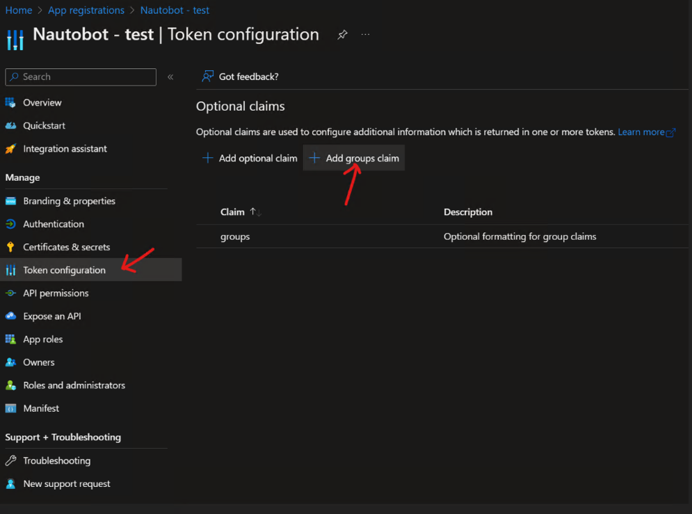
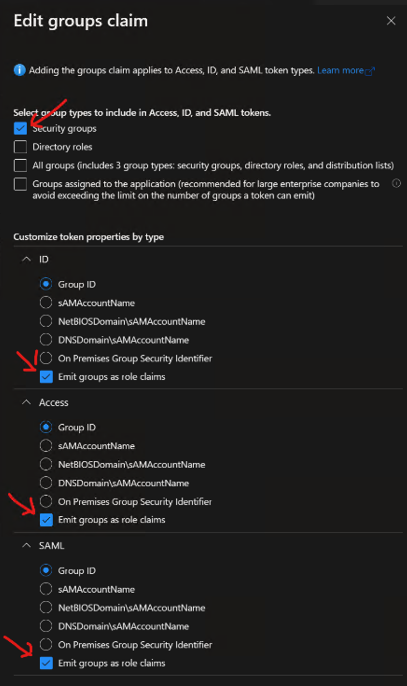

# Social Auth Pipeline AzureAD Group Sync Example

NOTE: In newer versions of Nautobot this is built-in via the `nautobot.extras.group_sync` module.

This example shows how to extend the Social Auth Pipeline to read groups from a groups claim in AzureAD and sync those with Nautobot.

Create a Python module with the provided `group_sync.py` file in it. This could be done as part of a Nautobot App, or as a standalone Python module.

In the `nautobot_config.py` set the following values with the settings from Azure:

```python
AUTHENTICATION_BACKENDS = [
    "social_core.backends.azuread.AzureADOAuth2",
    "nautobot.core.authentication.ObjectPermissionBackend",
]

SOCIAL_AUTH_AZUREAD_OAUTH2_KEY = ""
SOCIAL_AUTH_AZUREAD_OAUTH2_SECRET = ""
SOCIAL_AUTH_AZUREAD_TENANT_OAUTH2_TENANT_ID = ""
SOCIAL_AUTH_AZUREAD_OAUTH2_RESOURCE = ""

SOCIAL_AUTH_PIPELINE = (
    "social_core.pipeline.social_auth.social_details",
    "social_core.pipeline.social_auth.social_uid",
    "social_core.pipeline.social_auth.auth_allowed",
    "social_core.pipeline.social_auth.social_user",
    "social_core.pipeline.user.get_username",
    "social_core.pipeline.user.create_user",
    "social_core.pipeline.social_auth.associate_user",
    "social_core.pipeline.social_auth.load_extra_data",
    "social_core.pipeline.user.user_details",
    "my_custom_module.azure_ad.group_sync",
)
```

If the name of the name of your Superuser and Staff groups vary from default you'll need to update the script accordingly.  This example is provided "as is" and may very well be unique for your Azure deployment.

## Troubleshooting

A few troubleshooting steps are provided below.

### Roles are Not in SSO Response

If no groups are being seen/sync'd after implementing this module into the `SOCIAL_AUTH_PIPELINE`, make sure the application allows for groups. Within **Azure Active Directory --> App registrations --> "your Nautobot app name"** to add `Groups Claim`.



By default the groups are named the `UUID` in the admin panel, if syncing based on a different attribute change the options within `Edit groups claim`.



Emit groups as role claims should be checked, also the different attributes to be sent in the response data are listed and can be chosen based on preference.

### Displaying Logging from `my_custom_module`

Update `LOGGING` in `nautobot_config.py`.

```python
LOGGING = {
    # .....Omitted.....
    "loggers": {
        "my_custom_module": {"handlers": ["console", "file"], "level": "DEBUG"},
    }
}
```
