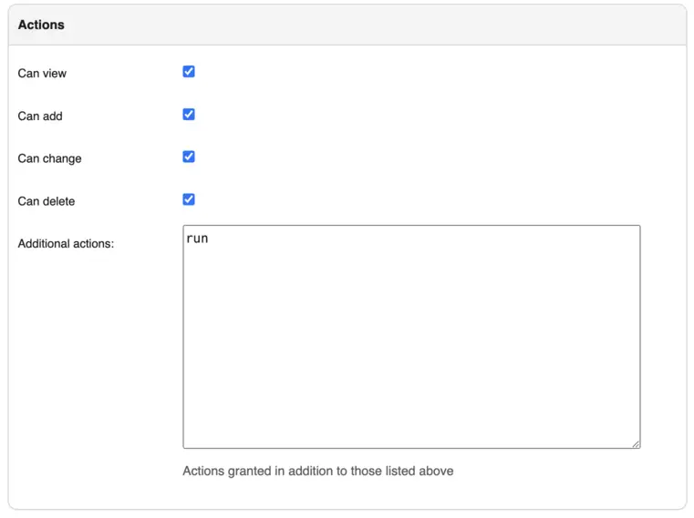

# Jobs

Jobs are a way for users to execute custom logic on demand from within the Nautobot UI. Jobs can interact directly with Nautobot data to accomplish various data creation, modification, and validation tasks, such as:

* Automatically populate new devices and cables in preparation for a new site deployment
* Create a range of new reserved prefixes or IP addresses
* Fetch data from an external source and import it to Nautobot
* Check and report whether all top-of-rack switches have a console connection
* Check and report whether every router has a loopback interface with an assigned IP address
* Check and report whether all IP addresses have a parent prefix

...and so on. Jobs are Python code and exist outside of the official Nautobot code base, so they can be updated and changed without interfering with the core Nautobot installation. And because they're completely customizable, there's practically no limit to what a job can accomplish.

!!! note
    Jobs unify and supersede the functionality previously provided in NetBox by "custom scripts" and "reports". Jobs are backwards-compatible for now with the `Script` and `Report` class APIs, but you are urged to move to the new `Job` class API described below. Jobs may be optionally marked as [read-only](#read_only) which equates to the `Report` functionally, but in all cases, user input is supported via [job variables](#variables).

## Writing Jobs

Jobs may be installed in one of three ways:

* Manually installed as files in the [`JOBS_ROOT`](../configuration/optional-settings.md#jobs_root) path (which defaults to `$NAUTOBOT_ROOT/jobs/`).
    * The `JOBS_ROOT` directory *must* contain a file named `__init__.py`. Do not delete this file.
    * Each file created within this path is considered a separate module; there is no support for cross-file dependencies (such as a file acting as a common "library" module of functions shared between jobs) for files installed in this way.
* Imported from an external [Git repository](../models/extras/gitrepository.md#jobs).
    * The repository's `jobs/` directory *must* contain a file named `__init__.py`.
    * Each Job file in the repository is considered a separate module; there is no support for cross-file dependencies (such as a file acting as a common "library" module of functions shared between jobs) for files installed in this way.
* Packaged as part of a [plugin](../plugins/development.md#including-jobs).
    * Jobs installed this way are part of the plugin module and can import code from elsewhere in the plugin or even have dependencies on other packages, if needed, via the standard Python packaging mechanisms.

In any case, each module holds one or more Jobs (Python classes), each of which serves a specific purpose. The logic of each job can be split into a number of distinct methods, each of which performs a discrete portion of the overall job logic.

For example, we can create a module named `devices.py` to hold all of our jobs which pertain to devices in Nautobot. Within that module, we might define several jobs. Each job is defined as a Python class inheriting from `extras.jobs.Job`, which provides the base functionality needed to accept user input and log activity.

!!! warning
    Make sure you are *not* inheriting `extras.jobs.models.Job` instead, otherwise Django will think you want to define a new database model.

```python
from nautobot.extras.jobs import Job

class CreateDevices(Job):
    ...

class DeviceConnectionsReport(Job):
    ...

class DeviceIPsReport(Job):
    ...
```

Each job class will implement some or all of the following components:

* Module and class attributes, providing for default behavior, documentation and discoverability
* a set of variables for user input via the Nautobot UI (if your job requires any user inputs)
* a `run()` method, which is executed first and receives the user input values, if any
* any number of `test_*()` methods, which will be invoked next in order of declaration. Log messages generated by the job will be grouped together by the test method they were invoked from.
* a `post_run()` method, which is executed last and can be used to handle any necessary cleanup or final events (such as sending an email or triggering a webhook). The status of the overall job is available at this time as `self.failed` and the `JobResult` data object is available as `self.result`.

You can implement the entire job within the `run()` function, but for more complex jobs, you may want to provide more granularity in the output and logging of activity. For this purpose, you can implement portions of the logic as `test_*()` methods (i.e., methods whose name begins with `test_*`) and/or a `post_run()` method. Log messages generated by the job logging APIs (more below on this topic) will be grouped together according to their base method (`run`, `test_a`, `test_b`, ..., `post_run`) which can aid in understanding the operation of the job.

!!! note
    Your job can of course define additional Python methods to compartmentalize and reuse logic as required; however the `run`, `test_*`, and `post_run` methods are the only ones that will be automatically invoked by Nautobot.

It's important to understand that jobs execute on the server asynchronously as background tasks; they log messages and report their status to the database by updating [`JobResult`](../models/extras/jobresult.md) records and creating [`JobLogEntry`](../models/extras/joblogentry.md) records.

!!! note
    When actively developing a Job utilizing a development environment it's important to understand that the "automatically reload when code changes are detected" debugging functionality provided by `nautobot-server runserver` does **not** automatically restart the Celery `worker` process when code changes are made; therefore, it is required to restart the `worker` after each update to your Job source code or else it will continue to run the version of the Job code that was present when it first started.

    Additionally, as of Nautobot 1.3, the Job database records corresponding to installed Jobs are *not* automatically refreshed when the development server auto-restarts. If you make changes to any of the class and module metadata attributes described in the following sections, the database will be refreshed to reflect these changes only after running `nautobot-server migrate` or `nautobot-server post_upgrade` (recommended) or if you manually edit a Job database record to force it to be refreshed.

### Module Metadata Attributes

#### `name` (Grouping)

You can define a global constant called `name` within a job module (the Python file which contains one or more job classes) to set the default grouping under which jobs in this module will be displayed in the Nautobot UI. If this value is not defined, the module's file name will be used. This "grouping" value may also be defined or overridden when editing Job records in the database.

!!! note
    In some UI elements and API endpoints, the module file name is displayed in addition to or in place of this attribute, so even if defining this attribute, you should still choose an appropriately explanatory file name as well.

### Class Metadata Attributes

Job-specific attributes may be defined under a class named `Meta` within each job class you implement. All of these are optional, but encouraged.

#### `name`

This is the human-friendly name of your job, as will be displayed in the Nautobot UI. If not set, the class name will be used.

!!! note
    In some UI elements and API endpoints, the class name is displayed in addition to or in place of this attribute, so even if defining this attribute, you should still choose an appropriately explanatory class name as well.

#### `description`

An optional human-friendly description of what this job does.
This can accept either plain text or Markdown-formatted text. It can also be multiple lines:

```python
class ExampleJob(Job):
    class Meta:
        description = """
            This job does a number of interesting things.

             1. It hacks the Gibson
             2. It immanentizes the eschaton
             3. It's a floor wax *and* a dessert topping
        """
```

If you code a multi-line description, the first line only will be used in the description column of the jobs list, while the full description will be rendered in the job detail view, submission, approval, and results pages.

#### `approval_required`

Default: `False`

A boolean that will mark this job as requiring approval from another user to be run. For more details on approvals, [please refer to the section on scheduling and approvals](./job-scheduling-and-approvals.md).

#### `commit_default`

Default: `True`

The checkbox to commit database changes when executing a job is checked by default in the Nautobot UI. You can set `commit_default` to `False` under the `Meta` class if you want this option to instead be unchecked by default.

```python
class MyJob(Job):
    class Meta:
        commit_default = False
```

#### `field_order`

Default: `[]`

A list of strings (field names) representing the order your job [variables](#variables) should be rendered as form fields in the job submission UI. If not defined, the variables will be listed in order of their definition in the code. If variables are defined on a parent class and no field order is defined, the parent class variables will appear before the subclass variables.

#### `has_sensitive_variables`

+++ 1.3.10

Default: `True`

Unless set to False, it prevents the job's input parameters from being saved to the database. This defaults to True so as to protect against inadvertent database exposure of input parameters that may include sensitive data such as passwords or other user credentials. Review whether each job's inputs contain any such variables before setting this to False; if a job *does* contain sensitive inputs, if possible you should consider whether the job could be re-implemented using Nautobot's [`Secrets`](../core-functionality/secrets.md) feature as a way to ensure that the sensitive data is not directly provided as a job variable at all.

Important notes about jobs with sensitive variables:

* Such jobs cannot be scheduled to run in the future or on a recurring schedule (as scheduled jobs must by necessity store their variables in the database for future reference).
* Jobs with sensitive variables cannot be marked as requiring approval (as jobs pending approval must store their variables in the database until approved).

#### `hidden`

Default: `False`

A Boolean that if set to `True` prevents the job from being displayed by default in the list of Jobs in the Nautobot UI.

Since the jobs execution framework is designed to be generic, there may be several technical jobs defined by users which interact with or are invoked by external systems. In such cases, these jobs are not meant to be executed by a human and likely do not make sense to expose to end users for execution, and thus having them exposed in the UI at all is extraneous.

Important notes about hidden jobs:

* This is merely hiding them by default from the web interface. It is NOT a security feature.
* In the Jobs list view it is possible to filter to "Hidden: (no selection)" or even "Hidden: Yes" to list the hidden jobs.
* All Job UI and REST API endpoints still exist for hidden jobs and can be accessed by any user who is aware of their existence.
* Hidden jobs can still be executed through the UI or the REST API given the appropriate URL.
* Results for hidden jobs will still appear in the Job Results list after they are run.

#### `read_only`

+++ 1.1.0

Default: `False`

A boolean that designates whether the job is able to make changes to data in the database. The value defaults to `False` but when set to `True`, any data modifications executed from the job's code will be automatically aborted at the end of the job. The job input form is also modified to remove the `commit` checkbox as it is irrelevant for read-only jobs. When a job is marked as read-only, log messages that are normally automatically emitted about the DB transaction state are not included because no changes to data are allowed. Note that user input may still be optionally collected with read-only jobs via job variables, as described below.

#### `soft_time_limit`

+++ 1.3.0

An int or float value, in seconds, which can be used to override the default [soft time limit](../configuration/optional-settings.md#celery_task_soft_time_limit) for a job task to complete.

The `celery.exceptions.SoftTimeLimitExceeded` exception will be raised when this soft time limit is exceeded. The job task can catch this to clean up before the [hard time limit](../configuration/optional-settings.md#celery_task_time_limit) (10 minutes by default) is reached:

```python
from celery.exceptions import SoftTimeLimitExceeded
from nautobot.extras.jobs import Job

class ExampleJobWithSoftTimeLimit(Job):
    class Meta:
        name = "Soft Time Limit"
        description = "Set a soft time limit of 10 seconds`"
        soft_time_limit = 10

    def run(self, data, commit):
        try:
            # code which might take longer than 10 seconds to run
            job_code()
        except SoftTimeLimitExceeded:
            # any clean up code
            cleanup_in_a_hurry()
```

#### `task_queues`

+++ 1.5.0

Default: `[]`

A list of task queue names that the job can be routed to. An empty list will default to only allowing the user to select the [default queue](../configuration/optional-settings.md#celery_task_default_queue) (`default` unless changed by an administrator). The first queue in the list will be used if a queue is not specified in a job run API call.

!!! note
    A worker must be listening on the requested queue or the job will not run. See the documentation on [task queues](../administration/celery-queues.md) for more information.

#### `template_name`

+++ 1.4.0

A path relative to the job source code containing a Django template which provides additional code to customize the Job's submission form. This template should extend the existing job template, `extras/job.html`, otherwise the base form and functionality may not be available.

A template can provide additional JavaScript, CSS, or even display HTML. A good starting template would be:

```html



    {{ block.super }}
    <!-- Add additional CSS here. -->


    {{ block.super }}
    <!-- Add additional HTML here. -->


    {{ block.super }}
    <!-- Add additional JavaScript here. -->

```

For another example checkout [the template used in example plugin](https://github.com/nautobot/nautobot/blob/next/examples/example_plugin/example_plugin/templates/example_plugin/example_with_custom_template.html) in the GitHub repo.

#### `time_limit`

+++ 1.3.0

An int or float value, in seconds, which can be used to override the
default [hard time limit](../configuration/optional-settings.md#celery_task_time_limit) (10 minutes by default) for a job task to complete.

Unlike the `soft_time_limit` above, no exceptions are raised when a `time_limit` is exceeded. The task will just terminate silently:

```python
from nautobot.extras.jobs import Job

class ExampleJobWithHardTimeLimit(Job):
    class Meta:
        name = "Hard Time Limit"
        description = "Set a hard time limit of 10 seconds`"
        time_limit = 10

    def run(self, data, commit):
        # code which might take longer than 10 seconds to run
        # this code will fail silently if the time_limit is exceeded
        job_code()
```

!!! note
    If the `time_limit` is set to a value less than or equal to the `soft_time_limit`, a warning log is generated to inform the user that this job will fail silently after the `time_limit` as the `soft_time_limit` will never be reached.

### Variables

Variables allow your job to accept user input via the Nautobot UI, but they are optional; if your job does not require any user input, there is no need to define any variables. Conversely, if you are making use of user input in your job, you *must* also implement the `run()` method, as it is the only entry point to your job that has visibility into the variable values provided by the user.

```python
from nautobot.extras.jobs import Job, StringVar, IntegerVar, ObjectVar

class CreateDevices(Job):
    var1 = StringVar(...)
    var2 = IntegerVar(...)
    var3 = ObjectVar(...)

    def run(self, data, commit):
        ...
```

The remainder of this section documents the various supported variable types and how to make use of them.

#### Default Variable Options

All job variables support the following default options:

* `default` - The field's default value
* `description` - A brief user-friendly description of the field
* `label` - The field name to be displayed in the rendered form
* `required` - Indicates whether the field is mandatory (all fields are required by default)
* `widget` - The class of form widget to use (see the [Django documentation](https://docs.djangoproject.com/en/stable/ref/forms/widgets/))

#### `StringVar`

Stores a string of characters (i.e. text). Options include:

* `min_length` - Minimum number of characters
* `max_length` - Maximum number of characters
* `regex` - A regular expression against which the provided value must match

Note that `min_length` and `max_length` can be set to the same number to effect a fixed-length field.

#### `TextVar`

Arbitrary text of any length. Renders as a multi-line text input field.

#### `IntegerVar`

Stores a numeric integer. Options include:

* `min_value` - Minimum value
* `max_value` - Maximum value

#### `BooleanVar`

A true/false flag. This field has no options beyond the defaults listed above.

#### `ChoiceVar`

A set of choices from which the user can select one.

* `choices` - A list of `(value, label)` tuples representing the available choices. For example:

```python
CHOICES = (
    ('n', 'North'),
    ('s', 'South'),
    ('e', 'East'),
    ('w', 'West')
)

direction = ChoiceVar(choices=CHOICES)
```

In the example above, selecting the choice labeled "North" will submit the value `n`.

#### `MultiChoiceVar`

Similar to `ChoiceVar`, but allows for the selection of multiple choices.

#### `ObjectVar`

A particular object within Nautobot. Each ObjectVar must specify a particular model, and allows the user to select one of the available instances. ObjectVar accepts several arguments, listed below.

* `model` - The model class
* `display_field` - The name of the REST API object field to display in the selection list (default: `'display'`)
* `query_params` - A dictionary of REST API query parameters to use when retrieving available options (optional)
* `null_option` - A label representing a "null" or empty choice (optional)

The `display_field` argument is useful in cases where using the `display` API field is not desired for referencing the object. For example, when displaying a list of IP Addresses, you might want to use the `dns_name` field:

```python
device_type = ObjectVar(
    model=IPAddress,
    display_field="dns_name",
)
```

To limit the selections available within the list, additional query parameters can be passed as the `query_params` dictionary. For example, to show only devices with an "active" status:

```python
device = ObjectVar(
    model=Device,
    query_params={
        'status': 'active'
    }
)
```

Multiple values can be specified by assigning a list to the dictionary key. It is also possible to reference the value of other fields in the form by prepending a dollar sign (`$`) to the variable's name. The keys you can use in this dictionary are the same ones that are available in the REST API - as an example it is also possible to filter the `Site` `ObjectVar` for its `tenant_group_id`.

```python
region = ObjectVar(
    model=Region
)
tenant_group = ObjectVar(
    model=TenantGroup
)
site = ObjectVar(
    model=Site,
    query_params={
        'region_id': '$region',
        'tenant_group_id': '$tenant_group'
    }
)
```

#### `MultiObjectVar`

Similar to `ObjectVar`, but allows for the selection of multiple objects.

#### `FileVar`

An uploaded file. Note that uploaded files are present in memory only for the duration of the job's execution: They will not be automatically saved for future use. The job is responsible for writing file contents to disk where necessary.

#### `IPAddressVar`

An IPv4 or IPv6 address, without a mask. Returns a `netaddr.IPAddress` object.

#### `IPAddressWithMaskVar`

An IPv4 or IPv6 address with a mask. Returns a `netaddr.IPNetwork` object which includes the mask.

#### `IPNetworkVar`

An IPv4 or IPv6 network with a mask. Returns a `netaddr.IPNetwork` object. Two attributes are available to validate the provided mask:

* `min_prefix_length` - Minimum length of the mask
* `max_prefix_length` - Maximum length of the mask

### The `run()` Method

The `run()` method, if you choose to implement it, should accept two arguments:

1. `data` - A dictionary which will contain all of the variable data passed in by the user (via the web UI or REST API)
2. `commit` - A boolean indicating whether database changes should be committed. If this is `False`, even if your Job attempts to make database changes, they will be automatically rolled back when the Job completes.

```python
from nautobot.extras.jobs import Job, StringVar, IntegerVar, ObjectVar

class CreateDevices(Job):
    var1 = StringVar(...)
    var2 = IntegerVar(...)
    var3 = ObjectVar(...)

    def run(self, data, commit):
        ...
```

Again, defining user variables is totally optional; you may create a job with just a `run()` method if no user input is needed, in which case `data` will be an empty dictionary.

!!! note
    The `test_*()` and `post_run()` methods do not accept any arguments; if you need to access user `data` or the `commit` flag, your `run()` method is responsible for storing these values in the job instance, such as:

    ```
    def run(self, data, commit):
        self.data = data
        self.commit = commit
    ```

!!! warning
    When writing Jobs that create and manipulate data it is recommended to make use of the `validated_save()` convenience method which exists on all core models. This method saves the instance data but first enforces model validation logic. Simply calling `save()` on the model instance **does not** enforce validation automatically and may lead to bad data. See the development [best practices](../development/best-practices.md).

!!! warning
    The Django ORM provides methods to create/edit many objects at once, namely `bulk_create()` and `update()`. These are best avoided in most cases as they bypass a model's built-in validation and can easily lead to database corruption if not used carefully.

### The `test_*()` Methods

If your job class defines any number of methods whose names begin with `test_`, these will be automatically invoked after the `run()` method (if any) completes. These methods must take no arguments (other than `self`).

Log messages generated by any of these methods will be automatically grouped together by the test method they were invoked from, which can be helpful for readability.

### The `post_run()` Method

If your job class implements a `post_run()` method (which must take no arguments other than `self`), this method will be automatically invoked after the `run()` and `test_*()` methods (if any). It will be called even if one of the other methods raises an exception, so this method can be used to handle any necessary cleanup or final events (such as sending an email or triggering a webhook). The status of the overall job is available at this time as `self.failed` and the associated [`JobResult`](../models/extras/jobresult.md) `data` field is available as `self.results`.

### Logging

The following instance methods are available to log results from an executing job to be stored into [`JobLogEntry`](../models/extras/joblogentry.md) records associated with the current [`JobResult`](../models/extras/jobresult.md):

* `self.log(message)`
* `self.log_debug(message)`
* `self.log_success(obj=None, message=None)`
* `self.log_info(obj=None, message=None)`
* `self.log_warning(obj=None, message=None)`
* `self.log_failure(obj=None, message=None)`

Messages recorded with `log()` or `log_debug()` will appear in a job's results but are never associated with a particular object; the other `log_*` functions may be invoked with or without a provided object to associate the message with.

It is advised to log a message for each object that is evaluated so that the results will reflect how many objects are being manipulated or reported on.

Markdown rendering is supported for log messages.

+/- 1.3.4
    As a security measure, the `message` passed to any of these methods will be passed through the `nautobot.utilities.logging.sanitize()` function in an attempt to strip out information such as usernames/passwords that should not be saved to the logs. This is of course best-effort only, and Job authors should take pains to ensure that such information is not passed to the logging APIs in the first place. The set of redaction rules used by the `sanitize()` function can be configured as [settings.SANITIZER_PATTERNS](../configuration/optional-settings.md#sanitizer_patterns).

!!! note
    Using `self.log_failure()`, in addition to recording a log message, will flag the overall job as failed, but it will **not** stop the execution of the job, nor will it result in an automatic rollback of any database changes made by the job. To end a job early, you can use a Python `raise` or `return` as appropriate. Raising `nautobot.utilities.exceptions.AbortTransaction` will ensure that any database changes are rolled back as part of the process of ending the job.

### Accessing Request Data

Details of the current HTTP request (the one being made to execute the job) are available as the instance attribute `self.request`. This can be used to infer, for example, the user executing the job and their client IP address:

```python
username = self.request.user.username
ip_address = self.request.META.get('HTTP_X_FORWARDED_FOR') or \
    self.request.META.get('REMOTE_ADDR')
self.log_info(f"Running as user {username} (IP: {ip_address})...")
```

For a complete list of available request parameters, please see the [Django documentation](https://docs.djangoproject.com/en/stable/ref/request-response/).

### Reading Data from Files

The `Job` class provides two convenience methods for reading data from files:

* `load_yaml`
* `load_json`

These two methods will load data in YAML or JSON format, respectively, from files within the local path (i.e. `JOBS_ROOT/`).

## Managing Jobs

As of Nautobot 1.3, each Job class installed in Nautobot is represented by a corresponding Job data record in the Nautobot database. These data records are refreshed when the `nautobot-server migrate` or `nautobot-server post_upgrade` command is run, or (for Jobs from a Git repository) when a Git repository is enabled or re-synced in Nautobot. These data records make it possible for an administrative user (or other user with appropriate access privileges) to exert a level of administrative control over the Jobs created and updated by Job authors.

### Enabling Jobs for Running

When a new Job record is created for a newly discovered Job class, it defaults to `enabled = False`, which prevents the Job from being run by any user. This is intended to provide a level of security and oversight regarding the installation of new Jobs into Nautobot.

!!! important
    One exception to this default is when upgrading from a Nautobot release before 1.3 to Nautobot 1.3.0 or later. In this case, at the time of the upgrade, any Job class that shows evidence of having been run or scheduled under the older Nautobot version (that is, there is at least one JobResult and/or ScheduledJob record that references this Job class) will result in the creation of a Job database record with `enabled = True`. The reasoning for this feature is the assertion that because the Job has been run or scheduled previously, it has presumably already undergone appropriate review at that time, and so it should remain possible to run it as it was possible before the upgrade.

An administrator or user with `extras.change_job` permission can edit the Job to change it to `enabled = True`, permitting running of the Job, when they have completed any appropriate review of the new Job to ensure that it meets their standards. Similarly, an obsolete or no-longer-used Job can be prevented from inadvertent execution by changing it back to `enabled = False`.

### Overriding Metadata

An administrator or user with `extras.change_job` permission can also edit a Job database record to optionally override any or all of the following metadata attributes defined by the Job module or class:

* `grouping`
* `name`
* `description`
* `approval_required`
* `commit_default`
* `has_sensitive_variables`
* `hidden`
* `read_only`
* `soft_time_limit`
* `time_limit`
* `task_queues`

This is done by setting the corresponding "override" flag (`grouping_override`, `name_override`, etc.) to `True` then providing a new value for the attribute in question. An overridden attribute will remain set to its overridden value even if the underlying Job class definition changes and `nautobot-server <migrate|post_upgrade>` gets run again. Conversely, clearing the "override" flag for an attribute and saving the database record will revert the attribute to the underlying value defined within the Job class source code.

### Deleting Jobs

When a previously installed Job class is removed, after running `nautobot-server <migrate|post_upgrade>` or refreshing the providing Git repository, the Job database record will *not* be automatically deleted, but *will* be flagged as `installed = False` and can no longer be run or scheduled.

An administrator or user with `extras.delete_job` permissions *may* delete such a Job database record if desired, but be aware that doing so will result in any existing JobResult or ScheduledJob records that originated from this Job losing their association to the Job; this association will not be automatically restored even if the Job is later reinstalled or reintroduced.

## Running Jobs

!!! note
    To run any job, a user must be assigned the `extras.run_job` permission. This is achieved by assigning the user (or group) a permission on the `extras > job` object and specifying the `run` action in the admin UI as shown below.

    Similarly, to [approve a job request by another user](./job-scheduling-and-approvals.md), a user must be assigned the `extras.approve_job` permission via the same process. Job approvers also need the `extras.change_scheduledjob` and/or `extras.delete_scheduledjob` permissions as job approvals are implemented via the `ScheduledJob` data model.

    

### Jobs and `class_path`

It is a key concept to understand the 3 `class_path` elements:

* `grouping_name`: which can be one of `local`, `git`, or `plugins` - depending on where the `Job` has been defined.
* `module_name`: which is the Python path to the job definition file, for a plugin-provided job, this might be something like `my_plugin_name.jobs.my_job_filename` or `nautobot_golden_config.jobs` and is the importable Python path name (which would not include the `.py` extension, as per Python syntax standards).
* `JobClassName`: which is the name of the class inheriting from `nautobot.extras.jobs.Job` contained in the above file.

The `class_path` is often represented as a string in the format of `<grouping_name>/<module_name>/<JobClassName>`, such as
`local/example/MyJobWithNoVars` or `plugins/nautobot_golden_config.jobs/BackupJob`. Understanding the definitions of these
elements will be important in running jobs programmatically.

+/- 1.3.0
    With the addition of Job database models, it is now generally possible and preferable to refer to a job by its UUID primary key, similar to other Nautobot database models, rather than its `class_path`.

### Via the Web UI

Jobs can be run via the web UI by navigating to the job, completing any required form data (if any), and clicking the "Run Job" button.

Once a job has been run, the latest [`JobResult`](../models/extras/jobresult.md) for that job will be summarized in the job list view.

### Via the API

To run a job via the REST API, issue a POST request to the job's endpoint `/api/extras/jobs/<uuid>/run/`. You can optionally provide JSON data to set the `commit` flag, specify any required user input `data`, optional `task_queue`, and/or provide optional scheduling information as described in [the section on scheduling and approvals](./job-scheduling-and-approvals.md).

For example, to run a job with no user inputs and without committing any anything to the database:

```no-highlight
curl -X POST \
-H "Authorization: Token $TOKEN" \
-H "Content-Type: application/json" \
-H "Accept: application/json; version=1.3; indent=4" \
http://nautobot/api/extras/jobs/$JOB_ID/run/
```

Or to run a job that expects user inputs, and commit changes to the database:

```no-highlight
curl -X POST \
-H "Authorization: Token $TOKEN" \
-H "Content-Type: application/json" \
-H "Accept: application/json; version=1.3; indent=4" \
http://nautobot/api/extras/jobs/$JOB_ID/run/ \
--data '{"data": {"string_variable": "somevalue", "integer_variable": 123}, "commit": true}'
```

When providing input data, it is possible to specify complex values contained in `ObjectVar`s, `MultiObjectVar`s, and `IPAddressVar`s.

* `ObjectVar`s can be specified by either using their primary key directly as the value, or as a dictionary containing a more complicated query that gets passed into the Django ORM as keyword arguments.
* `MultiObjectVar`s can be specified as a list of primary keys.
* `IPAddressVar`s can be provided as strings in CIDR notation.

#### Jobs with Files

To run a job that contains `FileVar` inputs via the REST API, you must use `multipart/form-data` content type requests instead of `application/json`. This also requires a slightly different request payload than the example above. The `commit`, `task_queue`, and `schedule` data are flattened and prefixed with underscore to differentiate them from job-specific data. Job specific data is also flattened and not located under the top-level `data` dictionary key.

An example of running a job with both `FileVar` (named `myfile`) and `StringVar` (named `interval`) input:

```no-highlight
curl -X POST \
-H 'Authorization: Token $TOKEN' \
-H 'Content-Type: multipart/form-data' \
-H "Accept: application/json; version=1.3; indent=4" \
'http://nautobot/api/extras/jobs/$JOB_ID/run/' \
-F '_commit="true"' \
-F '_schedule_interval="immediately"' \
-F '_schedule_start_time="2022-10-18T17:31:23.698Z"' \
-F 'interval="3"' \
-F 'myfile=@"/path/to/my/file.txt"' \
```

### Via the CLI

Jobs can be run from the CLI by invoking the management command:

```no-highlight
nautobot-server runjob [--username <username>] [--commit] [--local] [--data <data>] <class_path>
```

!!! note
    [See above](#jobs-and-class_path) for `class_path` definitions.

+++ 1.3.10
    The `--data` and `--local` parameters were added.

    The `--data` parameter must be a JSON string, e.g. `--data='{"string_variable": "somevalue", "integer_variable": 123}'`

Using the same example shown in the API:

```no-highlight
nautobot-server runjob --username myusername local/example/MyJobWithNoVars
```

!!! warning
    The `--username <username>` parameter can be used to specify the user that will be identified as the requester of the job. It is optional if the job will not be modifying the database, but is mandatory if you are running with `--commit`, as the specified user will own any resulting database changes.

    Note that `nautobot-server` commands, like all management commands and other direct interactions with the Django database, are not gated by the usual Nautobot user authentication flow. It is possible to specify any existing `--username` with the `nautobot-server runjob` command in order to impersonate any defined user in Nautobot. Use this power wisely and be cautious who you allow to access it.

## Testing Jobs

Jobs are Python code and can be tested as such, usually via [Django unit-test features](https://docs.djangoproject.com/en/stable/topics/testing/). That said, there are a few useful tricks specific to testing Jobs.

While individual methods within your Job can and should be tested in isolation, you'll likely also want to test the entire execution of the Job. Nautobot 1.3.3 introduced a few enhancements to make this simpler to do, but it's also quite possible to test in earlier releases with a bit more effort.

### Nautobot 1.3.3 and later

The simplest way to test the entire execution of Jobs from 1.3.3 on is via calling the `nautobot.utilities.testing.run_job_for_testing()` method, which is a helper wrapper around the `run_job` function used to execute a Job via Nautobot's Celery worker process.

Because of the way `run_job_for_testing` and more specifically `run_job()` works, which is somewhat complex behind the scenes, you need to inherit from `nautobot.utilities.testing.TransactionTestCase` instead of `django.test.TestCase` (Refer to the [Django documentation](https://docs.djangoproject.com/en/stable/topics/testing/tools/#provided-test-case-classes) if you're interested in the differences between these classes - `TransactionTestCase` from Nautobot is a small wrapper around Django's `TransactionTestCase`).

When using `TransactionTestCase` (whether from Django or from Nautobot) each tests runs on a completely empty database. Furthermore, Nautobot requires new jobs to be enabled before they can run. Therefore, we need to make sure the job is enabled before each run which `run_job_for_testing` handles for us.

A simple example of a Job test case for 1.3.3 and forward might look like the following:

```python
from nautobot.extras.models import Job, JobLogEntry
from nautobot.utilities.testing import run_job_for_testing, TransactionTestCase


class MyJobTestCase(TransactionTestCase):
    def test_my_job(self):
        # Testing of Job "MyJob" in file "my_job_file.py" in $JOBS_ROOT
        job = Job.objects.get(job_class_name="MyJob", module_name="my_job_file", source="local")
        # or, job = Job.objects.get_for_class_path("local/my_job_file/MyJob")
        job_result = run_job_for_testing(job, data={}, commit=False)

        # Since we ran with commit=False, any database changes made by the job won't persist,
        # but we can still inspect the logs created by running the job
        log_entries = JobLogEntry.objects.filter(job_result=job_result)
        for log_entry in log_entries:
            self.assertEqual(log_entry.message, "...")
```

!!! tip
    For more advanced examples (such as testing jobs executed with `commit=True`, for example) refer to the Nautobot source code, specifically `nautobot/extras/tests/test_jobs.py`.

### Nautobot 1.3.2 and earlier (including 1.2)

If your test case needs to be backwards-compatible with test execution against Nautobot 1.3.2 and/or earlier, you need to handle a couple more things manually:

Set up the `"job_logs"` database correctly for testing:

```python
from django.conf import settings

if "job_logs" in settings.DATABASES:
    settings.DATABASES["job_logs"] = settings.DATABASES["job_logs"].copy()
    settings.DATABASES["job_logs"]["TEST"] = {"MIRROR": "default"}
```

Replicate the behavior of `run_job_for_testing` manually so that your test execution most closely resembles the way the celery worker would run the test:

```python
import uuid
from django.contrib.auth import get_user_model
from django.contrib.contenttypes.models import ContentType

from nautobot.extras.context_managers import web_request_context
from nautobot.extras.jobs import run_job
from nautobot.extras.models import JobResult, Job

def run_job_for_testing(job, data=None, commit=True, username="test-user"):
    if data is None:
        data = {}
    user_model = get_user_model()
    user, _ = user_model.objects.get_or_create(username=username, is_superuser=True, password="password")
    job_result = JobResult.objects.create(
        name=job.class_path,
        obj_type=ContentType.objects.get_for_model(Job),
        user=user,
        job_id=uuid.uuid4(),
    )
    with web_request_context(user=user) as request:
        run_job(data=data, request=request, commit=commit, job_result_pk=job_result.pk)
    return job_result
```

Setup the `databases` field on the test class correctly, and re-create the default Statuses on `setUp` in your test classes, because `django.test.TransactionTestCase` truncates them on every `tearDown`:

```python
from django.apps import apps
from django.conf import settings
from django.test import TransactionTestCase

from nautobot.extras.management import populate_status_choices

class MyJobTestCase(TransactionTestCase):
    # 'job_logs' is a proxy connection to the same (default) database that's used exclusively for Job logging
    if "job_logs" in settings.DATABASES:
        databases = ("default", "job_logs")

    def setUp(self):
        super().setUp()
        populate_status_choices(apps, None)
```

## Example Jobs

### Creating objects for a planned site

This job prompts the user for three variables:

* The name of the new site
* The device model (a filtered list of defined device types)
* The number of access switches to create

These variables are presented as a web form to be completed by the user. Once submitted, the job's `run()` method is called to create the appropriate objects, and it returns simple CSV output to the user summarizing the created objects.

```python
from django.utils.text import slugify

from nautobot.dcim.models import Device, DeviceRole, DeviceType, Manufacturer, Site
from nautobot.extras.models import Status
from nautobot.extras.jobs import *


class NewBranch(Job):

    class Meta:
        name = "New Branch"
        description = "Provision a new branch site"
        field_order = ['site_name', 'switch_count', 'switch_model']

    site_name = StringVar(
        description="Name of the new site"
    )
    switch_count = IntegerVar(
        description="Number of access switches to create"
    )
    manufacturer = ObjectVar(
        model=Manufacturer,
        required=False
    )
    switch_model = ObjectVar(
        description="Access switch model",
        model=DeviceType,
        query_params={
            'manufacturer_id': '$manufacturer'
        }
    )

    def run(self, data, commit):
        STATUS_PLANNED = Status.objects.get(slug='planned')

        # Create the new site
        site = Site(
            name=data['site_name'],
            slug=slugify(data['site_name']),
            status=STATUS_PLANNED,
        )
        site.validated_save()
        self.log_success(obj=site, message="Created new site")

        # Create access switches
        switch_role = DeviceRole.objects.get(name='Access Switch')
        for i in range(1, data['switch_count'] + 1):
            switch = Device(
                device_type=data['switch_model'],
                name=f'{site.slug}-switch{i}',
                site=site,
                status=STATUS_PLANNED,
                device_role=switch_role
            )
            switch.validated_save()
            self.log_success(obj=switch, message="Created new switch")

        # Generate a CSV table of new devices
        output = [
            'name,make,model'
        ]
        for switch in Device.objects.filter(site=site):
            attrs = [
                switch.name,
                switch.device_type.manufacturer.name,
                switch.device_type.model
            ]
            output.append(','.join(attrs))

        return '\n'.join(output)
```

### Device validation

A job to perform various validation of Device data in Nautobot. As this job does not require any user input, it does not define any variables, nor does it implement a `run()` method.

```python
from nautobot.dcim.models import ConsolePort, Device, PowerPort
from nautobot.extras.models import Status
from nautobot.extras.jobs import Job


class DeviceConnectionsReport(Job):
    description = "Validate the minimum physical connections for each device"

    def test_console_connection(self):
        STATUS_ACTIVE = Status.objects.get(slug='active')

        # Check that every console port for every active device has a connection defined.
        for console_port in ConsolePort.objects.prefetch_related('device').filter(device__status=STATUS_ACTIVE):
            if console_port.connected_endpoint is None:
                self.log_failure(
                    obj=console_port.device,
                    message="No console connection defined for {}".format(console_port.name)
                )
            elif not console_port.connection_status:
                self.log_warning(
                    obj=console_port.device,
                    message="Console connection for {} marked as planned".format(console_port.name)
                )
            else:
                self.log_success(obj=console_port.device)

    def test_power_connections(self):
        STATUS_ACTIVE = Status.objects.get(slug='active')

        # Check that every active device has at least two connected power supplies.
        for device in Device.objects.filter(status=STATUS_ACTIVE):
            connected_ports = 0
            for power_port in PowerPort.objects.filter(device=device):
                if power_port.connected_endpoint is not None:
                    connected_ports += 1
                    if not power_port.connection_status:
                        self.log_warning(
                            obj=device,
                            message="Power connection for {} marked as planned".format(power_port.name)
                        )
            if connected_ports < 2:
                self.log_failure(
                    obj=device,
                    message="{} connected power supplies found (2 needed)".format(connected_ports)
                )
            else:
                self.log_success(obj=device)
```
