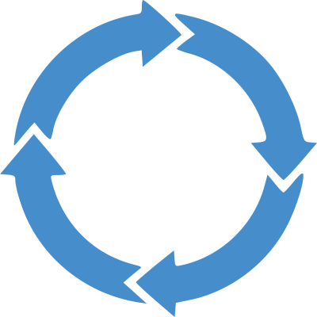
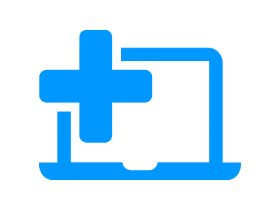
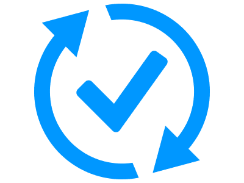
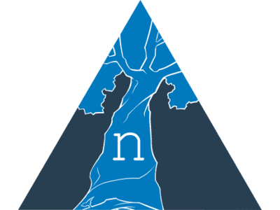
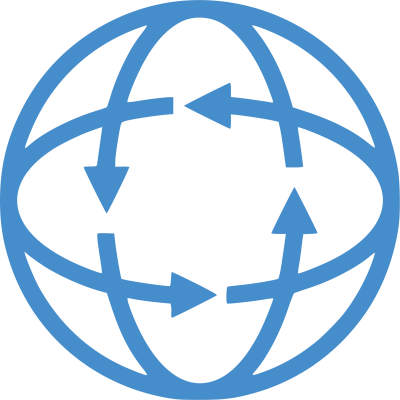

# Nautobot Apps Overview

To view and search the full list of Apps, head over to the [Nautobot App Ecosystem Page on networktocode.com](https://www.networktocode.com/nautobot/apps/). Below you will only find links to the **documentation** for the apps listed in the table.

## Community-Developed Nautobot Apps

Find out more about what documentation is available for the various community developed Nautobot Apps by visiting the [Community Apps](nautobot-apps.md) page.

## Network to Code Nautobot Apps

These Nautobot Apps have their documentation hosted as a subproject of this docs site and they are built and structured according to the **Network To Code** documentation standards.

| | App Name | Description |
|-| --- | --- |
|  | [Nautobot ChatOps](https://docs.nautobot.com/projects/chatops/en/latest/) | Add chatbot functionality to Nautobot to facilitate getting data from Nautobot directly from a chat platform. The ChatOps app is a multi-platform chatbot for network operations and engineering teams. It is built to seamlessly work across Slack, MS Teams, WebEx Teams, and Mattermost, but also as a framework to help developers add more chat platforms in the future. |
|  | [Nautobot Device Lifecycle Management](https://github.com/nautobot/nautobot-plugin-device-lifecycle-mgmt) | Make related associations to Devices, Device Types, and Inventory Items to help provide data about the hardware end of life notices, appropriate software versions to be running on the devices, and the maintenance contracts associated with devices. |
|  | [Nautobot Device Onboarding](https://github.com/nautobot/nautobot-plugin-device-onboarding) | Simplify the onboarding process of a new device by allowing the user to specify a small amount of info and having the plugin populate a much larger amount of device data in Nautobot. |
|  | [Nautobot Firewall Models](https://nautobot-plugin-firewall-models.readthedocs.io/en/latest/) | Construct firewall policies in Nautobot with the help of the provided collection of relevant models. |
|  | [Nautobot Golden Configuration](https://docs.nautobot.com/projects/golden-config/en/latest/) | Automate configuration backups, perform configuration compliance, and generate intended configurations. |
|  | [Nautobot Plugin Nornir](https://docs.nautobot.com/projects/plugin-nornir/en/latest/) | Provides a small shim layer between [nornir-nautobot](https://github.com/nautobot/nornir-nautobot) and other plugins. The primary abilities that the plugin provides are a native Nornir ORM based inventory and a credential manager. |
|  | [Nautobot Single Source of Truth (SSoT)](https://nautobot-plugin-ssot.readthedocs.io/en/latest/)  | Integrate and synchronize data between various "source of truth" (SoT) systems, with Nautobot acting as a central clearinghouse for data - a Single Source of Truth |
