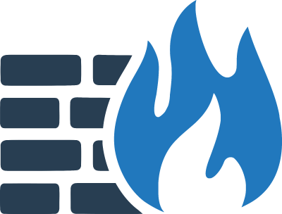
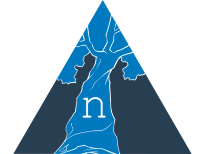

# Nautobot Apps Overview

To view and search the full list of Apps, head over to the [Nautobot App Ecosystem Page on networktocode.com](https://www.networktocode.com/nautobot/apps/). Below you will only find links to the **documentation** for the apps listed in the table.

## Serving Apps Documentation

The documentation for each pip-installed application is served dynamically through Django views and is restricted to authenticated users. This approach ensures that:

- Works regardless of where the app is installed (editable install, virtualenv, system site-packages).
- Access is protected by Django authentication.

### File Structure

Documentation for an app (e.g., example_app) is expected to be located inside the package:

```no-highlight
example_app/
├── docs/
│   ├── index.html
│   ├── assets/
      └── extra.css
      └── nautobot_logo.svg
```

The `docs` directory is the `site_dir` output of MkDocs during the build process.

### Build Process

Documentation is built using MkDocs:

```no-highlight
mkdocs build --no-directory-urls --strict
```

`site_dir` in mkdocs.yml should be always inside the app package like `<app_name>/docs` this defined where output of `mkdocs build` is placed.

### URL Routing

Two URL patterns are defined for serving documentation:

```python
from django.urls import path
from nautobot.core.views import AppDocsView

urlpatterns = [
    # Apps docs - Serve the main page
    path("docs/<str:app>/", AppDocsView.as_view(), name="docs_index"),
    # Apps docs - Serve assets
    path("docs/<str:app>/<path:path>", AppDocsView.as_view(), name="docs_file"),
]
```

`/docs/example_app/` - serves index.html.

`/docs/example_app/assets/extra.css` - serves static assets referenced in the HTML.

Both routes go through AppDocsView, which enforces login.

### Redirect for Each App

Each app should define its own top-level `/docs/` URL that redirects to the appropriate app documentation:

```python
app_name = example_app
path(
    "docs/",
    RedirectView.as_view(pattern_name="docs_index"),
    {"app_name": app_name},
    name="docs",
)
```

This allows users to access `/docs/` without specifying the app name.

The redirect points to the docs_index route for the specific app.

## Community-Developed Nautobot Apps

Find out more about what documentation is available for the various community developed Nautobot Apps by visiting the [Community Apps](nautobot-apps.md) page.

## Network to Code Nautobot Apps

These Nautobot Apps have their documentation hosted as a subproject of this docs site and they are built and structured according to the **Network To Code** documentation standards.

| | App Name | Description |
|-| --- | --- |
|  | [Nautobot ChatOps](https://docs.nautobot.com/projects/chatops/en/latest/) | Add chatbot functionality to Nautobot to facilitate getting data from Nautobot directly from a chat platform. The ChatOps app is a multi-platform chatbot for network operations and engineering teams. It is built to seamlessly work across Slack, MS Teams, WebEx Teams, and Mattermost, but also as a framework to help developers add more chat platforms in the future. |
|  | [Nautobot Data Validation Engine](https://docs.nautobot.com/projects/data-validation/en/latest/) | Create custom, user-defined validation rules that can be used to enforce business constraints on the data within Nautobot. |
|  | [Nautobot Device Lifecycle Management](https://docs.nautobot.com/projects/device-lifecycle/en/latest/) | Make related associations to Devices, Device Types, and Inventory Items to help provide data about the hardware end of life notices, appropriate software versions to be running on the devices, and the maintenance contracts associated with devices. |
|  | [Nautobot Device Onboarding](https://docs.nautobot.com/projects/device-onboarding/en/latest/) | Simplify the onboarding process of a new device by allowing the user to specify a small amount of info and having the App populate a much larger amount of device data in Nautobot. |
|  | [Nautobot Firewall Models](https://docs.nautobot.com/projects/firewall-models/en/latest/) | Construct firewall policies in Nautobot with the help of the provided collection of relevant models. |
|  | [Nautobot Golden Configuration](https://docs.nautobot.com/projects/golden-config/en/latest/) | Automate configuration backups, perform configuration compliance, and generate intended configurations. |
|  | [Nautobot Plugin Nornir](https://docs.nautobot.com/projects/plugin-nornir/en/latest/) | Provides a small shim layer between [`nornir-nautobot`](https://github.com/nautobot/nornir-nautobot) and other plugins. The primary abilities that the plugin provides are a native Nornir ORM based inventory and a credential manager. |
|  | [Nautobot Single Source of Truth (SSoT)](https://docs.nautobot.com/projects/ssot/en/latest/)  | Integrate and synchronize data between various "source of truth" (SoT) systems, with Nautobot acting as a central clearinghouse for data - a Single Source of Truth |
