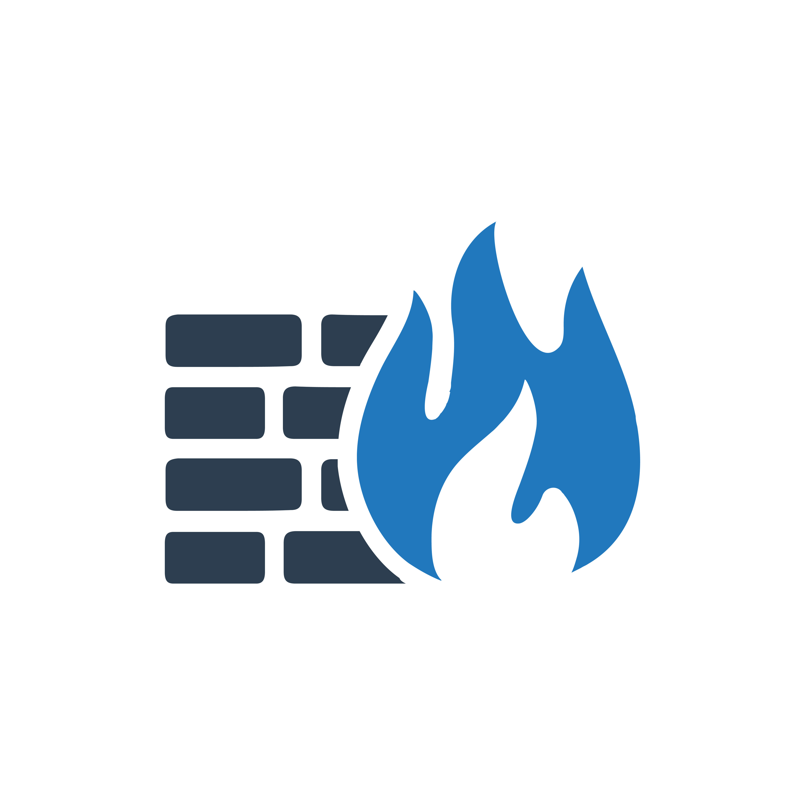
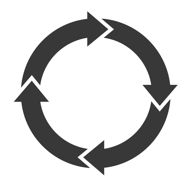

# Nautobot Community Apps

## Overview

To view and search the full list of Apps, head over to the [Nautobot App Ecosystem Page on networktocode.com](https://www.networktocode.com/nautobot/apps/).

### With documentation elsewhere

The following is a manually curated list of Apps/Plugins from the wider Nautobot community, which have some sort of hosted documentation.

| | App Name | Description |
|-| --- | --- |
|     | [Nautobot Firewall Models](https://nautobot-plugin-firewall-models.readthedocs.io/en/latest/) | Collection of models for constructing firewall policies in Nautobot. |
|  | [Nautobot Single Source of Truth (SSoT)](https://nautobot-plugin-ssot.readthedocs.io/en/latest/)  | This app facilitates integration and data synchronization between various "source of truth" (SoT) systems, with Nautobot acting as a central clearinghouse for data - a Single Source of Truth|
|     | [Nautobot Device Lifecycle Management](https://github.com/nautobot/nautobot-plugin-device-lifecycle-mgmt) | This App works by making related associations to Devices, Device Types, and Inventory Items to help provide data about the hardware end of life notices, appropriate software versions to be running on the devices, and the maintenance contracts associated with devices. |
