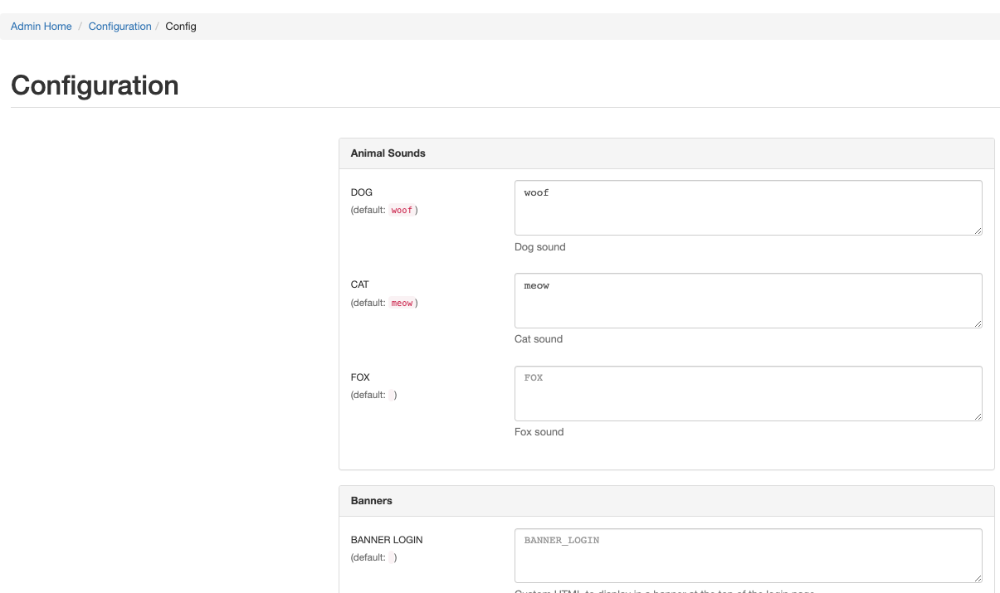

# Adding Database Backed Config

+++ 2.0.0

Apps can define settings that will be stored in the Database Backend through [Django Constance](https://django-constance.readthedocs.io/en/latest/#). All of the standard Django Constance types are supported. A Constance Fieldset will automatically be created for your plugin. We have added the `ConstanceConfigItem` `namedtuple` to assist in the configurations.

```python
# __init__.py
from nautobot.apps import ConstanceConfigItem, NautobotAppConfig

class AnimalSoundsConfig(NautobotAppConfig):
    # ...
    constance_config = {
        'DOG_SOUND': ConstanceConfigItem(default='woof', help_text='Dog sound'),
        'CAT_SOUND': ConstanceConfigItem(default='meow', help_text='Cat sound'),
        'FOX_SOUND': ConstanceConfigItem(default=123, help_text='Fox sound', field_type=int),
    }
```



!!! warning
    Do not store secrets in the constance_config, instead use Nautobot [Secrets](../../../user-guide/platform-functionality/secret.md).
