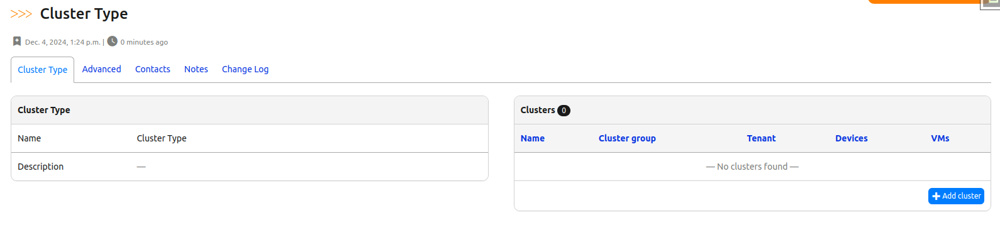

# Migrating to UI Component Framework

A guide for app developers transitioning to the UI Component Framework.

## Introduction

This guide helps you migrate your existing Nautobot app views to use the new UI Component Framework. The framework provides a declarative approach to building object detail views, reducing boilerplate code while ensuring consistency across the platform.

For complete UI Component Framework documentation, see: [Nautobot UI Framework Documentation](../../../core/ui-component-framework.md)

## Why Migrate?

### Benefits

- Reduced template maintenance
- Consistent UI patterns across apps
- Standardized component behavior

## Before and After Examples

### `Secret` model

In this example, we're migrating an existing view (the detail view for the `Secret` model) to use the UI Component Framework. We'll also convert it from using older generic class-based views to using the newer `NautobotUIViewSet` class pattern.

#### `Secret` Before

```python title="nautobot/extras/views.py"
...

class SecretListView(generic.ObjectListView):
    queryset = Secret.objects.all()
    filterset = filters.SecretFilterSet
    filterset_form = forms.SecretFilterForm
    table = tables.SecretTable


class SecretView(generic.ObjectView):
    queryset = Secret.objects.all()

    def get_extra_context(self, request, instance):
        provider = registry["secrets_providers"].get(instance.provider)

        groups = instance.secrets_groups.distinct()
        groups_table = tables.SecretsGroupTable(groups, orderable=False)

        return {
            "format": format_,
            "provider_name": provider.name if provider else instance.provider,
            "groups_table": groups_table,
            **super().get_extra_context(request, instance),
        }


class SecretEditView(generic.ObjectEditView):
    queryset = Secret.objects.all()  # (1)
    model_form = forms.SecretForm


class SecretDeleteView(generic.ObjectDeleteView):
    queryset = Secret.objects.all()


class SecretBulkDeleteView(generic.BulkDeleteView):
    queryset = Secret.objects.all()
    filterset = filters.SecretFilterSet
    table = tables.SecretTable

...
```

1. Note the repetition of information such as `queryset` across each distinct view class here. Reducing this repetition is one of the key benefits of moving to use `NautobotUIViewSet`.

```html title="nautobot/extras/templates/extras/secret.html"




    <a onClick="checkSecret()" class="btn btn-default">  <!-- (1) -->
        Check Secret
    </a>



    <div class="panel panel-default">  <!-- (2) -->
        <div class="panel-heading">
            <strong>Secret</strong>
        </div>
        <table class="table table-hover panel-body attr-table">
            <tr>
                <td>Description</td>
                <td>{{ object.description | placeholder }}</td>
            </tr>
            <tr>
                <td>Provider</td>
                <td>{{ provider_name }}</td>
            </tr>
        </table>
    </div>
    <div class="panel panel-default">  <!-- (3) -->
        <div class="panel-heading">
            <strong>Parameters</strong>
        </div>
        <table class="table table-hover panel-body attr-table">
            
                <tr>
                    <td><code>{{ param }}</code></td>
                    <td><code>{{ value }}</code></td>
                </tr>
            
        </table>
    </div>



    <!-- (4) -->
    



{{ block.super }}
<script>
    function checkSecret() {
        $.ajax({
            url: "",
            dataType: 'json',
            success: function(json) {
                if(json.result) {
                    alert("The secret was successfully retrieved.")
                } else {
                    alert("Error retrieving secret: \n\n" + json.message)
                }
            },
            error: function(xhr) {
                alert("Error checking secret: \n\n" + xhr.responseText);
            }
        });
    }
</script>

```

1. Custom button added to this page, with custom JavaScript later in the file associated with it.
2. First panel in this page, on the left side.
3. Second panel in this page, on the left side below the first panel.
4. Third panel in this page, on the right side. Note that it renders `groups_table`, which was manually added to the template rendering context in `get_extra_context()` above.

```python title="nautobot/extras/urls.py"
...
    path("secrets/", views.SecretListView.as_view(), name="secret_list"),
    path("secrets/add/", views.SecretEditView.as_view(), name="secret_add"),
    path("secrets/delete/", views.SecretBulkDeleteView.as_view(), name="secret_bulk_delete"),
    path("secrets/<uuid:pk>/", views.SecretView.as_view(), name="secret"),
    path("secrets/<uuid:pk>/edit/", views.SecretEditView.as_view(), name="secret_edit"),
    path("secrets/<uuid:pk>/delete/", views.SecretDeleteView.as_view(), name="secret_delete"),
    path(
        "secrets/<uuid:pk>/changelog/",
        views.ObjectChangeLogView.as_view(),
        name="secret_changelog",
        kwargs={"model": Secret},
    ),
    path(
        "secrets/<uuid:pk>/notes/",
        views.ObjectNotesView.as_view(),
        name="secret_notes",
        kwargs={"model": Secret},
    ),
...
```

#### `Secret` After

```python title="nautobot/extras/views.py"
...

class SecretUIViewSet(
    ObjectDetailViewMixin,
    ObjectListViewMixin,
    ObjectEditViewMixin,
    ObjectDestroyViewMixin,
    ObjectBulkDestroyViewMixin,
    # no ObjectBulkUpdateViewMixin here yet (1)
    ObjectChangeLogViewMixin,
    ObjectNotesViewMixin,
):
    queryset = Secret.objects.all()
    form_class = forms.SecretForm  # (2)
    filterset_class = filters.SecretFilterSet
    filterset_form_class = forms.SecretFilterForm
    table_class = tables.SecretTable

    object_detail_content = object_detail.ObjectDetailContent(
        panels=[
            object_detail.ObjectFieldsPanel(
                weight=100,
                section=SectionChoices.LEFT_HALF,
                fields="__all__",
                exclude_fields=["parameters"],  # (3)
            ),
            object_detail.KeyValueTablePanel(
                weight=200,
                section=SectionChoices.LEFT_HALF,
                label="Parameters",
                context_data_key="parameters",  # (4)
            ),
            object_detail.ObjectsTablePanel(
                weight=100,  # (5)
                section=SectionChoices.RIGHT_HALF,
                table_title="Groups containing this secret",
                table_class=tables.SecretsGroupTable,
                table_attribute="secrets_groups",  # (6)
                footer_content_template_path=None,  # (7)
            ),
        ],
        extra_buttons=[
            object_detail.Button(
                weight=100,
                label="Check Secret",
                icon="mdi-test-tube",
                javascript_template_path="extras/secret_check.js",
                attributes={"onClick": "checkSecret()"},
            ),
        ],
    )

    def get_extra_context(self, request, instance):
        ctx = super().get_extra_context(request, instance)
        if self.action == "retrieve":
            ctx["parameters"] = instance.parameters
        return ctx

...
```

1. The existing Secret views didn't provide a bulk-edit view, probably because there aren't many (any?) Secret attributes that make sense to bulk-edit. We're preserving that behavior here by using the individual view Mixin classes instead of the single NautobotUIViewSet class as we otherwise might.
2. Note the change in attribute names here compared to the generic class-based views - `model_form` to `form_class`, `filterset` to `filterset_class`, `filterset_form` to `filterset_form_class`, `table` to `table_class`.
3. Matching the original template - we don't render `obj.parameters` in this panel because we're going to render it specially in the next panel.
4. In other words, the data to be rendered into this panel will come from the key `"parameters"` in the render context, which we're specifically injecting in `get_extra_context()` below.
5. We restart our `weight` numbers from 100 here because this panel begins a different `section` of the page.
6. In other words, this table will render `obj.secrets_groups` as its data.
7. This disables the otherwise automatic injection of an "Add Secrets Group" button in the footer of this table. That might be nice to support in the future but it's a bit tricky because of the many-to-many relationship between Secret and Secrets Group, so for now, we disable it.

Note that we've removed `nautobot/extras/templates/extras/secret.html` entirely, as a custom template is no longer needed. In its place we have a much smaller template that just contains the custom JavaScript needed for the custom button on this page:

```javascript title="nautobot/extras/templates/extras/secret_check.js"
function checkSecret() {
    $.ajax({
        url: "",
        dataType: 'json',
        success: function(json) {
            if(json.result) {
                alert("The secret was successfully retrieved.")
            } else {
                alert("Error retrieving secret: \n\n" + json.message)
            }
        },
        error: function(xhr) {
            alert("Error checking secret: \n\n" + xhr.responseText);
        }
    });
}
```

```python title="nautobot/extras/urls.py"
...
router.register("secrets", views.SecretUIViewSet)
...
```

As a side benefit of this change, we've also reduced the amount of code (Python + HTML) that we have to maintain for this set of views by a fairly significant percentage.

### `ClusterType` model

Screenshot of migrated view:

<!-- pyml disable-num-lines 5 no-inline-html -->
<div class="grid cards example-images" markdown>

- { .on-glb }

</div>

#### `ClusterType` Before

```html title="nautobot/virtualization/templates/virtualization/clustertype.html"



        <div class="panel panel-default">
            <div class="panel-heading">
                <strong>Cluster Type</strong>
            </div>
            <table class="table table-hover panel-body attr-table">
                <tr>
                    <td>Description</td>
                    <td>{{ object.description|placeholder }}</td>
                </tr>
                <tr>
                    <td>Clusters</td>
                    <td>
                        <a href="?cluster_type={{ object.name }}">{{ cluster_table.rows|length }}</a>
                    </td>
                </tr>
            </table>
        </div>



        <div class="panel panel-default">
            <div class="panel-heading">
                <strong>Clusters</strong>
            </div>
            
            
                <div class="panel-footer text-right noprint">
                    <a href="?cluster_type={{ object.pk }}" class="btn btn-xs btn-primary">
                        <span class="mdi mdi-plus-thick" aria-hidden="true"></span> Add cluster
                    </a>
                </div>
            
        </div>
        
        <div class="row"></div>

```

1. Both panels are declared in the HTML.
2. `Add cluster` button needed to be added manually in HTML code.

```python title="nautobot/virtualization/views.py"

class ClusterTypeView(generic.ObjectView):
    queryset = ClusterType.objects.all()

    def get_extra_context(self, request, instance):
        # Clusters
        clusters = Cluster.objects.restrict(request.user, "view").filter(cluster_type=instance)

        cluster_table = tables.ClusterTable(clusters)
        cluster_table.columns.hide("cluster_type")

        paginate = {
            "paginator_class": EnhancedPaginator,
            "per_page": get_paginate_count(request),
        }
        RequestConfig(request, paginate).configure(cluster_table)

        return {"cluster_table": cluster_table, **super().get_extra_context(request, instance)}
```

1. You need to manually get the data to populate `Clusters` table along with pagination.
2. To pass the data into the template you need to override the `get_extra_context` method.

#### `ClusterType` After

File `nautobot/virtualization/templates/virtualization/clustertype.html` can be deleted.

`ClusterTypeView` after changes:

```python title="nautobot/virtualization/views.py"

class ClusterTypeView(generic.ObjectView):
    queryset = ClusterType.objects.all()

    object_detail_content = object_detail.ObjectDetailContent(
        panels=(
            object_detail.ObjectFieldsPanel(
                weight=100,
                section=SectionChoices.LEFT_HALF,
                fields="__all__",
            ),
            object_detail.ObjectsTablePanel(
                weight=100,
                section=SectionChoices.RIGHT_HALF,
                table_class=tables.ClusterTable,
                table_filter="cluster_type",
                exclude_columns=["cluster_type"],
            ),
        ),
    )
```

1. There is no need to override `get_extra_context` method or fetch data for the table manually.
2. Proper labels are set automatically both for `Cluster Type` and `Clusters` panel according to the models names.
3. `ObjectsTablePanel` has built in support for `Add` button and render `Add cluster` button automatically.
4. There is no need for custom template or to maintain custom HTML file. HTML template is standardized across the Nautobot.
5. Pagination support is also built-in into `ObjectsTablePanel`.
6. You can easily shuffle Panels if needed or adjust displayed fields at the Panel declaration level without need to look for HTML template.
