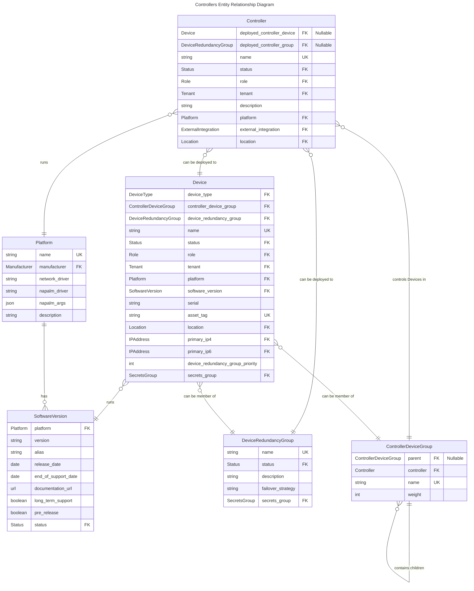

# Controllers

A Controller in Nautobot is an abstraction meant to represent network or SDN (Software-Defined Networking) controllers. These may include, but are not limited to, wireless controllers, cloud-based network management systems, and other forms of central network control mechanisms.

For more details, refer to the user guide for a [Controller model](../../user-guide/core-data-model/dcim/controller.md) or a [Controller Device Group model](../../user-guide/core-data-model/dcim/controllerdevicegroup.md).

## Entity Relationship Diagram

This schema illustrates the connections between related models.

