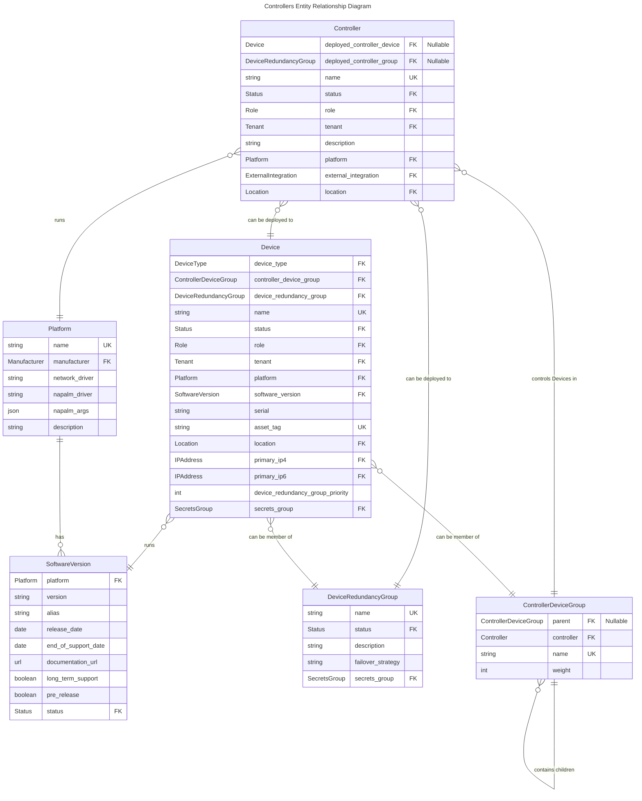

# Controller Models

Controller models enable Nautobot users to model a set of well known industry network or SDN controllers, with their relationship to the managed devices. These models should enable modeling of controllers like Cisco ACI, Juniper MIST, OpenStack, Wireless Controllers, Panorama (PA), F5 BIG-IQ etc.

## Use Cases

Modeling should be tested against well known platforms:

- Cisco ACI
- Panorama
- Juniper MIST
- Arista CV
- Meraki
- Wireless Controller (i.e. Ruckus or Cisco)
- OpenStack

Should allow answering inventory questions:

- What is the controller for the given device group
- What is the controller for the given device
- What are the device groups managed by the controller
- What are the devices managed by the controller

## Controller Models

### `Controller`

Represents an entity that manages or controls one or more devices, acting as a central point of control.

A Controller can be deployed to a single device or a group of devices represented by single `DeviceRedundancyGroup`.

### `ControllerDeviceGroup`

Represents a mapping of controlled devices to a specific controller.

This model allows for the organization of controlled devices into hierarchical groups for structured representation.

## Related Models

### `Platform`

Platform refers to the software or firmware running on a Device. For example, "Cisco IOS-XR" or "Juniper Junos".

Nautobot uses Platforms to determine how to interact with devices when pulling inventory data or other information
by specifying a network driver; `netutils` is then used to derive library-specific driver information from this.

### `SoftwareVersion`

A software version for a Device, Virtual Machine or Inventory Item.

### `Device`

A Device represents a piece of physical hardware. Each Device is assigned a `DeviceType`,
`Role`, and (optionally) a `Platform`. Device names are not required, however if one is set it must be unique.

When a new `Device` is created, console/power/interface/device bay components are created along with it as dictated
by the component templates assigned to its `DeviceType`. Components can also be added, modified, or deleted after the
creation of a Device.

### `DeviceRedundancyGroup`

A `DeviceRedundancyGroup` represents a logical grouping of physical hardware for the purposes of high-availability.

## Entity Relationship Diagram


## Examples

### Cisco ACI

```yaml
name: Cisco ACI APIC - east
deployed_controller_device: DC-East-APIC-1
location: DC-East
platform: cisco_apic
```

### Cisco Meraki

```yaml
name: Cisco Meraki SAAS
deployed_controller_device: ~
location: Cloud "Location
platform: cisco_meraki
```

### Controller Device Group

```yaml
controller_device_group:
  - name: campus
    controller: Panorama1
    tags:
      - high_security
    member_devices:
      - dal-fw01
      - chi-fw01
  - name: dc
    controller: Panorama1
    tags:
      - medium_security
    member_devices:
      - nyc-fw99
      - jcy-fw99
```
