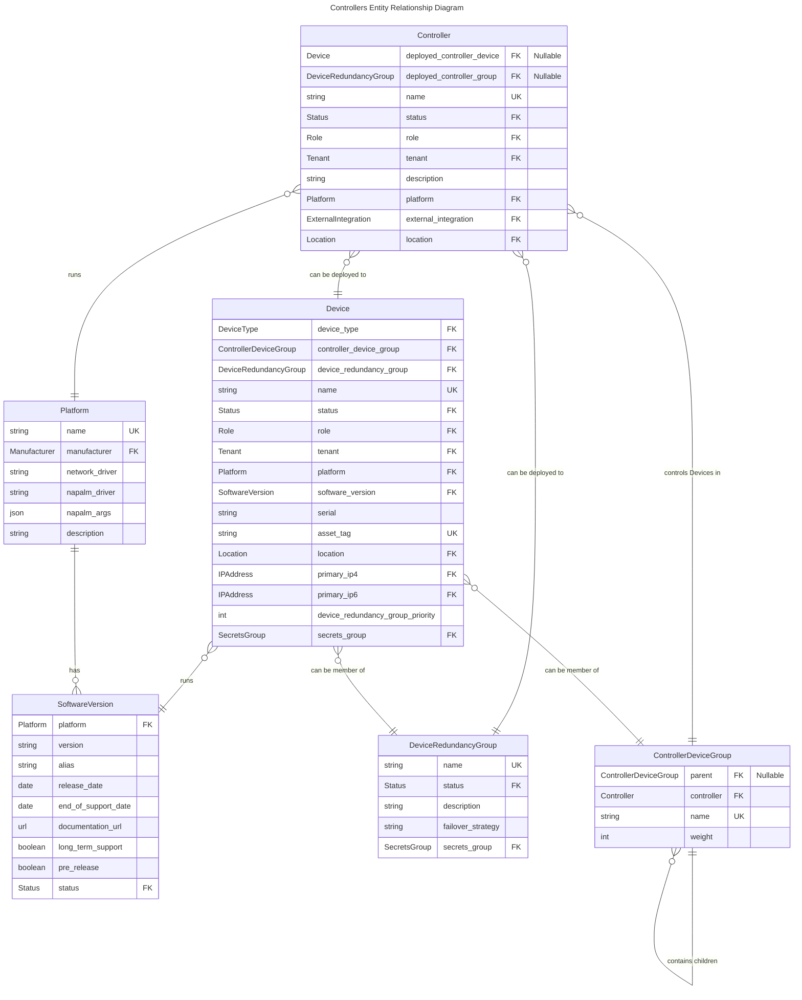

# Controllers

Controllers in Nautobot enable users to model a set of industry-standard network or SDN controllers, along with their relationships to the devices they manage.

## Use Cases

These models support the representation of various use cases, including, but not limited to:

- Cisco ACI
- Panorama
- Juniper MIST
- Arista CloudVision
- Meraki
- Wireless Controllers (e.g., Ruckus, Cisco)
- OpenStack

Using controllers enables answering inventory-related queries:

- Find the controller for the given device group.
- Find the controller for the given device.
- List device groups managed by the controller.
- List devices managed by the controller.

## Controller Model

Represents an entity that manages or controls one or more devices, acting as a central point of control.

A Controller can be deployed to a single device or a group of devices represented by single `DeviceRedundancyGroup`.

## Controller Device Group Model

Represents a mapping of controlled devices to a specific controller.

This model allows for the organization of controlled devices into hierarchical groups for structured representation.

## Entity Relationship Diagram



## Examples

### Cisco ACI

```yaml
name: Cisco ACI APIC - east
deployed_controller_device: DC-East-APIC-1
location: DC-East
platform: cisco_apic
```

### Cisco Meraki

```yaml
name: Cisco Meraki SAAS
deployed_controller_device: ~
location: Cloud Location
platform: cisco_meraki
```

### Controller Device Group

```yaml
controller_device_group:
  - name: campus
    controller: Panorama1
    tags:
      - high_security
    devices:
      - dal-fw01
      - chi-fw01
  - name: dc
    controller: Panorama1
    tags:
      - medium_security
    devices:
      - nyc-fw99
      - jcy-fw99
```
