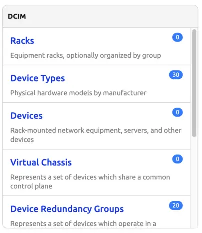
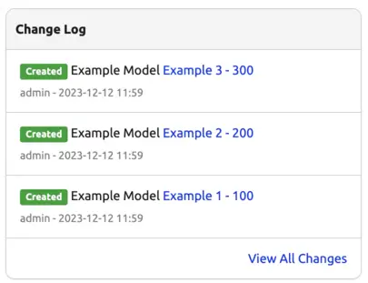

# Populating the Home Page

Both core applications and Apps can contribute items to the Nautobot home page by defining `layout` inside of their app's `homepage.py`. Using a key and weight system, a developer can integrate amongst existing home page panels or can create entirely new panels as desired.

## Adding a new Home Page Panel

Each panel on the home page is defined by a `HomePagePanel` object. A `HomePagePanel` may contain either or both of `HomePageItem` and/or `HomePageGroup` objects, or may define custom content via a referenced Django template. A `HomePageGroup` may itself contain `HomePageItem` objects as well, and individual `HomePageItem` objects may also reference custom Django templates.

Some examples:



This is a single `HomePagePanel` (defined in `nautobot/dcim/homepage.py`) containing four `HomePageItem` and one `HomePageGroup` (the `Connections` group, which in turn contains four more `HomePageItem`). Using these objects together allows you to create panels that match the visual style of most other panels on the Nautobot home page.



This is a `HomePagePanel` (defined in `nautobot/extras/homepage.py`) that uses a custom template to render content that doesn't fit into the `HomePageGroup`/`HomePageItem` pattern.

The initial position of a panel in the home page is defined by its `weight`. The lower the weight the closer to the start (top/left) of the home page the object will be. All core objects have weights in multiples of 100, meaning there is plenty of space around the objects for Apps to customize.

In the below code example, you can see that the `Example App Custom Panel` panel has a `weight` value of `350`. This means it will appear between `Power` (weight `300`) and `IPAM` (weight `400`). (Since Nautobot 2.1, a user can drag-and-drop the panels to re-order them to their liking, but the `weight` still sets the initial position before the user does so.)

!!! tip
    Weights for already existing items can be found in the Nautobot source code (in `nautobot/<app>/homepage.py`) or with a web session open to your Nautobot instance, you can inspect an element of the home page using the developer tools.

Example of custom code being used in a panel can be seen in the `Example App Custom Panel` panel below. The attribute `custom_template` is used to refer to the filename of a template. Templates need to be stored in the templates `inc` folder for the App (`/example_app/templates/example_app/inc/`).

If additional data is needed to render the custom template, callback functions can be used to collect this data. In the below example, the `Example App Custom Panel` panel is using the callback `get_example_data()` to dynamically populate the key `example_data` into the rendering context of this panel.

``` python
from nautobot.core.apps import HomePageItem, HomePagePanel
from .models import ExampleModel


def get_example_data(request):
    return ExampleModel.objects.all()


layout = (
    HomePagePanel(
        name="Organization",
        items=(
            HomePageItem(
                weight=150,
                name="Example Models",
                model=ExampleModel,
                link="plugins:example_app:examplemodel_list",
                description="List Example App models.",
                permissions=["example_app.view_examplemodel"],
            ),
        ),
    ),
    HomePagePanel(
        weight=350,
        name="Example App Custom Panel",
        custom_template="panel_example.html",
        custom_data={"example_data": get_example_data},
        permissions=["example_app.view_examplemodel"],
    ),
)
```
