# Kubernetes Job Support

Kubernetes Job Support is added in Nautobot v2.4.0. This documentation is a end-to-end development guide on topics from how to set up your local kubernetes cluster with [minikube](https://minikube.sigs.k8s.io/docs/) and how to run a nautobot job in a remote kubernetes job pod.

## Preliminary Setup

First we need to install minikube, go to the offical [get started page](https://minikube.sigs.k8s.io/docs/start/?arch=%2Fmacos%2Farm64%2Fstable%2Fbinary+download) to learn how to download minikube.

Once minikube is downloaded, create and start your minikube cluster with the following command:

```bash
minikube start
```

You should see the following output:

```bash
😄  minikube v1.34.0 on Darwin 14.4 (arm64)
✨  Using the docker driver based on existing profile
👍  Starting "minikube" primary control-plane node in "minikube" cluster
🚜  Pulling base image v0.0.45 ...
🏃  Updating the running docker "minikube" container ...
🐳  Preparing Kubernetes v1.31.0 on Docker 27.2.0 ...
🔎  Verifying Kubernetes components...
    ▪ Using image gcr.io/k8s-minikube/storage-provisioner:v5
🌟  Enabled addons: storage-provisioner, default-storageclass
🏄  Done! kubectl is now configured to use "minikube" cluster and "default" namespace by default
```

Next we need [`kubectl`](https://kubernetes.io/docs/reference/kubectl/) to interact with the new cluster we just created. See [Kubernetes official documentation](https://kubernetes.io/docs/tasks/tools/#kubectl) on how to download `kubectl` for your respective operating system.

Once you have `kubectl` downloaded and installed, run the following command to ensure the version you installed is up-to-date:

```bash
kubectl version --client
```

You should see the following output:

```bash
Client Version: v1.31.2
Kustomize Version: v5.4.2
```

We also need to check if our default service account is enabled to create jobs, we can check the permission by executing the following command:

```bash
kubectl auth can-i --as=system:serviceaccount:default:default create jobs -n default
```

If the output from the above command is yes, then you are all good to go. However, if the output is no, then we need to create a rolebinding to grant the default user appropriate permissions. We can achieve this by running the following command:

```bash
kubectl create rolebinding admin-namespace-default-new --clusterrole=admin --serviceaccount=default:default --namespace=default
```

This command will assign the admin role to our default serviceaccount in the namespace `default`. Check out kubernetes [RBAC authorization page](https://kubernetes.io/docs/reference/access-authn-authz/rbac/) to learn how to create more granular role and permission assignments.

We can run the `kubectl auth can-i --as=system:serviceaccount:default:default create jobs -n default` again and this time the output should be yes.

## Starting Required Deployments

### Check Required Files

If this is your first time installing `minikube` and creating a new cluster, there should be nothing running on the cluster yet. Assuming that your current working directory is in the `nautobot` folder, what we need to do is to confirm that we have all the deployment files that we need in the `/development/kubernetes` folder.

You can confirm that by running the following command:

```bash
ls development/kubernetes
```

You should see the following output:

```bash
celery-beat-deployment.yaml                media-root-persistentvolumeclaim.yaml      nautobot-service.yaml
db-deployment.yaml                         nautobot-cm1-configmap.yaml                pgdata-nautobot-persistentvolumeclaim.yaml
db-service.yaml                            nautobot-cm2-configmap.yaml                redis-deployment.yaml
dev-env-configmap.yaml                     nautobot-deployment.yaml                   redis-service.yaml
docker-compose.min.yml
```

You should see several yaml files with post-fixes like `*-deployment.yaml`, `*-service.yaml`, `*-persistentvolumeclaim.yaml`, and `*-configmap.yaml`.

### Build an up-to-date Nautobot Docker Image

An up-to-date Nautobot local docker image named `local/nautobot-dev:local-py${PYTHON_VER}` is required before we start building our kubernetes deployments. The default `PYTHON_VER` is set to 3.11. If you have a different python version, for example 3.9, you will need to replace every occurrence of `local/nautobot-dev:local-py3.11` in `nautobot-deployment.yaml` and `nautobot-cm1-configmap.yaml` with `local/nautobot-dev:local-py3.9` to make sure that minikube pick up the correct local nautobot image in your docker environment.

Run the following command to point your terminal to use the docker daemon inside minikube. This will ensure that your up-to-date local image named `local/nautobot-final-dev:local-py${PYTHON_VER}` is used when we build our kubernetes deployments.

```bash
eval $(minikube docker-env)
```

Now you can build your nautobot image locally using the `invoke build` command. After the build is complete, we are ready to build our kubernetes deployments.

### Starting the Deployments and Services

Once you have confirmed that you have all the files listed above. We can start the required deployments and services:

To start all deployments:

```bash
kubectl apply -f "development/kubernetes/*-deployment.yaml"
```

You should see the following output:

```bash
deployment.apps/celery-beat created
deployment.apps/db created
deployment.apps/nautobot created
deployment.apps/redis created
```

You can confirm the health of the deployment by running the following command:

```bash
kubectl get deployments
```

You should see the following output:

```bash
NAME          READY   UP-TO-DATE   AVAILABLE   AGE
celery-beat   1/1     1            1           12m
db            1/1     1            1           12m
nautobot      1/1     1            1           12m
redis         1/1     1            1           14m
```

To start all services:

```bash
kubectl apply -f "development/kubernetes/*-service.yaml"
```

You should see the following output:

```bash
service/db created
service/nautobot created
service/redis created
```

You can confirm the health of the each service by running the following command:

```bash
kubectl get services
```

You should see the following output:

```bash
NAME            TYPE        CLUSTER-IP       EXTERNAL-IP   PORT(S)    AGE
db              ClusterIP   10.111.0.30      <none>        5432/TCP   12m
kubernetes      ClusterIP   10.96.0.1        <none>        443/TCP    12m
nautobot        ClusterIP   10.106.32.53     <none>        8080/TCP   12m
redis           ClusterIP   10.102.99.143    <none>        6379/TCP   12m
```

### Starting the Configuration Maps and Persistent Volumn Claims

Once you have started all deployments and services. We can start the required configuration maps and persistent volume claims:

To start all configuration maps:

```bash
kubectl apply -f "development/kubernetes/*-configmap.yaml"
```

You should see the following output:

```bash
configmap/dev-env created
configmap/nautobot-cm1 created
configmap/nautobot-cm2 created
```

You can confirm that those configuration maps are created by running the following command:

```bash
kubectl get configmaps
```

You should see the following output:

```bash
NAME               DATA   AGE
dev-env            32     24s
nautobot-cm1       1      24s
nautobot-cm2       1      24s
```

To start all persistent volume claims:

```bash
kubectl apply -f "development/kubernetes/*-persistentvolumeclaim.yaml"
```

You should see the following output:

```bash
persistentvolumeclaim/media-root created
persistentvolumeclaim/pgdata-nautobot created
```

You can confirm that those persistent volume claims are created by running the following command:

```bash
kubectl get persistentvolumeclaims
```

You should see the following output:

```bash
NAME              STATUS   VOLUME                                     CAPACITY   ACCESS MODES   STORAGECLASS   VOLUMEATTRIBUTESCLASS   AGE
media-root        Bound    pvc-011f484b-2ccf-4fe0-953b-289a13ad0480   200Mi      RWO            standard       <unset>                 2m35s
pgdata-nautobot   Bound    pvc-5954eb3f-75e3-4f6b-9b9c-a91e40ea96bf   200Mi      RWO            standard       <unset>                 2m35s
```

To confirm all required kubernetes entities are up and running, run the following command:

```bash
kubectl get all
```

You should see the following output, note that pods are automatically created when we create deployments:

```bash
NAME                               READY   STATUS    RESTARTS      AGE
pod/celery-beat-6fb67477b7-rsw62   1/1     Running   0             30m
pod/db-8687b48964-gtvtc            1/1     Running   0             30m
pod/nautobot-679bdc765-pl2ld       1/1     Running   0             30m
pod/redis-7cc58577c-tl5sq          1/1     Running   0             30m

NAME                 TYPE        CLUSTER-IP      EXTERNAL-IP   PORT(S)    AGE
service/db           ClusterIP   10.111.0.30     <none>        5432/TCP   30m
service/kubernetes   ClusterIP   10.96.0.1       <none>        443/TCP    30m
service/nautobot     ClusterIP   10.106.32.53    <none>        8080/TCP   30m
service/redis        ClusterIP   10.102.99.143   <none>        6379/TCP   30m

NAME                          READY   UP-TO-DATE   AVAILABLE   AGE
deployment.apps/celery-beat   1/1     1            1           30m
deployment.apps/db            1/1     1            1           30m
deployment.apps/nautobot      1/1     1            1           30m
deployment.apps/redis         1/1     1            1           30m
```

### Port Forward to Local Host

We can use the `port-forward` command from `kubectl` to make your Nautobot instance on the kubernetes cluster accessible in `localhost:8080`:

```bash
kubectl port-forward <nautobot-pod-name> 8080:8080
```

The output should be:

```bash
Forwarding from 127.0.0.1:8080 -> 8080
Forwarding from [::1]:8080 -> 8080
Handling connection for 8080
```

Now go to your web browser and navigate to `localhost:8080`. You should see your Nautobot instance running.

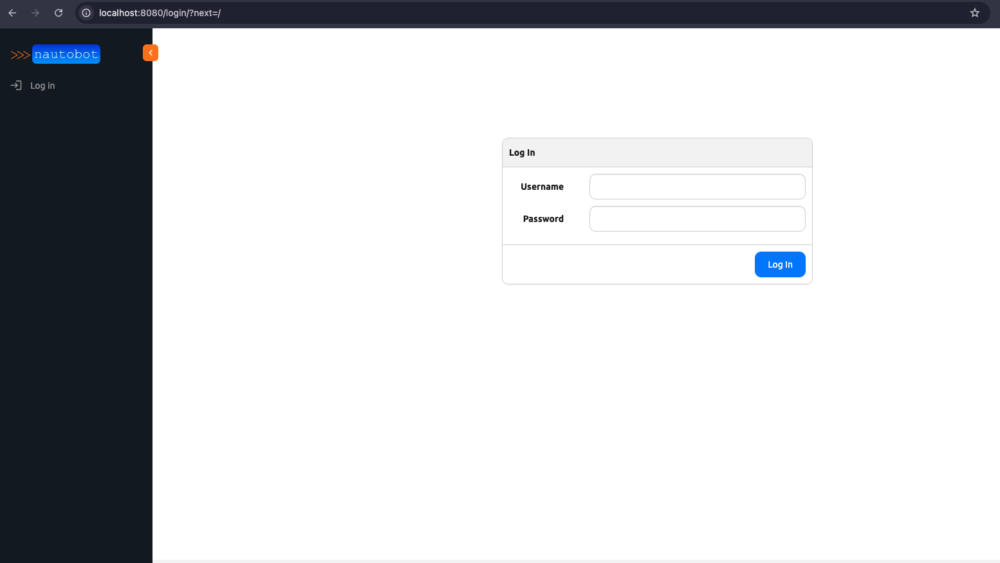

## Run a Kubernetes Job

### Configure a New Job Queue of Type Kubernetes

Go to the Navigation bar on your left hand side and look at the Jobs Section. You should see Job Queues at the very end of the section. Click on the plus button next to the Job Queues entry and this will take us to a form for creating a new job queue.

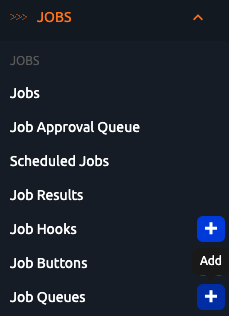

We can give the name "kubernetes" to the new job queue and select "Kubernetes" from the Queue Type dropdown.

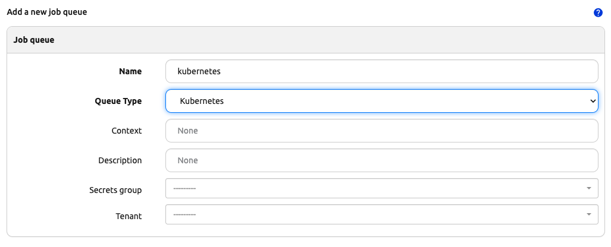

Scroll down and click on the create button. A new Job Queue with name "kubernetes" and with type Kubernetes should be created.

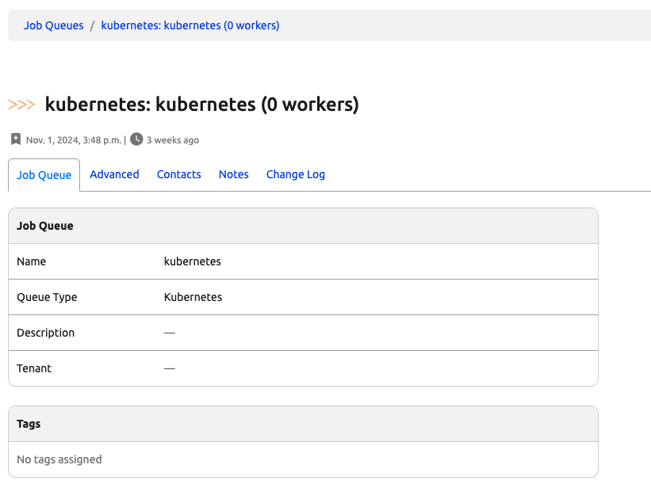

### Assign that Job Queue to a Job

Go to a Job's edit form and assign the newly created kubernetes job queue to the job. We will be using the "Export Object List" system job here.

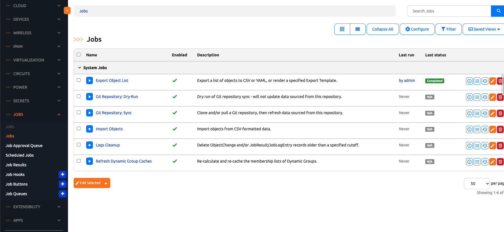

Check the override default value checkbox on the `Job Queues` field and select the kubernetes job queue from the dropdown.
Check the override default value checkbox on the `Default Job Queue` field and select the kubernetes job queue from the dropdown.

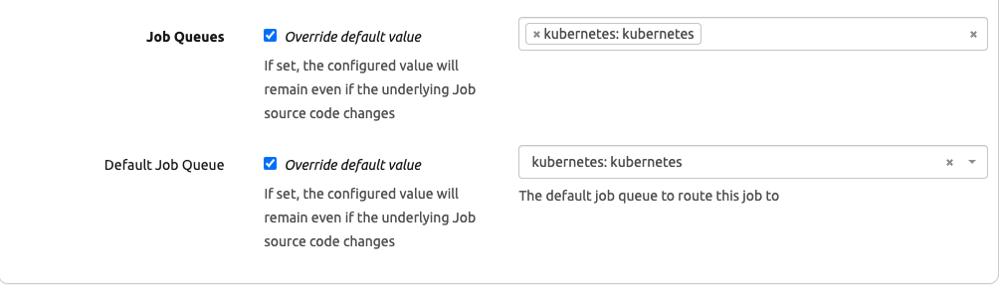

Click on the update button when we are finished.

### Run the Job

After clicking on the update button after the previous step, we should be redirected to the table of jobs. Click on the link that says "Export Object List". This should take us to the Job Run Form.

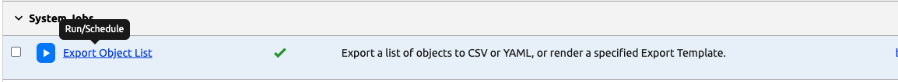

Select an option for the Content Type field dropdown and notice that the Job queue is already filled out with the kubernetes job queue that we assigned to this job from previous steps. So we do not need to make any changes there.

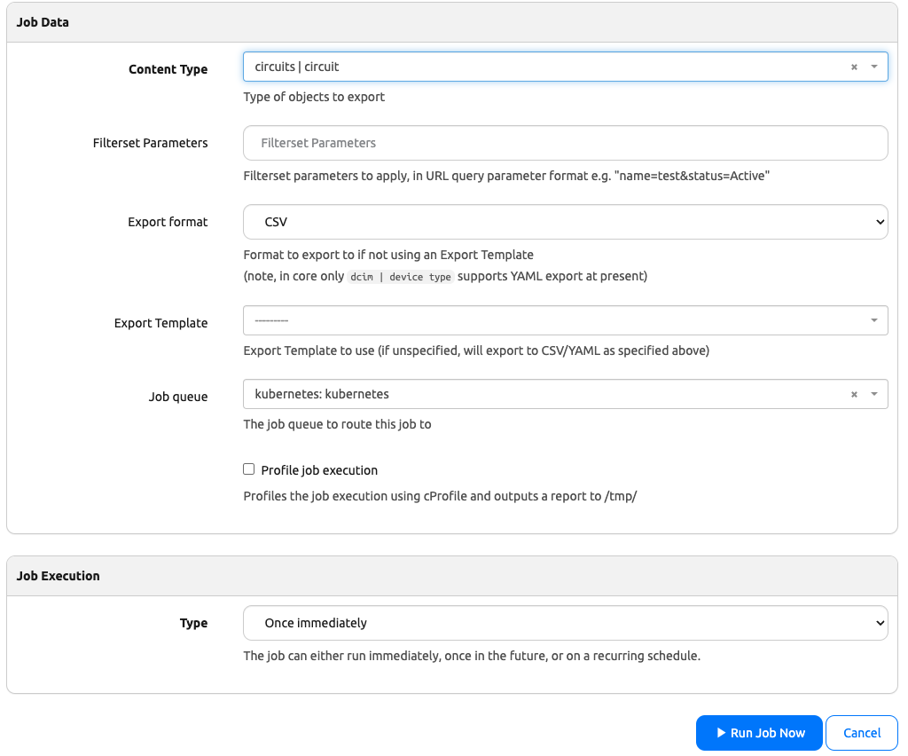

Click on the "Run Job Now" button and we should be directed to the job result page.

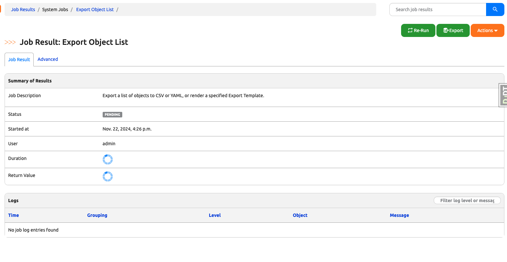

### Inspect the Job Result

You can inspect the job result and the job logs in this page. Notice the two job log entries that reads something like "Creating job pod (pod-name) in namespace default" and Reading job pod (pod-name) in namespace default". Those entries indicate that a Kubernetes Job pod was executing the job for us.

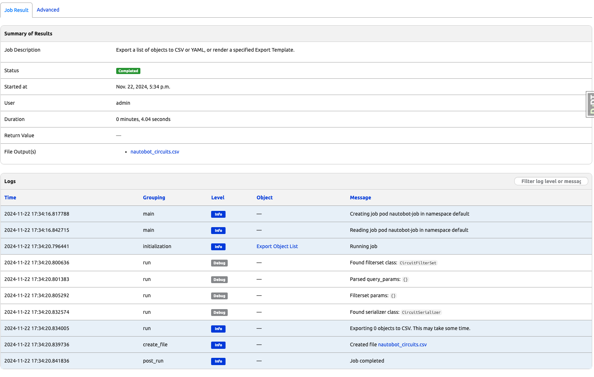

### Running a Scheduled Job

We can run scheduled jobs as well. In order to run scheduled jobs, we do need celery beat which should already be running from previous steps. To confirm that the celery beat is running, we need to retrieve the celery beat pod name by running the command `kubectl get pods`. You should see the following output or something similar, copy the pod name with prefix `celery-beat-*`.

```bash
NAME                           READY   STATUS    RESTARTS   AGE
celery-beat-6fb67477b7-rsw62   1/1     Running   0          10m
db-8687b48964-gtvtc            1/1     Running   0          10m
nautobot-679bdc765-pl2ld       1/1     Running   0          10m
redis-7cc58577c-tl5sq          1/1     Running   0          10m
```

we can run the command `kubectl logs <celery-beat-pod-name> -f` and you should see the following output or something similar:

```bash
LocalTime -> 2024-11-20 18:49:41
Configuration ->
    . broker -> redis://:**@redis:6379/0
    . loader -> celery.loaders.app.AppLoader
    . scheduler -> nautobot.core.celery.schedulers.NautobotDatabaseScheduler

    . logfile -> [stderr]@%INFO
    . maxinterval -> 5.00 seconds (5s)
[2024-11-20 18:49:41,161: INFO/MainProcess] beat: Starting...
```

Open another terminal and execute the command `kubectl exec --stdin --tty <nautobot-pod-name> -- /bin/bash` and run `nautobot-server nbshell`. We are going to create a new Scheduled Export Object List Job.

First we import all the required packages:

```py
from nautobot.extras.choices import JobExecutionType
from datetime import datetime
from zoneinfo import ZoneInfo
```

Then we can create the Scheduled Job

```py
scheduled_job = ScheduledJob()
scheduled_job.name = "Export Object List Hourly"
scheduled_job.task = "nautobot.core.jobs.ExportObjectList"
scheduled_job.job_model = Job.objects.get(name="Export Object List")
scheduled_job.interval = JobExecutionType.TYPE_HOURLY
scheduled_job.user = User.objects.first()
scheduled_job.approval_required = False
scheduled_job.start_time = datetime.now(ZoneInfo("America/New_York"))
scheduled_job.time_zone = ZoneInfo("America/New_York")
scheduled_job.job_queue = JobQueue.objects.get(name="kubernetes")
scheduled_job.kwargs = {"content_type": 1}
schedule_job.save()
```

To confirm that the Scheduled Job is running, we go back to the terminal that was logging celery beat. You should see the following logs or something similar:

```bash
[2024-11-21 02:09:57,756: INFO/MainProcess] DatabaseScheduler: Schedule changed.
[2024-11-21 02:09:57,774: INFO/MainProcess] Scheduler: Sending due task Export Object List Hourly_85413d3f-1342-4adf-8d80-11e740ebb907 (nautobot.extras.jobs.run_job)
02:09:57.782 INFO    nautobot.extras.utils utils.py        run_kubernetes_job_and_return_job_result() :
  Creating job pod nautobot-job in namespace default
[2024-11-21 02:09:57,782: INFO/MainProcess] Creating job pod nautobot-job in namespace default
02:09:57.802 INFO    nautobot.extras.utils utils.py        run_kubernetes_job_and_return_job_result() :
  Reading job pod nautobot-job in namespace default
[2024-11-21 02:09:57,802: INFO/MainProcess] Reading job pod nautobot-job in namespace default
[2024-11-21 02:09:57,837: INFO/MainProcess] DatabaseScheduler: Schedule changed.
```

You can also confirm if the job is running or is completed by running `kubectl get jobs` and `kubectl get pods` in another terminal.

Go back to your browser and click on the Job Results entry from the Jobs navigation menu.

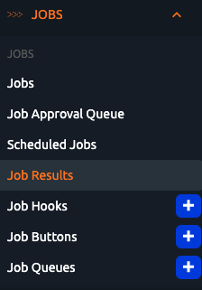

Inspect the Job Result

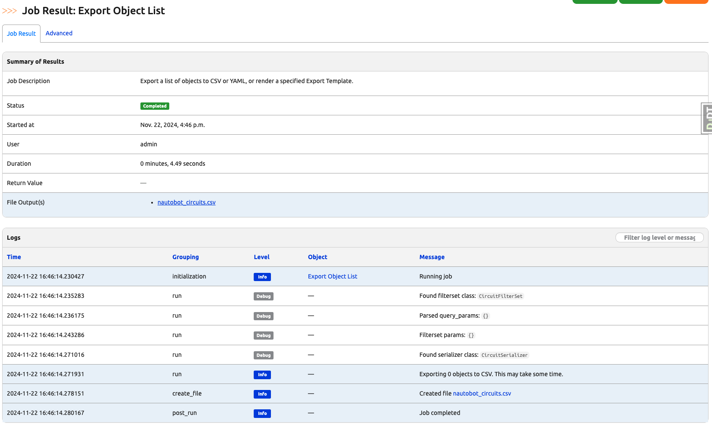

## After Running a Job

Good news is that there is nothing for you to do after running a kubernetes job. The job pod with prefix `nautobot-job-pod-*` will clean up itself. Running `kubectl get pods` to confirm that `nautobot-job-pod-<pod_id>` no longer exists.

```bash
NAME                           READY   STATUS    RESTARTS   AGE
celery-beat-6fb67477b7-rsw62   1/1     Running   0          1h
db-8687b48964-gtvtc            1/1     Running   0          1h
nautobot-679bdc765-pl2ld       1/1     Running   0          1h
redis-7cc58577c-tl5sq          1/1     Running   0          1h
```

You can also run `kubectl get jobs` to confirm that `nautobot-job-<pod_id>` no longer exists as well.

```bash
No resources found in default namespace.
```
