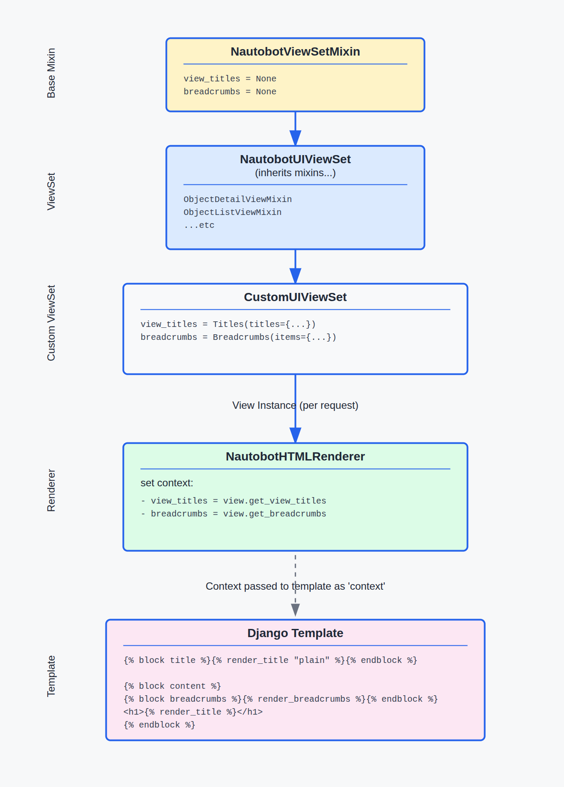

# Nautobot UI Component Framework

## Table of Contents

- [Introduction](#introduction)
- [Getting Started](#getting-started)
- [Core Concepts](#core-concepts)
- [Panel Types](#panel-types)
- [Button Types](#button-types)
- [Complete Example](#complete-example)
- [Layouts and Sections](#layouts-and-sections)
- [Best Practices](#best-practices)
- [Troubleshooting](#troubleshooting)

## Introduction

The Nautobot UI Framework revolutionizes how you create object detail views in your applications. Instead of writing HTML templates, you declaratively define your UI structure using Python objects, resulting in consistent, maintainable, and responsive interfaces.

<!-- pyml disable-num-lines 5 no-inline-html -->
<div class="grid cards example-images" markdown>

- { .on-glb }

</div>

### Why Use the UI Framework?

- ✨ **Reduced Development Time**: Eliminate boilerplate HTML/CSS
- 🎯 **Consistency**: Automatic adherence to Nautobot's design patterns
- 🔄 **Reusable Components**: Compose views from pre-built panels
- 🛠 **Extensible**: Easy to customize and extend

## Getting Started

### Basic Setup

1. Create a view that inherits from `NautobotUIViewSet`:

```python
from nautobot.apps import views
from nautobot.apps.ui import ObjectDetailContent, SectionChoices, ObjectFieldsPanel

class ExampleUIViewSet(views.NautobotUIViewSet):
    queryset = Example.objects.all()
    ...

    object_detail_content = ObjectDetailContent(
        panels=[
            ObjectFieldsPanel(
               weight=100,
               section=SectionChoices.LEFT_HALF,
                fields="__all__"
            )
        ]
    )
```

## Core Concepts

### ObjectDetailContent Definition

Each object detail view (whether based on a `NautobotUIViewSet` or a legacy `ObjectView`) that implements the UI Framework does so by defining an `object_detail_content` attribute which is an instance of the `ObjectDetailContent` class. This class automatically does a lot of the "heavy lifting" for you as a developer, but you'll generally want to configure it for your specific data model, usually by defining any of the following:

- Extra `Tab`s (beyond the default "main", "advanced", "contacts", etc. tabs that are automatically provided)
- `Panel`s in the "main" tab or any extra tabs
- Extra `Button`s to display at the top of the page (beyond the default "actions" dropdown)

### Tabs

A `Tab` is one of the major building blocks of your UI. The user can toggle between tabs, each of which displays distinct page content, typically consisting of one or more `Panel`s. Multiple tabs can be rendered in a single HTML response (for example, the "main" and "advanced" tabs are both part of the same page; toggling between them is a client-side action only and does not require Nautobot to reload or re-render the page), while to optimize performance, certain other tabs may correspond to distinct `View`s that are retrieved and rendered on request. The UI Framework supports both patterns.

### Panels

`Panel`s are another of the major building blocks of your UI. They contain specific types of content and can be positioned within sections within a Tab.

<!-- pyml disable-num-lines 5 no-inline-html -->
<div class="grid cards example-images" markdown>

- { .on-glb }

</div>

### Buttons

`Button`s are the third major building block for the UI. Defining `extra_buttons` on your `ObjectDetailContent` instance allows you to add buttons that appear at the top of the page, alongside the standard "actions" dropdown and any custom buttons added by Apps. These buttons may operate as simple hyperlinks, or may use JavaScript to provide more advanced functionality.

#### Buttons Example

```python
from nautobot.apps.ui import ObjectDetailContent, Button

object_detail_content = ObjectDetailContent(
        panels=[...],
        extra_buttons=[
            Button(
                weight=100,
                label="Check Secret",
                icon="mdi-test-tube",
                javascript_template_path="extras/secret_check.js",
                attributes={"onClick": "checkSecret()"},
            ),
        ],
    )
```

<!-- pyml disable-num-lines 5 no-inline-html -->
<div class="grid cards example-images" markdown>

- { .on-glb }

</div>

### Page headings and document titles

The Titles component provides a flexible system for generating page titles and headings based on the current view action and context.

```python
from nautobot.apps.ui import Titles

# Create a document title instance
titles = Titles(titles={"list": "{{obj_type_plural}}"})

# Render title for a list view
context = Context({
    'view_action': 'list',
    'obj_type_plural': 'devices',
    'view_titles': titles,
})

title = titles.render(context)  # Returns: "Devices"
```

In HTML there is available `render_title` helper that use the `Title` instance from `context['view_titles']` and properly renders the page heading and document title.

```html

    <h1></h1>

```

## Breadcrumbs Component

The Breadcrumbs component creates navigation trails that help users understand their location within the application hierarchy.

There are 3 main breadcrumb items classes:
- `ViewNameBreadcrumbItem` - Handles breadcrumbs that are generated from Django view names using URL reversing.
- `ModelBreadcrumbItem` - Generates breadcrumbs from Django model metadata, automatically creating appropriate URLs and labels.
- `InstanceBreadcrumbItem` - Creates detail breadcrumbs for specific object instances, generating URLs to the object's detail page.
- `BaseBreadcrumbItem` - Can be used to create custom breadcrumb items or to show just empty "label" within the breadcrumbs path.
- `ParentInstanceBreadcrumbItem` - Useful to create link to the object instance, but filtered by some "parent", eg.: Devices list filtered by location.
- `AncestorsInstanceBreadcrumbItem` - Generates breadcrumbs items with whole ancestors path of given instance, eg.: for Locations will output all parent Locations.

By default, breadcrumbs class will render only link to the `list_url` if view is `detail=True`.
Label will be taken from model associated to this path or set to `title` (if in the context).

+/- 3.0.0 "Default breadcrumbs have changed"
    In Nautobot 2.x, all breadcrumbs defaulted to including the `list_url` at the beginning, and "detail" breadcrumbs additionally appended the
    object in question to the end of the breadcrumbs by default. This was decided to be redundant information and so the behavior was changed in
    v3.0.0 to the current behavior. Any views or templates using custom breadcrumbs should also be updated accordingly.

```python
from nautobot.apps.ui import Breadcrumbs, ViewNameBreadcrumbItem, ModelBreadcrumbItem, InstanceBreadcrumbItem

# Use default breadcrumbs
breadcrumbs = Breadcrumbs()

# Render for a device detail view
context = Context({
    'view_action': 'retrieve',
    'detail': True,  # Indicates this is a detail view
    'object': device,
})
html = breadcrumbs.render(context)
```

It will generate:

```html
<ol class="breadcrumb">
    <li><a href="/dcim/devices">Devices</a></li>
</ol>
```

```python
from nautobot.apps.ui import Breadcrumbs, ViewNameBreadcrumbItem, ModelBreadcrumbItem, InstanceBreadcrumbItem

# Use default breadcrumbs
breadcrumbs = Breadcrumbs(items={"detail": [
    ViewNameBreadcrumbItem(viewname_str="home", label="Home"),
    ModelBreadcrumbItem(model_key="location"),
]})

# Render for a device detail view
context = Context({
    'view_action': 'retrieve',
    'detail': True,  # Indicates this is a detail view
    'object': device,
    'location': device.location,
})
html = breadcrumbs.render(context)
```

It will generate:

```html
<ol class="breadcrumb">
    <li><a href="/">Home</a></li>
    <li><a href="/dcim/locations">Locations</a></li>
</ol>
```

## Panel Types

### Base Panel

The Panel component serves as a base class for creating individual display panels within a Layout system. You'll rarely use it directly, but it's important to understand as the base class for the more feature-filled subclasses described below.

[Code reference](../../code-reference/nautobot/apps/ui.md#nautobot.apps.ui.Panel)

#### Panel Examples

```python
from nautobot.apps.ui import Panel, SectionChoices

Panel(
   weight=100,
   section=SectionChoices.FULL_WIDTH,
   label="Panel Header",
)
```

```python
from nautobot.apps.ui import Panel, SectionChoices

Panel(
    weight=200,
    section=SectionChoices.RIGHT_HALF,
    label="Optional Params Included",
    body_content_template_path="path/to/template/body_content_template.html",
    header_extra_content_template_path="path/to/template/header_extra_content_template.html",
    footer_content_template_path="path/to/template/footer_content_template.html",
    template_path="path/to/template/template.html",
    body_wrapper_template_path="path/to/template/body_wrapper_template.html",
)
```

### ObjectFieldsPanel

`ObjectFieldsPanel` is designed to automatically render object attributes in a table format. It's particularly useful for displaying model instances or any object with defined attributes. This panel inherits from `KeyValueTablePanel`.

[Code reference](../../code-reference/nautobot/apps/ui.md#nautobot.apps.ui.ObjectFieldsPanel)

NOTE:
    When `fields="__all__"`, the panel automatically excludes:

    - ManyToMany fields and reverse relations (these should be displayed via `ObjectsTablePanel` if desired)
    - hidden fields (name starting with `_` or explicitly declared as `hidden=True`)
    - `id`, `created`, `last_updated` (these are automatically displayed elsewhere in the standard view template)
    - `comments`, `tags` (these are automatically added as standalone panels)

#### ObjectFieldsPanel Examples

```python
from nautobot.apps.ui import ObjectFieldsPanel, SectionChoices

ObjectFieldsPanel(
   weight=100,
   section=SectionChoices.LEFT_HALF,
   label="Object Fields Panel",
   context_object_key="obj",
)
```

```python
from nautobot.apps import ui
from nautobot.core.templatetags import helpers


panels = ui.ObjectFieldsPanel(
    weight=200,
    section=ui.SectionChoices.LEFT_HALF,
    label="Object Fields Panel",
    fields=["name", "number", "notes", "notexists"],
    context_object_key="obj",
    ignore_nonexistent_fields=True,
    value_transforms={
        "name": [helpers.bettertitle],
        "number": [lambda v: helpers.hyperlinked_field(v, "https://nautobot.com")]
    },
),
```

<!-- pyml disable-num-lines 5 no-inline-html -->
<div class="grid cards example-images" markdown>

- { .on-glb }
- { .on-glb }

</div>

### KeyValueTablePanel

`KeyValueTablePanel` is a Panel component that displays data in a two-column table format, commonly used in object detail views. It extends the base `Panel` class and provides additional functionality for data display and transformation.

!!! tip
    For displaying the attributes of a specific data model instance, you'll more commonly want to use the `ObjectFieldsPanel` subclass rather than using a `KeyValueTablePanel` directly.

[Code reference](../../code-reference/nautobot/apps/ui.md#nautobot.apps.ui.KeyValueTablePanel)

#### KeyValueTablePanel Examples

```python
from nautobot.apps.ui import KeyValueTablePanel

KeyValueTablePanel(
    weight=100,
    data={
        "speed": "1000000",
        "notes": "**Important**"
    },
)
```

```python
from nautobot.apps.ui import KeyValueTablePanel

KeyValueTablePanel(
    weight=100,
    data={
        "speed": "1000000",
        "notes": "**Important**",
    },
    hide_if_unset=(),
    value_transforms={
        "speed": [             # List of functions to apply in order
            humanize_speed,    # Convert 1000000 to "1 Gbps"
            placeholder        # Show placeholder if empty
        ],
        "notes": [
            render_markdown,   # Convert markdown to HTML
            placeholder       # Show placeholder if empty
        ]
    },
)
```

### GroupedKeyValueTablePanel

`GroupedKeyValueTablePanel` is a specialized version of `KeyValueTablePanel` that organizes data into collapsible accordion groups. This is used in the standard template for displaying grouped custom/computed fields when present.

[Code reference](../../code-reference/nautobot/apps/ui.md#nautobot.apps.ui.GroupedKeyValueTablePanel)

#### GroupedKeyValueTablePanel Examples

```python
from nautobot.apps.ui import GroupedKeyValueTablePanel, SectionChoices

GroupedKeyValueTablePanel(
    weight=300,
    section=SectionChoices.FULL_WIDTH,
    label="Grouped Information",
    body_id="network-details",
    # Data Structure
    data={
        "Network": {            # Group name (shown as accordion header)
            "VLAN": "100",      # Key-value pairs in this group
            "IP Range": "192.168.1.0/24"
        },
        "Physical": {           # Another group
            "Location": "Rack A1",
            "Height": "2U"
        },
        "": {                   # Empty string for ungrouped items
            "Notes": "Important info"
        }
    },
)
```

<!-- pyml disable-num-lines 7 no-inline-html -->
<div class="grid cards example-images" markdown>

- { .on-glb }

- { .on-glb }

</div>

### StatsPanel

`StatsPanel` is a Panel component that displays statistical information with clickable links to filtered views of related models. It's particularly useful for dashboards and summary views that provide quick access to filtered data sets.

[Code reference](../../code-reference/nautobot/apps/ui.md#nautobot.apps.ui.StatsPanel)

#### StatsPanel Examples

```python
from nautobot.apps.ui import StatsPanel, SectionChoices

StatsPanel(
    weight=700,
    section=SectionChoices.RIGHT_HALF,
    label="Statistics",
    filter_name="location",
    related_models=[  # Models to show statistics for
        Device,  # Direct model reference
                 # Will count all devices related to this object by their `location` key
        (Circuit, "circuit_terminations__location__in"),
                 # Tuple of (Model, query_string)
                 # For complex relationships
        (VirtualMachine, "cluster__location__in")
                 # Another complex relationship example
    ],
)
```

<!-- pyml disable-num-lines 5 no-inline-html -->
<div class="grid cards example-images" markdown>

- { .on-glb }
- { .on-glb }

</div>

### BaseTextPanel

`BaseTextPanel` is a specialized Panel component designed to display single values in various text formats including plaintext, JSON, YAML, Markdown, and code snippets.

[Code reference](../../code-reference/nautobot/apps/ui.md#nautobot.apps.ui.BaseTextPanel)

<!-- pyml disable-num-lines 5 no-inline-html -->
<div class="grid cards" style="width: 300px;" markdown>

- { .on-glb }

</div>

### ObjectTextPanel

`ObjectTextPanel` renders content from a specific field of an object in the context. It simplifies the display of object attributes in various text formats (Markdown, JSON, YAML, etc.).

[Code reference](../../code-reference/nautobot/apps/ui.md#nautobot.apps.ui.ObjectTextPanel)

#### ObjectTextPanel Examples

```python
from nautobot.apps.ui import ObjectTextPanel, SectionChoices

ObjectTextPanel(
   weight=500,
   section=SectionChoices.FULL_WIDTH,
   label="Description",
   object_field="description",
   render_as=ObjectTextPanel.RenderOptions.MARKDOWN,
   render_placeholder=True,
)
```

### TextPanel

`TextPanel` renders content from a specified context field. It provides a simple way to display text content in various formats (Markdown, JSON, YAML, plaintext, or code) from the rendering context.

[Code reference](../../code-reference/nautobot/apps/ui.md#nautobot.apps.ui.TextPanel)

#### TextPanel Examples

```python
from nautobot.apps.ui import TextPanel, SectionChoices

TextPanel(
   weight=600,
   section=SectionChoices.FULL_WIDTH,
   label="Custom Content",
   context_field="text",
   render_as=TextPanel.RenderOptions.CODE,
   render_placeholder=True,
)
```

### DataTablePanel

`DataTablePanel` is a Panel component that renders tabular data directly from a list of dictionaries, providing a lightweight alternative to `django_tables2` Table classes.

[Code reference](../../code-reference/nautobot/apps/ui.md#nautobot.apps.ui.DataTablePanel)

Note:
    `columns`/`context_columns_key` and `column_headers`/`context_column_headers_key` are mutually exclusive pairs.

<!-- pyml disable-num-lines 5 no-inline-html -->
<div class="grid cards example-images" markdown>

- { .on-glb }

</div>

#### DataTablePanel Examples

```python
from nautobot.apps.ui import DataTablePanel

DataTablePanel(
   weight=100,
   context_data_key="data",
   columns=["one", "two", "three"],
   column_headers=["One", "Two", "Three"]
)
```

### ObjectsTablePanel

The `ObjectsTablePanel` is a powerful component for rendering tables of Django model objects,
particularly suited for displaying related objects within a detail view.
It integrates with `django_tables2` and provides extensive customization options.

#### Configuration Parameters

[Code reference](../../code-reference/nautobot/apps/ui.md#nautobot.apps.ui.ObjectsTablePanel)

##### Core Configuration

| Parameter | Required | Default | Description |
|-----------|----------|---------|-------------|
| `context_table_key` | No | `None` | Key for pre-configured table in render context |
| `table_class` | No | `None` | Table class to instantiate (e.g., DeviceTable) |
| `table_filter` | No | `None` | Filter name for queryset (e.g., `location_type`) |
| `table_attribute` | No | `None` | Object attribute containing queryset |
| `table_title` | No | Model's plural name | Title displayed in panel heading |

##### Query Optimization

| Parameter | Required | Default | Description |
|-----------|----------|---------|-------------|
| `select_related_fields` | No | `None` | Fields to include in `select_related()` |
| `prefetch_related_fields` | No | `None` | Fields to include in `prefetch_related()` |
| `order_by_fields` | No | `None` | Fields to order queryset by |
| `max_display_count` | No | User preference | Maximum items to display |

##### Column Configuration

| Parameter | Required | Default | Description |
|-----------|----------|---------|-------------|
| `include_columns` | No | `None` | List of columns to display |
| `exclude_columns` | No | `None` | List of columns to hide |
| `hide_hierarchy_ui` | No | `False` | Disable tree model indentation |

##### Actions Configuration

| Parameter | Required | Default | Description |
|-----------|----------|---------|-------------|
| `add_button_route` | No | `"default"` | Route for "add" button URL |
| `add_permissions` | No | Model defaults | Required permissions for "add" button |
| `enable_bulk_actions` | No | `False` | Enable bulk action checkboxes |
| `related_field_name` | No | `table_filter` value | Field linking to base model |

#### ObjectsTablePanel Examples

```python
from nautobot.apps.ui import ObjectsTablePanel, SectionChoices

ObjectsTablePanel(
    weight=100,
    section=SectionChoices.RIGHT_HALF,
    table_class=ExampleTable,
    table_filter="example_name",
    table_title="Example Table",

)
```

```python
from nautobot.apps.ui import ObjectsTablePanel, SectionChoices

ObjectsTablePanel(
    weight=200,
    section=SectionChoices.FULL_WIDTH,
    context_table_key="example_table_instance",
    table_title="Example Table",
    hide_hierarchy_ui=True,
    related_field_name="example_id",
    enable_bulk_actions=True,
    add_permissions=["dcim:add_device"],
    max_display_count=10,
    prefetch_related_fields=["devices"],
    select_related_fields=["manufacturers", "locations"],
)
```

## Button Types

### Button

The Button component defines a single button in an object detail view.

[Code reference](../../code-reference/nautobot/apps/ui.md#nautobot.apps.ui.Button)

#### Button Examples

```python
class SecretUIViewSet(...):
    ...
    object_detail_content = ObjectDetailContent(
        panels=[...],
        extra_buttons=[
            Button(
                weight=100,
                label="Check Secret",
                icon="mdi-test-tube",
                javascript_template_path="extras/secret_check.js",
                attributes={"onClick": "checkSecret()"},
            ),
        ],
    )
```

<!-- pyml disable-num-lines 5 no-inline-html -->
<div class="grid cards example-images" markdown>

- { .on-glb }

</div>

### DropdownButton

`DropdownButton` is a subclass of `Button` that may itself contain other `Buttons` as its `children`, which it will render as a dropdown menu. For an example of usage, refer to the `Add Components` dropdown on the Device detail view.

[Code reference](../../code-reference/nautobot/apps/ui.md#nautobot.apps.ui.DropdownButton)

#### DropdownButton Examples

```python
class DeviceView(generic.ObjectView):
    ...
    object_detail_content = ObjectDetailContent(
        extra_buttons=[
            object_detail.DropdownButton(
                weight=100,
                color=ButtonColorChoices.BLUE,
                label="Add Components",
                icon="mdi-plus-thick",
                required_permissions=["dcim.change_device"],
                children=(
                    object_detail.Button(
                        weight=100,
                        link_name="dcim:device_consoleports_add",
                        label="Console Ports",
                        icon="mdi-console",
                        required_permissions=["dcim.add_consoleport"],
                    ),
                    object_detail.Button(
                        weight=200,
                        link_name="dcim:device_consoleserverports_add",
                        label="Console Server Ports",
                        icon="mdi-console-network-outline",
                        required_permissions=["dcim.add_consoleserverport"],
                    ),
                    ...
                ),
            ),
        ],
    )
```

<!-- pyml disable-num-lines 5 no-inline-html -->
<div class="grid cards example-images" markdown>

- { .on-glb }

</div>

## Breadcrumbs and titles overview

High-level data flow diagram:

<!-- pyml disable-num-lines 5 no-inline-html -->
<div class="grid cards example-images" markdown>

- { .on-glb }

</div>

### BreadcrumbItem Configuration

Breadcrumb items has three main type of items.

- `ViewNameBreadcrumbItem`: Creates a breadcrumb from a Django view name (string or callable), with optional URL kwargs and query params. The label can be static or dynamic.
- `ModelBreadcrumbItem`: Generates a breadcrumb based on a Django model class, instance, or dotted model string. Supports resolving list/detail URLs and model verbose names for the label.
- `InstanceBreadcrumbItem`: Represents a breadcrumb for a specific object instance (fetched from context). The URL and label are resolved from the object’s absolute URL and display/name.

All breadcrumb items accept a `should_render` callable to control visibility based on context, and are automatically filtered out if both their URL and label are empty.
Labels can be rendered either by using simple str, passing object that has `__str__` method, passing callable that accepts context or by taking it from context via `label_key`.

#### `ViewNameBreadcrumbItem` Class

```python
# Basic view name breadcrumb
item = ViewNameBreadcrumbItem(
    view_name="dcim:device_list",
    label="All Devices",
)
# Will generate: ("/dcim/devices/", "All Devices")

# Basic view name from context breadcrumb
item = ViewNameBreadcrumbItem(
    view_name_key="list_url",
    label="All Devices",
)
# Will generate: ("/dcim/devices/", "All Devices"); assuming there is "dcim:device_list" in context["list_url"]

# With reverse parameters
item = ViewNameBreadcrumbItem(
    view_name="dcim:device",
    reverse_kwargs={"pk": 123},
    label="Device Details",
)
# Will generate: ("/dcim/devices/123", "Device Details")

# With query parameters
item = ViewNameBreadcrumbItem(
    view_name="dcim:device_list",
    reverse_query_params={"status": "active"},
    label="Active Devices",
)
# Will generate: ("/dcim/devices/?status=active", "Active Devices")

# With dynamic parameters from context
item = ViewNameBreadcrumbItem(
    view_name="dcim:device_detail",
    reverse_kwargs=lambda ctx: {"pk": ctx["object"].pk},
    label=lambda ctx: f"Device: {ctx['object'].name}",
)
```

[Code reference](../../code-reference/nautobot/apps/ui.md#nautobot.apps.ui.ViewNameBreadcrumbItem)

#### `ModelBreadcrumbItem` Class

```python
# Basic model breadcrumb (uses plural verbose_name)
item = ModelBreadcrumbItem(model=Device)
# Will generate: ("/dcim/devices/", "Devices")

# Singular form
item = ModelBreadcrumbItem(
    model=Device,
    model_label_type="singular",
)
# Will generate: ("/dcim/devices/", "Device")

# Different URL action
item = ModelBreadcrumbItem(
    model=Device,
    model_url_action="add",
)
# Will generate: ("/dcim/devices/add/", "Devices")

item = ModelKeyBreadcrumbItem(
    model_key="parent_model",
    model_label_type="singular",
)
# Will generate: ("/dcim/devices/", "Device") - assuming that "parent model" is Device

# Using dotted model path
item = ModelBreadcrumbItem(model="dcim.device")
# Will generate: ("/dcim/devices/", "Devices")
```

[Code reference](../../code-reference/nautobot/apps/ui.md#nautobot.apps.ui.ModelBreadcrumbItem)

#### `InstanceBreadcrumbItem` Class

```python
# Basic usage - looks for instance in context["object"]
item = InstanceBreadcrumbItem()
# Uses default instance_key="object"

# Custom context key
item = InstanceBreadcrumbItem(instance_key="device")

# Custom label
item = InstanceBreadcrumbItem(
    instance_key="object",
    label="Current Item"
)

# Dynamic label from context
item = InstanceBreadcrumbItem(
    label=lambda ctx: f"Editing {ctx['object'].name}"
)
```

[Code reference](../../code-reference/nautobot/apps/ui.md#nautobot.apps.ui.InstanceBreadcrumbItem)

### Customizing Breadcrumbs

By default `Breadcrumbs` class uses two actions: `list` and `detail`. However, you can specify your custom action,
or just pass to the items one built-in action to override default only for the chosen view actions.

If there is no `view_action` in the context it will use `list` by default.

If there is no `detail` in the context it will assume `detail=False` by default.

[Code reference](../../code-reference/nautobot/apps/ui.md#nautobot.apps.ui.Breadcrumbs)

#### Example 1: Simple Override

```python
# Replace default breadcrumbs for create action
custom_breadcrumbs = Breadcrumbs(
    items={
        'create': [
            ViewNameBreadcrumbItem(view_name="home", label="Home"),
            ModelBreadcrumbItem(model_key="model"),
            ModelBreadcrumbItem(model_key="model", action="add", label="Add New")
        ]
    }
)
```

#### Example 2: Complex Navigation

```python
# Multi-level hierarchy for nested objects
nested_breadcrumbs = Breadcrumbs(
    items={
        'retrieve': [
            ModelBreadcrumbItem(model="dcim.location", model_label_type="plural"),
            InstanceBreadcrumbItem(
                instance_key="object.location",
                label=lambda ctx: f"Site: {ctx['object'].location.name}"
            ),
            ModelBreadcrumbItem(model="dcim.device", model_label_type="plural"),
            InstanceBreadcrumbItem(),
        ]
    }
)
```

## Complete Example

```python title="views.py"
from nautobot.apps.ui import (
    SectionChoices,
    ObjectFieldsPanel,
    ObjectDetailContent,
    StatsPanel,
)
from nautobot.apps import views
from your_app.models import Location, Device, Circuit

class LocationUIViewSet(views.NautobotUIViewSet):
    queryset = Location.objects.all()

    object_detail_content = ObjectDetailContent(
        panels=[
            ObjectFieldsPanel(
               weight=100,
               section=SectionChoices.LEFT_HALF,
               fields="__all__",
            ),
            StatsPanel(
                weight=100,
                section=SectionChoices.RIGHT_HALF,
                filter_name="location",
                related_models=[
                    Device,
                    (Circuit, "circuit_terminations__location__in")
                ],
            ),
            GroupedKeyValueTablePanel(
                weight=300,
                section=SectionChoices.FULL_WIDTH,
                body_id="custom-fields",
                data={
                    "Network": {
                        "VLAN": "100",
                        "IP Range": "192.168.1.0/24"
                    }
                },
            ),
            ObjectTextPanel(
                weight=400,
                section=SectionChoices.FULL_WIDTH,
                object_field="description",
                render_as=BaseTextPanel.RenderOptions.MARKDOWN,
            ),
        ]
    )
```

## Layouts and Sections

### [Render Options](../../code-reference/nautobot/apps/ui.md#nautobot.apps.ui.BaseTextPanel.RenderOptions)

### [Section Options](../../code-reference/nautobot/apps/ui.md#nautobot.apps.ui.SectionChoices)

## Best Practices

### 1. Panel Organization

- Use consistent weights across your application
- Group related information in adjacent panels
- Consider various screen sizes when choosing sections, especially for ObjectsTablePanel

### 2. Performance

- Be specific with field selections - select only needed fields for better performance
- Ensure usage of `select_related` or `prefetch_related`

### 3. User Experience

- Provide clear, descriptive labels
- Use consistent patterns across views
- Implement proper error handling for custom business logic if writing custom panels

### 4. Maintenance

- Document custom transformations
- Keep related model lists updated
- Use meaningful `body_id` values

## Troubleshooting

### Common Issues and Solutions

1. Panels Not Appearing
    - Verify section choices
    - Check panel weights
    - Confirm data availability

2. Performance Issues
    - Review query complexity in StatsPanel
    - Optimize field selections
    - Check database indexes

3. Layout Problems
    - Validate section assignments
    - Review weight ordering
    - Check responsive behavior

4. Value Rendering
    - Verify transform functions
    - Check data types
    - Confirm template paths
