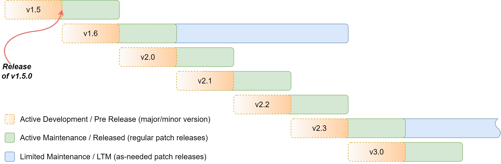

# Nautobot Development

Nautobot is maintained as a [GitHub project](https://github.com/nautobot/nautobot) under the Apache 2 license. Users are encouraged to submit GitHub issues for feature requests and bug reports.

## Governance

Nautobot is a community-based Free Open Source Software (FOSS) project sponsored by [Network to Code (NTC)](https://www.networktocode.com). As a network automation solution provider, Network to Code works with its clients around the world to craft and build network automation strategies and solutions, often tightly integrated with Nautobot serving as a Source of Truth and Network Automation Platform. The direction of this project will be shaped by the community as well as by input from NTC customers; independent of where requests come from, contributors will need to follow the Contributing Guidelines.

The Nautobot Core Team is responsible for the direction and execution of the code that gets committed to the project.

## Project Structure

Nautobot components are arranged into functional subsections called _apps_ (a carryover from Django vernacular). Each app holds the models, views, and templates relevant to a particular function:

* `circuits`: Communications circuits and providers (not to be confused with power circuits)
* `dcim`: Datacenter infrastructure management (sites, racks, and devices)
* `extras`: Additional features not considered part of the core data model
* `ipam`: IP address management (VRFs, prefixes, IP addresses, and VLANs)
* `tenancy`: Tenants (such as customers) to which Nautobot objects may be assigned
* `users`: Authentication and user preferences
* `utilities`: Resources which are not user-facing (extendable classes, etc.)
* `virtualization`: Virtual machines and clusters

## Release Management

### Roadmap

In order to best understand how to contribute and where to open an issue or discussion, you should understand how work moves from idea to feature and how the roadmap is structured.

There are three major "buckets" of work to be aware of within the lifecycle of getting contributions committed and released:

* **Current** - Work that is planned for the release currently being developed.
* **Near Term** - Work that is planned for one of the next two releases after the one currently being developed.
* **Future** - Work that needs more discussion and/or will be planned for a version three or more releases later.

The following provides more detail on these.

#### Current

* Current tickets (GitHub issues) that are being worked on for the _current_ release or bugs that are found and will be fixed in the _current_ release.
* Uses `current` label on GitHub.
* The GitHub **Release Milestone** will track items for the _current_ release.

#### Near Term

* Current tickets (GitHub issues) that are estimated to complete in one of the next two releases, e.g. 3-6 months to get into core, if accepted.
* GitHub discussions are used to create one or more GitHub issues when and if something moves from _Future_ to _Near Term_.
* Uses `near-term` label on GitHub.

#### Future

* Work that is for 3+ releases away or work that needs more free form discussions and brainstorming to better scope future bodies of work.
* Estimated 7+ months to get into core, if accepted.
* GitHub Discussions are used for collaborating on _future_ work.
* If a GitHub issue is opened and is deemed that it is out of scope for _Current_ or _Near Term_, it will be converted into a GitHub Discussion.
* GitHub Discussions will be closed when the topic/feature moves from _Future_ to _Near Term_.

Over time, the process of moving work from _Future_ to _Near Term_ to _Current_ will continue to get further refined.

Please read through the [Nautobot Roadmap](https://www.networktocode.com/nautobot/roadmap) so you can understand the current backlog and roadmap and which items are already in _Current, Near Term, and Future_.

### Versioning

Nautobot adheres to the Semantic Versioning ("SemVer") strategy, which gives us versions of the format `X.Y.Z`.

* `X` is the major release number. Contains breaking changes or switching default behavior and shadowing legacy/deprecated behavior. May contain new functionality and bug fixes as well.
* `Y` is the minor release number. Contains new functionality and bug fixes. May introduce deprecation warnings but will not remove or change default behavior.
* `Z` is the patch release number. Will only contain bug fixes, security updates, and small feature enhancements aimed at addressing user-experience bugs.

For more information, please visit [SemVer.org](https://semver.org/).

### Release Schedule

Nautobot aims to publish against following release schedule:

* One (1) major release per year
* Three (3) minor releases per year
* At minimum one (1) patch release every two weeks or more frequently as needed.

Using `2.0` as a release cycle example, that would mean we would publish:

* `2.0.z`
* `2.1.z`
* `2.2.z`
* `2.3.z`

After the third minor release (`2.3.0`), we would plan for another major release, in this case `3.0.0`.

We estimate non-patch releases will be released quarterly but dates are not set in stone. Dates and notifications will occur by updating the GitHub Release Milestone and on Slack.

An example of the release timeline for the `2.0` release cycle:



#### Patch Releases

Specifics around patch releases:

* Will be released every two weeks on Mondays, starting March 7th, 2022.
* Will be focused on bugs, security vulnerabilities, backports, and other issues as they arise.
* Will not introduce significant new functionality except as needed to address a bug.
* Will not be released if there have been no new merges to `develop` since the previous release.
* Should not be considered a mandatory upgrade: If it does not fix a bug or issue you are experiencing, you should not feel the need to upgrade right away.
* May happen a day or two after the Monday schedule if Monday is an observed holiday. We would like to ensure full team availability post-release.

Should a patch release contain a fix for security vulnerability(s) (i.e. CVE(s)), data-loss bug(s), or other critical issue(s), we will:

* Release a new patch release as soon as the fix has been identified, implemented, and thoroughly tested. No waiting for the next regularly scheduled release date.
* Bring special attention to these releases in our notification channels.
* Strongly urge you to upgrade to address these more serious issues as soon as possible.
* Not adjust any subsequent release dates (the next scheduled release will still occur as scheduled).

### Maintenance Release (LTM)

#### Overview

For the sake of abundance in clarity, we are officially naming what is sometimes called an "LTS" release of software a "Maintenance" or "Long Term Maintenance" (LTM) release of Nautobot. The mindset is that we always aim to release stable software and in fact label the latest releases of the current major version of Nautobot as "stable" (as seen in our documentation and in our Docker container tags).

New users who may choose to install an "LTS" release because it is assumed to be more stable, may almost immediately be presented with breaking changes upon their next upgrade to a "stable" Nautobot release. We want to avoid any confusion that may arise between the term "stable" representing our latest stable release compared to "long term support" which is commonly interpreted to represent a stable release.

Our LTM release will be the last minor version of the previous major release train. At the time of this writing `1.5` will be our maintenance release train of Nautobot for the `1.y` release cycle. Version 1 of Nautobot had an extended release cycle as it was our first major release of the platform. Going forward it can be expected that the `x.3` version of the platform will be the maintenance train of any major version.

With this schedule you can expect a few things per major/minor release:

* `x.0.0`
    * Introduce breaking changes.
    * Changing default behavior for user interfaces, APIs, and functions.
* `x.1.z`
    * Typical minor release, adding features, bug fixes, potential deprecations.
* `x.2.z`
    * Removal of deprecated functions, classes introduced in the previous major release (ex: only if deprecated in `1.y`, removed in `2.2`).
* `x.3.z`
    * Maintenance release candidate.
    * Features may be added in `x.3.0` but nothing further in this cycle.

A release will only be marked as "In Maintenance" when the next major release is published. Active bug fixes will be applied to a `x.3` until that time. Once a new major release has been published, the following will apply to the `x.3` codebase:

* Dependencies are frozen/pinned to a specific release; will only be upgraded if addressing a security vulnerability.
* Data loss and CVE-related fixes will be back ported from the new active release cycle. All other fixes will be back ported on a case-by-case basis.
* Patch releases for this phase will be on an as-needed basis.
* Core features from newer releases will never be back ported. In some cases, developer-centric features that ease the transition to the next major release train may be back ported if it is determined that they will alleviate transitions related to backwards incompatible changes.

A maintenance release will be actively maintained until the next maintenance release is available, roughly a year from the launch of the previous one.

#### Launch of Maintenance Release Schedule (as an Example)

At the time of this writing we are in the active development of Nautobot 1.5. This will be our last minor release of the v1 series of releases and therefore become our first "Long Term Maintenance" (LTM) release of Nautobot. We will be actively applying the normal category of bug fixes (including UI tweaks, display bugs, etc.) to this release train until the release of Nautobot 2.0.

Once we launch Nautobot 2.0, 1.5 will go into maintenance mode and be considered LTM, continuing to receive data loss and CVE-related fixes. At that time we will encourage users to migrate to v2 as they are ready. Nautobot 1.5 will continue to receive such fixes until the release of Nautobot 2.3, where we will end the maintenance of Nautobot 1.5 and it will formally become "End of Life" (EOL). Nautobot 2.3 will then become the LTM release until Nautobot 3.3 is published the following year.

If for any reason the next maintenance release is delayed, we will continue to support the current maintenance release. There is no time limitation for this. We want to ensure our users always have a maintenance release available.

### Deprecation Policy

Functionality, features, or Python primitives that have been deprecated will be removed in the following major train's `x.2` release (ex: if deprecated in `1.y`, removed in `2.2`).

To provide assistance for knowing what features and functionality have been deprecated, additional transition features are as follows:

* Python primitives that have been deprecated will emit a `DeprecationWarning`, along with a message to which objects will be replacing them. The new objects may not be a direct replacement so please check the release notes and documentation for more migration information.
* Nautobot 1.2 introduced REST APIs versioning. Newer versions of the API become the default behavior on a major release (`x.0.0`) and older versions become deprecated. Along with classes and other functionality the deprecated versions will be removed in the `x.2` release. For more information, see the [Versioning section of our REST API documentation](../rest-api/overview.md#versioning).
* We will drop support for Python versions on a case-by-case basis: A patch release may drop support for a Python version if a security update of a critical dependency would require split or conditional support. For example, if the dependency has not published a vulnerability fix for an older Python version, we will drop support at that time. All other cases will be documented and will tend to occur on minor release boundaries.
* Any deprecation notice (announcement or removal) will be available in our release notes.

!!! warning "Backwards-Incompatible Changes and Deprecations"
    Breaking changes in a `x.0.0` release may have an effect on deprecated APIs. While we do our best to keep the deprecated APIs intact to simplify migrations to newer releases, breaking changes are inherently breaking and will cause some changes to current and previous API versions. Types of breaking changes include, but are not limited to, removing or collapsing of objects and changing object relationships. This will also mean we will not publish deprecated APIs for models that no longer exist.

    For example, in the upcoming `2.0.0` release we plan to collapse `Site` and `Region` to be `LocationType`s. This means there would no longer be a `site` property on objects such as `Device` as well as no `/api/dcim/sites` or `/api/dcim/regions` API endpoints.

    We will document in major releases how breaking changes will affect existing APIs and Python primitives. Backwards-compatible changes would still be kept around following the normal deprecation policy.

## Communication

Communication among the contributors should always occur via public channels. The following outlines the best ways to communicate and engage on all things Nautobot.

### Slack

* [**#nautobot** on Network to Code Slack](http://slack.networktocode.com/) - Good for quick chats. Avoid any discussion that might need to be referenced later on, as the chat history is not retained long.

### GitHub

* [GitHub issues](https://github.com/nautobot/nautobot/issues) - All feature requests, bug reports, and other substantial changes should be documented in an issue.
* [GitHub discussions](https://github.com/nautobot/nautobot/discussions) - The preferred forum for general discussion and support issues. Ideal for shaping a feature request prior to submitting an issue.

GitHub's discussions are the best place to get help or propose rough ideas for
new functionality. Their integration with GitHub allows for easily cross-
referencing and converting posts to issues as needed. There are several
categories for discussions:

* **General** - General community discussion.
* **Ideas** - Ideas for new functionality that isn't yet ready for a formal
  feature request. These ideas are what will be in scope to review when moving work from _Future_ to _Near Term_ as stated in the previous section.
* **Q&A** - Request help with installing or using Nautobot.

## Contributing

We welcome many forms of contributions to Nautobot. While we understand most contributions will commonly come from developers, we encourage others to contribute in the form of docs, tutorials, and user guides. If you have other ideas for contributing, don't hesitate to open an issue or have a discussion in one of the forums above.

Please also take a chance to look at our [Wiki on GitHub](https://github.com/nautobot/nautobot/wiki/Work-Intake-&-Issue-Management) to review any specifics as to how we define and scope work as a community.

### Reporting Bugs

* First, ensure that you're running the [latest stable version](https://github.com/nautobot/nautobot/releases)
  of Nautobot. If you're running an older version, it's possible that the bug has
  already been fixed.

* Next, check the GitHub [issues list](https://github.com/nautobot/nautobot/issues)
  to see if the bug you've found has already been reported. If you think you may
  be experiencing a reported issue that hasn't already been resolved, please
  click "add a reaction" in the top right corner of the issue and add a thumbs
  up (+1). You might also want to add a comment describing how it's affecting your installation. This will allow us to prioritize bugs based on how many users are affected.

* When submitting an issue, please be as descriptive as possible. Be sure to
  provide all information request in the issue template, including:
    * The environment in which Nautobot is running
    * The exact steps that can be taken to reproduce the issue
    * Expected and observed behavior
    * Any error messages generated
    * Screenshots (if applicable)

* Please avoid prepending any sort of tag (e.g. "[Bug]") to the issue title.
  The issue will be reviewed by a maintainer after submission and the appropriate
  labels will be applied for categorization.

* Keep in mind that bugs are prioritized based on their severity and how much
  work is required to resolve them. It may take some time for someone to address
  your issue.

Bugs will follow our published workflow from inbound triage to ultimate terminal state, whether accepted or closed:


### Opening Feature Requests

* First, check the GitHub [issues
  list](https://github.com/nautobot/nautobot/issues) and
  [Discussions](https://github.com/nautobot/nautobot/discussions) to see if the
  feature you're requesting is already listed. You can greater visibility on the
  committed by looking at the [Nautobot
  Roadmap](https://www.networktocode.com/nautobot/roadmap) (Be sure to search
  closed issues as well, since some feature requests have not have been accepted.)
  If the feature you'd like to see has already been requested and is open, click
  "add a reaction" in the top right corner of the issue and add a thumbs up (+1).
  This ensures that the issue has a better chance of receiving attention. Also
  feel free to add a comment with any additional justification for the feature.
  (However, note that comments with no substance other than a "+1" will be deleted. Please use GitHub's reactions feature to indicate your support.)

* Before filing a new feature request, consider starting with a GitHub
  Discussion. Feedback you receive there will help validate and shape the proposed feature before filing a formal issue. If the feature request does not get accepted into the _current_ or _near term_ backlog, it will get converted to a Discussion anyway.

* Good feature requests are very narrowly defined. Be sure to thoroughly
  describe the functionality and data model(s) being proposed. The more effort you put into writing a feature request, the better its chance is of being
  implemented. Overly broad feature requests will be closed.

* When submitting a feature request on GitHub, be sure to include all
  information requested by the issue template, including:
    * A detailed description of the proposed functionality
    * A use case for the feature; who would use it and what value it would add to Nautobot
    * A rough description of changes necessary to the database schema (if applicable)
    * Any third-party libraries or other resources which would be involved
    * Please avoid prepending any sort of tag (e.g. "[Feature]") to the issue title.

The issue will be reviewed by a moderator after submission and the appropriate
labels will be applied for categorization.

Feature requests will follow our published workflow from inbound triage to ultimate terminal state, whether accepted or closed:


### Submitting Pull Requests

* If you're interested in contributing to Nautobot, be sure to check out our
  [getting started](getting-started.md)
  documentation for tips on setting up your development environment.

* It is recommended to open an issue **before** starting work on a pull request, and discuss your idea with the Nautobot maintainers before beginning work. This will help prevent wasting time on something that we might not be able to implement. When suggesting a new feature, also make sure it won't conflict with any work that's already in progress.

* Once you've opened or identified an issue you'd like to work on, ask that it
  be assigned to you so that others are aware it's being worked on. A maintainer
  will then mark the issue as "accepted."

* If you followed the project guidelines, have ample tests, code quality, you will first be acknowledged for your work. So, thank you in advance! After that, the PR will be quickly reviewed to ensure that it makes sense as a contribution to the project, and to gauge the work effort or issues with merging into _current_. If the effort required by the core team isn’t trivial, it’ll likely still be a few weeks before it gets thoroughly reviewed and merged, thus it won't be uncommon to move it to _near term_ with a `near-term` label. It will just depend on the current backlog.

* All code submissions should meet the following criteria (CI will enforce
  these checks):
    * Python syntax is valid
    * All unit tests pass successfully
    * PEP 8 compliance is enforced, with the exception that lines may be
      greater than 80 characters in length
    * At least one [changelog fragment](#creating-changelog-fragments) has
      been included in the feature branch

#### Creating Changelog Fragments

All pull requests to `next` or `develop` must include a changelog fragment file in the `./changes` directory. To create a fragment, use your github issue number and fragment type as the filename. For example, `2362.added`. Valid fragment types are `added`, `changed`, `deprecated`, `fixed`, `removed`, and `security`. The change summary is added to the file in plain text. Change summaries should be complete sentences, starting with a capital letter and ending with a period, and be in past tense. Each line of the change fragment will generate a single change entry in the release notes. Use multiple lines in the same file if your change needs to generate multiple release notes in the same category. If the change needs to create multiple entries in separate categories, create multiple files.

!!! example

    **Wrong**
    ```plaintext title="changes/1234.fixed"
    fix critical bug in documentation
    ```

    **Right**
    ```plaintext title="changes/1234.fixed"
    Fixed critical bug in documentation.
    ```

!!! example "Multiple Entry Example"

    This will generate 2 entries in the `fixed` category and one entry in the `changed` category.

    ```plaintext title="changes/1234.fixed"
    Fixed critical bug in documentation.
    Fixed release notes generation.
    ```

    ```plaintext title="changes/1234.changed"
    Changed release notes generation.
    ```
