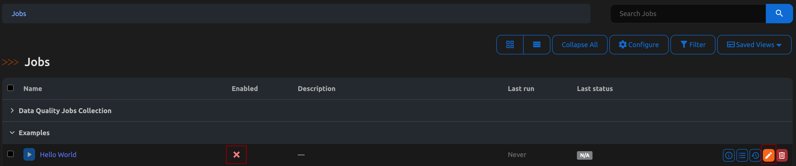
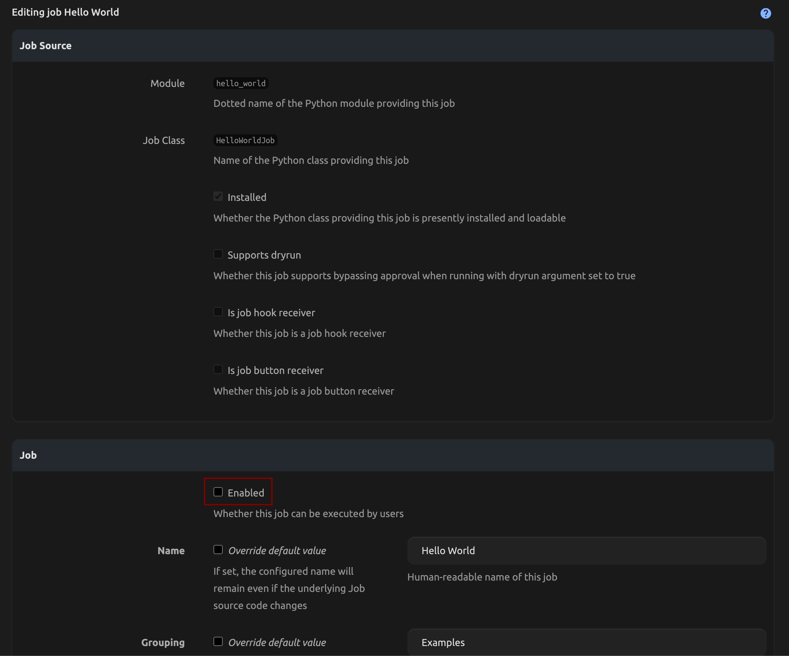
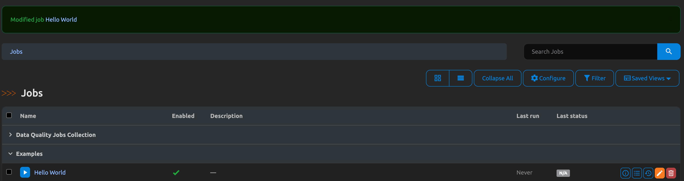
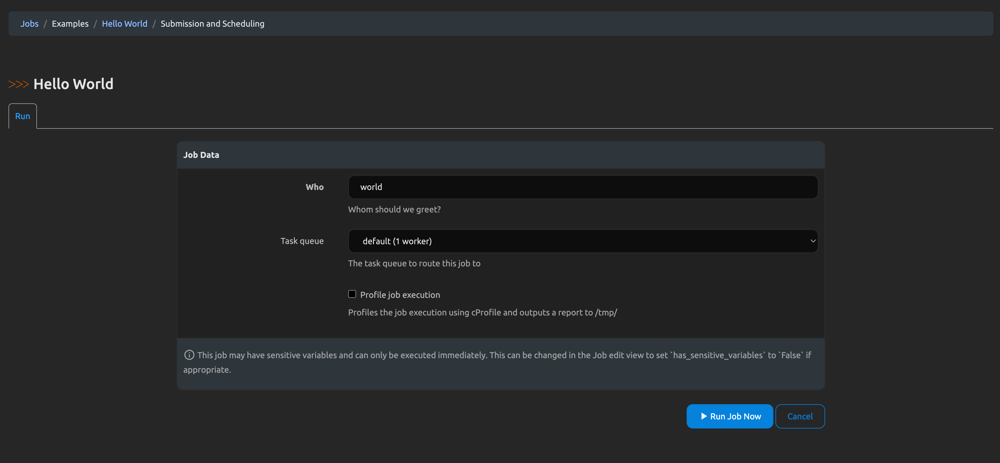
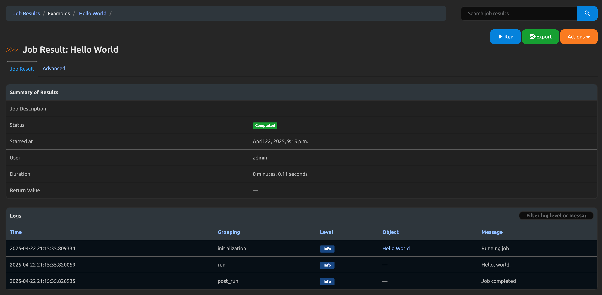

# Getting Started

## Why Jobs?

Nautobot **Jobs** let you run your own Python inside Nautobot’s execution engine.  
They’re perfect for one‑off data imports, consistency checks, scheduled sync tasks, or bulk edits that would be painful by hand.

What Jobs **can** do: 

- Touch Nautobot’s database with the same ORM models you use elsewhere  
- Talk to external devices or APIs  
- Read/write files via `create_file()` for later download  
- Run asynchronously in the background (powered by Celery)

What they **shouldn’t** do:

- Spawn infinite loops or long‑running daemons (use [Job scheduling](../../user-guide/platform-functionality/jobs/job-scheduling-and-approvals.md) for jobs need to be run at a later date or periodically)  
- Circumvent user permissions or Django validation  
- Perform blocking tasks without timeouts

## Prerequisites

You only need a working Nautobot installation where you can:

- **Create a file** under the [`JOBS_ROOT`](../../user-guide/administration/configuration/settings.md#jobs_root) path (defaults to `$NAUTOBOT_ROOT/jobs/`).  
- **Restart the worker** (Docker, systemd, or `nautobot-server celery worker`) after adding code.

!!! tip
    If you're using a Git repository or App to provide Jobs, the steps are the same: just save the file, re-sync the repo (or reload the App), and you're good to go.

## Your First Job in 6 Steps

1. **Create a file** called `hello_world.py` inside `$JOBS_ROOT`.
2. Paste the minimal Job below.  
3. **Restart your Celery worker** (or redeploy your container / pod).  
4. Run `nautobot-server post_upgrade` so Nautobot discovers the new Job and creates its database record.
5. In the UI, navigate to **Jobs → “Examples” → “Hello World”**, click **Edit Job**, then under the Job section, select the **Enabled** checkbox. Scroll down and **Update** the job.  
6. **Run Job Now**. You’ll see the log entry appear almost instantly.

```python title="$JOBS_ROOT/hello_world.py"
from nautobot.apps import jobs

name = "Examples"                 # Grouping shown in the UI

class HelloWorldJob(jobs.Job):
    class Meta:
        name = "Hello World"      # Job name

    who = jobs.StringVar(         # One user‑supplied variable
        description="Whom should we greet?",
        default="world",
    )

    def run(self, *, who):
        self.logger.info("Hello, %s!", who)  # This is the logic that runs when the Job is executed

jobs.register_jobs(HelloWorldJob) # <- required in Nautobot 2.x
```

### Visual Guide

  
**Edit the Job**: Navigate to **Jobs → Examples → Hello World**, select **Edit**.

  
**Enable the Job**: Scroll down to **Enable** the job, selecting the checkmark box, scroll down and **Update** the job.

  
**Job Now Enabled**: Now that the job is enabled, click on the job name.

  
**Run the Job**: Provide input if you like, then click **Run Job Now**.

  
**Job Results**: View real-time logs showing the Job's execution.

## Troubleshooting Common Issues

- **Job not showing in UI**:
    - Verify correct placement in `$JOBS_ROOT`.
    - Verify that the Job class is registered using `register_jobs()`
    - Run `nautobot-server post_upgrade` after adding Jobs.

- **Changes not appearing**:
    - Ensure Celery workers are restarted manually after Job code updates. Nautobot's auto-reload does **not** affect Celery workers.

- **Jobs in submodules**:
    - Only top-level modules are imported. Use top-level `__init__.py` files to import and register submodule Jobs explicitly.
