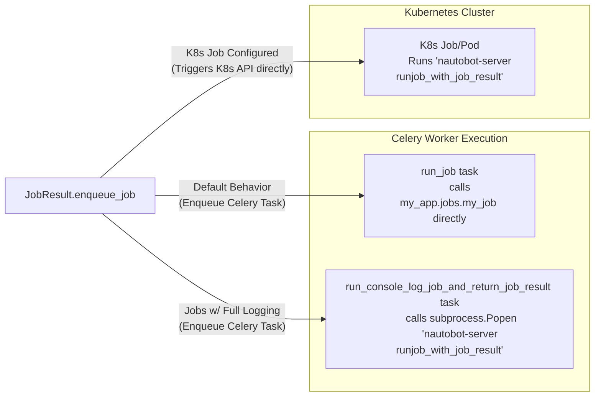

# Job Logging

Nautobot Jobs support rich, structured logging using `self.logger`, with logs surfaced in both the UI and API. This guide covers logging best practices, structured metadata, and important version notes.

## Logging Patterns

+/- 2.0.0

Nautobot logs messages from Jobs in a structured way, storing them as part of the `JobResult` and displaying them in the UI. This enables Jobs to provide real-time feedback, track their progress, and surface success or failure messages clearly to the user.

Use the `self.logger` property to write log messages from within your Job code. These logs appear in the UI and are also saved as [`JobLogEntry`](../../user-guide/platform-functionality/jobs/models.md#job-log-entry) records associated with the current [`JobResult`](../../user-guide/platform-functionality/jobs/models.md#job-results).

## Logging Levels

Nautobot supports standard logging levels, with additional custom levels for success and failure messages:

| Level   | Method                 | Description                               |
|---------|------------------------|-------------------------------------------|
| DEBUG   | `self.logger.debug()`  | Detailed diagnostic information.          |
| INFO    | `self.logger.info()`   | General operational messages.             |
| SUCCESS | `self.logger.success()`| Indicates successful operations.          |
| WARNING | `self.logger.warning()`| Signals potential issues.                 |
| FAILURE | `self.logger.failure()`| Denotes failed operations.                |
| ERROR   | `self.logger.error()`  | Serious errors that prevent execution.    |
| CRITICAL| `self.logger.critical()`| Critical conditions.                      |

!!! note
    `logger.success()` and `logger.failure()` were introduced in versions 2.4.0 and 2.4.5, respectively.

## Writing Log Messages

<!-- pyml disable-num-lines 10 proper-names -->
!!! example
    ```py
    self.logger.info("Job is starting.")
    self.logger.error("An unexpected error occurred.")
    self.logger.success("Provisioning complete.")
    ```

For most use cases, you'll use `self.logger`. You can also obtain the same logger via `nautobot.extras.jobs.get_task_logger(__name__)`, though this is less common.

## Structured Log Context with `extra`

You can attach structured metadata to log messages using the `extra` parameter. This enables grouping and improves how logs are displayed or queried:

- `grouping`: A logical label used to associate related log messages. It is useful for filtering, context, and organizing output in the API or database
- `object`: A Nautobot object instance to associate with this log message (e.g., a Device)
- `skip_db_logging`: Set to `True` to avoid saving the log message in the database (it will still be visible in the Celery worker log output)

<!-- pyml disable-num-lines 10 proper-names -->
!!! example
    ```py
    self.logger.info(
        "Validated device",
        extra={
            "grouping": "inventory-check",
            "object": device
        }
    )
    ```

To skip writing a log entry to the database but still print it to the console of the Celery worker:

<!-- pyml disable-num-lines 10 proper-names -->
!!! example
    ```py
    self.logger.info("Debugging message", extra={"skip_db_logging": True})
    ```

If `grouping` is not specified, Nautobot uses the current function name as a default. If `object` is omitted, the log is not associated with any model instance.

<!-- pyml disable-num-lines 10 proper-names -->
!!! example
    ```py
    from nautobot.apps.jobs import Job

    class MyJob(Job):
        def run(self):
            self.logger.info("This job is running!", extra={"grouping": "myjobisrunning", "object": self.job_result})
    ```

## Log Message Formatting

Log messages can include Markdown formatting, and [a limited subset of HTML](../../user-guide/platform-functionality/template-filters.md#render_markdown) is also supported for added emphasis in the UI.

## Sanitizing Log Messages

As a security precaution, Nautobot passes all log messages through `nautobot.core.utils.logging.sanitize()` to remove sensitive information like passwords or tokens. You should still avoid logging such values yourself, as this redaction is best-effort. The sanitization behavior can be customized using [`settings.SANITIZER_PATTERNS`](../../user-guide/administration/configuration/settings.md#sanitizer_patterns).

+/- 2.0.0 "Significant API changes"
    The Job class logging functions (example: `self.log(message)`, `self.log_success(obj=None, message=message)`, etc) have been removed. Also, the convenience method to mark a Job as failed, `log_failure()`, has been removed. To replace the functionality of this method, you can log an error message with `self.logger.error()` and then raise an exception to fail the Job. Note that it is no longer possible to manually set the Job Result status as failed without raising an exception in the Job.

+/- 2.0.0
    The `AbortTransaction` class was moved from the `nautobot.utilities.exceptions` module to `nautobot.core.exceptions`. Jobs should generally import it from `nautobot.apps.exceptions` if needed.

+++ 2.4.0 "`logger.success()` added"
    You can now use `self.logger.success()` to log a message at the level `SUCCESS`, which is located between the standard `INFO` and `WARNING` log levels.

+++ 2.4.5 "`logger.failure()` added"
    You can now use `self.logger.failure()` to log a message at the level `FAILURE`, which is located between the standard `WARNING` and `ERROR` log levels.

## Console Logging

+++ 3.1.0

The console_log flag controls how job stdout/stderr is handled and where the job is executed.

*If not explicitly provided, `console_log` defaults to True.*

### Asynchronous execution (synchronous=False)



When `console_log=True` and the job is executed asynchronously:

1. The job is not executed directly by Celery.
2. The JobResult.task_kwargs field is populated with the job’s keyword arguments.
3. A dedicated Celery task `run_console_log_job_and_return_job_result` is queued instead of the standard run_job task.
4. That task:

    - Starts a subprocess using:

    ```no-highlight
    nautobot-server runjob_with_job_result <job_result_id> --console_log
    ```

    - Reads stdout and stderr line by line from the subprocess.
    - Streams output into the JobResult console log in real time.
    - This allows the UI and API to display live job output as the job runs.

### Use cases

1. For debugging
