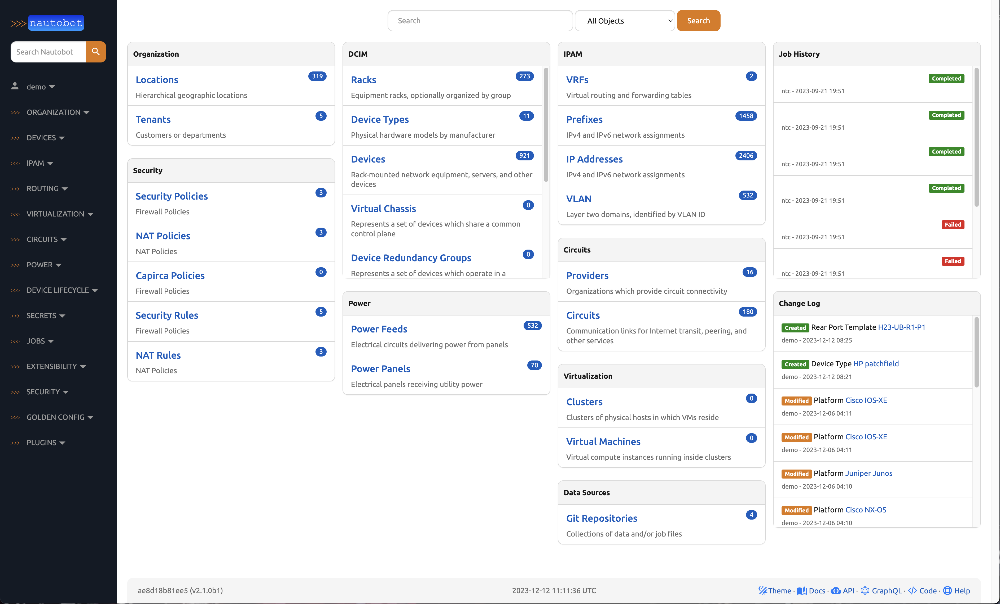
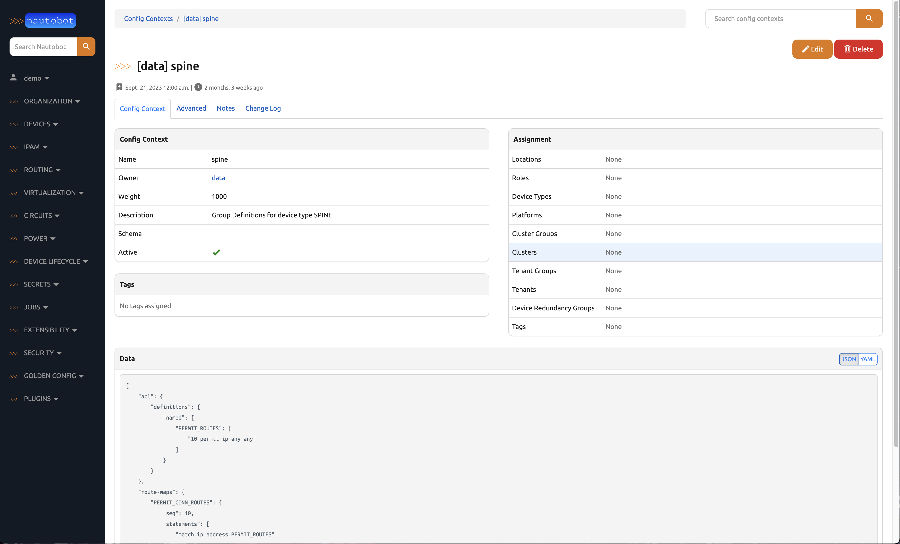
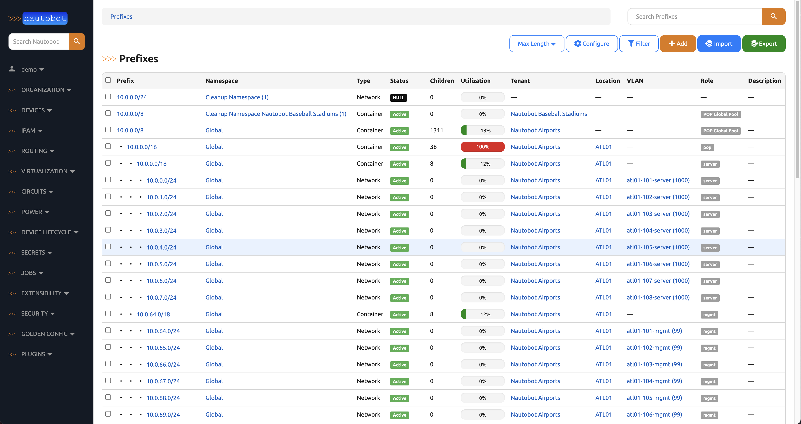
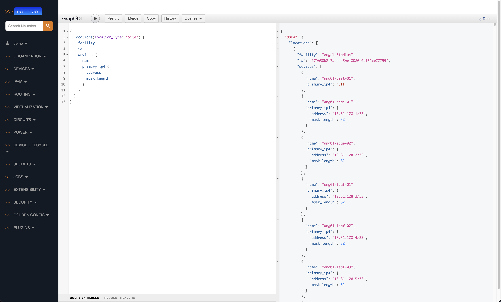
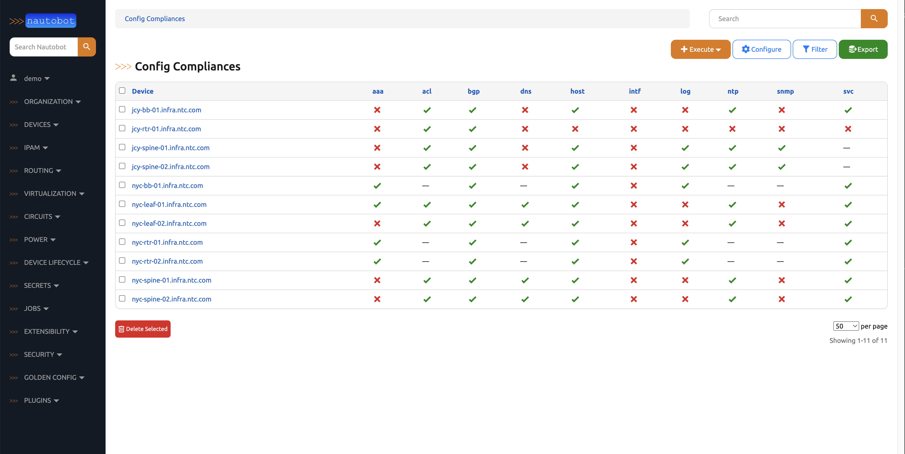
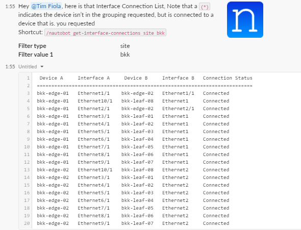

# Nautobot

<!-- pyml disable-num-lines 5 no-inline-html,proper-names -->
<figure markdown="span">
  { width="400" }
</figure>

## What is Nautobot?

Nautobot is an open source Network Source of Truth and Network Automation Platform built as a web application atop the [Django](https://www.djangoproject.com/) Python framework with a [PostgreSQL](https://www.postgresql.org/) or [MySQL](https://www.mysql.com) database.

<!-- pyml disable-next-line proper-names -->
Try out a live demo at [https://demo.nautobot.com](https://demo.nautobot.com)

## Key Use Cases

Nautobot enables three (3) key use cases.

1. **Flexible Source of Truth for Networking** — Nautobot serves as a highly flexible source of truth for network infrastructure, utilizing its core data models to define the intended state of your network. While it provides a baseline set of models such as IP networks, devices, racks, circuits, and cables, Nautobot's true strength lies in its flexibility. Users can define custom relationships and fields for any model, ensuring that the platform adapts to their specific needs. Additionally, Nautobot's robust data validation allows for the enforcement of naming standards and the execution of automated tests before data is committed, ensuring data integrity and consistency.

2. **Extensible Data Platform for Automation** — Nautobot is designed to seamlessly integrate with network automation solutions, offering a comprehensive feature set that includes GraphQL, native Git integration, REST APIs, and webhooks. The Git integration allows Nautobot to dynamically load YAML data files as configuration contexts. The evolving App system further enhances Nautobot's capabilities, enabling users to create custom models, APIs, and UI elements. By unifying and aggregating disparate data sources, Nautobot provides a single source of truth, simplifying data management and streamlining network automation processes.

3. **Platform for Network Automation Apps** — The Nautobot App system empowers users to develop custom Network Automation Apps tailored to their specific needs. Whether lightweight or complex, these apps benefit from Nautobot's existing features such as authentication, permissions, webhooks, GraphQL, and change logging, significantly reducing development time by up to 70%. This integration not only accelerates the development process but also leverages the extensive data already stored in Nautobot, providing a powerful and efficient platform for building network automation solutions.

## Getting Started

<!-- pyml disable-num-lines 30 no-inline-html,proper-names -->

- :material-cloud-download:{ .lg .middle } **Installing Nautobot**

    ---
    Get up and running with a [Nautobot install](user-guide/administration/installation/index.md) on your own Linux VM or in a Docker environment.

- :material-cog:{ .lg .middle } **Configuring Nautobot**

    ---
    Learn about the many [configuration options](user-guide/administration/configuration/index.md) that Nautobot offers for fine-tuning your installation.

- :material-play-network:{ .lg .middle } **Using Nautobot**

    ---
    Dive into [how to use Nautobot](user-guide/feature-guides/getting-started/index.md) and the key components of the core web interface.
    Learn how [Nautobot Apps](apps/index.md) can expand Nautobot's functionality.

    ---

- :material-api:{ .lg .middle } **Nautobot APIs!**

    ---
    Dive into the [REST](user-guide/platform-functionality/rest-api/overview.md) and [GraphQL](user-guide/platform-functionality/graphql.md) APIs.

- :material-language-python:{ .lg .middle } **Nautobot SDKs**

    ---
    Nautobot has a [Python SDK](https://docs.nautobot.com/projects/pynautobot/en/latest/index.html) and [Ansible modules](https://galaxy.ansible.com/ui/repo/published/networktocode/nautobot/docs/) to interact with Nautobot in a programmatic way.

## Nautobot Apps

Nautobot has a thriving ecosystem of **Apps**, developed as separate projects, for which you can find links to documentation under the [Nautobot Apps](apps/index.md) section.

<!-- pyml disable-num-lines 42 no-inline-html -->

- {style="height: 35px; margin-bottom: 0em" .middle } **Golden Configuration**

    ---
    [Golden Configuration](https://docs.nautobot.com/projects/golden-config/en/latest/) backs up configurations, generates intended state configurations, compares them for compliance and remediates device configurations.

- {style="height: 35px; margin-bottom: 0em" .middle } **Device Lifecycle**

    ---
    [Device Lifecycle](https://github.com/nautobot/nautobot-app-device-lifecycle-mgmt) adds additional capabilities around managing the **hardware** and **software** lifecycle, including the tracking of related **contracts** .

- {style="height: 35px; margin-bottom: 0em" .middle } **Firewall Models**

    ---
    [Firewall Models](https://docs.nautobot.com/projects/firewall-models/en/latest/) helps to model out firewall rules and related objects, including extended ACLs.

- {style="height: 35px; margin-bottom: 0em" .middle } **SSoT**

    ---
    [Single Source of Truth](https://docs.nautobot.com/projects/ssot/en/latest/) is the framework to synchronize data from other systems into and out of Nautobot.

- {style="height: 35px; margin-bottom: 0em" .middle } **ChatOps**

    ---
    [ChatOps](https://github.com/nautobot/nautobot-app-chatops) supports a variety of chat applications, allowing peer teams to conveniently interact with Nautobot and get information about the network.

- {style="height: 35px; margin-bottom: 0em" .middle } **Circuit Maintenance**

    ---
    [Circuit Maintenance](https://docs.nautobot.com/projects/circuit-maintenance/en/latest/) brings your circuit maintenance notification emails (and API connected info) into objects within Nautobot to bring better notification and business actions to the maintenances.

- {style="height: 35px; margin-bottom: 0em" .middle } **Capacity Metrics**

    ---
    [Capacity Metrics](https://docs.nautobot.com/projects/capacity-metrics/en/latest/) brings additional Nautobot data to Prometheus metrics, making it easy to derive time series information about your Nautobot data.

- {style="height: 35px; margin-bottom: 0em" .middle } **Device Onboarding**

    ---
    [Device Onboarding](https://docs.nautobot.com/projects/device-onboarding/en/latest/) brings network data into Nautobot, helping to build out the intended state from the current state of the network.

## Nautobot Screenshots

<!-- pyml disable-num-lines 11 no-inline-html -->

- { .on-glb }

- { .on-glb }

- { .on-glb }

- { .on-glb }

### App Screenshots

<!-- pyml disable-num-lines 7 no-inline-html -->

- { .on-glb }

- { .on-glb }

## Contributing to Nautobot

<!-- pyml disable-num-lines 17 no-inline-html -->

- :material-pier-crane:{ .lg .middle } **Jobs Developer Guide**

    ---
    Jump start your [development of Nautobot Jobs](development/jobs/index.md).

- :material-application-brackets:{ .lg .middle } **Apps Developer Guide**

    ---
    Get started [developing Nautobot Apps](development/apps/index.md)

- :material-file-code:{ .lg .middle } **Core Developer Guide**

    ---
    Learn how to [develop and contribute to Nautobot](development/core/getting-started.md)

