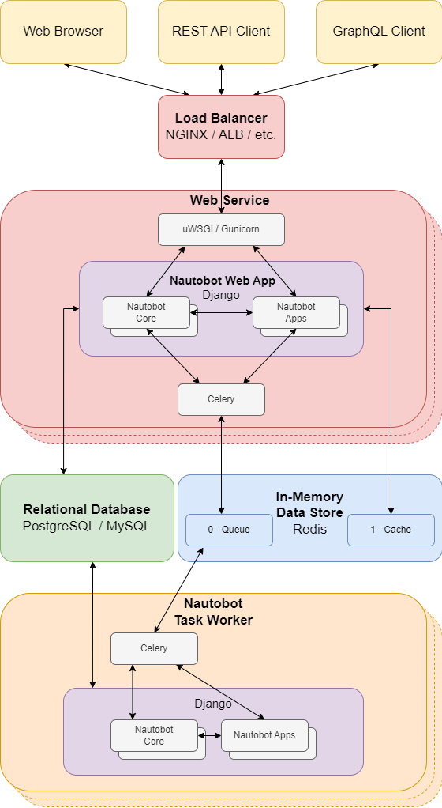

---
hide:
  - navigation
---

# Overview

Welcome to the Nautobot Core Documentation! Use the top navigation bar to read about:

- [Installing Nautobot](installation/index.md), [Configuring Nautobot](configuration/index.md), [Getting Started with the Web Interface](user-guides/getting-started/index.md), [REST](rest-api/overview.md) and [GraphQL](additional-features/graphql.md) APIs, [Plugins](plugins/index.md), additional features and much more can be found under the **Documentation** section.
- Learn about how to [Develop and Contribute to Nautobot](development/index.md), [Set up your Development Environment](development/getting-started.md), and more under the **Development Guide** section.
- Nautobot has a thriving ecosystem of **Apps** (also known as Plugins), developed as separate projects, for which you can find links to documentation under the [Nautobot Apps](apps/index.md) section.

## What is Nautobot?

<!-- markdownlint-disable MD033 -->

<!-- markdownlint-enable MD033 -->

Nautobot is an open source Network Source of Truth and Network Automation Platform. Nautobot was initially developed as a fork of NetBox (v2.10.4), which was originally created by Jeremy Stretch at DigitalOcean and by the NetBox open source community.

## Key Use Cases

Nautobot enables three (3) key use cases.

1. **Flexible Source of Truth for Networking** - Nautobot core data models are used to define the intended state of network infrastructure enabling it as a Source of Truth. While a baseline set of models are provided (such as IP networks and addresses, devices and racks, circuits and cable, etc.) it is Nautobot's goal to offer maximum data model flexibility. This is enabled through features such as user-defined relationships, custom fields on any model, and data validation that permits users to codify everything from naming standards to having automated tests run before data can be populated into Nautobot.

2. **Extensible Data Platform for Automation** - Nautobot has a rich feature set to seamlessly integrate with network automation solutions.  Nautobot offers GraphQL and native Git integration along with REST APIs and webhooks.  Git integration dynamically loads YAML data files as Nautobot config contexts.  Nautobot also has an evolving plugin system that enables users to create custom models, APIs, and UI elements.  The plugin system is also used to unify and aggregate disparate data sources creating a Single Source of Truth to streamline data management for network automation.

3. **Platform for Network Automation Apps** - The Nautobot plugin system enables users to create Network Automation Apps.  Apps can be as lightweight or robust as needed based on user needs.  Using Nautobot for creating custom applications saves up to 70% development time by re-using features such as authentication, permissions, webhooks, GraphQL, change logging, etc. all while having access to the data already stored in Nautobot. Some production ready applications include:

    - [Golden Configuration](https://github.com/nautobot/nautobot-plugin-golden-config)
    - [Device Lifecycle](https://github.com/nautobot/nautobot-plugin-device-lifecycle-mgmt)
    - [Firewall Models](https://github.com/nautobot/nautobot-plugin-firewall-models)
    - [SSoT](https://github.com/nautobot/nautobot-plugin-ssot)
    - [ChatOps](https://github.com/nautobot/nautobot-plugin-chatops)
    - [Circuit Maintenance](https://github.com/nautobot/nautobot-plugin-circuit-maintenance)
    - [Capacity Metrics](https://github.com/nautobot/nautobot-plugin-capacity-metrics)
    - [Device Onboarding](https://github.com/nautobot/nautobot-plugin-device-onboarding)

## Design Philosophy

The following tenets drive the direction of Nautobot.

### Replicate the Real World

Careful consideration has been given to the data model to ensure that it can accurately reflect a real-world network. For instance, IP addresses are assigned not to devices, but to specific interfaces attached to a device, and an interface may have multiple IP addresses assigned to it.

### Serve as a Source of Truth (SoT)

Nautobot intends to represent the _desired_ state of a network versus its _operational_ state. While plugins and apps can be built and integrated with Nautobot to extend its capabilities to various aspects of the _operational_ state, the core platform's focus is on the _desired_ state.

### Serve as a Network Automation Platform

Nautobot intends to be a vehicle to deliver high-value network automation apps.  Using the extensible plugin system, users have the choice and freedom to create the integrations that make sense for them.

### Ensure Maximum Flexibility & Extensibility

While Nautobot intends to replicate the real world and offer opinionated models to get started defining the intended state of the network, it is understood that organizations and networks have unique design considerations that may need to be addressed in the SoT or Network Automation Platform.  Nautobot strives to enable flexibility and extensibility to power and automate all types of networks.

### Keep it Simple

When given a choice between a relatively simple [80% solution](https://en.wikipedia.org/wiki/Pareto_principle) and a much more complex complete solution, the former will typically be favored. This ensures a lean codebase with a low learning curve.

## Application Stack

Nautobot is built on the [Django](https://djangoproject.com/) Python Web framework and requires either a [PostgreSQL](https://www.postgresql.org/) or [MySQL](https://www.mysql.com) database backend. It runs as a WSGI service behind your choice of HTTP server.

| Function           | Component                       |
|--------------------|---------------------------------|
| HTTP service       | NGINX                           |
| WSGI service       | uWSGI or Gunicorn               |
| Application        | Django/Python                   |
| Database           | PostgreSQL 9.6+ or MySQL 8.0+   |
| Cache              | Redis/django-cacheops           |
| Task queuing       | Redis/Celery/django-rq          |
| Live device access | NAPALM                          |

+++ 1.1.0
    MySQL support was added.

The following diagram displays how data travels through Nautobot's application stack.

## Supported Python Versions

Nautobot supports Python 3.7, 3.8, 3.9, and 3.10.

+++ 1.3.0
    Python 3.10 support was added.

--- 1.3.0
    Python 3.6 support was removed.

## Getting Started

See the [installation guide](installation/index.md) for help getting Nautobot up and running quickly.
