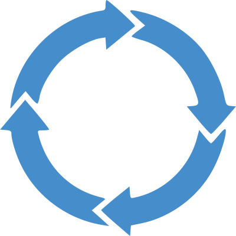
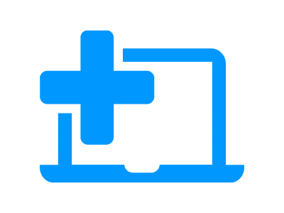
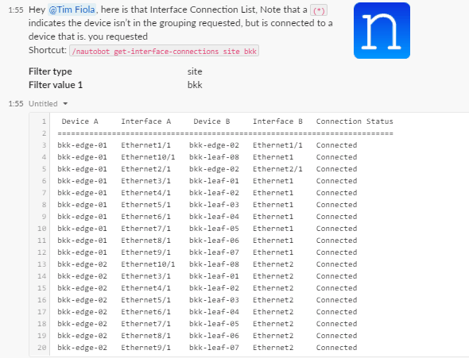

# Nautobot

<!-- pyml disable-num-lines 5 no-inline-html,proper-names -->
<figure markdown="span">
  { width="400" }
</figure>

## What is Nautobot?

Nautobot is the open source **Network Source of Truth** and **Network Automation Platform** for enterprises operating complex networks at scale.

[Network to Code](https://networktocode.com/) is the sponsor and official steward of Nautobot.

Nautobot is used by thousands of organizations around the world, including NVIDIA, Intel, Cox, Hughes, Chevron, BPCE, TNS, Arizona State University, the U.S. Department of Defense, and many others.

<!-- pyml disable-next-line proper-names -->
Try Nautobot at [demo.nautobot.com](https://demo.nautobot.com), a live instance of the open source platform with several open source Apps installed.

### Network Source of Truth

Nautobot's data models define the *intended state* of your network: locations and racks, devices and interfaces, IP address space, VLANs, circuits, cables, and more.

Beyond the out-of-the-box data models, Nautobot provides flexible ways to extend and validate the source of truth. Custom fields, user-defined relationships, and data validation rules allow teams to represent their own network standards, processes, and requirements directly in Nautobot.

### Network Automation Platform

Nautobot also includes a built-in Automation Engine for running network automation directly against the data in the source of truth.

Nautobot Jobs execute against your network data on demand or on a schedule, with permissions, logging, and approvals built in. REST and GraphQL APIs, webhooks, and native Git integration connect Nautobot to the rest of your tooling.

The Nautobot App framework extends the platform with new models, APIs, UI, and Jobs while inheriting authentication, permissions, change logging, and everything else the core platform already provides.

## Getting Started

<!-- pyml disable-num-lines 30 no-inline-html,proper-names -->

- :material-cloud-download:{ .lg .middle } **Installing Nautobot**

    ---
    Get up and running with a [Nautobot install](user-guide/administration/installation/index.md) on your own Linux VM or in a Docker environment.

- :material-cog:{ .lg .middle } **Configuring Nautobot**

    ---
    Learn about the many [configuration options](user-guide/administration/configuration/index.md) that Nautobot offers for fine-tuning your installation.

- :material-play-network:{ .lg .middle } **Using Nautobot**

    ---
    Dive into [how to use Nautobot](user-guide/feature-guides/getting-started/index.md) and the key components of the core web interface.
    Learn how [Nautobot Apps](apps/index.md) can expand Nautobot's functionality.

    ---

- :material-api:{ .lg .middle } **Nautobot APIs!**

    ---
    Dive into the [REST](user-guide/platform-functionality/rest-api/overview.md) and [GraphQL](user-guide/platform-functionality/graphql.md) APIs.

- :material-language-python:{ .lg .middle } **Nautobot SDKs**

    ---
    Nautobot has a [Python SDK](https://docs.nautobot.com/projects/pynautobot/en/latest/index.html) and [Ansible modules](https://galaxy.ansible.com/ui/repo/published/networktocode/nautobot/docs/) to interact with Nautobot in a programmatic way.

## Nautobot Apps and Editions

The Nautobot App framework enables users to develop custom Network Automation Apps tailored to their specific needs.

### Open Source Apps

Nautobot has a thriving ecosystem of open source **Apps**, developed as separate projects, for which you can find links to documentation under the [Nautobot Apps](apps/index.md) section.

<!-- pyml disable-num-lines 42 no-inline-html -->

- {style="height: 35px; margin-bottom: 0em" .middle } **Golden Configuration**

    ---
    [Golden Configuration](https://docs.nautobot.com/projects/golden-config/en/latest/) backs up configurations, generates intended state configurations, compares them for compliance and remediates device configurations.

- {style="height: 35px; margin-bottom: 0em" .middle } **Device Lifecycle**

    ---
    [Device Lifecycle](https://github.com/nautobot/nautobot-app-device-lifecycle-mgmt) adds additional capabilities around managing the **hardware** and **software** lifecycle, including the tracking of related **contracts** .

- {style="height: 35px; margin-bottom: 0em" .middle } **Firewall Models**

    ---
    [Firewall Models](https://docs.nautobot.com/projects/firewall-models/en/latest/) helps to model out firewall rules and related objects, including extended ACLs.

- {style="height: 35px; margin-bottom: 0em" .middle } **SSoT**

    ---
    [Single Source of Truth](https://docs.nautobot.com/projects/ssot/en/latest/) is the framework to synchronize data from other systems into and out of Nautobot.

- {style="height: 35px; margin-bottom: 0em" .middle } **ChatOps**

    ---
    [ChatOps](https://github.com/nautobot/nautobot-app-chatops) supports a variety of chat applications, allowing peer teams to conveniently interact with Nautobot and get information about the network.

- {style="height: 35px; margin-bottom: 0em" .middle } **Circuit Maintenance**

    ---
    [Circuit Maintenance](https://docs.nautobot.com/projects/circuit-maintenance/en/latest/) brings your circuit maintenance notification emails (and API connected info) into objects within Nautobot to bring better notification and business actions to the maintenances.

- {style="height: 35px; margin-bottom: 0em" .middle } **Capacity Metrics**

    ---
    [Capacity Metrics](https://docs.nautobot.com/projects/capacity-metrics/en/latest/) brings additional Nautobot data to Prometheus metrics, making it easy to derive time series information about your Nautobot data.

- {style="height: 35px; margin-bottom: 0em" .middle } **Device Onboarding**

    ---
    [Device Onboarding](https://docs.nautobot.com/projects/device-onboarding/en/latest/) brings network data into Nautobot, helping to build out the intended state from the current state of the network.

### Commercial Editions

<!-- pyml disable-next-line proper-names -->
Commercial editions from [Network to Code](https://networktocode.com/) build on the same open source Nautobot core. [Nautobot Professional](https://networktocode.com/nautobot/nautobot-professional/) adds supported capabilities for network discovery, onboarding, and operations. [Nautobot Enterprise](https://networktocode.com/nautobot/nautobot-enterprise/) extends the platform with additional Apps for compliance, OS upgrades, reporting, automation, and AI. [Nautobot Cloud](https://networktocode.com/nautobot/nautobot-cloud/) delivers the Enterprise platform as a fully managed SaaS offering. See [networktocode.com/nautobot](https://networktocode.com/nautobot/) to compare editions.

## Nautobot Screenshots

<!-- pyml disable-num-lines 11 no-inline-html -->

- { .on-glb }
  { .on-glb }
  [//]: # "`https://next.demo.nautobot.com/`"

- { .on-glb }
  { .on-glb }
  [//]: # "`https://next.demo.nautobot.com/extras/config-contexts/5170335b-785e-476a-a495-1a6cec1571d1/`"

- { .on-glb }
  { .on-glb }
  [//]: # "`https://next.demo.nautobot.com/ipam/prefixes/`"

- { .on-glb }
  { .on-glb }
  [//]: # "`https://next.demo.nautobot.com/graphql/?id=d51955b1-caa3-428c-8ea4-5dfd17887821`"

### App Screenshots

<!-- pyml disable-num-lines 7 no-inline-html -->

- { .on-glb }
  { .on-glb }
  [//]: # "`https://next.demo.nautobot.com/plugins/golden-config/config-compliance/`"

- { .on-glb }
  { .on-glb }
  [//]: # "`https://next.demo.nautobot.com/plugins/golden-config/config-compliance/overview/`"

- { .on-glb }

## Contributing to Nautobot

<!-- pyml disable-num-lines 17 no-inline-html -->

- :material-pier-crane:{ .lg .middle } **Jobs Developer Guide**

    ---
    Jump start your [development of Nautobot Jobs](development/jobs/index.md).

- :material-application-brackets:{ .lg .middle } **Apps Developer Guide**

    ---
    Get started [developing Nautobot Apps](development/apps/index.md)

- :material-file-code:{ .lg .middle } **Core Developer Guide**

    ---
    Learn how to [develop and contribute to Nautobot](development/core/getting-started.md)

