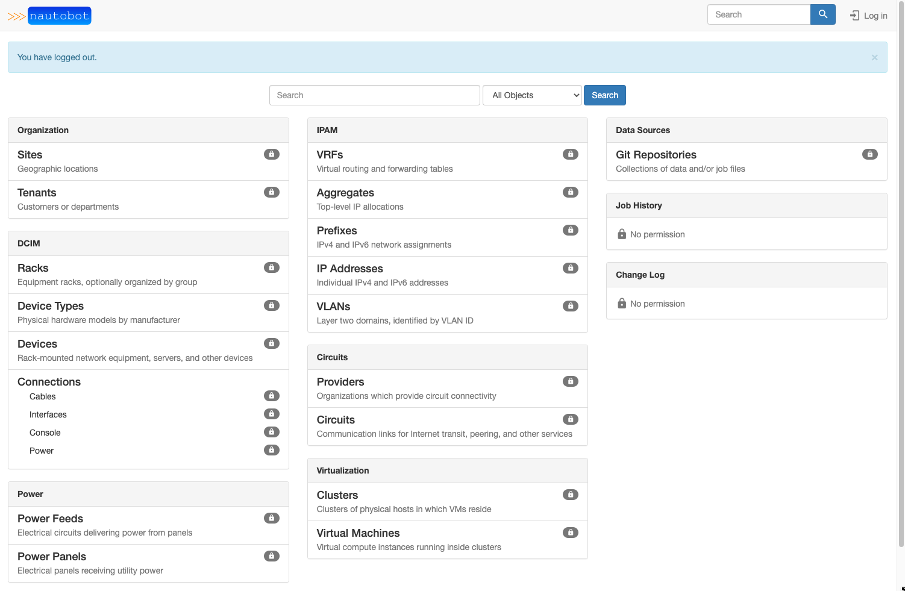

# Installing Nautobot

This section of the documentation discusses installing and configuring the Nautobot application itself.

These instructions will guide you through the following actions:

- Establish a Nautobot root directory for the application environment
- Create a `nautobot` system account
- Create a Python virtual environment (virtualenv)
- Install Nautobot and all required Python packages
- Run the database schema migrations
- Aggregate static resource files on disk
- Verify the installation using the development/test server

!!! important
    PostgreSQL and Redis must have been successfully installed before continuing with deployment steps. If you haven't done that yet, please visit the guide on [Installing Nautobot Dependencies](../../installation/#installing-nautobot-dependencies)

## Choose your `NAUTOBOT_ROOT`

This is where everything related to Nautobot will be installed. We're going to use this value across the documentation. You'll need to set the `NAUTOBOT_ROOT` environment variable to tell Nautobot where to find its files and settings.

We're also going to use this as the home directory of the `nautobot` user.

!!! tip
    We have selected `/opt/nautobot`, but you may use any directory you choose.

```no-highlight
$ export NAUTOBOT_ROOT=/opt/nautobot
```

## Create the Nautobot System User

Create a system user account named `nautobot`. This user will own all of the Nautobot files, and the Nautobot web services will be configured to run under this account. This also creates the `NAUTOBOT_ROOT` directory and sets it as the home directory for the user.

```no-highlight
$ sudo useradd --system --shell /bin/bash --create-home --home-dir $NAUTOBOT_ROOT nautobot
```

## Create the Virtual Environment

A Python [virtual environment](https://docs.python.org/3/tutorial/venv.html) or *virtualenv* is like a container for a set of Python packages. A virtualenv allows you to build environments suited to specific projects without interfering with system packages or other projects. When installed per the documentation, Nautobot uses a virtual environment in production.

We're going to create the virtualenv in our `NAUTOBOT_ROOT` as the `nautobot` user to populate the `/opt/nautobot` directory with a self-contained Python environment.

```no-highlight
$ sudo -u nautobot python3 -m venv $NAUTOBOT_ROOT
```

## Sudo to nautobot

Now that we've created the virtualenv, the remaining steps will be performed as the `nautobot` user.

!!! warning
    Don't skip this step!!

    It is critical to install Nautobot as the `nautobot` user so that we don't have to worry about fixing permissions later.

```no-highlight
$ sudo -iu nautobot
```

### Update the Nautobot `.bashrc`

After becoming `nautobot`, we need to set the `NAUTOBOT_ROOT` environment variable again for this user (since it is a fresh session as far as the system is concerned).

We want to make sure that this variable is always set.

Add this to `~/.bashrc` for `nautobot` so that anytime you become `nautobot`, your `NAUTOBOT_ROOT` will be set automatically.

```no-highlight
$ echo "export NAUTOBOT_ROOT=/opt/nautobot" >> ~/.bashrc
```

Next, reload the `.bashrc` file so that your `NAUTOBOT_ROOT` is set and display its value to verify it worked:

```no-highlight
$ source ~/.bashrc
$ echo $NAUTOBOT_ROOT
/opt/nautobot
```

## Understanding the Virtual Environment

Because the `nautobot` user was created with `NAUTOBOT_ROOT` set as its home directory and we had you set the shell to `/bin/bash`, the binary path `$NAUTOBOT_ROOT/bin` is automatically added to the beginning of the `$PATH` environment variable:

```no-highlight
$ echo $PATH
/opt/nautobot/bin:/usr/local/sbin:/usr/local/bin:/usr/sbin:/usr/bin:/sbin:/bin:/snap/bin
```

Therefore, any commands executed by the `nautobot` user will always check `$NAUTOBOT_ROOT/bin` first.

Because `NAUTOBOT_ROOT` also contains the Python virtualenv for Nautobot, all of the commands you will execute as the `nautobot` user, will automatically prefer the virtualenv's commands because they come first in the `$PATH`.

As the `nautobot` user, you may use `which pip3` to confirm that you are using the correct version of `pip3`. The path should match that of `$NAUTOBOT_ROOT/bin`. For example:

```no-highlight
$ which pip3
/opt/nautobot/bin/pip3
```

This makes sure that the version of Python you're using, as well any dependencies that you install, remain isolated in this environment.

## Prepare the Virtual Environment

!!! warning
    Unless explicitly stated, this and all remaining steps requiring the use of `pip3` or `nautobot-server` in this document should be performed as the `nautobot` user!

    Hint: Use `sudo -iu nautobot` to become the `nautobot` user.

Before we install anything into the virtualenv, we want to make sure that Pip is running the latest version.

[Pip]((https://pip.pypa.io/)) is Python's package installer and is referred interchangeably as `pip` or `pip3`. For the purpose of this document, we'll deliberately be referring to it as `pip3`. Many common issues can be solved by running the latest version of Pip. Before continuing with installing Nautobot, upgrade Pip to its latest release.

We also want to deliberately install the `wheel` library which will tell Pip to always try to install wheel packages if they are available. A [wheel is a pre-compiled Python package](https://realpython.com/python-wheels/), which is quicker and safer to install because it does not require development libraries or `gcc` to be installed on your system just so that some more advanced Python libraries can be compiled.

```no-highlight
$ pip3 install --upgrade pip wheel
```

## Install Nautobot

Use Pip to install Nautobot:

```no-highlight
$ pip3 install nautobot
```

Great! We have `NAUTOBOT_ROOT` ready for use by the `nautobot` user, so let's proceed to verifying the installation.

## Verify your Nautobot Installation

You should now have a fancy `nautobot-server` command in your environment. This will be your gateway to all things Nautobot! Run it to confirm the installed version of `nautobot`:

```no-highlight
$ nautobot-server --version
```

## Configuration

Before you can use Nautobot, you'll need to configure it by telling it where your database and Redis servers can be found, among other things. This is done with the `nautobot_config.py` configuration file.

### Initialize your configuration

Initialize a new configuration by running `nautobot-server init`. You may specify an alternate location and detailed instructions for this are covered in the documentation on [Nautobot Configuration](../../configuration).

However, because we've set the `NAUTOBOT_ROOT`, this command will automatically create a new `nautobot_config.py` at the default location based on this at `$NAUTOBOT_ROOT/nautobot_config.py`:

```no-highlight
$ nautobot-server init
Configuration file created at '/opt/nautobot/nautobot_config.py'
```

### Required Settings

Your `nautobot_config.py` provides sane defaults for all of the configuration settings. You will inevitably need to update the settings for your environment, most notably the [`DATABASES`](../../configuration/required-settings/#databases) setting.

Edit `$NAUTOBOT_ROOT/nautobot_config.py`, and head over to the documentation on [Required Settings](../../configuration/required-settings) to tweak your required settings.

!!! important
    You absolutely must update your required settings in your `nautobot_config.py` or Nautobot will not work.

Save your changes to your `nautobot_config.py` and then return here.

## Optional Settings

All Python packages required by Nautobot will be installed automatically when running `pip3 install nautobot`.

Nautobot also supports the ability to install optional Python packages. If desired, these packages should be listed in `local_requirements.txt` within the `NAUTOBOT_ROOT` directory, such as `/opt/nautobot/local_requirements.txt`.

If you decide to use any [Nautobot plugins](../../plugins), they should be listed in this file.

We will cover two examples of common optional settings below.

### Configuring NAPALM

Nautobot provides built-in support for the [NAPALM automation](https://napalm-automation.net/) library, which allows Nautobot to fetch live data from devices and return it to a requester via its REST API. The [`NAPALM_USERNAME`](../../configuration/optional-settings#napalm_username) and [`NAPALM_PASSWORD`](../../configuration/optional-settings#napalm_password) configuration parameters define the credentials to be used when connecting to a device.

To use NAPALM, add `napalm` to your `local_requirements.txt` so that it can be installed and kept up to date:

```no-highlight
$ echo napalm >> $NAUTOBOT_ROOT/local_requirements.txt
```

### Remote File Storage

By default, Nautobot will use the local filesystem to store uploaded files. To use a remote filesystem, install the [`django-storages`](https://django-storages.readthedocs.io/en/stable/) library and configure your [desired storage backend](../../configuration/optional-settings/#storage_backend) in `nautobot_config.py`.

To use remote file storage, add `django-storages` to your `local_requirements.txt` so that it can be installed and kept up to date:

```no-highlight
$ echo django-storages >> $NAUTOBOT_ROOT/local_requirements.txt
```

## Prepare the Database

Before Nautobot can run, the database migrations must be performed to prepare the database for use. This will populate the database tables and relationships:

```no-highlight
$ nautobot-server migrate
```

## Create a Superuser

Nautobot does not come with any predefined user accounts. You'll need to create a administrative superuser account to be able to log into Nautobot for the first time. Specifying an email address for the user is not required, but be sure to use a very strong password.

```no-highlight
$ nautobot-server createsuperuser
```

## Create Static Directories

Nautobot relies upon many static files including:

- `git` - For storing [Git repositories](../../models/extras/gitrepository)
- `jobs` - For storing [custom Jobs](../../additional-features/jobs)
- `media` - For storing [uploaded images and attachments](../../configuration/optional-settings/#media_root) (such as device type images)
- `static` - The home for [CSS, JavaScript, and images](../../configuration/optional-settings/#static_root) used to serve the web interface

Each of these have their own corresponding setting that defined in `nautobot_config.py`, but by default they will all be placed in `NAUTOBOT_ROOT` unless you tell Nautobot otherwise by customizing their unique variable.

The `collectstatic` command will create these directories if they do not exist, and in the case of the `static` files directory, it will also copy the appropriate files:

```no-highlight
$ nautobot-server collectstatic
```

## Install Local Requirements

This step is entirely optional. As indicated above, we mentioned that any extra local requirements should go into `$NAUTOBOT_ROOT/local_requirements.txt`.

```no-highlight
$ pip3 install -r $NAUTOBOT_ROOT/local_requirements.txt
```

## Check your Configuration

Nautobot leverages Django's built-in [system check framework](https://docs.djangoproject.com/en/stable/topics/checks/#writing-your-own-checks) to validate the configuration to detect common problems and to provide hints for how to fix them.

Checks are ran automatically when running a development server using `nautobot-server runserver`, but not when running in production using WSGI.

!!! hint
    Get into the habit of running checks before deployments!

```no-highlight
$ nautobot-server check
```

## Test the Application

At this point, we should be able to run Nautobot's development server for testing. We can check by starting a
development instance:

```no-highlight
$ nautobot-server runserver 0.0.0.0:8000 --insecure
```

Next, connect to the name or IP of the server (as defined in `ALLOWED_HOSTS`) on port 8000; for example, <http://127.0.0.1:8000/>. You should be greeted with the Nautobot home page.

!!! warning
    The development server is for development and testing purposes only. It is neither performant nor secure enough for production use. **Do not use it in production.**

!!! warning
    If the test service does not run, or you cannot reach the Nautobot home page, something has gone wrong. Do not proceed with the rest of this guide until the installation has been corrected.

!!! important
    Certain Nautobot features (Git repository synchronization, webhooks, jobs, etc.) depend on the presence of Nautobot's background worker process, which is not automatically started by the `runserver` command. To start it for testing purposes, you can run `nautobot-server rqworker` separately. For production use, both Nautobot and the worker should be managed by systemd rather than started manually, as described in the next section of this documentation.

Note that the initial user interface will be locked down for non-authenticated users.



Try logging in using the superuser account we just created. Once authenticated, you'll be able to access all areas of the UI:


Type `Ctrl-C` to stop the development server. Now you're ready to proceed to [starting Nautobot as a system service](../wsgi).
