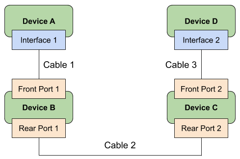
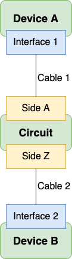

# Cables

All connections between device components in Nautobot are represented using cables. A cable represents a direct physical connection between two termination points, such as between a console port and a patch panel port, or between two network interfaces.

Each cable must have two endpoints defined. These endpoints are sometimes referenced as A and B for clarity, however cables are direction-agnostic and the order in which terminations are made has no meaning. Cables may be connected to the following objects:

* Circuit terminations
* Console ports
* Console server ports
* Interfaces
* Pass-through ports (front and rear)
* Power feeds
* Power outlets
* Power ports

Each cable may be assigned a type, label, length, and color. Each cable must also assigned to an operational [`status`](../../models/extras/status.md). The following statuses are available by default:

* Active
* Planned
* Decommissioning

## Tracing Cables

A cable may be traced from either of its endpoints by clicking the "trace" button. (A REST API endpoint also provides this functionality.) Nautobot will follow the path of connected cables from this termination across the directly connected cable to the far-end termination. If the cable connects to a pass-through port, and the peer port has another cable connected, Nautobot will continue following the cable path until it encounters a non-pass-through or unconnected termination point. The entire path will be displayed to the user.

In the example below, three individual cables comprise a path between devices A and D:

Traced from Interface 1 on Device A, Nautobot will show the following path:

* Cable 1: Interface 1 to Front Port 1
* Cable 2: Rear Port 1 to Rear Port 2
* Cable 3: Front Port 2 to Interface 2

A cable can also be traced through a circuit.

Traced from Interface 1 on Device A, Nautobot will show the following path:

* Cable 1: Interface 1 to Side A
* Cable 2: Side Z to Interface 2
