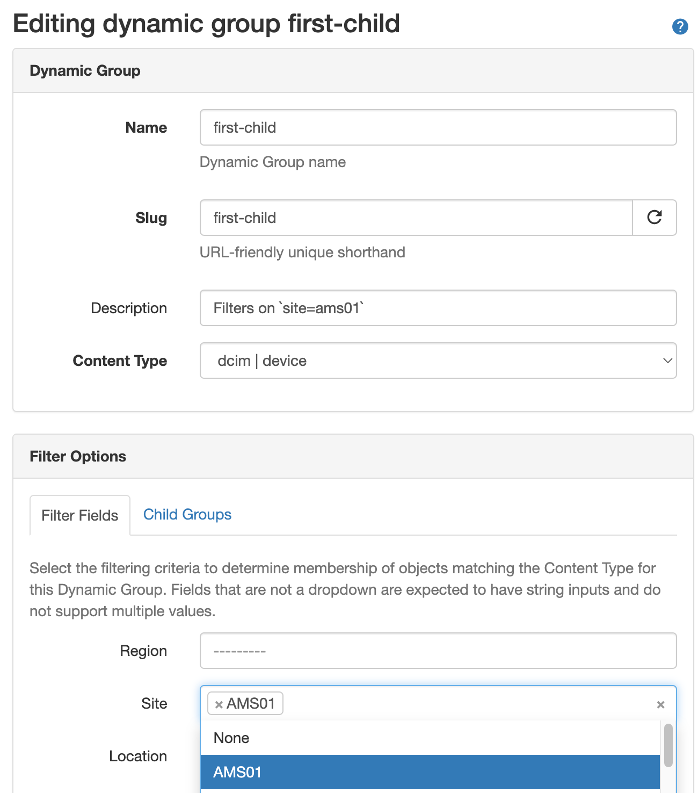
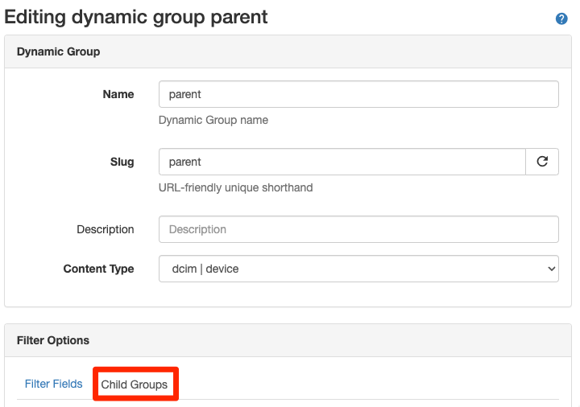
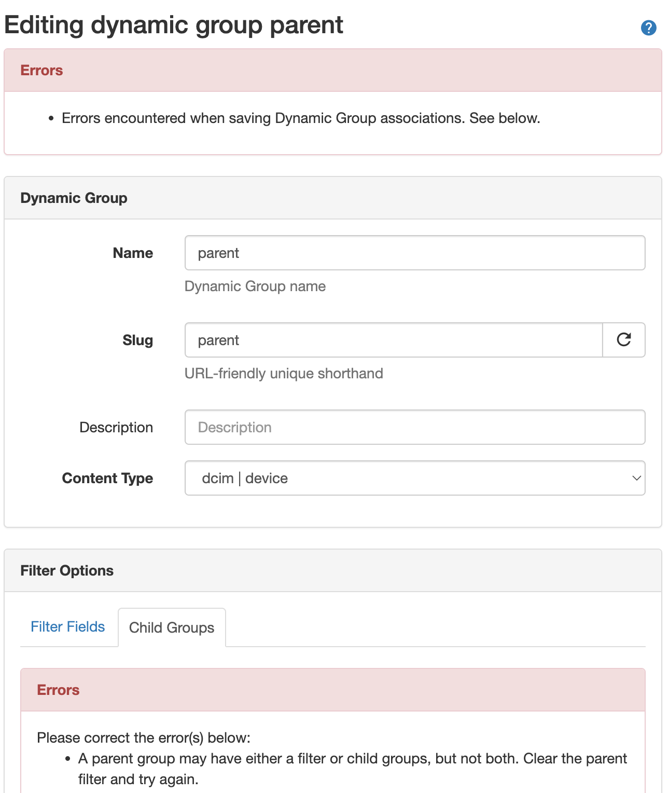

# Dynamic Groups

Dynamic Groups provide a way to organize objects of the same Content Type by matching filters. A Dynamic Group can be used to create unique groups of objects matching a given filter, such as Devices for a specific site location or set of locations. As indicated by the name, Dynamic Groups update in real time as member objects are created, updated, or deleted.

When creating a Dynamic Group, one must select a Content Type to which it is associated, for example `dcim.device`. The filtering parameters saved to the group behave as a bi-directional search query that used to identify members of that group, and can also be used to determine from an individual object the list of Dynamic Groups to which it belongs.

Once created the Content Type for a Dynamic Group may not be modified as this relationship is tightly-coupled to the available filtering parameters. All other fields may be updated at any time.

## Creating Dynamic Groups

Dynamic Groups can be created through the UI under _Organization > Dynamic Groups_ and clicking the "Add" button, or through the REST API.

Each Dynamic Group must have a human-readable **Name** string, e.g. `devices-site-ams01` and a **Slug**, which should be a simple database-friendly string. By default, the slug will be automatically generated from the name, however you may customize it if you like. You must select a **Content Type** for the group that determines the filtering parameters available include objects as member into the group. Finally, you may also assign a an optional human-friendly **Description** (e.g. "Devices in site AMS01").

Once a new Dynamic Group is created, the **Filter Fields** or **Child Groups** may be specified. This must be done after the group has been created by clicking the "Edit" button.

!!! warning
    The content type of a Dynamic Group cannot be modified once created, so take care in selecting this initially. This is intended to prevent the possibility of inconsistent data and enforces the importance of thinking about the data model when defining a new Dynamic Group.

### Working with Dynamic Groups

Dynamic Groups can be accessed from the primary Dynamic Groups landing page in the web interface under the _Organization > Dynamic Groups_ menu. From there you may view the list of available groups, search or filter the list, view or edit an individual group, or bulk delete groups. Additionally if a group's filter has matching members, the number of members may be clicked to take you to a filtered list view of those objects.

Dynamic Groups cannot be imported nor can they be updated in bulk, as these operations would be complex and do not make sense in most cases.

From an individual object's detail page, if it is a member of any groups, a "Dynamic Groups" tab will display in the navigation tabs. Clicking that tab will display all Dynamic Groups of which this object is a member.

## Filtering

Dynamic Group filtering is powered by **FilterSet** objects underneath the hood. Basic filtering is performed using the `filter` that is defined on a given Dynamic Group. Advanced filtering is performed by aggregating all filters from nested Dynamic Group memberships.

### Basic Filtering

An object is considered to be a member of a Dynamic Group if it is of the same Content Type and it is not excluded by way of any of the filter criteria specified for that group. By default, if a group has an empty filter (`{}`) it will include all objects of the matching Content Type, just as a default list view of objects would prior to any filter fields being filled in the web UI.

For example, for a Dynamic Group with Content Type of `dcim.device` and an empty filter, the list of members would be equivalent to the queryset for `Device.objects.all()` from the database ORM.

!!! warning
    _Changed in version 1.4.0_  <!-- markdownlint-disable-line MD036 -->

     v1.3.0 the default for a group with an empty filter was to fail "closed" and have zero members.

    As of v1.4.0, this behavior has been inverted to include all objects matching the content type by default instead of matching no objects. This was necessary to implement the progressive layering of child filters similarly to how we use filters to reduce desired objects from basic list view filters. This will described in more detail below.

When editing a Dynamic Group, under the **Filter Options** section, you will find a **Filter Fields** tab that allows one to specify filter criteria. The filter fields available for a given Content Type are backed and validated by underlying filterset classes (for example `nautobot.dcim.filters.DeviceFilterSet`) and are represented in the web interface as a dynamically-generated filter form that corresponds to each eligible filter field.

For example, to specify a filter condition that would filter on site "AMS01", you would edit a group, populate the desired filter fields fields, and then click "Update".



This results in a filter that gets translated into a JSON object:

```json
{
    "site": [
        "ams01"
    ]
}
```

The raw query for this at the database level gets translated to:

```no-highlight
(site__slug='ams01')
```

We will cover how these are used in more detail further in the documentation.

For more on how filters are stored in the database, please see [Specifying Filter Conditions](#specifying-filter-conditions) below.

### Advanced Filtering

_Added in version 1.4.0_  <!-- markdownlint-disable-line MD036 -->

Advanced filtering is performed using nested Dynamic Group memberships.

An object is considered a member of an advanced Dynamic Group if it matches the aggregated filter criteria across all descendant groups.

When editing a Dynamic Group, under the **Filter Options** section, you will find a **Child Groups** tab that allows one to make other Dynamic Groups of the same content type children of the parent group.



!!! important
    Filter fields and child groups are mutually exclusive. A group may have either a filter defined, or child groups, but not both.

In the event that you attempt to add child groups to a dynamic group that already has a `filter` defined, or populate a filter on a dynamic group that already has children, this will result in a `ValidationError`. For example:



### Filter Generation

Filters are always processed hiearchically from the top down starting from the parent group and descending recursively to the last nested child group in order by the `weight` value assigned to that group when it was associated to its parent.

!!! note
    For the purpose illustration, we will use "left to right" terminology since when verbally describing precedence in English, we read from left to right, so that following it will be more intuitive.

The nesting of Dynamic Groups is performed using two advanced patterns: Sets and graphs. Rules for each child group are processed using a set `operator`, and groups are sorted hierarchically as a directed acyclic graph (DAG), where the `weight` is used for sorting child groups topologically.

In both cases, the ordering of the tree of descendants from a parent group to its nested children is significant and critically important to how each subsequent filter or group of filters are processed to result in a final set of member objects.

Consider an example where there is a graph from the parent group to three direct child groups, the third of which has its own nested child group:

```no-highlight
parent
- first-child
- second-child
- third-child
  - nested-child
```

The filter generation would walk the graph topologically, starting from the base filter of `parent`, the filter of `first-child` would be applied to that of `parent`, then `second-child`, in order, all the way down, in order by `weight`. In the case of `third-child`, all of its children (only `nested-child` in this case) would be processed in order in the same way and the resultant filter from all of the child groups for `third-child` would be used to process the filter that resulted from the filter of `second-child`.

If this is confusing, don't worry. We'll cover it more in hands-on examples after this section.

### Weights

Weights are used to enforce the order (aka topological sorting) in which filters are processed when traversing from a parent to each descending child group. Because this ordering is significant, care must be taken when constructing nested Dynamic Groups to result in filter parameters that have the desired outcome.

!!! note
    Unique weights are only considered for directly-related child groups. In other words, the weights for each child group of a parent group are unique to that parent and only affect the sorting of the children for that parent.

In practice, weights are automatically assigned in increments of `10`. In the web UI, child groups may be dragged and dropped to explicitly sort them. When using the API, the weights must be manually provided as a part of your request payload.

Using the example group hierarchy above, the weights would be as follows:

```no-highlight
parent
- first-child {weight: 10}
- second-child {weight: 20}
- third-child {weight: 30}
  - nested-child {weight: 10}
```

### Operators

Set theory is applied when a new group is added as a child group. Three key concepts are at play: Intersections, Unions, and Differences.

We have attempted to simplify working with these operators by giving them both human-readable and Boolean name mappings. They are as follows:

- **Restrict (`AND`)** - The **Restrict** operator performs a set _intersection_ on the queryset, and is equivalent to a Boolean `AND`. Any objects matching the child filter are _restricted_ (aka _intersected_) with the preceding filter. All filter criteria must match between the filters for a member object to be included in the resultant filter.
- **Include (`OR`)** - The **Include** operator performs a set _union_ on the queryset, and is equivalent to a Boolean `OR`. Any objects matching the child filter are _included_ (aka _unioned_) with the preceding filter. Any filter criteria may match between the filters for member objects to be included in the resultant filter.
- **Exclude (`NOT`)** - The **Exclude** operator performs a set _difference_ on the queryset, and is equivalent to a Boolean `NOT`. Any objects matching the child filter are _excluded_ (aka _differenced_) from the preceding filter. Any matching objects from the child filter will be negated from the members of the resultant filter.

The following table maps the Nautobot **operator** to the corresponding set operations:

| Operator | Set Operation | Boolean | Description                                                  |
| -------- | ------------- | ------- | ------------------------------------------------------------ |
| Restrict | Intersection  | AND     | All criteria from parent/child filters _must_ match          |
| Include  | Union         | OR      | Any criteria from parent/child filters _may_ match           |
| Exclude  | Difference    | NOT     | All matches from child filter are _negated_ from parent filter |

Any filters provided by the child groups are used to filter the members from the parent group using one of the three operators: **Restrict (AND)**, **Include (OR)**, or **Exclude (NOT)**. This allows for logical parenthetical grouping of nested groups by the operator you choose for that child group association to the parent.

Using the example group hierarchy from above, let's apply operators and explain how it would work:

```no-highlight
parent {filter: None}
- first-child {weight: 10, operator: intersection, filter: site=ams01}
- second-child {weight: 20, operator: union, fitler: site=ang01}
- third-child {weight: 30, operator: difference, filter: None}
  - nested-child {weight: 10, operator: intersection, filter: status=active}
```

Logically, the filter will be expressed like so using the hierarchy above:

```no-highlight
((first-child OR second-child) AND (NOT nested-child))
```

#### How does this work?

First, the filters for direct children for a group will always be included in a parenthetical grouping, separated by the operator. Any _empty_ filters are skipped as they imply a parent group that contains other groups. Therefore the filter of `parent` and the filter of `third-child` are not directly used for generating the filter. The filter from `parent` is passed through from left to right as the "base" filter.

Similarly, by the time we get to `third-child`, the filter at that node in the graph will have already had the filter from `first-child` and `second-child` applied, and will merely be passed through to the filter generated from the children of `third-child`.

Because `first-child` and `second-child` are "included" by way of the `union` set operator (Boolean `OR`), but because the filter for `third-child` is empty as explained above, its filter condition is not directly included, resulting in `(first-child OR second-child)` as the first group, representing all _direct_ filters for the group `parent`.

!!! note
    But what about the `AND` coming from the association of `first-child`, you might be asking?

    Well, that `AND` is also passed through because the default behavior when performing queryset filtering is to join all filter statements together with `AND`. For example, consider when you perform this from the Django ORM `Device.objects.filter(site__slug="ams01")` the outcome is in fact equivalent to `AND site__slug="ams01"`. Therefore, for the first child group (literally `first-child` in this case), initial `AND` will be omitted.

Continuing on to the children of `third-child`, the same iteration rules apply. The filter from `nested-child` gets applied to the filter being passed through from its parent, `third-child`, except that the "exclude" (boolean `NOT`) operator is still applied from the association of `third-child` to parent resulting in `(NOT nested-child`).

!!! note
    You'll see `NOT` emitted as an `AND NOT` because `NOT` is actually just shorthand for this. They are in fact interchangeable as Boolean operators. While it's technically possible to perform an `OR NOT` query from a database perspective, it is not supported by Dynamic Groups because the `NOT` operator maps directly to the "difference" set operation which is distinctly an `AND NOT` Boolean operation when performing underlying SQL queries at the database.

Piecing the rules together, we ended up with two filters and by wrapping them in their own set of parentheses we get our final generated filter:

```no-highlight
((first-child OR second-child) AND (NOT nested-child))
```

How does this work?

| Start with   | Filter        | Operator | Weight | Group Count | Final Count |
| ------------ | ------------- | -------- | ------ | ----------- | ----------- |
| parent       | none          | none     | none   | 389         | 389         |
| first-child  | site=ams01    | restrict | 10     | 11          | 11          |
| second-child | site=ang01    | include  | 20     | 7           | 18          |
| third-child  | none          | none     | 30     | 389         | n/a         |
| nested-child | status=active | exclude  | 10     | 389         | 0           |

### Assigning Child Groups

TBD. Higher-weight fields will be ordered lower within a form. (The default weight is 100.)

## Dynamic Groups and the REST API

Dynamic Groups are fully supported by the API.

### Creating a Dynamic Group

Request:

```json
POST /api/extras/dynamic-groups/
{
    "name": "parent2",
    "slug": "parent2",
    "description": "I am the parent group with nested children.",
    "content-type": "dcim.device"
}
```

Response:

```json
200 OK
Content-Type: application/json

{
    "id": "03df0328-337c-4eeb-9095-fa2764cb31e2",
    "display": "parent",
    "url": "http://localhost:6789/api/extras/dynamic-groups/03df0328-337c-4eeb-9095-fa2764cb31e2/",
    "name": "parent",
    "slug": "parent",
    "description": "I am the parent group with nested children.",
    "content_type": "dcim.device",
    "filter": {},
    "children": [],
    "created": "2022-07-06",
    "last_updated": "2022-07-06T20:17:04.305663Z",
    "custom_fields": {},
    "computed_fields": {},
    "relationships": {}
}
```

### Specifying Filter Conditions

Dynamic Groups are fairly straightforward however it is important to note that the `filter` field is a JSON field and it must be able to be used as valid query parameters for filtering objects of the corresponding content type.

!!! warning
    _Changed in version 1.4.0_  <!-- markdownlint-disable-line MD036 -->

    Prior to v1.4.0, any invalid field names that are not eligible for filtering objects will be discarded upon validation.

    As of v1.4.0, [strict filtering is enabled by default](../../../configuration/optional-settings/#strict_filtering), which causes any invalid field names to result in a `ValidationError`.

Any invalid field values for valid field names will also result in a `ValidationError`.

Consider, for example, the following Dynamic Group:

```json
{
    "id": "9664758b-9de1-4b2b-87c2-8be40aa2238d",
    "url": "http://localhost:6789/api/extras/dynamic-groups/9664758b-9de1-4b2b-87c2-8be40aa2238d/",
    "name": "devices-a-star",
    "slug": "devices-a-star",
    "description": "Devices in sites starting with 'A'",
    "content_type": "dcim.device",
    "filter": {
        "site": [
            "ams01",
            "ang01",
            "atl01",
            "atl02",
            "azd01"
        ]
    },
    "display": "devices-a-star"
}
```

It is an error to provide any value other than a JSON object (`{}` or a Python dictionary) for the `filter` field. Additionally, most fields within the `filter` accept multiple values and must be represented as a JSON array (Python list). Certain fields take Boolean values (JSON `true`/`false`) or single numeric integers or character strings.

For example, consider this filter:

```json
{
  "has_interfaces": true,
  "name": "ams01-edge-01"
}
```

This would result in a Dynamic Group of a single Device with name "ams01-edge-01" if-and-only-if that device also has interfaces. While this likely wouldn't be all that useful of a filter for a Dynamic Group in practice, it illustrates that some fields take only one value instead of an array of values. It also underscores how important it is to think deliberately about defining your filter criteria.

!!! note
    Please refer to either the source code definition of the `{model_name}FilterSet` (e.g. for `Device` it would be `nautobot.dcim.filters.DeviceFilterSet`) or the API documentation for the list endpoint (e.g. `/api/dcim/devices/`) for a given model object, to view the available filter fields and their expectations.

### Adding Child Groups

- `/api/extras/dynamic-group-memberships/`

Request:

```json
POST /api/extras/dynamic-group-memberships/

{
    "group": {"slug": "first-child"},
    "parent_group": {"slug": "parent"},
    "operator": "intersection",
    "weight": 10
}
```

Response:

```json
{
    "id": "4c8296de-42bc-49a6-8fed-fc1b1f6b93ca",
    "display": "parent > intersection (10) > first-child",
    "url": "http://localhost:6789/api/extras/dynamic-group-memberships/4c8296de-42bc-49a6-8fed-fc1b1f6b93ca/",
    "group": {
        "display": "first-child",
        "id": "97188a74-eddd-46d8-be41-909c1ece1d43",
        "url": "http://localhost:6789/api/extras/dynamic-groups/97188a74-eddd-46d8-be41-909c1ece1d43/",
        "name": "first-child",
        "slug": "first-child",
        "content_type": "dcim.device"
    },
    "parent_group": {
        "display": "parent",
        "id": "6d58a68f-94d7-4150-a258-e57cec80f3b5",
        "url": "http://localhost:6789/api/extras/dynamic-groups/6d58a68f-94d7-4150-a258-e57cec80f3b5/",
        "name": "parent",
        "slug": "parent",
        "content_type": "dcim.device"
    },
    "operator": "intersection",
    "weight": 10
}
```
