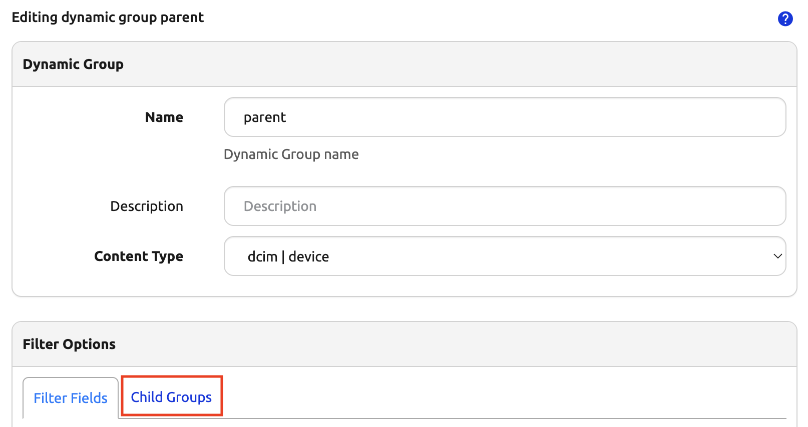
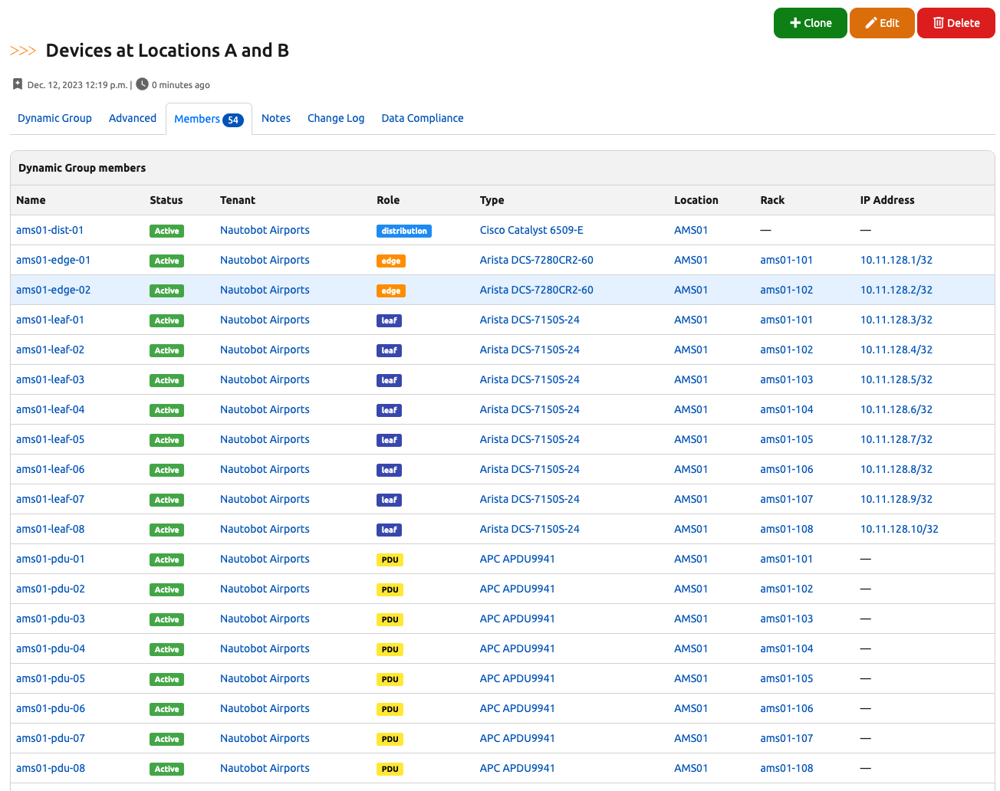
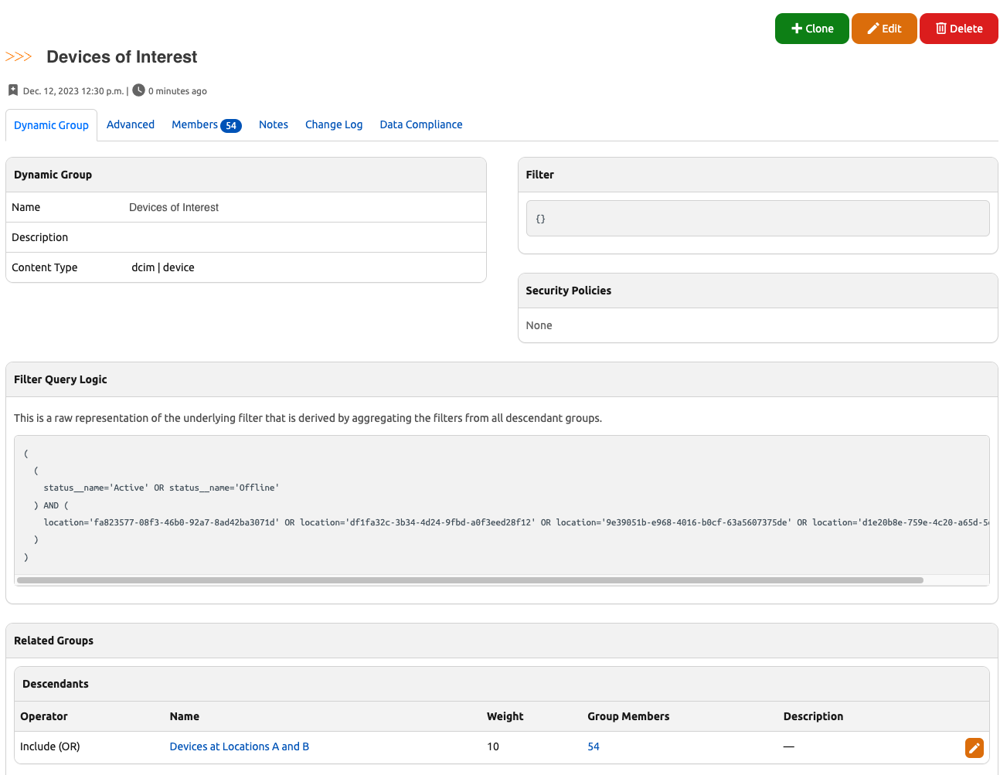
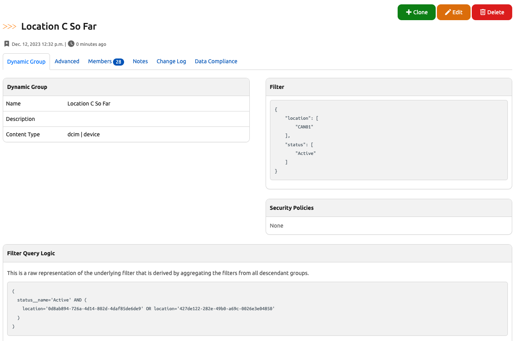
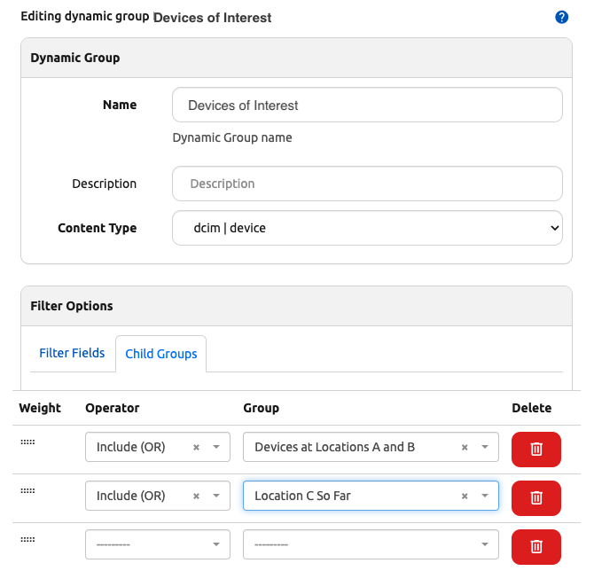
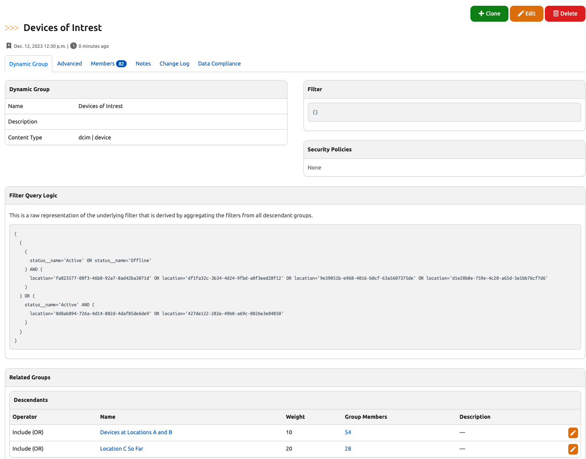
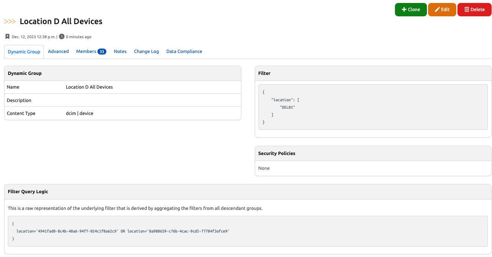
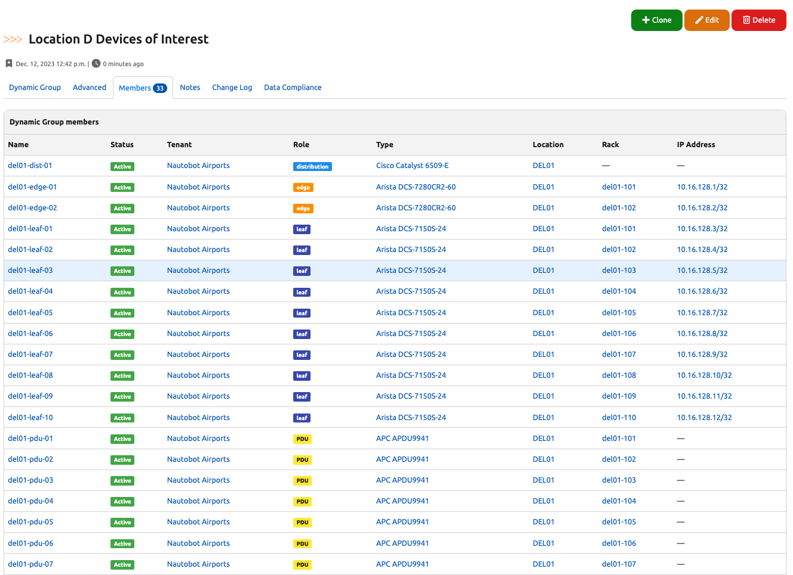

# Dynamic Groups

+++ 1.3.0

Dynamic Groups provide a way to organize objects of the same Content Type by matching filters. A Dynamic Group can be used to create unique groups of objects matching a given filter, such as Devices for a specific site location or set of locations. As indicated by the name, Dynamic Groups update in real time as potential member objects are created, updated, or deleted.

When creating a Dynamic Group, one must select a Content Type to which it is associated, for example `dcim.device`. The filtering parameters saved to the group behave as a bi-directional search query that is used to identify members of that group, and can also be used to determine from an individual object the list of Dynamic Groups to which an individual object belongs.

Once created the Content Type for a Dynamic Group may not be modified as this relationship is tightly-coupled to the available filtering parameters. All other fields may be updated at any time.

## Introduction

### Creating Dynamic Groups

Dynamic Groups can be created through the UI under _Organization > Dynamic Groups_ and clicking the "Add" button, or through the REST API.

Each Dynamic Group must have a human-readable **Name** string, e.g. `devices-site-ams01` and a **Slug**, which should be a simple database-friendly string. By default, the slug will be automatically generated from the name, however you may customize it if you like. You must select a **Content Type** for the group that determines the kind of objects that can be members of the group and the corresponding filtering parameters available. Finally, you may also assign an optional human-friendly **Description** (e.g. "Devices in site AMS01").

Once a new Dynamic Group is created, the group can be configured by clicking the "Edit" button to specify **Filter Fields** or **Child Groups** to use to narrow down the group's member objects. More on this below.

!!! warning
    The content type of a Dynamic Group cannot be modified once created, so take care in selecting this initially. This is intended to prevent the possibility of inconsistent data and enforces the importance of thinking about the data model when defining a new Dynamic Group.

### Working with Dynamic Groups

Once created and configured, Dynamic Groups can be accessed from the primary Dynamic Groups landing page in the web interface under the _Organization > Dynamic Groups_ menu. From there you may view the list of available groups, search or filter the list, view or edit an individual group, or bulk delete groups. Additionally if a group's filter has matching members, the number of members may be clicked to take you to the list of members for that dynamic group containing those objects.

Dynamic Groups cannot be imported nor can they be updated in bulk, as these operations would be complex and do not make sense in most cases.

From an individual object's detail page, if it is a member of any groups, a "Dynamic Groups" tab will display in the navigation tabs. Clicking that tab will display all Dynamic Groups of which this object is a member.

### Filtering

Dynamic Group filtering is powered by **FilterSet** objects underneath the hood. Basic filtering is performed using the `filter` that is defined on a given Dynamic Group. Advanced filtering is performed by aggregating filters from multiple nested Dynamic Groups to form a combined parent Dynamic Group, which will be explained later in this document.

An object is considered to be a member of a Dynamic Group if it is of the same Content Type and it is not excluded by way of any of the filter criteria specified for that group. By default, a freshly created group has an empty filter (`{}`), which will include all objects of the matching Content Type, just as a default list view of those objects would display prior to any filter fields being filled in the web UI.

For example, for a Dynamic Group with Content Type of `dcim.device` and an empty filter, the list of members would be equivalent to the default Device list view, which in turn is equivalent to the queryset for `Device.objects.all()` from the database ORM.

+/- 1.4.0
    In Nautobot v1.3.0 the default for a Dynamic Group with an empty filter was to "fail closed" and have zero members.

    As of v1.4.0, this behavior has been inverted to default to include all objects matching the Content Type, instead of matching no objects as was previously the case. This was necessary to implement the progressive layering of child filters similarly to how we use filters to reduce desired objects from basic list view filters. This will be described in more detail below.

#### Basic Filtering

When editing a Dynamic Group, under the **Filter Options** section, you will find a **Filter Fields** tab that allows one to specify filter criteria. The filter fields available for a given Content Type are backed and validated by underlying filterset classes (for example `nautobot.dcim.filters.DeviceFilterSet`) and are represented in the web interface as a dynamically-generated filter form that corresponds to each eligible filter field.

#### Advanced Filtering

+++ 1.4.0

Advanced filtering is performed using nested Dynamic Group memberships.

An object is considered a member of an advanced Dynamic Group if it matches the aggregated filter criteria across all descendant groups.

When editing a Dynamic Group, under the **Filter Options** section, you will find a **Child Groups** tab that allows one to make other Dynamic Groups of the same Content Type children of the parent group.



## Example Workflow

Dynamic Groups are a complex topic and are perhaps best understood through a series of worked examples.

### Basic Filtering with a single Dynamic Group

Let's say you want to create a Dynamic Group that contains all production Devices at your first two Sites. You can create a Dynamic Group called "Devices at Sites A and B" for Content Type `dcim | device`, then edit it and set the **Filter Fields** to match:

1. a Site of either "AMS01" or "BKK01"
2. a Status of "Active" or "Offline"


After clicking "Update", you will be returned to the detail view for this Dynamic Group, where you can verify the filter logic that results, and click the "Members" tab to see the set of Devices that it contains.




A key to understand here is that generally, within a single Dynamic Group, additional values specified for the _same_ filter field (here, "Site") will _broaden_ the group to _include_ additional objects that match those additional values, while specifying values for _additional filter fields_ (here, "Status") will _narrow_ the group to match only the objects that match this additional filter. This is expressed in the "Filter Query Logic" panel by the use of `OR` and `AND` operators - the logic for this Dynamic Group is:

```no-highlight
(
  (
    site__slug='ams01' OR site__slug='bkk01'
  ) AND (
    status__slug='active' OR status__slug='offline'
  )
)
```

### Advanced Filtering - Combining Two Dynamic Groups into a Third

+++ 1.4.0

Now, let's say that you add a third site to your network. This site is currently being built out, and you don't care about Devices from this site that are Offline status at present. What you want for your "Devices of Interest" Dynamic Group is logic similar to:

```no-highlight
(
  (
    (
      site__slug='ams01' OR site__slug='bkk01'
    ) AND (
      status__slug='active' OR status__slug='offline'
    )
  ) OR (
    site__slug='can01' AND status__slug='active'
  )
)
```

This logic is too complex to express directly via a single Dynamic Group, but fear not! This is what combining Dynamic Groups allows you to do.

First, you can create a new "Devices of Interest" group. Edit this group, and instead of specifying **Filter Fields**, switch to the **Child Groups** tab of the editor, select the operator "Include (OR)" and the group "Devices at Sites A and B", and update the group.


In the new group's detail view, you can see that it now contains one child group, "Devices at Sites A and B", and its members are exactly the same as those of that group. But we're not done yet!



Next, you'll create another group to represent the other part of your desired logic. Call this group "Site C So Far", and set its **Filter Fields** to match Site "CAN01" and Status "Active". Verify that it contains the expected set of Devices from Site C.



Now, we'll add this group into the "Devices of Interest" parent group. Navigate back to the **Dynamic Groups** list view, and edit this group. Under the **Child Groups** tab, add another "Include (OR)" operator and select group "Site C So Far":



Now things are getting interesting!



The "Devices of Interest" Dynamic Group now contains the filtered Devices from both of its child groups, and the "Filter Query Logic" matches our intent as we stated it earlier:

```no-highlight
(
  (
    (
      site__slug='ams01' OR site__slug='bkk01'
    ) AND (
      status__slug='active' OR status__slug='offline'
    )
  ) OR (
    site__slug='can01' AND status__slug='active'
  )
)
```

### Advanced Filtering: Nested Groups and Negation

+++ 1.4.0

Next, let's say you add a fourth site to your network. This site is in bad shape, and has Devices in a wide range of statuses. You want your "Devices of Interest" group to include all Devices from this site, _except for those in Decommissioning status_. To express this logic and add these devices to our parent group, we will need to use a combination of groups and the "Exclude (NOT)" operator.

First, you will create an "Site D All Devices" group. This will simply match Devices at Site "DEL01", regardless of their status.



Then create a "Site D Decommissioning Devices" group, which matches Site "DEL01" and Status "Decommissioning".


Next create a "Site D Devices of Interest" group, and set its **Child Groups** to:

1. Operator "Include (OR)", group "Site D All Devices"
2. Operator "Exclude (NOT)", group "Site D Decommissioning Devices"


!!! warning
    In general, but especially when using the AND and NOT operators, you must pay close attention to the order of the child groups. In this example, if you were to reverse the order of these two child groups, you would **not** get the desired final result!

You can check this group and confirm that it contains the expected restricted subset of Devices.



Finally, you can edit the parent "Devices of Interest" group and add a third **Child Groups** entry, "Include (OR)" on "Site D Devices of Interest". The final result is a Dynamic Group that contains the desired set of Devices across all four of your Sites.


You can see the filter logic that this combination of groups results in:

```no-highlight
(
  (
    (
      site__slug='ams01' OR site__slug='bkk01'
    ) AND (
      status__slug='active' OR status__slug='offline'
    )
  ) OR (
    site__slug='can01' AND status__slug='active'
  ) OR (
    site__slug='del01' AND (
      NOT (site__slug='del01' AND status__slug='decommissioning')
    )
  )
)
```

You can also see the hierarchy of nested groups that are being used to derive the "Devices of Interest" group:


Most importantly, you now have a Dynamic Group that contains exactly the set of Devices you need!


## Technical Details

### Filter Generation

Filters are always processed hiearchically from the top down starting from the parent group and descending recursively to the last nested child group in order by the `weight` value assigned to that group when it was associated to its parent.

!!! note
    For the purpose illustration, we will use "left to right" terminology since when verbally describing precedence in English, we read from left to right, so that following it will be more intuitive.

The nesting of Dynamic Groups is performed using two advanced patterns: Sets and graphs. Rules for each child group are processed using a set `operator`, and groups are sorted hierarchically as a directed acyclic graph (DAG), where the `weight` is used for sorting child groups topologically.

In both cases, the ordering of the tree of descendants from a parent group to its nested children is significant and critically important to how each subsequent filter or group of filters are processed to result in a final set of member objects.

Consider an example where there is a graph from the parent group to three direct child groups, the third of which has its own nested child group:

```no-highlight
parent
- first-child
- second-child
- third-child
  - nested-child
```

The filter generation would walk the graph: starting from the base (match-all) filter of `parent`, the filter of `first-child` would be applied, then `second-child`, as ordered by their `weight`. In the case of `third-child`, all of its children (only `nested-child` in this case) would be processed in order in the same way and the resultant filter from all of the child groups for `third-child` would be applied to the filter resulting from `first-child` and `second-child`, resulting in the final filter for `parent`.

### Weights

Weights are used to define the order in which a parent group's child group filters are processed. Because this ordering is significant, care must be taken when constructing nested Dynamic Groups to result in filter parameters that have the desired outcome.

!!! note
    Unique weights are only considered for directly-related child groups. In other words, the weights for each child group of a parent group are unique to that parent and only affect the sorting of the children for that parent.

In practice, weights are automatically assigned in increments of `10` when associating child groups in the web UI, and child groups may be dragged and dropped to re-order them and re-assign their weights accordingly. When using the REST API, the weights must be explicitly provided as a part of your request payload.

Using the example group hierarchy above, the weights would be as follows:

```no-highlight
parent
- first-child {weight: 10}
- second-child {weight: 20}
- third-child {weight: 30}
  - nested-child {weight: 10}
```

### Operators

Set theory is applied when a new group is added as a child group. Three key concepts are at play: Intersections, Unions, and Differences.

We have attempted to simplify working with these operators by giving them both human-readable and Boolean name mappings. They are as follows:

- **Restrict (Boolean `AND`)** - The **Restrict** operator performs a set _intersection_ on the queryset, and is equivalent to a Boolean `AND`. The preceding filter is _restricted_ (aka _intersected_) by the objects matching the child filter. All filter criteria must match between the filters for a member object to be included in the resultant filter.
- **Include (Boolean `OR`)** - The **Include** operator performs a set _union_ on the queryset, and is equivalent to a Boolean `OR`. The preceding filter is _extended to include_ (aka _unioned with_) any objects matching the child filter. Any filter criteria may match between the filters for member objects to be included in the resultant filter.
- **Exclude (Boolean `NOT`)** - The **Exclude** operator performs a set _difference_ on the queryset, and is equivalent to a Boolean `NOT`. The preceding filter _excludes_ (aka _differences_) any objects matching the child filter. Any matching objects from the child filter will be negated from the members of the resultant filter.

The following table maps the Nautobot **operator** to the corresponding set operations:

| Operator | Set Operation | Boolean | Description                                                  |
| -------- | ------------- | ------- | ------------------------------------------------------------ |
| Restrict | Intersection  | AND     | Objects _must_ match this child filter to be included in the parent group |
| Include  | Union         | OR      | Objects _may_ match the child filter to be included in the parent group |
| Exclude  | Difference    | NOT     | Objects _must not_ match this child filter to be included in the parent group |

Any filters provided by the child groups are used to filter the members from the parent group using one of the three operators: **Restrict (AND)**, **Include (OR)**, or **Exclude (NOT)**.

Using the example group hierarchy from above, let's apply operators and explain how it would work:

```no-highlight
parent {filter: None}
- first-child {weight: 10, operator: intersection (AND), filter: site=ams01}
- second-child {weight: 20, operator: union (OR), filter: site=ang01}
- third-child {weight: 30, operator: difference (NOT), filter: None}
  - nested-child {weight: 10, operator: intersectio (AND), filter: status=active}
```

Logically, the filter will be expressed like so using the hierarchy above:

```no-highlight
((first-child OR second-child) AND (NOT nested-child))
```

Which in turn would map to the object filter:

```no-highlight
((site=ams01 OR site=ang01) AND (NOT status=active))
```

#### How does this work?

First, the filters for direct children for a group will always be included in a parenthetical grouping, separated by the operator. Parent groups always start from their base filter containing "all objects" (equivalent to an empty filter or `{}`). Therefore the filter of `parent` and the filter of `third-child` are not directly used for generating the filter and are instead passed through from `parent` left to right as the "base" filter.

Similarly, by the time we get to `third-child`, the filter at that node in the graph will have already had the filter from `first-child` and `second-child` applied, and will merely be passed through to the filter generated from the children of `third-child`.

Because `first-child` and `second-child` are "included" by way of the `union` set operator (Boolean `OR`), but because the filter for `third-child` is empty as explained above, its filter condition is not directly included, resulting in `(first-child OR second-child)` as the first group, representing all _direct_ filters for the group `parent`.

!!! note
    But what about the `AND` coming from the association of `first-child`, you might be asking?

    Well, that `AND` is also passed through because the default behavior when performing queryset filtering is to join all filter statements together with `AND`. For example, consider when you perform this from the Django ORM `Device.objects.filter(site__slug="ams01")` the outcome is in fact equivalent to `AND site__slug="ams01"`. Therefore, for the first child group (literally `first-child` in this case), initial `AND` will be omitted.

Continuing on to the children of `third-child`, the same iteration rules apply. The filter from `nested-child` gets applied to the filter being passed through from its parent, `third-child`, except that the "exclude" (boolean `NOT`) operator is still applied from the association of `third-child` to parent resulting in `(NOT nested-child`).

!!! note
    You'll see `NOT` emitted as an `AND NOT` because `NOT` is actually just shorthand for this. They are in fact interchangeable as Boolean operators. While it's technically possible to perform an `OR NOT` query from a database perspective, it is not supported by Dynamic Groups because the `NOT` operator maps directly to the "difference" set operation which is distinctly an `AND NOT` Boolean operation when performing underlying SQL queries at the database.

Piecing the rules together, we ended up with two filters and by wrapping them in their own set of parentheses we get our final generated filter:

```no-highlight
(
  (
    [ALL OBJECTS]
    AND first-child
  )
  OR second-child
)
AND NOT (
  [ALL OBJECTS]
  AND nested-child
)
```

## Dynamic Groups and the REST API

Dynamic Groups are fully supported by the API. Two distinct endpoints are required, one each for managing Dynamic Groups and for assigning child groups using Dynamic Group Memberships.

### Specifying Filter Conditions

Dynamic Groups are fairly straightforward however it is important to understand how the `filter` field works before digging in.

The `filter` is a JSON field and it must be able to be used as valid query parameters for filtering objects of the corresponding Content Type.

It is an error to provide any value other than a JSON object (`{}` or a Python dictionary) for the `filter` field.

#### Multiple Values

Most fields within the `filter` accept multiple values and must be represented as a JSON array (Python list), for example:

```json
{
    "site": ["ams01", "ang01"]
}
```

#### Single Values

Certain fields take Boolean values (JSON `true`/`false`) or single numeric integers or character strings.

For example, consider this boolean filter that requires a single `true`/`false` and would result in a Dynamic Group of devices that have interfaces:

```json
{
  "has_interfaces": true
}
```

Or this character filter that requires a single string and would result in a Dynamic Group with only one member matching this `name`:

```json
{
  "name": "ams01-edge-01"
}
```

#### Field Validation

Any invalid field values for valid field names will also result in a `ValidationError`, for example providing an integer to the `name` filter is invalid:

```json
{
    "name": -42
}
```

!!! note
    Please refer to either the source code definition of the `{model_name}FilterSet` (e.g. for `Device` it would be `nautobot.dcim.filters.DeviceFilterSet`) or the API documentation for the list endpoint (e.g. `/api/dcim/devices/`) for a given model object, to view the available filter fields and their expectations.

+/- 1.4.0
    Prior to v1.4.0, any invalid field names that are not eligible for filtering objects will be discarded upon validation.

    As of v1.4.0, [strict filtering is enabled by default](../../configuration/optional-settings.md#strict_filtering), which causes any invalid field names to result in a `ValidationError`.

### Managing Dynamic Groups

#### Creating a Dynamic Group

A Dynamic Group may be created by performing a `POST` to the Dynamic Groups list endpoint at `/api/extras/dynamic-groups/`.

!!! note
    The `filter` field will default to an empty filter (`{}`) if not provided.

!!! important
    It is not possible to perform a nested assignment of `children` when creating a new Dynamic Group. You must first create the new group and then use the endpoint for creating Dynamic Group Memberships as explained below under [Assigning Child Groups](#assigning-child-groups).

Request:

```json
POST /api/extras/dynamic-groups/

{
    "name": "parent",
    "slug": "parent",
    "description": "I am a parent group with nested children.",
    "content-type": "dcim.device",
    "filter": {},
}
```

Response:

```json
{
    "id": "1f825078-b6dc-4b12-9463-be5a9189b03f",
    "display": "parent",
    "url": "http://localhost:6789/api/extras/dynamic-groups/1f825078-b6dc-4b12-9463-be5a9189b03f/",
    "name": "parent",
    "slug": "parent",
    "description": "I am the parent group with nested children.",
    "content_type": "dcim.device",
    "filter": {},
    "children": [],
    "created": "2022-07-06",
    "last_updated": "2022-07-06T20:17:04.305663Z",
    "custom_fields": {},
    "computed_fields": {},
    "relationships": {}
}
```

#### Updating or Deleting a Dynamic Group

!!! important
    It is not possible to perform a nested update of `children` when updating a new Dynamic Group. You must use the endpoint for creating Dynamic Group Memberships as explained below under [Updating or Deleting Child Groups](#updating-or-deleting-child-groups).

Updating or deleting a Dynamic Group is done by sending a request to the detail endpoint for that object.

A Dynamic Group may be updated using `PUT` or `PATCH` (for a partial update) requests. A `PUT` request requires the entire object to be updated in place. For example if you wanted to update the `name` and the `slug` together, leaving every other field with their current values as provided:

```json
PUT /api/extras/dynamic-groups/{uuid}/

{
    "name": "I am the best parent group",
    "slug": "best-parent",
    "description": "I am the parent group with nested children.",
    "filter": {}
}
```

Performing a partial update using a `PATCH` request can allow any single field to be updated without affecting the other fields. For example, if we wanted to update only the `slug` for a group:

```json
PATCH /api/extras/dynamic-group-memberships/{uuid}/

{
    "slug": "best-parent"
}
```

To delete a Dynamic Group you would send a `DELETE` request to the detail endpoint:

```json
DELETE /api/extras/dynamic-group-memberships/{uuid}/
```

### Managing Child Groups

Dynamic Groups may be nested to a parent group by creating a new Dynamic Group Membership. The act of assigning a Dynamic Group as a child to a parent group creates a Dynamic Group Membership.

This can be done at the list endpoint found at `/api/extras/dynamic-group-memberships/`.

#### Assigning Child Groups

Dynamic Group Membership objects may be created, updated, or deleted just like any other object and are represented as `children` on the parent group.

!!! note
    When interacting with the REST API, the `operator` must be provided using the string representation that is stored in the database. The human-readable operator names (such as "Exclude (AND)" for "intersection") are not accepted.

Request:

```json
POST /api/extras/dynamic-group-memberships/

{
    "group": {"slug": "first-child"},
    "parent_group": {"slug": "parent"},
    "operator": "intersection",
    "weight": 10
}
```

Response:

```json
{
    "id": "4c8296de-42bc-49a6-8fed-fc1b1f6b93ca",
    "display": "parent > intersection (10) > first-child",
    "url": "http://localhost:6789/api/extras/dynamic-group-memberships/4c8296de-42bc-49a6-8fed-fc1b1f6b93ca/",
    "group": {
        "display": "first-child",
        "id": "97188a74-eddd-46d8-be41-909c1ece1d43",
        "url": "http://localhost:6789/api/extras/dynamic-groups/97188a74-eddd-46d8-be41-909c1ece1d43/",
        "name": "first-child",
        "slug": "first-child",
        "content_type": "dcim.device"
    },
    "parent_group": {
        "display": "parent",
        "id": "1f825078-b6dc-4b12-9463-be5a9189b03f",
        "url": "http://localhost:6789/api/extras/dynamic-groups/1f825078-b6dc-4b12-9463-be5a9189b03f/",
        "name": "parent",
        "slug": "parent",
        "content_type": "dcim.device"
    },
    "operator": "intersection",
    "weight": 10
}
```

Observe that after adding this new membership object, the parent group now reflects this in its `children`:

```json
GET /api/extras/dynamic-groups/1f825078-b6dc-4b12-9463-be5a9189b03f/

{
    "id": "1f825078-b6dc-4b12-9463-be5a9189b03f",
    "display": "parent",
    "url": "http://localhost:6789/api/extras/dynamic-groups/1f825078-b6dc-4b12-9463-be5a9189b03f/",
    "name": "parent",
    "slug": "parent",
    "description": "",
    "content_type": "dcim.device",
    "filter": {},
    "children": [
        {
            "id": "4c8296de-42bc-49a6-8fed-fc1b1f6b93ca",
            "display": "parent > intersection (10) > first-child",
            "url": "http://localhost:6789/api/extras/dynamic-group-memberships/4c8296de-42bc-49a6-8fed-fc1b1f6b93ca/",
            "group": {
                "display": "first-child",
                "id": "97188a74-eddd-46d8-be41-909c1ece1d43",
                "url": "http://localhost:6789/api/extras/dynamic-groups/97188a74-eddd-46d8-be41-909c1ece1d43/",
                "name": "first-child",
                "slug": "first-child",
                "content_type": "dcim.device"
            },
            "parent_group": {
                "display": "parent",
                "id": "1f825078-b6dc-4b12-9463-be5a9189b03f",
                "url": "http://localhost:6789/api/extras/dynamic-groups/1f825078-b6dc-4b12-9463-be5a9189b03f/",
                "name": "parent",
                "slug": "parent",
                "content_type": "dcim.device"
            },
            "operator": "intersection",
            "weight": 10
        }
    ],
    "created": "2022-07-15",
    "last_updated": "2022-07-15T16:50:45.453965Z",
    "notes_url": "http://localhost:6789/api/extras/dynamic-groups/1f825078-b6dc-4b12-9463-be5a9189b03f/notes/",
    "custom_fields": {}
}
```

#### Updating or Deleting Child Groups

Updating or deleting Dynamic Group Membership is done by sending a request to the detail endpoint for that membership object.

A Dynamic Group Membership may be updated using `PUT` or `PATCH` (for a partial update) requests. A `PUT` request requires the entire object to be updated in place. For example if you wanted to update the `operator` and the `weight` together,leaving every other field with their current values as provided:

```json
PUT /api/extras/dynamic-group-memberships/{uuid}/

{
    "group": {"slug": "first-child"},
    "parent_group": {"slug": "parent"},
    "operator": "difference",
    "weight": 10
}
```

Performing a partial update using a `PATCH` request can allow any single field to be updated without affecting the other fields. For example, if we only wanted to update the `weight` for a membership:

```json
PATCH /api/extras/dynamic-group-memberships/{uuid}/

{
    "weight": 15
}
```

To delete a Dynamic Group Membership you would send a `DELETE` request to the detail endpoint:

```json
DELETE /api/extras/dynamic-group-memberships/{uuid}/
```
