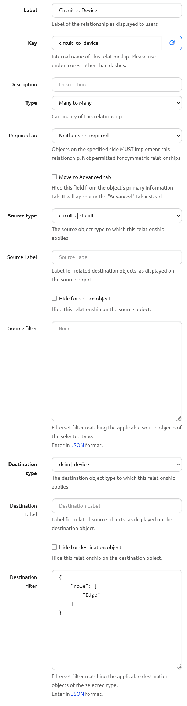
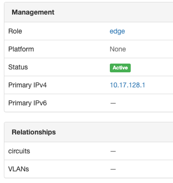
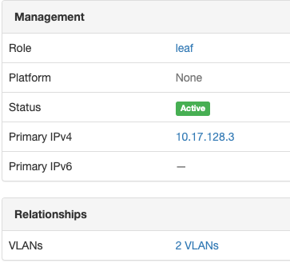

# Relationships
Sometimes it is desirable to create a new kind of relationship between one (or more) objects in your source of truth to reflect business logic or other relationships that may be useful to you but that haven't been defined. This is where the Relationships feature comes in: like defining custom fields to hold atributes specific to your use cases, relationships define specific links between objects that might be specific to your network or data.

To create a relationship, from the top-level navigation menu select *Extensibility* --> *Relationships*

## Relationship Types

* Many to Many -  where both sides of the relationship connection can be connected to multiple objects. e.g. VLANs can be connected to multiple devices and devices will have multiple VLANs.
* One to Many - where one side of the connection can only have one object. e.g. where a controller has many supplicants like FEX and parent switch. A FEX can be uplinked to one parent switch (in most cases), but the parent switch can have many FEX. 
* One to One - where there can be only one object on either side of the relationship. e.g. a primary VLAN for a site or device. It doesn't make sense to have more than 1 'primary' vlan for a device.

## Relationship Filters

Filters can be defined to restrict the type or selection of objects for either side of the connection. 

As an example, let's create a relationship between Circuits and Devices. 
In our situation we only would terminate Circuits on Devices with the Device Role of `edge`.

To prevent the Circuit Relationship from showing up on any other Device, use a JSON filter to 
limit the Relationship to only Devices with Device Role whose slug is `edge`:

```json
{
    "role": [
        "edge"
    ]
}
```

!!! note
    There are a few ways to tell what attributes are available to filter on for a given object.
    In the case of the *Device* object used in the example, the user could:
    
    - look at the code `nautobot/dcim/filters.py` -> `DeviceFilterSet` class (available options there include `manufacturer_id`, `manufacturer`, etc)
    - check the filter options available in the REST API: `https://<server-name>/api/docs`, and in this case checking the `dcim_devices_list` API endpoint for the parameter names

For context, here is an image of the entire Relationship:



Now, the Circuit Relationship field will show up on a Device with an `edge` role:



The Circuit Relationship field will *not* show up on a Device with a role `leaf`:




## Relationship Labels

Relationship connections can be labeled with a friendly name so that when they are displayed in the GUI, they will have a more descriptive or friendly name. 
From the Devices/Circuits example above, you might label the relationship so that on the Device side the connection appears as 'Terminated Circuits' and on the Circuit side the connection appears as 'Terminating Devices'. 

### Options

It's also possible to hide the relationship from either side of the connection. 

# Creating new Relationships

Relationships can be added through the UI under Extensibility > Relationships

Each relationship must have a Name, Slug, Type, Source Object(s), and Destination Object(s). Optionally, Source Labels, Source Filters, Destination Labels, and Destination Filters may be configured. 

Once a new relationship is added, the Relationship configuration section will appear under that device in the UI edit screen. Once a specific instance relationship has been configured for the object, that new relationship will appear under the Relationship section heading when viewing the object.


# API

Relationships are fully supported by the API. 

## Adding a new type of Relationship

The API endpoint for relationship creation is `/extras/relationships/`

From our many to many example above, we would use the following data to create the relationship. 

```json
{
    "name": "Device VLANs",
    "slug": "device-vlans",
    "type": "many-to-many",
    "source_type": "ipam.vlan",
    "destination_type": "dcim.device"
}
```

## Configuring the Relationship between Objects

Configuring the relationship is similarly easy. Send a request to `/extras/relationship-associations/` like the following:

Here we specify the IDs of each object. We specify the UUID of each object in their respective fields.

```json
{
    "relationship": "bff38197-26ed-4bbd-b637-3e688acf361c",
    "source_type": "ipam.vlan",
    "source_id": "89588629-2d70-45ce-9e20-f6b159b41b0c",
    "destination_type": "dcim.device",
    "destination_id": "6e8e72da-ce6e-468d-90f9-b4473d449db7"
}
```

In the relationship field, you may specify a dictionary of object attributes instead:

```json
{
    "relationship": {
        "slug": "device-vlans"
    },
    "source_type": "ipam.vlan",
    "source_id": "89588629-2d70-45ce-9e20-f6b159b41b0c",
    "destination_type": "dcim.device",
    "destination_id": "6e8e72da-ce6e-468d-90f9-b4473d449db7"
}
```