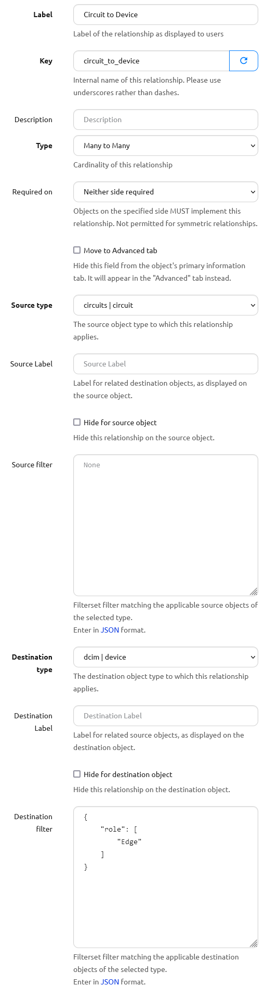

# Relationships

Sometimes it is desirable to create a new kind of relationship between one (or more) objects in your source of truth to reflect business logic or other relationships that may be useful to you but that haven't been defined. This is where the Relationships feature comes in: like defining custom fields to hold attributes specific to your use cases, relationships define specific links between objects that might be specific to your network or data.

To create a relationship, from the top-level navigation menu select **Extensibility > Data Management > Relationships**

!!! tip
    Because relationship information can be included in the REST API and in GraphQL, we strongly recommend that when defining a relationship, you provide a slug that contains underscores rather than dashes (`my_relationship_slug`, not `my-relationship-slug`), as some features may not work optimally if dashes are included in the slug.

## Relationship Types

* **Many-to-many** - where both sides of the relationship connection can be connected to multiple objects. For example, VLANs can be connected to multiple devices and devices will have multiple VLANs.
* **One-to-many** - where one side of the connection can only have one object. For example, where a controller has many supplicants like FEX and parent switch. A FEX can be uplinked to one parent switch (in most cases), but the parent switch can have many FEX.
* **One-to-one** - where there can be only one object on either side of the relationship. For example, an IP address serving as a router-id for a device. Each device has at most one router-id, and each IP address can be a router-id for at most one device.

+++ 1.2.0
    Additionally, there are two _symmetric_ relationship types that can be used when defining a relationship between objects of the same type. These relationship types treat the two _sides_ of a relationship as interchangeable (much like the A/Z sides of a circuit, or the endpoints of a cable) rather than distinguishing between the _source_ and _destination_ of a relationship as the non-symmetric relationship types above do.

    * **Symmetric Many-to-many** - as in Many-to-many, but acting more as an _undirected graph_ of similar objects. For example, this could be used to define a set of devices participating in a routing topology, where each device has some number of peers and there's no distinction between _source_ and _destination_ peers.
    * **Symmetric One-to-one** - as in One-to-one, but defining a relationship between exactly two objects of the same type. For example, a HSRP/VRRP pair of redundant devices, where each device has exactly one peer device.

!!! note
    A symmetric many-to-many relationship can be, but is not necessarily, a _complete graph_ or _full mesh_. For example, in the routing topology example above, if Device _A_ and Device _B_ are peers, and Device _B_ and Device _C_ are peers, this does not automatically imply a relationship between Devices _A_ and _C_ -- they **might or might not** also be peers, depending on how you define and populate the specific associations for this relationship.

## Required Relationships

+++ 1.5.0

Relationships can be marked as being required. By default, relationships are not marked as being required.

To mark a relationship as being required, select "Source objects MUST implement this relationship" or conversely "Destination objects MUST implement this relationship" from the "Required on" field when editing or creating a relationship:

* If "Destination objects MUST implement this relationship" is selected, objects of the type selected in "Destination Type" will enforce this relationship when they are created or edited.
* If "Source objects MUST implement this relationship" is selected, objects of the type selected in "Source Type" will enforce this relationship when they are created or edited.

Required relationships are enforced in the following scenarios:

* Creating or editing an object via the API or the UI
* Bulk creating objects via the API
* Bulk editing objects via the API or the UI

## Relationship Filters

Filters can be defined to restrict the type or selection of objects for either side of the connection.

An important note is that the filters have to be defined in **FilterSet** rather than QuerySet format. In practice this means that you can use any of the filters that are valid in the REST API for a given object type, but cannot necessarily use complex nested attribute lookups (such as `interfaces__ip_addresses__prefix_length` on a Device, for example).

As an example, let's create a relationship between Circuits and Devices.
In our situation we only would terminate Circuits on Devices with the Device Role of `edge`.

To prevent the Circuit Relationship from showing up on any other Device, use a JSON filter to limit the Relationship to only Devices with Device Role whose slug is `edge`:

```json
{
    "role": [
        "edge"
    ]
}
```

!!! note
    There are a few ways to tell what attributes are available to filter on for a given object.
    In the case of the _Device_ object used in the example, the user could:

    - look at the code `nautobot/dcim/filters.py` -> `DeviceFilterSet` class (available options there include `manufacturer_id`, `manufacturer`, etc)
    - check the filter options available in the REST API: `https://<server-name>/api/docs`, and in this case checking the `dcim_devices_list` API endpoint for the parameter names

For context, here is an image of the entire Relationship:



Now, the Circuit Relationship field will show up on a Device with an `edge` role:


The Circuit Relationship field will _not_ show up on a Device with a role `leaf`:


## Relationship Labels

Relationship connections can be labeled with a friendly name so that when they are displayed in the GUI, they will have a more descriptive or friendly name.
From the Devices/Circuits example above, you might label the relationship so that on the Device side the connection appears as 'Terminated Circuits' and on the Circuit side the connection appears as 'Terminating Devices'.

### Options

It's also possible to hide the relationship from either side of the connection.

## Creating New Relationships

Relationships can be added through the UI under Extensibility > Relationships

Each relationship must have a Name, Slug, Type, Source Object(s), and Destination Object(s). Optionally, Source Labels, Source Filters, Destination Labels, and Destination Filters may be configured.

Once a new relationship is added, the Relationship configuration section will appear under that device in the UI edit screen. Once a specific instance relationship has been configured for the object, that new relationship will appear under the Relationship section heading when viewing the object.

When creating a relationship, if "Move to Advanced tab" is checked, this relationship won't appear on the object's main detail tab in the UI, but will appear in the "Advanced" tab. This is useful when the requirement is to hide this relationship from the main detail tab when, for instance, it is only required for machine-to-machine communication and not user consumption.

## REST API

Relationships are fully supported by the API.

### Adding a new type of Relationship

The API endpoint for relationship creation is `/extras/relationships/`

From our many to many example above, we would use the following data to create the relationship.

```json
{
    "name": "Device VLANs",
    "slug": "device-vlans",
    "type": "many-to-many",
    "source_type": "ipam.vlan",
    "destination_type": "dcim.device"
}
```

### Configuring the Relationship between Objects

#### Via Object Endpoints

+++ 1.4.0

To get object relationships and associations from the REST API, you can query any object endpoint with the `?include=relationships` query parameter included, for example `GET /api/dcim/devices/f472bb77-7f56-4e79-ac25-2dc73eb63924/?include=relationships`. The API response will include a nested dictionary of relationships and associations applicable to the object(s) retrieved.

Similarly, you can update the relationship associations for a given object via an HTTP `POST` or `PATCH` request, generally by including the nested key `["relationships"][<relationship-slug>]["source"|"destination"|"peer"]["objects"]` with a list of objects to associate.

For more details on this feature, refer to the [REST API documentation](../../rest-api/overview.md).

#### Via Relationship-Associations Endpoint

Alternatively, relationship associations may be configured by sending a request to `/extras/relationship-associations/` like the following:

Here we specify the IDs of each object. We specify the UUID of each object in their respective fields.

```json
{
    "relationship": "bff38197-26ed-4bbd-b637-3e688acf361c",
    "source_type": "ipam.vlan",
    "source_id": "89588629-2d70-45ce-9e20-f6b159b41b0c",
    "destination_type": "dcim.device",
    "destination_id": "6e8e72da-ce6e-468d-90f9-b4473d449db7"
}
```

In the relationship field, you may specify a dictionary of object attributes instead:

```json
{
    "relationship": {
        "slug": "device-vlans"
    },
    "source_type": "ipam.vlan",
    "source_id": "89588629-2d70-45ce-9e20-f6b159b41b0c",
    "destination_type": "dcim.device",
    "destination_id": "6e8e72da-ce6e-468d-90f9-b4473d449db7"
}
```
