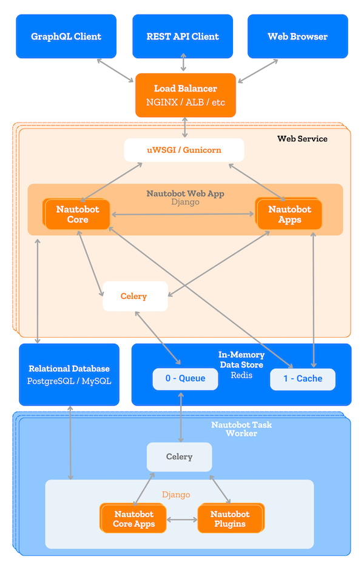

# Application Stack

Nautobot is built on the [Django](https://djangoproject.com/) Python Web framework and requires either a [PostgreSQL](https://www.postgresql.org/) or [MySQL](https://www.mysql.com) database backend. It runs as a WSGI service behind your choice of HTTP server.

| Function           | Component                      |
| ------------------ | ------------------------------ |
| HTTP service       | NGINX                          |
| WSGI service       | uWSGI or Gunicorn              |
| Application        | Django/Python                  |
| Database           | PostgreSQL 12.0+ or MySQL 8.0+ |
| Cache              | Django/Redis                   |
| Task queuing       | Redis/Celery                   |
| Live device access | NAPALM                         |

+++ 1.1.0
    MySQL support was added.

--- 2.0.0
    - `django-rq` support was removed.
    - `django-cacheops` usage was removed and replaced with Django's native caching features.

--- 2.1.0
    Support for versions of PostgreSQL older than 12.0 was removed.

The following diagram displays how data travels through Nautobot's application stack.

## Supported Python Versions

Nautobot supports Python 3.8 through 3.11.

+++ 1.3.0
    Python 3.10 support was added.

--- 1.3.0
    Python 3.6 support was removed.

+/- 1.6.0
    Python 3.11 support was added and Python 3.7 support was removed.

## Getting Started

See the [installation guide](../user-guide/administration/installation/index.md) for help getting Nautobot up and running quickly.

## Notices

> Nautobot was initially developed as a fork of NetBox (v2.10.4), which was originally created by Jeremy Stretch at DigitalOcean and by the NetBox open source community.
