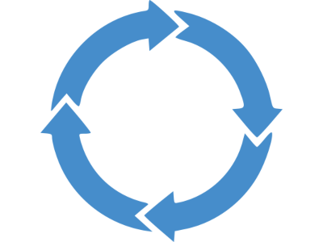
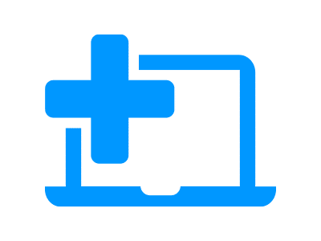
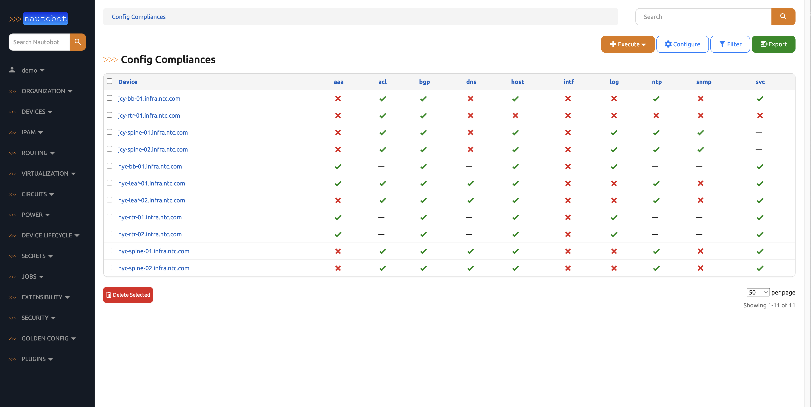

# 
<figure markdown="span">
  { width="400" }
</figure>

---

## What is Nautobot?

Nautobot is an open source Network Source of Truth and Network Automation Platform built as a web application atop the [Django](https://www.djangoproject.com/) Python framework with a [PostgreSQL](https://www.postgresql.org/) or [MySQL](https://www.mysql.com) database. Use the top navigation bar to dive directly into the documentation. Try out a live demo at [https://demo.nautobot.com](https://demo.nautobot.com)

## Key Use Cases

Nautobot enables three (3) key use cases.

1. **Flexible Source of Truth for Networking** - Nautobot core data models are used to define the intended state of network infrastructure enabling it as a Source of Truth. While a baseline set of models are provided (such as IP networks and addresses, devices and racks, circuits and cable, etc.) it is Nautobot's goal to offer maximum data model flexibility. This is enabled through features such as user-defined relationships, custom fields on any model, and data validation that permits users to codify everything from naming standards to having automated tests run before data can be populated into Nautobot.

2. **Extensible Data Platform for Automation** - Nautobot has a rich feature set to seamlessly integrate with network automation solutions.  Nautobot offers GraphQL and native Git integration along with REST APIs and webhooks.  Git integration dynamically loads YAML data files as Nautobot config contexts.  Nautobot also has an evolving App system that enables users to create custom models, APIs, and UI elements.  The App system is also used to unify and aggregate disparate data sources creating a Single Source of Truth to streamline data management for network automation.

3. **Platform for Network Automation Apps** - The Nautobot App system enables users to create Network Automation Apps.  Apps can be as lightweight or robust as needed based on user needs.  Using Nautobot for creating custom applications saves up to 70% development time by re-using features such as authentication, permissions, webhooks, GraphQL, change logging, etc. all while having access to the data already stored in Nautobot.

## Getting Started

- :material-cloud-download:{ .lg .middle } **Installing Nautobot**
    
    ---
    Get up and running with a [Nautobot install](../user-guide/administration/installation/index.md) on your own Linux VM or in a Docker environment.

- :material-account-settings:{ .lg .middle } **Configuring Nautobot**
    
    ---
    Learn about the many [configuration options](../user-guide/administration/configuration/index.md) that Nautobot offers for fine-tuning your installation.

- :material-web-check:{ .lg .middle } **Getting Started with Nautobot** 
    
    ---
    Dive into [how to use Nautobot](../user-guide/feature-guides/getting-started/index.md) and the key components of the core web interface.
    How [Nautobot Apps](../apps/index.md) can expand Nautobot's functionality.

    ---

-  :material-api:{ .lg .middle } **Nautobot APIs!**

    ---
    Dive into the [REST](../user-guide/platform-functionality/rest-api/overview.md) and [GraphQL](../user-guide/platform-functionality/graphql.md) APIs.

-  :material-language-python:{ .lg .middle } **Nautobot SDKs**

    ---
    Nautobot has a [Python SDK](https://pynautobot.readthedocs.io/) and [Ansible modules](https://galaxy.ansible.com/ui/repo/published/networktocode/nautobot/docs/) to interact with Nautobot in a programmatic way.

## Nautobot Apps

Nautobot has a thriving ecosystem of **Apps**, developed as separate projects, for which you can find links to documentation under the [Nautobot Apps](../apps/index.md) section.

- {style="height: 35px; margin-bottom: 0em" .middle } **Golden Configuration**

    ---
    [Golden Configuration](https://github.com/nautobot/nautobot-app-golden-config) backs up configurations, generates intended state configurations, compares them for compliance and remediates device configurations.

- {style="height: 35px; margin-bottom: 0em" .middle } **Device Lifecycle**

    ---
    [Device Lifecycle](https://github.com/nautobot/nautobot-app-device-lifecycle-mgmt) adds additional capabilities around managing the **hardware** and **software** lifecycle, including the tracking of related **contracts** .

- {style="height: 35px; margin-bottom: 0em" .middle } **Firewall Models**

    ---
    [Firewall Models](https://github.com/nautobot/nautobot-app-firewall-models) helps to model out firewall rules and related objects, including extended ACLs.

- {style="height: 35px; margin-bottom: 0em" .middle } **SSoT**

    ---
    [Single Source of Truth](https://github.com/nautobot/nautobot-app-ssot) is the framework to synchronize data from other systems into and out of Nautobot.

 - {style="height: 35px; margin-bottom: 0em" .middle } **ChatOps**

    ---
    [ChatOps](https://github.com/nautobot/nautobot-app-chatops) supports a variety of chat applications, allowing peer teams to conveniently interact with Nautobot and get information about the network.

 - {style="height: 35px; margin-bottom: 0em" .middle } **Circuit Maintenance**

    ---
    [Circuit Maintenance](https://github.com/nautobot/nautobot-app-circuit-maintenance) brings your circuit maintenance notification emails (and API connected info) into objects within Nautobot to bring better notification and business actions to the maintenances.

 - {style="height: 35px; margin-bottom: 0em" .middle } **Capacity Metrics**

    ---
    [Capacity Metrics](https://github.com/nautobot/nautobot-app-capacity-metrics) brings additional Nautobot data to Prometheus metrics, making it easy to derive time series information about your Nautobot data.

 - {style="height: 35px; margin-bottom: 0em" .middle } **Device Onboarding**

    ---
    [Device Onboarding](https://github.com/nautobot/nautobot-app-device-onboarding) brings network data into Nautobot, helping to build out the intended state from the current state of the network.

## Nautobot Screenshots

- { .on-glb }

- { .on-glb }

- { .on-glb }

- { .on-glb }

### App Screenshots

- { .on-glb }

- { .on-glb }

## Contributing to Nautobot

- :material-code-block-braces:{ .lg .middle } **Develop and Contribute to Nautobot**
    
    ---
    Learn how to [develop and contribute to Nautobot](../development/index.md)

- :material-laptop:{ .lg .middle } **Set Up Your Developer Environment**
    
    ---
    [Set up your Development Environment](development/core/getting-started.md)

- :material-pier-crane:{ .lg .middle } **Jobs Development Guide** 
    
    ---
    Jump started your [development of Nautobot Jobs](../development/jobs/index.md).

