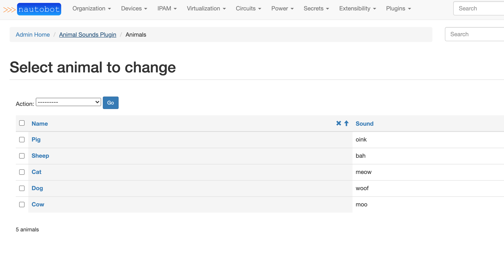
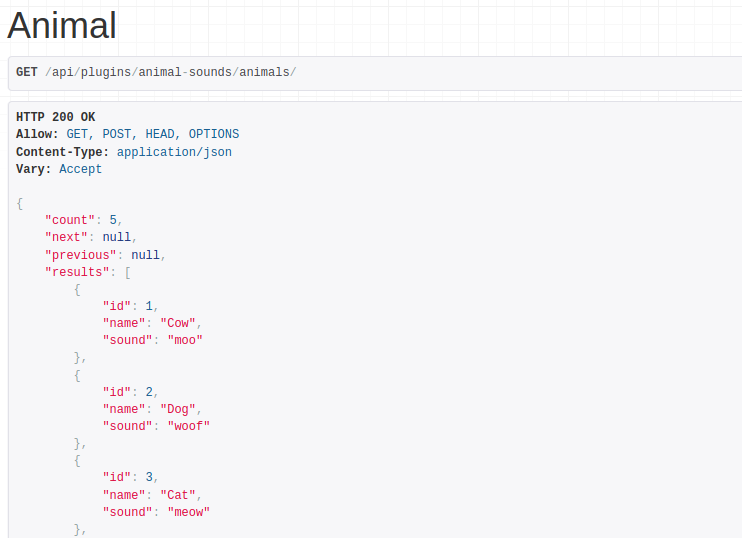

# App Development

This documentation covers the development of custom apps (plugins) for Nautobot. Nautobot apps are essentially self-contained [Django applications](https://docs.djangoproject.com/en/stable/ref/applications/) which integrate with Nautobot to provide custom functionality. Since the development of Django applications is already very well-documented, this will only be covering the aspects that are specific to Nautobot.

Apps can [do a lot of different things](./index.md#capabilities), all of which will be covered in detail in this document.
Keep in mind that each piece of functionality is entirely optional. For example, if your app merely adds a piece of middleware or an API endpoint for existing data, there's no need to define any new models.

+/- 1.5.2
    The `nautobot.apps` namespace was added in Nautobot 1.5.2. If developing apps to be backwards-compatible with older versions of Nautobot, please refer to the app developer documentation of your required Nautobot version.

!!! tip
    The app detail view (`/plugins/installed-plugins/<plugin_name>/`, accessible to superusers via **Plugins -> Installed Plugins** in the navigation menu, then selecting a specific app) provides in-depth information about which features any installed app is implementing or making use of.

## Initial Setup

!!! important "Use a Development Environment, Not Production For App Development"
    You should not use your production environment for app development. For information on getting started with a development environment, check out [Nautobot development guide](../development/getting-started.md).

### App Structure

Although the specific structure of an app is largely left to the discretion of its authors, a Nautobot app that makes use of all available app features described in this document could potentially look something like this:

```no-highlight
app_name/
  - app_name/
    - __init__.py           # required
    - admin.py              # Django Admin Interface
    - api/
      - serializers.py      # REST API Model serializers
      - urls.py             # REST API URL patterns
      - views.py            # REST API view sets
    - banner.py             # Banners
    - custom_validators.py  # Custom Validators
    - datasources.py        # Loading Data from a Git Repository
    - filter_extensions.py  # Extending Filters
    - filters.py            # Filtersets for UI, REST API, and GraphQL Model Filtering
    - forms.py              # UI Forms and Filter Forms
    - graphql/
      - types.py            # GraphQL Type Objects
    - homepage.py           # Home Page Content
    - jinja_filters.py      # Jinja Filters
    - jobs.py               # Job classes
    - middleware.py         # Request/response middleware
    - migrations/
      - 0001_initial.py     # Database Models
    - models.py             # Database Models
    - navigation.py         # Navigation Menu Items
    - secrets.py            # Secret Providers
    - signals.py            # Signal Handler Functions
    - template_content.py   # Extending Core Templates
    - templates/
      - app_name/
        - *.html            # UI content templates
    - urls.py               # UI URL Patterns
    - views.py              # UI Views and any view override definitions
  - pyproject.toml          # *** REQUIRED *** - Project package definition
  - README.md
```

The top level is the project root. Immediately within the root should exist several items:

* `pyproject.toml` - This is the new [unified Python project settings file](https://www.python.org/dev/peps/pep-0518/) that replaces `setup.py`, `requirements.txt`, and various other setup files (like `setup.cfg`, `MANIFEST.in`, among others).
* `README.md` - A brief introduction to your app, how to install and configure it, where to find help, and any other pertinent information. It is recommended to write README files using a markup language such as Markdown.
* The app source directory, with the same name as your app.

The app source directory contains all of the actual Python code and other resources used by your app. Its structure is left to the author's discretion, however it is recommended to follow best practices as outlined in the [Django documentation](https://docs.djangoproject.com/en/stable/intro/reusable-apps/). At a minimum, this directory **must** contain an `__init__.py` file containing an instance of Nautobot's `NautobotAppConfig` class.

!!! note
    Nautobot includes a command to help create the app directory:
    `nautobot-server startplugin [app_name]`
    Please see the [Nautobot Server Guide](../administration/nautobot-server.md#startplugin) for more information.

### Create pyproject.toml

#### Poetry Init (Recommended)

To get started with a project using [Python Poetry](https://python-poetry.org/) you use the `poetry init` command. This will guide you through the prompts necessary to generate a pyproject.toml with details required for packaging.

```no-highlight
This command will guide you through creating your pyproject.toml config.

Package name [tmp]:  nautobot-animal-sounds
Version [0.1.0]:
Description []:  An example Nautobot app
Author [, n to skip]:  Bob Jones
License []:  Apache 2.0
Compatible Python versions [^3.8]:  ^3.7

Would you like to define your main dependencies interactively? (yes/no) [yes] no
Would you like to define your development dependencies interactively? (yes/no) [yes] no
Generated file

[tool.poetry]
name = "nautobot-animal-sounds"
version = "0.1.0"
description = "An example Nautobot app"
authors = ["Bob Jones"]
license = "Apache 2.0"

[tool.poetry.dependencies]
python = "^3.7"

[tool.poetry.dev-dependencies]

[build-system]
requires = ["poetry-core>=1.0.0"]
build-backend = "poetry.core.masonry.api"


Do you confirm generation? (yes/no) [yes]
```

### Define a NautobotAppConfig

The `NautobotAppConfig` class is a Nautobot-specific wrapper around Django's built-in [`AppConfig`](https://docs.djangoproject.com/en/stable/ref/applications/) class. It is used to declare Nautobot app functionality within a Python package. Each app should provide its own subclass, defining its name, metadata, and default and required configuration parameters. An example is below:

```python
from nautobot.apps import NautobotAppConfig

class AnimalSoundsConfig(NautobotAppConfig):
    name = 'nautobot_animal_sounds'
    verbose_name = 'Animal Sounds'
    description = 'An example app for development purposes'
    version = '0.1'
    author = 'Bob Jones'
    author_email = 'bob@example.com'
    base_url = 'animal-sounds'
    required_settings = []
    default_settings = {
        'loud': False
    }

config = AnimalSoundsConfig
```

Nautobot looks for the `config` variable within an app's `__init__.py` to load its configuration. Typically, this will be set to the `NautobotAppConfig` subclass, but you may wish to dynamically generate a `NautobotAppConfig` class based on environment variables or other factors.

#### Required NautobotAppConfig Attributes

| Name | Description |
| ---- | ----------- |
| `author` | Name of app's author |
| `author_email` | Author's public email address |
| `description` | Brief description of the app's purpose |
| `name` | Raw app name; same as the app's source directory |
| `verbose_name` | Human-friendly name for the app |
| `version` | Current release ([semantic versioning](https://semver.org/) is encouraged) |

#### Optional NautobotAppConfig Attributes

| Name | Default | Description |
| ---- | ------- | ----------- |
| `base_url` | Same as specified `name` | Base path to use for app URLs |
| `caching_config` | `{"*":{"ops":"all"}}` | App-specific [query caching configuration](https://github.com/Suor/django-cacheops#setup) |
| `config_view_name` | `None` | [URL name](#adding-links-to-the-installed-apps-view) for a "configuration" view defined by this app |
| `default_settings` | `{}` | A dictionary of configuration parameters and their default values |
| `home_view_name` | `None` | [URL name](#adding-links-to-the-installed-apps-view) for a "home" or "dashboard" view defined by this app |
| `docs_view_name` | `None` | [URL name](#adding-links-to-the-installed-apps-view) for a "documentation" view defined by this app |
| `installed_apps` | `[]` | A list of additional Django application dependencies to automatically enable when the app is activated (you must still make sure these underlying dependent libraries are installed) |
| `max_version` | `None` | Maximum version of Nautobot with which the app is compatible |
| `middleware` | `[]` | A list of middleware classes to append after Nautobot's built-in middleware |
| `min_version` | `None` | Minimum version of Nautobot with which the app is compatible |
| `required_settings` | `[]` | A list of any configuration parameters that **must** be defined by the user |

!!! note
    All `required_settings` must be configured in `PLUGINS_CONFIG` in `nautobot_config.py` before the app can be used.

!!! warning
    If a configuration parameter is listed in both `required_settings` and `default_settings`, the default setting will be ignored.

#### NautobotAppConfig Code Location Attributes

The following `NautobotAppConfig` attributes can be configured to customize where Nautobot will look to locate various pieces of app code. In most cases you will not need to change these, but they are provided as options in case your app has a non-standard organizational structure.

!!! info
    As used below, a "dotted path" is the combination of a Python module path within the app and the name of a variable within that module. For example, `"template_content.template_extensions"` refers to a variable named `template_extensions` inside a `template_content` module located at the root of the app.

| Name | Default | Description |
| ---- | ------- | ----------- |
| `banner_function` | `"banner.banner"` | Dotted path to a function that can render a custom [banner](#adding-a-banner) |
| `custom_validators` | `"custom_validators.custom_validators"` | Dotted path to a list of [custom validator classes](#implementing-custom-validators) |
| `datasource_contents` | `"datasources.datasource_contents"` | Dotted path to a list of [datasource (Git, etc.) content types](#loading-data-from-a-git-repository) to register |
| `graphql_types` | `graphql.types.graphql_types` | Dotted path to a list of [GraphQL type classes](#creating-your-own-graphql-type-object) |
| `homepage_layout` | `"homepage.layout"` | Dotted path to a list of [home page items](#adding-home-page-content) provided by the app |
| `jinja_filters` | `"jinja_filters"` | Path to a module that contains [Jinja2 filters](#adding-jinja2-filters) to be registered |
| `jobs` | `"jobs.jobs"` | Dotted path to a list of [Job classes](#including-jobs) |
| `menu_items` | `"navigation.menu_items"` | Dotted path to a list of [navigation menu items](#adding-navigation-menu-items) provided by the app |
| `secrets_providers` | `"secrets.secrets_providers"` | Dotted path to a list of [secrets providers](#implementing-secrets-providers) in the app |
| `template_extensions` | `"template_content.template_extensions"` | Dotted path to a list of [template extension classes](#extending-object-detail-views) |

### Install the App for Development

The app needs to be installed into the same python environment where Nautobot is, so that we can get access to `nautobot-server` command, and also so that the nautobot-server is aware of the new app.

If you installed Nautobot using Poetry, then go to the root directory of your clone of the Nautobot repository and run `poetry shell` there.  Afterward, return to the root directory of your app to continue development.

Otherwise if using the pip install or Docker workflows, manually activate nautobot using `source /opt/nautobot/bin/activate`.

To install the app for development the following steps should be taken:

* Activate the Nautobot virtual environment (as detailed above)
* Navigate to the project root, where the `pyproject.toml` file exists for the app
* Execute the command `poetry install` to install the local package into the Nautobot virtual environment

!!! note
    Poetry installs the current project and its dependencies in editable mode (aka ["development mode"](https://setuptools.readthedocs.io/en/latest/userguide/development_mode.html)).

!!! important "This should be done in development environment"
    You should not use your production environment for app development. For information on getting started with a development environment, check out [Nautobot development guide](../development/getting-started.md).

```no-highlight
poetry install
```

Once the app has been installed, add it to the configuration for Nautobot:

```python
PLUGINS = ["animal_sounds"]
```

### Verify that the App is Installed

After restarting the Nautobot server, the newly installed app should appear in **Plugins -> Installed Plugins** if everything is configured correctly. You can also click on the app's name in this table to view more detailed information about this app based on its NautobotAppConfig and other contents.

## Extending the Existing Nautobot UI

### Extending Object Detail Views

Apps can inject custom content into certain areas of the detail views of applicable models. This is accomplished by subclassing `TemplateExtension`, designating a particular Nautobot model, and defining the desired methods to render custom content. Four methods are available:

* `left_page()` - Inject content on the left side of the page
* `right_page()` - Inject content on the right side of the page
* `full_width_page()` - Inject content across the entire bottom of the page
* `buttons()` - Add buttons to the top of the page
* `detail_tabs()` - Add extra tabs to the end of the list of tabs within the page tabs navigation

Additionally, a `render()` method is available for convenience. This method accepts the name of a template to render, and any additional context data you want to pass. Its use is optional, however.

When a TemplateExtension is instantiated, context data is assigned to `self.context`. Available data include:

* `object` - The object being viewed
* `request` - The current request
* `settings` - Global Nautobot settings
* `config` - App-specific configuration parameters

For example, accessing `{{ request.user }}` within a template will return the current user.

Declared subclasses should be gathered into a list or tuple for integration with Nautobot. By default, Nautobot looks for an iterable named `template_extensions` within a `template_content.py` file. (This can be overridden by setting `template_extensions` to a custom value on the app's `NautobotAppConfig`.) An example is below.

```python
# template_content.py
from django.urls import reverse
from nautobot.apps.ui import TemplateExtension

from .models import Animal


class SiteAnimalCount(TemplateExtension):
    """Template extension to display animal count on the right side of the page."""

    model = 'dcim.site'

    def right_page(self):
        return self.render('nautobot_animal_sounds/inc/animal_count.html', extra_context={
            'animal_count': Animal.objects.count(),
        })


class DeviceExtraTabs(TemplateExtension):
    """Template extension to add extra tabs to the object detail tabs."""

    model = 'dcim.device'

    def detail_tabs(self):
        """
        You may define extra tabs to render on a model's detail page by utilizing this method.
        Each tab is defined as a dict in a list of dicts.

        For each of the tabs defined:
        - The <title> key's value will become the tab link's title.
        - The <url> key's value is used to render the HTML link for the tab

        These tabs will be visible (in this instance) on the Device model's detail page as
        set by the DeviceContent.model attribute "dcim.device"

        This example demonstrates defining two tabs. The tabs will be ordered by their position in list.
        """
        return [
            {
                "title": "App Tab 1",
                "url": reverse("plugins:example_plugin:device_detail_tab_1", kwargs={"pk": self.context["object"].pk}),
            },
            {
                "title": "App Tab 2",
                "url": reverse("plugins:example_plugin:device_detail_tab_2", kwargs={"pk": self.context["object"].pk}),
            },
        ]

template_extensions = [DeviceExtraTabs, SiteAnimalCount]
```

#### Adding Extra Tabs

+++ 1.4.0

In order for any extra tabs to work properly, the `"url"` key must reference a view which inherits from the `nautobot.apps.views.ObjectView` class and the template must extend the object's detail template such as:

```html
<!-- example_plugin/tab_device_detail_1.html -->



    <h2>Device App Tab 1</h2>
    <p>I am some content for the example plugin's device ({{ object.pk }}) detail tab 1.</p>

```

Here's a basic example of a tab's view

```python
# views.py
from nautobot.apps.views import ObjectView
from nautobot.dcim.models import Device

class DeviceDetailAppTabOne(ObjectView):
    """
    This view's template extends the device detail template,
    making it suitable to show as a tab on the device detail page.

    Views that are intended to be for an object detail tab's content rendering must
    always inherit from nautobot.apps.views.ObjectView.
    """

    queryset = Device.objects.all()
    template_name = "example_plugin/tab_device_detail_1.html"
```

You must also add the view to the `url_patterns` like so (make sure to read the note after this code snippet):

```python
# urls.py
from django.urls import path

from example_plugin import views

urlpatterns = [
    # ... previously defined urls
    path("devices/<uuid:pk>/example-plugin-tab-1/", views.DeviceDetailAppTabOne.as_view(), name="device_detail_tab_1"),
]
```

!!! note
    For added tab views, we recommend for consistency that you follow the URL pattern established by the base model detail view and tabs (if any). For example, `nautobot/dcim/urls.py` references Device tab views with the URL pattern `devices/<uuid:pk>/TAB-NAME/`, so above we have followed that same pattern.

### Adding a Banner

+++ 1.2.0

An app can provide a function that renders a custom banner on any number of Nautobot views. By default Nautobot looks for a function `banner()` inside of `banner.py`. (This can be overridden by setting `banner_function` to a custom value on the app's `NautobotAppConfig`.)

This function currently receives a single argument, `context`, which is the [Django request context](https://docs.djangoproject.com/en/stable/ref/templates/api/#using-requestcontext) in which the current page is being rendered. The function can return `None` if no banner is needed for a given page view, or can return a `Banner` object describing the banner contents. Here's a simple example `banner.py`:

```python
# banner.py
from django.utils.html import format_html

from nautobot.apps.ui import Banner, BannerClassChoices

def banner(context, *args, **kwargs):
    """Greet the user, if logged in."""
    # Request parameters can be accessed via context.request
    if not context.request.user.is_authenticated:
        # No banner if the user isn't logged in
        return None
    else:
        return Banner(
            content=format_html("Hello, <strong>{}</strong>! 👋", context.request.user),
            banner_class=BannerClassChoices.CLASS_SUCCESS,
        )
```

### Adding Navigation Menu Items

Apps can extend the existing navigation bar layout. By default, Nautobot looks for a `menu_items` list inside of `navigation.py`. (This can be overridden by setting `menu_items` to a custom value on the app's `NautobotAppConfig`.)

Using a key and weight system, a developer can integrate the app's menu additions amongst existing menu tabs, groups, items and buttons, and/or create entirely new menus as desired.

More documentation and examples can be found in the [Navigation Menu](../development/navigation-menu.md) guide.

!!! tip
    To reduce the amount of clutter in the navigation menu, if your app provides an "app configuration" view, we recommend [linking it from the main "Installed Plugins" page](#adding-links-to-the-installed-apps-view) rather than adding it as a separate item in the navigation menu.

    Similarly, if your app provides an "app home" or "dashboard" view, consider linking it from the "Installed Plugins" page, and/or adding a link from the Nautobot home page (see below), rather than adding it to the navigation menu.

### Adding Home Page Content

+++ 1.2.0

Apps can add content to the Nautobot home page. By default, Nautobot looks for a `layout` list inside of `homepage.py`. (This can be overridden by setting `homepage_layout` to a custom value on the app's `NautobotAppConfig`.)

Using a key and weight system, a developer can integrate the app content amongst existing panels, groups, and items and/or create entirely new panels as desired.

More documentation and examples can be found in the guide on [Home Page Panels](../development/homepage.md).

### Adding Links to the Installed Apps View

+++ 1.2.0

It's common for many apps to provide an "app configuration" [view](#adding-web-ui-views) used for interactive configuration of aspects of the app that don't necessarily need to be managed by a system administrator via `PLUGINS_CONFIG`. The `NautobotAppConfig` setting of `config_view_name` lets you provide the URL pattern name defined for this view, which will then be accessible via a button on the **Plugins -> Installed Plugins** UI view.

For example, if the `animal_sounds` app provides a configuration view, which is set up in `urls.py` as follows:

```python
# urls.py
from django.urls import path

from . import views

urlpatterns = [
    path("configuration/", views.AnimalSoundsConfigView.as_view(), name="config"),
]
```

then in your `AnimalSoundsConfig` you could refer to the view by name:

```python
# __init__.py
from nautobot.apps import NautobotAppConfig

class AnimalSoundsConfig(NautobotAppConfig):
    # ...
    config_view_name = "plugins:animal_sounds:config"

config = AnimalSoundsConfig
```

and now the "Configuration" button that appears in the Installed Plugins table next to "Animal Sounds" will be a link to your configuration view.

Similarly, if your app provides an "app home" or "dashboard" view, you can provide a link for the "Home" button in the Installed Plugins table by defining `home_view_name` on your `NautobotAppConfig` class. This can also be done for documentation by defining `docs_view_name` on your `NautobotAppConfig` class.

## Extending Existing Functionality

### Adding Jinja2 Filters

+++ 1.1.0

Apps can define custom Jinja2 filters to be used when rendering templates defined in computed fields. Check out the [official Jinja2 documentation](https://jinja.palletsprojects.com/en/3.0.x/api/#custom-filters) on how to create filter functions.

In the file that defines your filters (by default `jinja_filters.py`, but configurable in the `NautobotAppConfig` if desired), you must import the `library` module from the `django_jinja` library. Filters must then be decorated with `@library.filter`. See an example below that defines a filter called `leet_speak`.

```python
from django_jinja import library


@library.filter
def leet_speak(input_str):
    charset = {"a": "4", "e": "3", "l": "1", "o": "0", "s": "5", "t": "7"}
    output_str = ""
    for char in input_str:
        output_str += charset.get(char.lower(), char)
    return output_str
```

This filter will then be available for use in computed field templates like so:

```jinja2
{{ "HELLO WORLD" | leet_speak }}
```

The output of this template results in the string `"H3110 W0R1D"`.

### Including Jobs

Apps can provide [Jobs](../additional-features/jobs.md) to take advantage of all the built-in functionality provided by that feature (user input forms, background execution, results logging and reporting, etc.).

By default, for each app, Nautobot looks for an iterable named `jobs` within a `jobs.py` file. (This can be overridden by setting `jobs` to a custom value on the app's `NautobotAppConfig`.) A brief example is below; for more details on Job design and implementation, refer to the Jobs feature documentation.

```python
# jobs.py
from nautobot.extras.jobs import Job


class CreateDevices(Job):
    ...


class DeviceConnectionsReport(Job):
    ...


class DeviceIPsReport(Job):
    ...


jobs = [CreateDevices, DeviceConnectionsReport, DeviceIPsReport]
```

### Implementing Custom Validators

Apps can register custom validator classes which implement model validation logic to be executed during a model's `clean()` method. Like template extensions, custom validators are registered to a single model and offer a method which app authors override to implement their validation logic. This is accomplished by subclassing `CustomValidator` and implementing the `clean()` method.

App authors must raise `django.core.exceptions.ValidationError` within the `clean()` method to trigger validation error messages which are propagated to the user and prevent saving of the model instance. A convenience method `validation_error()` may be used to simplify this process. Raising a `ValidationError` is no different than vanilla Django, and the convenience method will simply pass the provided message through to the exception.

When a CustomValidator is instantiated, the model instance is assigned to context dictionary using the `object` key, much like TemplateExtension. E.g. `self.context['object']`.

Declared subclasses should be gathered into a list or tuple for integration with Nautobot. By default, Nautobot looks for an iterable named `custom_validators` within a `custom_validators.py` file. (This can be overridden by setting `custom_validators` to a custom value on the app's `NautobotAppConfig`.) An example is below.

```python
# custom_validators.py
from nautobot.apps.models import CustomValidator


class SiteValidator(CustomValidator):
    """Custom validator for Sites to enforce that they must have a Region."""

    model = 'dcim.site'

    def clean(self):
        if self.context['object'].region is None:
            # Enforce that all sites must be assigned to a region
            self.validation_error({
                "region": "All sites must be assigned to a region"
            })


custom_validators = [SiteValidator]
```

### Loading Data from a Git Repository

It's possible for an app to register additional types of data that can be provided by a [Git repository](../models/extras/gitrepository.md) and be automatically notified when such a repository is refreshed with new data. By default, Nautobot looks for an iterable named `datasource_contents` within a `datasources.py` file. (This can be overridden by setting `datasource_contents` to a custom value on the app's `NautobotAppConfig`.) An example is below.

```python
# datasources.py
import yaml
import os

from nautobot.extras.choices import LogLevelChoices
from nautobot.apps.datasources import DatasourceContent

from .models import Animal


def refresh_git_animals(repository_record, job_result, delete=False):
    """Callback for GitRepository updates - refresh Animals managed by it."""
    if 'nautobot_animal_sounds.Animal' not in repository_record.provided_contents or delete:
        # This repository is defined not to provide Animal records.
        # In a more complete worked example, we might want to iterate over any
        # Animals that might have been previously created by this GitRepository
        # and ensure their deletion, but for now this is a no-op.
        return

    # We have decided that a Git repository can provide YAML files in a
    # /animals/ directory at the repository root.
    animal_path = os.path.join(repository_record.filesystem_path, 'animals')
    for filename in os.listdir(animal_path):
        with open(os.path.join(animal_path, filename)) as fd:
            animal_data = yaml.safe_load(fd)

        # Create or update an Animal record based on the provided data
        animal_record, created = Animal.objects.update_or_create(
            name=animal_data['name'],
            defaults={'sound': animal_data['sound']}
        )

        # Record the outcome in the JobResult record
        job_result.log(
            "Successfully created/updated animal",
            obj=animal_record,
            level_choice=LogLevelChoices.LOG_SUCCESS,
            grouping="animals",
        )


# Register that Animal records can be loaded from a Git repository,
# and register the callback function used to do so
datasource_contents = [
    (
        'extras.gitrepository',                                  # datasource class we are registering for
        DatasourceContent(
            name='animals',                                      # human-readable name to display in the UI
            content_identifier='nautobot_animal_sounds.animal',  # internal slug to identify the data type
            icon='mdi-paw',                                      # Material Design Icons icon to use in UI
            callback=refresh_git_animals,                        # callback function on GitRepository refresh
        )
    )
]
```

With this code, once your app is installed, the Git repository creation/editing UI will now include "Animals" as an option for the type(s) of data that a given repository may provide. If this option is selected for a given Git repository, your `refresh_git_animals` function will be automatically called when the repository is synced.

### Populating Extensibility Features

+++ 1.2.0

In many cases, an app may wish to make use of Nautobot's various extensibility features, such as [custom fields](../models/extras/customfield.md) or [relationships](../models/extras/relationship.md). It can be useful for an app to automatically create a custom field definition or relationship definition as a consequence of being installed and activated, so that everyday usage of the app can rely upon these definitions to be present.

To make this possible, Nautobot provides a custom [signal](https://docs.djangoproject.com/en/stable/topics/signals/), `nautobot_database_ready`, that apps can register to listen for. This signal is triggered when `nautobot-server migrate` or `nautobot-server post_upgrade` is run after installing an app, and provides an opportunity for the app to make any desired additions to the database at this time.

For example, maybe we want our app to make use of a Relationship allowing each Site to be linked to our Animal model. We would define our callback function that makes sure this Relationship exists, by convention in a `signals.py` file:

```python
# signals.py

from nautobot.extras.choices import RelationshipTypeChoices

def create_site_to_animal_relationship(sender, apps, **kwargs):
    """Create a Site-to-Animal Relationship if it doesn't already exist."""
    # Use apps.get_model to look up Nautobot core models
    ContentType = apps.get_model("contenttypes", "ContentType")
    Relationship = apps.get_model("extras", "Relationship")
    Site = apps.get_model("dcim", "Site")
    # Use sender.get_model to look up models from this app
    Animal = sender.get_model("Animal")

    # Ensure that the Relationship exists
    Relationship.objects.update_or_create(
        slug="site-favorite-animal",
        defaults={
            "name": "Site's Favorite Animal",
            "type": RelationshipTypeChoices.TYPE_ONE_TO_MANY,
            "source_type": ContentType.objects.get_for_model(Animal),
            "source_label": "Sites that love this Animal",
            "destination_type": ContentType.objects.get_for_model(Site),
            "destination_label": "Favorite Animal",
        },
    )
```

Then, in the `NautobotAppConfig` `ready()` function, we connect this callback function to the `nautobot_database_ready` signal:

```python
# __init__.py

from nautobot.apps import nautobot_database_ready, NautobotAppConfig

from .signals import create_site_to_animal_relationship

class AnimalSoundsConfig(NautobotAppConfig):
    # ...

    def ready(self):
        super().ready()
        nautobot_database_ready.connect(create_site_to_animal_relationship, sender=self)

config = AnimalSoundsConfig
```

After writing this code, run `nautobot-server migrate` or `nautobot-server post_upgrade`, then restart the Nautobot server, and you should see that this custom Relationship has now been automatically created.

### Implementing Secrets Providers

+++ 1.2.0

An app can define and register additional providers (sources) for [Secrets](../models/extras/secret.md), allowing Nautobot to retrieve secret values from additional systems or data sources. By default, Nautobot looks for an iterable named `secrets_providers` within a `secrets.py` file. (This can be overridden by setting `secrets_providers` to a custom value on the app's `NautobotAppConfig`.)

To define a new `SecretsProvider` subclass, we must specify the following:

* A unique `slug` string identifying this provider
* A human-readable `name` string (optional; the `slug` will be used if this is not specified)
* A Django form for entering the parameters required by this provider, as an inner class named `ParametersForm`
* An implementation of the `get_value_for_secret()` API to actually retrieve the value of a given secret

For a simple (insecure!) example, we could define a "constant-value" provider that simply stores a constant value in Nautobot itself and returns this value on demand.

!!! warning
    This is an intentionally simplistic example and should not be used in practice! Sensitive secret data should never be stored directly in Nautobot's database itself.

```python
# secrets.py
from nautobot.apps.secrets import SecretsProvider


class ConstantValueSecretsProvider(SecretsProvider):
    """
    Example SecretsProvider - this one just returns a user-specified constant value.

    Obviously this is insecure and not something you'd want to actually use!
    """

    slug = "constant-value"
    name = "Constant Value"

    class ParametersForm(BootstrapMixin, forms.Form):
        """
        User-friendly form for specifying the required parameters of this provider.
        """
        constant = forms.CharField(
            required=True,
            help_text="Constant secret value. <strong>DO NOT USE FOR REAL DATA</strong>"
        )

    @classmethod
    def get_value_for_secret(cls, secret, obj=None, **kwargs):
        """
        Return the value defined in the Secret.parameters "constant" key.

        A more realistic SecretsProvider would make calls to external APIs, etc.,
        to retrieve a secret from another system as desired.

        Args:
            secret (nautobot.extras.models.Secret): The secret whose value should be retrieved.
            obj (object): The object (Django model or similar) providing context for the secret's
                parameters.
        """
        return secret.rendered_parameters(obj=obj).get("constant")


secrets_providers = [ConstantValueSecretsProvider]
```

After installing and enabling your app, you should now be able to navigate to `Secrets > Secrets` and create a new Secret, at which point `"constant-value"` should now be available as a new secrets provider to use.

### Extending Filters

+++ 1.3.0

Apps can extend any model-based `FilterSet` and `FilterForm` classes that are provided by the Nautobot core.

The requirements to extend a filter set or a filter form (or both) are:

* The file must be named `filter_extensions.py`
* The variable `filter_extensions` must be declared in that file, and contain a list of `FilterExtension` subclasses
* The `model` attribute of each `FilterExtension` subclass must be set to a valid model name in the dotted pair format (`{app_label}.{model}`, e.g. `tenant.tenant` or `dcim.device`)

Nautobot dynamically creates many additional filters based upon the defined filter type. Specifically, there are additional lookup expressions (referred to in code as `lookup_expr`) that are created for each filter, when there is neither a `lookup_expr` nor `method` parameter already set. These dynamically-added lookup expressions are added using a shorthand notation (e.g. `icontains` is `ic`). Nautobot will also add the negation of each, for example, so `icontains` will be added along with _not_ `icontains` using the `ic` and `nic` expressions respectively.

The dynamically-added lookup expressions can be found in the source code at [nautobot/utilities/constants.py](https://github.com/nautobot/nautobot/blob/main/nautobot/utilities/constants.py) and the mapping logic can be found in [nautobot/utilities/filters.py](https://github.com/nautobot/nautobot/blob/main/nautobot/utilities/filters.py). Please see the documentation on [filtering](../rest-api/filtering.md#lookup-expressions) for more information.

!!! tip
    For developers of apps that define their own model filters, note that the above are added dynamically, as long as the class inherits from `nautobot.apps.filters.BaseFilterSet`.

However, that does not cover every possible use case, to list a few examples:

* Usage of a custom `method` argument on a filter that points to a `FilterSet` method, which would allow arbitrary filtering using custom logic. This is how the `q` field search logic is currently performed.
* Creation of a filter on a field that does not currently have filtering support
* Convenience methods for highly nested fields

There are several conditions that must be met in order to extend a filter:

* The original FilterSet must follow the pattern: `f"{model.__name__}FilterSet"` e.g. `TenantFilterSet`
* The `FilterExtension.filterset_fields` attribute must be a valid dict, with each key being the filter name (which must start with the plugin's `name` + `_`, e.g. `"example_plugin_description"`, not merely `"description"`) and each value being a valid [django-filter](https://django-filter.readthedocs.io/en/main/) filter

Nautobot will dynamically generate the additional relevant lookup expressions of an app's defined custom FilterSet field, so no need to additionally register `example_plugin_description__ic`, etc.

Similar to `FilterSet` fields, Nautobot provides a default filter form for each model, however that does not cover every possible use case. To list a few examples of why one may want to extend a filter form:

* The base filter form does not include a custom filter defined by the app as described above
* The base filter form does not provide a specific lookup expression to a filterable field, such as allowing regex on name

There are several conditions that must be met in order to extend a filter:

* The original `FilterForm` must follow the pattern: `f"{model.__name__}FilterForm"`, e.g. `TenantFilterForm`
* The `filterform_fields` attribute must be a valid dictionary of Django form fields

!!! note
    An app is not required to define both `filterset_fields` and `filterform_fields`.

You can view an example of `filter_extensions.py` by viewing [the one provided](https://github.com/nautobot/nautobot/blob/main/examples/example_plugin/example_plugin/filter_extensions.py) with the Example Plugin.

!!! tip
    The `method` parameter, if used, must be a callable (method/function). Note that because filters with a `method` do their filtering in Python code rather than at the database level, performance of `method` filters is generally much poorer than pure-database filters. The `method` parameter is not supported when using [Dynamic Groups](../models/extras/dynamicgroup.md).

## Adding Database Models

If your app introduces a new type of object in Nautobot, you'll probably want to create a [Django model](https://docs.djangoproject.com/en/stable/topics/db/models/) for it. A model is essentially a Python representation of a database table, with attributes that represent individual columns. Model instances can be created, manipulated, and deleted using [queries](https://docs.djangoproject.com/en/stable/topics/db/queries/). Models must be defined within a file named `models.py`.

It is highly recommended to have app models inherit from at least `nautobot.apps.models.BaseModel` which provides base functionality and convenience methods common to all models.

For more advanced usage, you may want to instead inherit from one of Nautobot's "generic" models derived from `BaseModel` -- `nautobot.apps.models.OrganizationalModel` or `nautobot.apps.models.PrimaryModel`. The inherent capabilities provided by inheriting from these various parent models differ as follows:

| Feature | `django.db.models.Model` | `BaseModel` | `OrganizationalModel` | `PrimaryModel` |
| ------- | --------------------- | ----------- | --------------------- | -------------- |
| UUID primary key | ❌ | ✅ | ✅ | ✅ |
| [Object permissions](../administration/permissions.md) | ❌ | ✅ | ✅ | ✅ |
| [`validated_save()`](../development/best-practices.md#model-validation) | ❌ | ✅ | ✅ | ✅ |
| [Change logging](../additional-features/change-logging.md) | ❌ | ❌ | ✅ | ✅ |
| [Custom fields](../models/extras/customfield.md) | ❌ | ❌ | ✅ | ✅ |
| [Relationships](../models/extras/relationship.md) | ❌ | ❌ | ✅ | ✅ |
| [Note](../models/extras/note.md) | ❌ | ❌ | ✅ | ✅ |
| [Tags](../models/extras/tag.md) | ❌ | ❌ | ❌ | ✅ |

!!! note
    When using `OrganizationalModel` or `PrimaryModel`, you also must use the `@extras_features` decorator to specify support for (at a minimum) the `"custom_fields"` and `"relationships"` features.

Below is an example `models.py` file containing a basic model with two character fields:

```python
# models.py
from django.db import models

from nautobot.apps.models import BaseModel


class Animal(BaseModel):
    """Base model for animals."""

    name = models.CharField(max_length=50)
    sound = models.CharField(max_length=50)

    def __str__(self):
        return self.name
```

Once you have defined the model(s) for your app, you'll need to create the database schema migrations. A migration file is essentially a set of instructions for manipulating the database to support your new model, or to alter existing models.

Creating migrations can be done automatically using the `nautobot-server makemigrations <app_name>` management command, where `<app_name>` is the name of the Python package for your app (e.g. `animal_sounds`):

```no-highlight
nautobot-server makemigrations nautobot_animal_sounds
```

!!! note
    An app must be installed before it can be used with Django management commands. If you skipped this step above, run `poetry install` from the app's root directory.

```no-highlight
nautobot-server makemigrations nautobot_animal_sounds
```

Example output:

```no-highlight
Migrations for 'nautobot_animal_sounds':
  /home/bjones/animal_sounds/nautobot_animal_sounds/migrations/0001_initial.py
    - Create model Animal
```

Next, apply the migration to the database with the `nautobot-server migrate <app_name>` command:

```no-highlight
nautobot-server migrate nautobot_animal_sounds
```

Example output:

```no-highlight
Operations to perform:
  Apply all migrations: nautobot_animal_sounds
Running migrations:
  Applying nautobot_animal_sounds.0001_initial... OK
```

For more background on schema migrations, see the [Django documentation](https://docs.djangoproject.com/en/stable/topics/migrations/).

### Using the Django Admin Interface

Apps can optionally expose their models via Django's built-in [administrative interface](https://docs.djangoproject.com/en/stable/ref/contrib/admin/). This can greatly improve troubleshooting ability, particularly during development. To expose a model, simply register it using Django's `admin.register()` function. An example `admin.py` file for the above model is shown below:

```python
# admin.py
from django.contrib import admin
from nautobot.apps.admin import NautobotModelAdmin

from .models import Animal


@admin.register(Animal)
class AnimalAdmin(NautobotModelAdmin):
    list_display = ('name', 'sound')
```

This will display the app and its model in the admin UI. Staff users can create, change, and delete model instances via the admin UI without needing to create a custom view.



### Integrating with GraphQL

Apps can optionally expose their models via the GraphQL interface to allow the models to be part of the Graph and to be queried easily. There are two mutually exclusive ways to expose a model to the GraphQL interface.

* By using the `@extras_features` decorator
* By creating your own GraphQL type definition and registering it within `graphql/types.py` of your app (the decorator _should not_ be used in this case)

All GraphQL model types defined by your app, regardless of which method is chosen, will automatically support some built-in Nautobot features:

* Support for object permissions based on their associated `Model` class
* Include any [custom fields](../models/extras/customfield.md) defined for their `Model`
* Include any [relationships](../models/extras/relationship.md) defined for their `Model`
* Include [tags](../models/extras/tag.md), if the `Model` supports them

#### Using the `@extras_features` Decorator for GraphQL

To expose a model via GraphQL, simply register it using the `@extras_features("graphql")` decorator. Nautobot will detect this and will automatically create a GraphQL type definition based on the model. Additionally, if a `FilterSet` is available at `<app_name>.filters.<ModelName>FilterSet`, Nautobot will automatically use the filterset to generate GraphQL filtering options for this type as well.

```python
# models.py
from django.db import models

from nautobot.apps.models import BaseModel, extras_features


@extras_features("graphql")
class Animal(BaseModel):
    """Base model for animals."""

    name = models.CharField(max_length=50)
    sound = models.CharField(max_length=50)

    def __str__(self):
        return self.name
```

#### Creating Your Own GraphQL Type Object

In some cases, such as when a model is using Generic Foreign Keys, or when a model has constructed fields that should also be reflected in GraphQL, the default GraphQL type definition generated by the `@extras_features` decorator may not work as the developer intends, and it will be preferable to provide custom GraphQL types.

By default, Nautobot looks for custom GraphQL types in an iterable named `graphql_types` within a `graphql/types.py` file. (This can be overridden by setting `graphql_types` to a custom value on the app's `NautobotAppConfig`.) Each type defined in this way must be a class inheriting from `graphene_django.DjangoObjectType` or `graphene_django_optimizer.OptimizedDjangoObjectType` and must follow the [standards defined by graphene-django](https://docs.graphene-python.org/projects/django/en/latest/queries/).

Nautobot uses a library called [`graphene-django-optimizer`](https://github.com/tfoxy/graphene-django-optimizer) to decrease the time queries take to process. By inheriting from `graphene_django_optimizer` type classes are automatically optimized.

!!! warning
    When defining types this way, do **not** use the `@extras_features("graphql")` decorator on the corresponding Model class, as no auto-generated GraphQL type is desired for this model.

```python
# graphql/types.py
import graphene_django_optimizer as gql_optimizer

from nautobot_animal_sounds.models import Animal


class AnimalType(gql_optimizer.OptimizedDjangoObjectType):
    """GraphQL Type for Animal"""

    class Meta:
        model = Animal
        exclude = ["sound"]


graphql_types = [AnimalType]
```

#### Using GraphQL ORM Utilities

GraphQL utility functions:

1. `execute_query()`: Runs string as a query against GraphQL.
2. `execute_saved_query()`: Execute a saved query from Nautobot database.

Both functions have the same arguments other than `execute_saved_query()` which requires a slug to identify the saved query rather than a string holding a query.

For authentication either a request object or user object needs to be passed in. If there is none, the function will error out.

Arguments:

* `execute_query()`:
    * `query` (str): String with GraphQL query.
    * `variables` (dict, optional): If the query has variables they need to be passed in as a dictionary.
    * `request` (django.test.client.RequestFactory, optional): Used to authenticate.
    * `user` (django.contrib.auth.models.User, optional): Used to authenticate.
* `execute_saved_query()`:
    * `saved_query_slug` (str): Slug of a saved GraphQL query.
    * `variables` (dict, optional): If the query has variables they need to be passed in as a dictionary.
    * `request` (django.test.client.RequestFactory, optional): Used to authenticate.
    * `user` (django.contrib.auth.models.User, optional): Used to authenticate.

Returned is a GraphQL object which holds the same data as returned from GraphiQL. Use `execute_query().to_dict()` to get the data back inside of a dictionary.

## Adding Web UI Views

If your app needs its own page or pages in the Nautobot web UI, you'll need to define views. A view is a particular page tied to a URL within Nautobot, which renders content using a template.

### NautobotUIViewSet

+++ 1.4.0

New in Nautobot 1.4 is the debut of `NautobotUIViewSet`: A powerful app development tool that can save app developer hundreds of lines of code compared to using legacy `generic.views`. Using it to gain access to default functionalities previous provided by `generic.views` such as `create()`, `bulk_create()`, `update()`, `partial_update()`, `bulk_update()`, `destroy()`, `bulk_destroy()`, `retrieve()` and `list()` actions.

Note that this ViewSet is catered specifically to the UI, not the API.

Concrete examples on how to use `NautobotUIViewSet` resides in `nautobot.circuits.views`.

Below we provide an example on how to use `NautobotUIViewSet` on a theoretical app model.

```python
from nautobot.apps.views import NautobotUIViewset

class YourAppModelUIViewSet(NautobotUIViewSet):
    bulk_create_form_class = YourAppModelCSVForm
    bulk_update_form_class = YourAppModelBulkEditForm
    filterset_class = YourAppModelFilterSet
    filterset_form_class = YourAppModelFilterForm
    form_class = YourAppModelForm
    queryset = YourAppModel.objects.all()
    serializer_class = serializers.YourAppModelSerializer
    table_class = YourAppModelTable
```

#### Setting ViewSet Attributes

**One caveat of using the NautobotUIViewSet is that the `queryset`, `serializer_class` and `table_class` attribute of the `YourAppModelUIViewSet` has to be set before most of the `NautobotUIViewSet` functionalities will become available.**

By default the URL patterns generated by a `NautobotUIViewSet` are based on the model's `slug` (`/model-name/<slug>/` for the detail view, `/model-name/<slug>/edit/` for the edit view, etc.). If your model lacks a `slug` field, or if you otherwise need to use a different field to look up an object, just override the default `lookup_field` in your ViewSet attributes:

```python
from nautobot.apps.views import NautobotUIViewset

class YourAppModelUIViewSet(NautobotUIViewSet):
    ...
    lookup_field = "pk"
    ...
```

#### View Template Context

Templates can benefit from a very rich context passed down from the views and renderer, including forms, tables, as well as any other information that may be helpful for rendering templates. The keys it provides are as follows:

* `content_type`: The ContentType object for the associated model
* `filter_form`: The FilterForm object for the associated model
* `form`: A Form object for the associated model if relevant (`None` for list and detail/retrieve views)
* `object`: An instance of the associated mode if available (`None` for list and bulk operation views)
* `permissions`: Summary of user permissions for the given model
* `return_url`: The relevant return URL
* `table`: A Table object for the associated model if relevant (`None` for detail/retrieve and update views)
* `table_config_form`: A TableConfigForm object for the associated `table`, providing the ability to customize the table
* `verbose_name`: The singular form of the model's name
* `verbose_name_plural`: The plural form of the model's name

An example from editing a Provider object:

```python
{
    'content_type': <ContentType: circuits | provider>,
    'filter_form': <ProviderFilterForm bound=True, valid=Unknown, fields=(region;site;location;q;asn;tag)>,
    'form': <ProviderForm bound=False, valid=Unknown, fields=(name;slug;asn;account;portal_url;noc_contact;admin_contact;comments;tags;object_note)>,
    'object': <Provider: NautobotProvider>,
    'permissions': {'add': True, 'change': True, 'delete': True, 'view': True},
    'return_url': '/circuits/providers/nautobotprovider',
    'table': None,
    'table_config_form': None,
    'verbose_name': 'provider',
    'verbose_name_plural': 'providers'
}
```

Other context keys may be available for certain views:

* `editing`: Provided for create and update views to help the template determine if this is a new or existing object
* `action_buttons`: Provided for the list view for the top of table buttons (such as "Add" and "Export")

You may see other context keys as well, but any not documented above should not be relied upon as they may be removed in a future release. Some examples of those are:

* `changelog_url`: This can now be retrieved from the object itself, via `object.get_changelog_url`, if the object supports change-logging
* `obj`: Please use `object` instead
* `obj_type`: Please use `verbose_name` instead
* `obj_type_plural`: Please use `verbose_name_plural` instead

#### Excluding ViewMixins from NautobotUIViewSet

For app models that do not require certain views, simply inherit directly from the `ViewMixin` classes available in `nautobot.apps.views` instead of `NautobotUIViewSet`.

Concrete examples for excluding `ViewMixins`, checkout `CircuitTerminationUIViewSet` and `CircuitTypeUIViewSet` in `nautobot.circuits.views`.

```python
## An app model viewset that does not support bulk views and operations
import nautobot.apps.views

class YourAppModelUIViewSet(
    nautobot.apps.views.ObjectListViewMixin,
    nautobot.apps.views.ObjectDetailViewMixin,
    nautobot.apps.views.ObjectEditViewMixin,
    nautobot.apps.views.ObjectDestroyViewMixin,
):

    filterset_class = YourAppModelFilterSet
    filterset_form_class = YourAppModelFilterForm
    form_class = YourAppModelForm
    queryset = YourAppModel.objects.all()
    serializer_class = serializers.YourAppModelSerializer
    table_class = YourAppModelTable
    # You do not need to specify attributes that are not needed.
```

Excluding unwanted urls from `NautobotUIViewSetRouter` is done for you at the ViewSet level. If you do not inherit the unwanted ViewMixins, the corresponding route from the router will not be published.

```python
# urls.py
# All the urls correspond to BulkViewMixins will not be published when you register your ViewSet with the router.
router.register("yourappmodel", views.YourAppModelUIViewSet)
```

#### Template Naming for NautobotUIViewSet

Template naming is very intuitive in NautobotUIViewSet. In `templates/yourapp` folder, name your templates following the convention `{model_name}_{action}.html`.

| ViewMixins                 | action       |
| -------------------------- |:------------:|
| ObjectListViewMixin        | list         |
| ObjectDetailViewMixin      | retrieve     |
| ObjectEditViewMixin        | create/update|
| ObjectDestroyViewMixin     | destroy      |
| ObjectBulkDestroyViewMixin | bulk_destroy |
| ObjectBulkCreateViewMixin  | bulk_create  |
| ObjectBulkUpdateViewMixin  | bulk_update  |

For example, for a DetailView template for `YourAppModel`, the template name will be `yourapp/yourappmodel_retrieve.html`, for a BulkCreateView template for `yourappmodel`, the template name will be `yourapp/yourappmodel_bulk_create.html` and etc.

If you do not provide your own templates in the `yourapp/templates/yourapp` folder, `NautobotUIViewSet` will fall back to `generic/object_{self.action}.html`.

Since in many cases the `create` and `update` templates for a model will be identical, you are not required to create both. If you provide a `{app_label}/{model_opts.model_name}_create.html` file but not a `{app_label}/{model_opts.model_name}_update.html` file, then when you update an object, it will fall back to `{app_label}/{model_opts.model_name}_create.html` and vice versa.

### NautobotUIViewSetRouter

With `NautobotUIViewSet` as the base UI ViewSet for `YourAppModel`, it is required to register your urls with the help of `NautobotUIViewSetRouter`.

For a concrete example on how to use `NautobotUIViewSetRouter`, see `nautobot.circuits.urls`.

Below is a theoretical `urls.py` file for `YourAppModel`:

```python
from django.urls import path

from nautobot.apps.urls import NautobotUIViewSetRouter
from your_app import views


router = NautobotUIViewSetRouter()
router.register("yourappmodel", views.YourAppModelUIViewSet)

urlpatterns = [
    # Extra urls that do not follow the patterns of `NautobotUIViewSetRouter` go here.
    # changelog, notes and etc.
    ...
    path(
        "yourappmodels/<slug:slug>/changelog/",
        ObjectChangeLogView.as_view(),
        name="yourappmodel_changelog",
        kwargs={"model": yourappmodel},
    ),
    path(
        "yourappmodels/<slug:slug>/notes/",
        ObjectNotesView.as_view(),
        name="yourappmodel_notes",
        kwargs={"model": yourappmodel},
    ),
    ...
]
urlpatterns += router.urls
```

+++ 1.5.1
    Changelog and Notes views and URLs are now provided in the NautobotUIViewSet and NautobotUIViewSetRouter.

### Utilizing Generic Django Views

The use of `generic` Django views can aid in app development. As an example, let's write a view which displays a random animal and the sound it makes. First, create the view in `views.py`:

```python
# views.py
from django.shortcuts import render
from django.views.generic import View

from .models import Animal


class RandomAnimalView(View):
    """Display a randomly-selected Animal."""

    def get(self, request):
        animal = Animal.objects.order_by('?').first()
        return render(request, 'nautobot_animal_sounds/animal.html', {
            'animal': animal,
        })
```

This view retrieves a random animal from the database and and passes it as a context variable when rendering a template named `animal.html`, which doesn't exist yet. To create this template, first create a directory named `templates/nautobot_animal_sounds/` within the app source directory. (We use the app's name as a subdirectory to guard against naming collisions with other apps.) Then, create a template named `animal.html` as described below.

### Utilizing Nautobot Generic Views

+++ 1.1.0
    Via [PR #14](https://github.com/nautobot/nautobot/issues/14), some `generic` views have been exposed to help aid in plugin development. These views have some requirements that must be in place in order to work. These can be used by importing them from `from nautobot.core.views import generic`.

More documentation and examples can be found in [Generic Views](../development/generic-views.md) guide.

### Extending the Base Template

Nautobot provides a base template to ensure a consistent user experience, which apps can extend with their own content. This template includes four content blocks:

* `title` - The page title
* `header` - The upper portion of the page
* `content` - The main page body
* `javascript` - A section at the end of the page for including Javascript code

For more information on how template blocks work, consult the [Django documentation](https://docs.djangoproject.com/en/stable/ref/templates/builtins/#block).

```jinja2
{# templates/nautobot_animal_sounds/animal.html #}



    
        <h2 class="text-center" style="margin-top: 200px">
            
                The {{ animal.name|lower }} says
                
                    {{ animal.sound|upper }}!
                
                    {{ animal.sound }}
                
            
                No animals have been created yet!
            
        </h2>
    


```

The first line of the template instructs Django to extend the Nautobot base template and inject our custom content within its `content` block.

!!! note
    Django renders templates with its own custom [template language](https://docs.djangoproject.com/en/stable/topics/templates/#the-django-template-language). This template language is very similar to Jinja2, however there are some important differences to keep in mind.

### Registering URL Patterns

Finally, to make the view accessible to users, we need to register a URL for it. We do this in `urls.py` by defining a `urlpatterns` variable containing a list of paths.

```python
# urls.py
from django.urls import path

from . import views


urlpatterns = [
    path('random/', views.RandomAnimalView.as_view(), name='random_animal'),
]
```

A URL pattern has three components:

* `route` - The unique portion of the URL dedicated to this view
* `view` - The view itself
* `name` - A short name used to identify the URL path internally

This makes our view accessible at the URL `/plugins/animal-sounds/random/`. (Remember, our `AnimalSoundsConfig` class sets our app's base URL to `animal-sounds`.) Viewing this URL should show the base Nautobot template with our custom content inside it.

!!! tip
    As a next step, you would typically want to add links from the Nautobot UI to this view, either from the [navigation menu](#adding-navigation-menu-items), the [Nautobot home page](#adding-home-page-content), and/or the [Installed Plugins view](#adding-links-to-the-installed-apps-view).

## Adding REST API Endpoints

Apps can declare custom endpoints on Nautobot's REST API to retrieve or manipulate models or other data. These behave very similarly to views, except that instead of rendering arbitrary content using a template, data is returned in JSON format using a serializer. Nautobot uses the [Django REST Framework](https://www.django-rest-framework.org/), which makes writing API serializers and views very simple.

First, create a serializer for the `Animal` model, in `api/serializers.py`:

```python
# api/serializers.py
from nautobot.apps.api import ValidatedModelSerializer

from nautobot_animal_sounds.models import Animal


class AnimalSerializer(ValidatedModelSerializer):
    """API serializer for interacting with Animal objects."""

    class Meta:
        model = Animal
        fields = ('id', 'name', 'sound')
```

!!! tip
    For more full-featured models, you should use one of the other base classes from `nautobot.apps.api` such as `NautobotModelSerializer`.

Next, create a generic API view set that allows basic CRUD (create, read, update, and delete) operations for Animal instances. This is defined in `api/views.py`:

```python
# api/views.py
from rest_framework.viewsets import ModelViewSet

from nautobot_animal_sounds.models import Animal
from .serializers import AnimalSerializer


class AnimalViewSet(ModelViewSet):
    """API viewset for interacting with Animal objects."""

    queryset = Animal.objects.all()
    serializer_class = AnimalSerializer
```

!!! tip
    For more full-featured models, you should probably use `nautobot.apps.api.NautobotModelViewSet` as a base class.

Finally, register a URL for our endpoint in `api/urls.py`. This file **must** define a variable named `urlpatterns`.

```python
# api/urls.py
from rest_framework import routers

from .views import AnimalViewSet


router = routers.DefaultRouter()
router.register('animals', AnimalViewSet)
urlpatterns = router.urls
```

With these three components in place, we can request `/api/plugins/animal-sounds/animals/` to retrieve a list of all Animal objects defined.



!!! warning
    This example is provided as a minimal reference implementation only. It does not address authentication, performance, or the myriad of other concerns that app authors should have.

## Adding Help Documentation

If you are using the `generic.ObjectEditView` from Nautobot for your object, the form can automatically include a help icon with a link to that object's documentation. For this to happen, Nautobot must be able to find the documentation for this object in a specific directory tree within your app:

```no-highlight
app_name/                   # "nautobot_animal_sounds"
  - static/
    - app_name/             # "nautobot_animal_sounds"
      - docs/
        - index.html
        - models/
          - object_model.html  # "animal.html"
```

## Overriding Existing Functionality

### Replacing Views

+++ 1.4.0

You may override any of the core or app views by providing an `override_views` `dict` in an app's `views.py` file.

To override a view, you must specify the view's fully qualified name as the `dict` key which consists of the app name followed by the view's name separated by a colon, for instance `dcim:device`. The `dict` value should be the overriding view function.

A simple example to override the device detail view:

```python
# views.py
from django.shortcuts import HttpResponse
from django.views import generic


class DeviceViewOverride(generic.View):
    def get(self, request, *args, **kwargs):
        return HttpResponse(("Hello world! I'm a view which "
                             "overrides the device object detail view."))


override_views = {
    "dcim:device": DeviceViewOverride.as_view(),
}
```

## Note URL Endpoint

+++ 1.4.0

Models that inherit from `PrimaryModel` and `OrganizationalModel` can have notes associated. In order to utilize this new feature you will need to add the endpoint to `urls.py`. Here is an option to be able to support both 1.4+ and older versions of Nautobot:

```python

urlpatterns = [
    path('random/', views.RandomAnimalView.as_view(), name='random_animal'),
]

try:
    from nautobot.extras.views import ObjectNotesView
    urlpatterns.append(
        path(
            'random/<slug:slug>/notes/),
            ObjectNotesView.as_view(),
            name="random_notes",
            kwargs={"model": Random},
        )
    )
except ImportError:
    pass
```

## Testing Apps

In general apps can be tested like other Django apps. In most cases you'll want to run your automated tests via the `nautobot-server test <app_module>` command or, if using the `coverage` Python library, `coverage run --module nautobot.core.cli test <app_module>`.

### Factories

+++ 1.5.0

The [`TEST_USE_FACTORIES`](../configuration/optional-settings.md#test_use_factories) setting defaults to `False` when testing apps, primarily for backwards-compatibility reasons. It can prove a useful way of populating a baseline of Nautobot database data for your tests and save you the trouble of creating a large amount of baseline data yourself. We recommend adding [`factory-boy`](https://pypi.org/project/factory-boy/) to your app's development dependencies and settings `TEST_USE_FACTORIES = True` in your app's development/test `nautobot_config.py` to take advantage of this.

### Performance Tests

+++ 1.5.0

### Running Performance Tests

You need to install `django-slowtests` as a part of your app dev dependency to run performance tests. It has a very intuitive way to measure the performance of your own tests for your app  (all you have to do is tag your tests with `performance`) and do `invoke performance-test` to get the time to run your tests with `NautobotPerformanceTestRunner`.

`NautobotPerformanceTestRunner` is used by adding the flag `--testrunner nautobot.core.tests.runner.NautobotPerformanceTestRunner` to the `coverage run` command used for unit tests. This flag will replace the default `NautobotTestRunner` while retaining all its functionalities with the addition of performance evaluation after test
runs.
Checkout [Performance Tests](../development/testing.md#performance-tests) for more detail.

```python
@tag("performance")
def test_your_app(self)
    pass
...
```

### Gathering Performance Test Baseline Data

If you want to add baselines for your own test to `nautobot/core/tests/performance_baselines.yml` or have your own baseline yaml file for performance testing, specify a different file path for  `TEST_PERFORMANCE_BASELINE_FILE` in app's development/test `nautobot_config.py`, and store the output of `invoke performance-test --performance-snapshot` command in that file. `--performance-snapshot` flag will store the results of your performance test to `report.yml` and all you need to do is copy/paste the result to the file set by `TEST_PERFORMANCE_BASELINE_FILE`. Now you have baselines for your own tests!
Example output of `invoke performance-test --performance-snapshot`:

```yaml
tests:
  - name: >-
      test_run_job_with_sensitive_variables_and_requires_approval
      (nautobot.extras.tests.test_views.JobTestCase)
    execution_time: 4.799533
  - name: test_run_missing_schedule (nautobot.extras.tests.test_views.JobTestCase)
    execution_time: 4.367563
  - name: test_run_now_missing_args (nautobot.extras.tests.test_views.JobTestCase)
    execution_time: 4.363194
  - name: >-
      test_create_object_with_constrained_permission
      (nautobot.extras.tests.test_views.GraphQLQueriesTestCase)
    execution_time: 3.474244
  - name: >-
      test_run_now_constrained_permissions
      (nautobot.extras.tests.test_views.JobTestCase)
    execution_time: 2.727531
```

We recommend adding [`django-slowtests`](https://pypi.org/project/django-slowtests/) to your app's development dependencies to leverage this functionality to build better performing apps.
