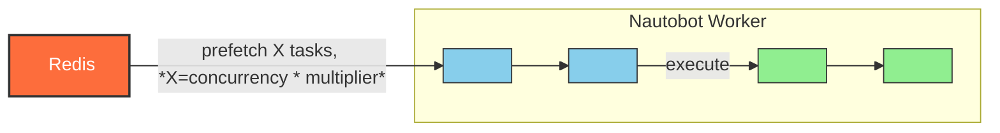
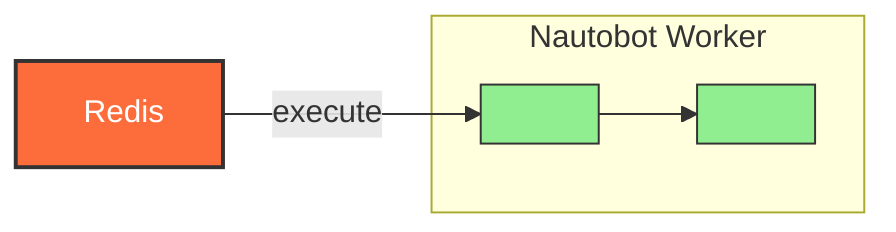

# Celery Task Queues

If you're planning to run multiple jobs, leverage job hooks or are finding that your jobs are taking too long to complete you may want to consider deploying multiple Celery workers with different queues for different types of tasks.

## How Celery Task Queues Work

The default Celery behavior is:

- [`--queue celery`](https://docs.celeryq.dev/en/stable/reference/cli.html#cmdoption-celery-worker-Q)
- [`--concurrency`](https://docs.celeryq.dev/en/stable/reference/cli.html#cmdoption-celery-worker-c) set to the number of CPUs detected on the system
- [`worker_prefetch_multiplier=4`](https://docs.celeryq.dev/en/stable/userguide/configuration.html#std-setting-worker_prefetch_multiplier)

This means that a worker running on a 4 core system will run 4 tasks concurrently and reserve a maximum of 16 more tasks from the queue named `celery`. If you have a mixture of long running and short running tasks with a single queue, you could find your long running tasks blocking the shorter tasks.

## Recommended Worker Deployment

Each environment is unique but it's generally a good idea to add at least one extra worker on a separate queue for running jobs. Nautobot uses the default `celery` queue to perform some background tasks and if the queue is full of long running jobs these system tasks could take a long time to execute. This could cause performance problems or unexpected behavior in Nautobot. A new worker can be deployed on a separate queue by using the [`nautobot-worker.service` systemd service](../installation/services.md#celery-worker) and modifying the `ExecStart` line to include a [`--queues` option](https://docs.celeryq.dev/en/stable/reference/cli.html#cmdoption-celery-worker-Q). Example:

```ini
ExecStart=/opt/nautobot/bin/nautobot-server celery worker --loglevel INFO --pidfile /var/tmp/nautobot-worker-jobqueue.pid --queues job_queue
```

This will create a worker that will only process tasks sent to the `job_queue` Celery queue. You can use this worker to run jobs while the rest of Nautobot's background tasks will be processed by the default Celery worker listening to the `celery` queue.

!!! info
    Workers can be configured to listen to multiple queues by supplying a comma separated list of queues to the `--queues` argument. See the [Celery workers guide](https://docs.celeryq.dev/en/stable/userguide/workers.html#queues) for more information.

!!! warning
    If a job is sent to a queue that no workers are listening to, that job will remain in pending status until it's purged or a worker starts listening to that queue and processes the job. Be sure that the queue name on the worker and jobs match.

+/- 2.3.0
    In Nautobot 2.3.0, `staff` accounts can access a new worker status page at `/worker-status/` to view the status of the Celery worker(s) and the configured queues. The link to this page appears in the "User" dropdown at the bottom of the navigation menu, under the link to the "Profile" page. Use this page with caution as it runs a live query against the Celery worker(s) and may impact performance of your web service.

## Concurrency Setting

If you have long running jobs that use little CPU resources you may want to increase your [`--concurrency`](https://docs.celeryq.dev/en/stable/reference/cli.html#cmdoption-celery-worker-c) setting on your worker to increase the number of jobs that run in parallel. For example, you may have a job that logs into a device over ssh and collects some information from the command line. This task could take a long time to run but consume minimal CPU so your system may be able to run many more of these tasks in parallel than the default concurrency setting allows. The `--concurrency` setting can be modified by adding the command line option in the `ExecStart` line in your systemd service:

```ini
ExecStart=/opt/nautobot/bin/nautobot-server celery worker --loglevel INFO --pidfile /var/tmp/nautobot-worker-jobqueue.pid --queues job_queue --concurrency 64
```

You may have to change this setting multiple times to find what works best in your environment.

!!! warning
    Modifying your concurrency setting may increase the CPU and will increase the memory load on your Celery worker by at least 175MB per concurrent thread. Only change this setting if you have monitoring systems in place to monitor the system resources on your worker.

## Queuing Optimizations

By default, a Celery worker will queue up to 4 times the number of tasks it can run concurrently. For example, with a `concurrency` set to 2, a worker will reserve up to 8 tasks from the queue at a time.

```mermaid
graph LR
    subgraph "Nautobot Worker"
        direction LR
        Prefetch1[ ] --> Prefetch2[ ] --> Prefetch3[ ] --> Prefetch4[ ] --> Prefetch5[ ] --> Prefetch6[ ] --> Prefetch7[ ] --> Prefetch8[ ]
        Prefetch8 -- "execute" --> Exec1[ ] --> Exec2[ ]
    end

    Redis["fa:fa-redis Redis"] -- "prefetch X tasks, *X=concurrency * multiplier*" --> Prefetch1

    %% --- Style Definitions ---
    style Redis fill:#FD6D3C,stroke:#333,stroke-width:2px,color:#fff

    classDef prefetch fill:#87CEEB,stroke:#333,stroke-width:1px,border-radius:3px,color:#333
    classDef execution fill:#90EE90,stroke:#333,stroke-width:1px,border-radius:3px,color:#333

    %% --- Class Assignments ---
    class Prefetch1,Prefetch2,Prefetch3,Prefetch4,Prefetch5,Prefetch6,Prefetch7,Prefetch8 prefetch
    class Exec1,Exec2 execution
```



Figure: *Celery queuing with concurrency set to 2, default prefetch multiplier of 4*

This behavior may be controlled by the [`CELERY_WORKER_PREFETCH_MULTIPLIER`](https://docs.celeryq.dev/en/stable/userguide/configuration.html#std-setting-worker_prefetch_multiplier) setting. If you have longer running jobs that are blocking short-lived jobs from running, you may want to consider reducing the prefetch multiplier to 1 so that a worker will only reserve as many tasks as it can run concurrently.

That said, even with the [`CELERY_WORKER_PREFETCH_MULTIPLIER`](https://docs.celeryq.dev/en/stable/userguide/configuration.html#std-setting-worker_prefetch_multiplier) set to 1, Nautobot workers will still prefetch an amount of tasks equal to the `concurrency` setting. So a worker with `concurrency` set to 2 and [`CELERY_WORKER_PREFETCH_MULTIPLIER`](https://docs.celeryq.dev/en/stable/userguide/configuration.html#std-setting-worker_prefetch_multiplier) set to 1 will still reserve up to 2 tasks from the queue at a time.



Figure: *Celery queuing with concurrency set to 2, prefetch multiplier set to 1*

!!! warning
    A value of zero is also valid and means "no limit". Effectively, the worker will keep consuming messages, not respecting that there may be other available worker nodes that may be able to process them sooner, or that the messages may not even fit in memory.

In order to completely disable prefetching on Nautobot workers, you will need to also set the [`CELERY_TASK_ACKS_LATE`](https://docs.celeryq.dev/en/stable/userguide/optimizing.html#reserve-one-task-at-a-time) setting to `True`. In short, this setting will ensure that tasks are only acknowledged after they have been completed. As a result, each worker will only pull tasks from the queue as it is ready to process them.



Figure: *Celery queuing with concurrency set to 2, prefetch multiplier set to 1, late acknowledgments enabled*

Enabling late acknowledgments may have implications on the way tasks are processed. Most importantly, if a worker is killed while processing a task, that task will be re-queued and executed by another available worker. This may lead to tasks being partially executed more than once, which may not be desirable for all types of tasks. This concern is best addressed by ensuring that tasks are idempotent, meaning that running the same task multiple times will not have unintended side effects - a best practice regardless of whether late acknowledgments are enabled or not.
