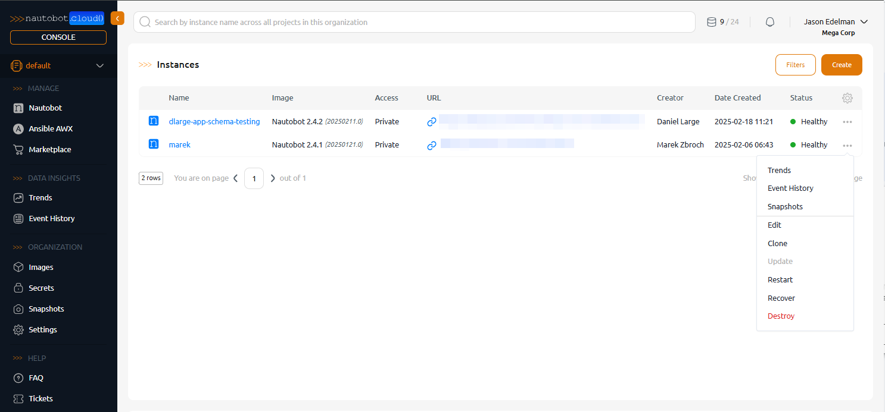

# Installation

Whether you are getting started for the first time, looking to build a local lab or ready to build a production environment, there are a variety of options to find the right fit for your needs with using Nautobot.

!!! tip "Checking out Nautobot for the first time? Not ready to install anything yet?"
    You can explore the [Nautobot Always-On Sandbox Environments](https://networktocode.com/nautobot/sandbox-environments/). There is sample data already prepopulated, no installation required, and several Nautobot Apps are pre-installed, with sample data.

## Deployment Options

=== "Bare metal / Virtual Machine"

    You can [install Nautobot](install_system.md) onto a [RHEL (Red Hat Enterprise Linux)](https://www.redhat.com/en/technologies/linux-platforms/enterprise-linux) or [Ubuntu](https://ubuntu.com/) virtual machine.

    Nautobot was designed to be a cross-platform application that can run on nearly any system that is able to run the required dependencies. *Only the operating system platforms listed below are officially supported at this time*.

    * Red Hat flavors of Linux including Fedora 8.2+ and Red Hat Enterprise Linux (RHEL) 8.2+ are supported.
    * Debian/Ubuntu flavors of Linux including Ubuntu 20.04+ and Debian 11+ are supported.

    Nautobot *should* work on any POSIX-compliant system including practically any flavor of Linux, BSD, or even macOS, but those are not *officially* supported at this time.

    ### Bare metal / Virtual Machine Pros

    * Familiar deployment option for many administrators
    * Performance is generally higher without the overhead of virtualization
    * Full control over hardware and software allows for greater customization and security practices

    ### Bare metal / Virtual Machine Cons

    * Maintenance and high availability is more difficult than Docker or Cloud options
    * Preparing server for production grade security and scaling requires additional effort

=== "Docker Compose"

    Nautobot can be deployed via Docker using [Nautobot Docker images](../guides/docker.md) that are available either from:

    * [Docker Hub](https://hub.docker.com/r/networktocode/nautobot)
    * [GitHub Container Registry](https://github.com/nautobot/nautobot/pkgs/container/nautobot)

    For local testing and lab work you can use the Nautobot [Docker Compose](https://github.com/nautobot/nautobot-docker-compose) project which leverages the container images above.

    For more information about the Docker tags, Docker configurations, or using container images for your own development environment, see [Nautobot in Docker](../guides/docker.md).

    ### Docker Compose Pros

    * Quick and simple setup for single-node lab environments and testing
    * Lightweight alternative for those who don't need full Kubernetes orchestration

    ### Docker Compose Cons

    * Docker compose on its own is missing advanced features like automated rollbacks, self-healing applications, and load balancing
    * Limited scaling if on single host

=== "Kubernetes Helm Charts"

    You can [install Nautobot via Helm Charts](https://docs.nautobot.com/projects/helm-charts/en/stable/) for Kubernetes documentation.

    If you are looking for an example of what that process looks like in a development environment using `minikube`, you can check out the three part blog series covering deploying Nautobot to Kubernetes:

    * [Part 1](https://networktocode.com/blog/deploying-nautobot-to-kubernetes-01/)
    * [Part 2](https://networktocode.com/blog/deploying-nautobot-to-kubernetes-02/)
    * [Part 3](https://networktocode.com/blog/deploying-nautobot-to-kubernetes-03/)

    ### Helm Charts Pros

    * Helm charts serves as a package manager for Kubernetes, streamlining the deployment of complex applications within Kubernetes clusters
    * Using Kubernetes features, you can manage large-scale deployments efficiently and ensure high-availability for production grade systems

    ### Helm Charts Cons

    * Requires knowledge of Kubernetes and has a steeper learning curve for setting up
    * Kubernetes clusters can use a lot of resources and monitoring effort

=== "Nautobot Cloud"

    [Nautobot Cloud](https://networktocode.com/nautobot/nautobot-cloud/) is a commercial Software as a Service (SaaS) offering from Network to Code. It is the _**easy**_ button for Nautobot. It offers self-service and turnkey deployment for Nautobot removing the need for infrastructure setup and maintenance including one-click upgrades, clones, backups and restores, and a marketplace to streamline Nautobot App installations.

    <!-- pyml disable-num-lines 5 no-inline-html -->
    

    { .on-glb }
    

    ### Nautobot Cloud Pros

    * One-click Nautobot deployments **and** upgrades
    * Enterprise grade dashboards to see trends of Nautobot data across all Nautobot instances
    * Click to install apps from Nautobot Cloud Marketplace
    * Cloud-based database snapshots
    * One-click deployments of Ansible AWX too

    ### Nautobot Cloud Cons

    * You’ll have to find something else to do with all that freed-up time now that you’re not maintaining on-prem applications and infrastructure.

## About Dependencies

This section describes the system dependencies required for Nautobot. They can be all installed on a single system, or distributed across your environment. That will be up to you. Our install instructions assume a single system install, and that is good for most use cases. More advanced configurations are also possible, but are not covered here.

### Mandatory dependencies

The following minimum versions are required for Nautobot to operate:

| Dependency | Role         | Minimum Version |
| ---------- | ------------ | --------------- |
| Python     | Application  | 3.10            |
| PostgreSQL | Database     | 12.0            |
| MySQL      | Database     | 8.0             |
| Redis      | Cache, Queue | 4.0             |
| Git        | Additional   | 2.0             |

Nautobot will not work without these dependencies.

#### Python

Nautobot is written in the [Python programming language](https://www.python.org/). The official Python package installer is called [Pip](https://pip.pypa.io/en/stable/), and you will see the `pip` command referenced often to install or update Python packages.

+++ 2.3.0 "Python 3.12 support added"
    Python 3.12 support was added.

--- 2.4.0 "Python 3.8 support removed"
    Python 3.8 support was removed.

<<<<<<< HEAD
+++ 3.0.0 "Python 3.13 support added"
    Python 3.13 support was added.

--- 3.0.0 "Python 3.9 support removed"
=======
--- 2.4.20 "Python 3.9 support removed"
>>>>>>> develop
    Python 3.9 support was removed.

#### Database

Nautobot uses a relational database to store its data. Both MySQL and PostgreSQL are officially supported.

--- 2.1.0 "PostgreSQL minimum version became 12.0"
    Support for versions of PostgreSQL older than 12.0 was removed.

!!! note "Only one database"
    Either PostgreSQL or MySQL must be selected, but not both.

=== "MySQL"

    [MySQL](https://mysql.com) is an open-source relational database management system that’s relatively easy to set up and manage, fast, reliable, and well-understood.

=== "PostgreSQL"

    [PostgreSQL](https://www.postgresql.org) is a powerful, feature-rich open source relational database server that can handle complex queries and massive databases.

#### Redis

[Redis](https://redis.io/) is an open source, in-memory data store which Nautobot employs for caching and queuing.

### Optional dependencies

???+ abstract "Optional dependency information"

    Nautobot will still operate without these optional dependencies, but would likely not be ready for use in a production environment without them. The installation and configuration of these dependencies are covered in the detailed guides which follow.

    For production deployment we recommend the following:

    * [uWSGI](https://uwsgi-docs.readthedocs.io/en/latest/) WSGI server
    * [NGINX](https://www.nginx.com/resources/wiki/) HTTP server
    * [External authentication](external-authentication.md) service for SSO such as SAML, OAuth2, or LDAP, or an authenticating proxy

    For additional features:

    * [NAPALM support](../../platform-functionality/napalm.md) for retrieving operational data from network devices
    * [Prometheus metrics](../guides/prometheus-metrics.md) for exporting application performance and telemetry data

## Upgrading

If you are upgrading from an existing installation, please consult the [upgrading guide](../upgrading/upgrading.md).
