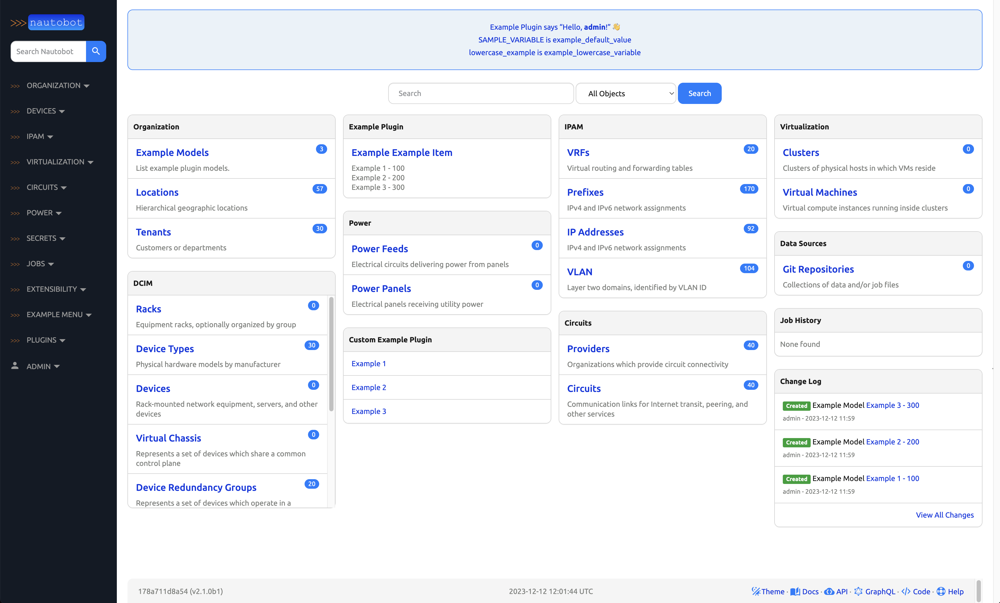

# Installing Nautobot

This section of the documentation discusses installing and configuring the Nautobot application itself.

These instructions will guide you through the following actions:

* Establish a Nautobot root directory for the application environment
* Create a `nautobot` system account
* Create a Python virtual environment (virtualenv)
* Install Nautobot and all required Python packages
* Run the database schema migrations
* Aggregate static resource files on disk
* Verify the installation using the development/test server

!!! important
    Your database server and Redis must have been successfully installed before continuing with deployment steps. If you haven't done that yet, please visit the guide on [Installing Nautobot Dependencies](install_system.md)

## Create the Nautobot System User

Create a system user account named `nautobot`. This user will own all of the Nautobot files, and the Nautobot web services will be configured to run under this account.

??? abstract "Choosing Nautobot Root"

    You need to select a directory path where everything related to Nautobot will be installed. We will use this value across the documentation and it will be referred to as `NAUTOBOT_ROOT`.

    We will be using this path as the home directory of the `nautobot` user.

    !!! tip
        We have selected `/opt/nautobot`, but you may use any directory you choose.

The following command also creates the `/opt/nautobot` directory and sets it as the home directory for the user.

```no-highlight title="Add system user"
sudo useradd --system --shell /bin/bash --create-home --home-dir /opt/nautobot nautobot
```

## Setup the Virtual Environment

??? info "Python Virtual Environment"

    A Python [virtual environment](https://docs.python.org/3/tutorial/venv.html) or *virtualenv* is like a container for a set of Python packages. A virtualenv allows you to build environments suited to specific projects without interfering with system packages or other projects.

When installed per the documentation, Nautobot uses a virtual environment in production.

In the following steps, we will have you create the virtualenv within the `NAUTOBOT_ROOT` you chose in the previous step. This is the same we had you set as the home directory as the `nautobot` user.

!!! note
    Instead of deliberately requiring you to activate/deactivate the virtualenv, we are emphasizing on relying on the `$PATH` to access programs installed within it. We find this to be much more intuitive and natural when working with Nautobot in this way.

### Create the Virtual Environment

As root, we're going to create the virtualenv in our `NAUTOBOT_ROOT` as the `nautobot` user to populate the `/opt/nautobot` directory with a self-contained Python environment including a `bin` directory for scripts and a `lib` directory for Python libraries.

```no-highlight title="Create the Virtual Environment"
sudo -u nautobot python3 -m venv /opt/nautobot
```

### Update the Nautobot `.bashrc`

So what about the `NAUTOBOT_ROOT`? We've referenced this environment variable several times. Here is where it finally gets set.

We need to set the `NAUTOBOT_ROOT` environment variable for the `nautobot` user and make sure that it always set without having to do it manually.

Run this command to update `~/.bashrc` for `nautobot` so that anytime you become `nautobot`, your `NAUTOBOT_ROOT` will be set automatically.

```no-highlight title="Add NAUTOBOT_ROOT to the nautobot user .bashrc file"
echo "export NAUTOBOT_ROOT=/opt/nautobot" | sudo tee -a ~nautobot/.bashrc
```

??? example "Example bashrc update output"

    ```no-highlight title="Example output of updating bashrc"
    export NAUTOBOT_ROOT=/opt/nautobot
    ```

## Sudo to `nautobot` user

It is critical to install Nautobot as the `nautobot` user so that we don't have to worry about fixing permissions later.

```no-highlight title="Log into the nautobot user"
sudo -iu nautobot
```

??? note "Validate the `NAUTOBOT_ROOT` variable"
    Observe also that you can now echo the value of the `NAUTOBOT_ROOT` environment variable that is automatically set because we added to `.bashrc`:

    ```no-highlight title="Verify Nautobot Root"
    echo $NAUTOBOT_ROOT
    ```

    ???+ example "Example NAUTOBOT_ROOT output"

        ```no-highlight
        /opt/nautobot
        ```

!!! warning
    Unless explicitly stated, all remaining steps requiring the use of `pip3` or `nautobot-server` in this document should be performed as the `nautobot` user!

## Prepare the Virtual Environment

??? abstract "Understanding the Virtual Environment"

    Because the `nautobot` user was created with `NAUTOBOT_ROOT` set as its home directory and we had you set the shell to `/bin/bash`, the binary path `$NAUTOBOT_ROOT/bin` is automatically added to the beginning of the `$PATH` environment variable:

    === "Ubuntu/Debian"

        ```no-highlight title="Print out the PATH variable"
        echo $PATH
        ```

        ??? example "Example path output"

            ```no-highlight title="Example output of a PATH variable"
            /opt/nautobot/bin:/usr/local/sbin:/usr/local/bin:/usr/sbin:/usr/bin:/sbin:/bin:/snap/bin
            ```

    === "Fedora/RHEL"

        ```no-highlight title="Print out the PATH variable"
        echo $PATH
        ```

        ??? example "Example path output"

            ```no-highlight title="Example output of a PATH variable"
            /opt/nautobot/.local/bin:/opt/nautobot/bin:/usr/local/sbin:/usr/local/bin:/usr/sbin:/usr/bin:/sbin:/bin:/var/lib/snapd/snap/bin
            ```

    Therefore, any commands executed by the `nautobot` user will always check `$NAUTOBOT_ROOT/bin` first.

    Since `NAUTOBOT_ROOT` also contains the Python virtualenv for Nautobot, all of the commands you will execute as the `nautobot` user, will automatically prefer the virtualenv's commands because they come first in the `$PATH`.

    As the `nautobot` user, you may use `which pip3` to confirm that you are using the correct version of `pip3`. The path should match that of `$NAUTOBOT_ROOT/bin`. For example:

    ```no-highlight title="Print out location of the pip3 executable"
    which pip3
    ```

    ??? example "Example `which pip3` output"

        ```no-highlight title="Example output"
        /opt/nautobot/bin/pip3
        ```

    This makes sure that the version of Python you're using, as well any dependencies that you install, remain isolated in this environment.

Before we install anything into the virtualenv, we want to make sure that Pip is running the latest version.

[Pip](https://pip.pypa.io/) is Python's package installer and is referred interchangeably as `pip` or `pip3`. For the purpose of this document, we'll deliberately be referring to it as `pip3`. Many common issues can be solved by running the latest version of Pip. Before continuing with installing Nautobot, upgrade Pip to its latest release.

We also want to deliberately install the `wheel` library which will tell Pip to always try to install wheel packages if they are available. A [wheel is a pre-compiled Python package](https://realpython.com/python-wheels/), which is quicker and safer to install because it does not require development libraries or `gcc` to be installed on your system just so that some more advanced Python libraries can be compiled.

```no-highlight title="Update Python Pip and Wheel"
pip3 install --upgrade pip wheel
```

??? example "Example pip update output"

    ```no-highlight
    Requirement already satisfied: pip in ./lib/python3.12/site-packages (24.0)
    Collecting pip
      Downloading pip-24.2-py3-none-any.whl.metadata (3.6 kB)
    Collecting wheel
      Downloading wheel-0.43.0-py3-none-any.whl.metadata (2.2 kB)
    Downloading pip-24.2-py3-none-any.whl (1.8 MB)
       ━━━━━━━━━━━━━━━━━━━━━━━━━━━━━━━━━━━━━━━━ 1.8/1.8 MB 36.6 MB/s eta 0:00:00
    Downloading wheel-0.43.0-py3-none-any.whl (65 kB)
       ━━━━━━━━━━━━━━━━━━━━━━━━━━━━━━━━━━━━━━━━ 65.8/65.8 kB 7.5 MB/s eta 0:00:00
    Installing collected packages: wheel, pip
      Attempting uninstall: pip
        Found existing installation: pip 24.0
        Uninstalling pip-24.0:
          Successfully uninstalled pip-24.0
    Successfully installed pip-24.2 wheel-0.43.0
    ```

By default, Pip will now install Python packages as wheels. In most cases this is desirable, however in some cases the wheel versions of packages may have been compiled with options differing from what is needed for a specific scenario. One such case presents itself here - the wheel for `pyuwsgi`, a key web server component of Nautobot, is built without SSL (HTTPS) support. This may be fine for a non-production deployment of Nautobot, such as in your lab, but for production deployments, not supporting HTTPS will not do at all. Fortunately, you can tell Pip when you don't want to use wheels for a specific package by passing the `--no-binary=<package>` CLI parameter. We'll use that below.

Great! We have `NAUTOBOT_ROOT` ready for use by the `nautobot` user, so let's proceed to verifying the installation.

## Install Nautobot

=== "PostgreSQL"

    Use Pip to install Nautobot:

    ```no-highlight title="Pip install Nautobot"
    pip3 install --no-binary=pyuwsgi nautobot
    ```

=== "MySQL"

    Use Pip to install Nautobot with the MySQL client:

    ```no-highlight title="Pip install Nautobot"
    pip3 install --no-binary=pyuwsgi "nautobot[mysql]"
    ```

## Verify your Nautobot Installation

You should now have a fancy `nautobot-server` command in your environment. This will be your gateway to all things Nautobot! Run it to confirm the installed version of `nautobot`:

```no-highlight title="Verify Nautobot install"
nautobot-server --version
```

## Configuration

Before you can use Nautobot, you'll need to configure it by telling it where your database and Redis servers can be found, among other things. This is done with the `nautobot_config.py` configuration file.

### Initialize your configuration

Initialize a new configuration by running `nautobot-server init`. You may specify an alternate location and detailed instructions for this are covered in the documentation on [Nautobot Configuration](../configuration/index.md).

However, because we've set the `NAUTOBOT_ROOT`, this command will automatically create a new `nautobot_config.py` at the default location based on this at `$NAUTOBOT_ROOT/nautobot_config.py`:

```no-highlight title="Initialize Nautobot server"
nautobot-server init
```

??? example "Example `nautobot-server init` output"

    ```no-highlight title="Example `nautobot-server init`"
    Nautobot would like to send anonymized installation metrics to the project's maintainers.
    These metrics include the installed Nautobot version, the Python version in use, an anonymous
    "deployment ID", and a list of one-way-hashed names of enabled Nautobot Apps and their versions.
    Allow Nautobot to send these metrics? [y/n]:
    ```

    ```no-highlight title="Example with Metrics sent"
    Installation metrics will be sent when running 'nautobot-server post_upgrade'. Thank you!
    Configuration file created at /opt/nautobot/nautobot_config.py
    ```

The `nautobot-server init` command will prompt you to set the initial value for the [`INSTALLATION_METRICS_ENABLED`](../configuration/settings.md#installation_metrics_enabled) setting. See the [`send_installation_metrics`](../tools/nautobot-server.md#send_installation_metrics) command for more information about the feature that this setting toggles.

### Required Settings

Your `nautobot_config.py` provides sane defaults for most configuration settings, but in the longer term, you will inevitably need to update the settings for your environment. For a more complete guide to supported configuration settings in Nautobot, you can refer to [Settings](../configuration/settings.md) later.

!!! tip "Environment variables"
    If you do not wish to modify the config file directly, many of these configuration settings can also be specified by environment variables, such as `NAUTOBOT_ALLOWED_HOSTS`, `NAUTOBOT_DB_USER`, etc.

Edit `$NAUTOBOT_ROOT/nautobot_config.py`. At a minimum, you'll need to update the following settings:

* [`ALLOWED_HOSTS`](../configuration/settings.md#allowed_hosts): You must set this value. This can be set to `["*"]` for a quick start, but this value is not suitable for production deployment.
* [`DATABASES`](../configuration/settings.md#databases): Database connection parameters, see below.

=== "PostgreSQL"

    - At a minimum, you'll need to update the `"USER"` and `"PASSWORD"` fields under `DATABASES`. Depending on your security posture, you may wish to set these via environment variables (`NAUTOBOT_DB_USER` and `NAUTOBOT_DB_PASSWORD`) rather than writing them directly into your `nautobot_config.py`.

=== "MySQL"

    - At a minimum, you'll need to update the `"USER"` and `"PASSWORD"` fields under `DATABASES`. Depending on your security posture, you may wish to set these via environment variables (`NAUTOBOT_DB_USER` and `NAUTOBOT_DB_PASSWORD`) rather than writing them directly into your `nautobot_config.py`.
    - Additionally, since Nautobot's configuration defaults to assuming PostgreSQL, you must change the `"ENGINE"` setting from `django.db.backends.postgresql` to `django.db.backends.mysql`.
    - If you want to enable support for Unicode text, including emojis, please make sure to include `"OPTIONS": {"charset": "utf8mb4"}`. Refer to the [configuration guide on MySQL Unicode settings](../configuration/settings.md#databases) for more information.

!!! warning
    You absolutely must update your required settings in your `nautobot_config.py` or Nautobot will not work.

Save your changes to your `nautobot_config.py` and then proceed to the next step.

### Optional Settings

All Python packages required by Nautobot were installed automatically when running `pip3 install nautobot` above.

Nautobot also supports the ability to install optional Python packages. If desired, these packages should be listed in `local_requirements.txt` within the `NAUTOBOT_ROOT` directory, such as `/opt/nautobot/local_requirements.txt`.

If you decide to use any [Nautobot Apps](../../../apps/index.md), they should be listed in the file.

??? abstract "Examples of `local_requirements.txt`"

    We will cover two examples of common optional settings below.

    <a name="napalm"><h4>NAPALM</h4></a>

    Nautobot provides built-in support for the [NAPALM automation](https://github.com/napalm-automation/napalm/) library, which allows Nautobot to fetch live data from devices and return it to a requester via its REST API. The [`NAPALM_USERNAME`](../configuration/settings.md#napalm_username) and [`NAPALM_PASSWORD`](../configuration/settings.md#napalm_password) configuration parameters define the credentials to be used when connecting to a device.

    To use NAPALM, add `nautobot[napalm]` to your `local_requirements.txt` so that it can be installed and kept up to date:

    ```no-highlight title="Add napalm to the local_requirements.txt file"
    echo "nautobot[napalm]" >> $NAUTOBOT_ROOT/local_requirements.txt
    ```

    <a name="remote-file-storage"><h4>Remote File Storage</h4></a>

    By default, Nautobot will use the local filesystem to store uploaded files. To use a remote filesystem, install the [`django-storages`](https://django-storages.readthedocs.io/en/stable/) library and configure your [desired storage backend](../configuration/settings.md#storage_backend) in `nautobot_config.py`.

    To use remote file storage, add `nautobot[remote_storage]` to your `local_requirements.txt` so that it can be installed and kept up to date:

    ```no-highlight title="Add remote storage to local_requirements.txt"
    echo "nautobot[remote_storage]" >> $NAUTOBOT_ROOT/local_requirements.txt
    ```

    For an example of using django-storages with AWS S3 buckets, visit the [django-storages with S3](../guides/s3-django-storage.md) user-guide.

## Prepare the Database

Before Nautobot can run, the database migrations must be performed to prepare the database for use. This will populate the database tables and relationships:

```no-highlight title="Push migrations onto the Nautobot database"
nautobot-server migrate
```

## Create a Superuser

Nautobot does not come with any predefined user accounts. You'll need to create a administrative superuser account to be able to log into Nautobot for the first time. Specifying an email address for the user is not required, but be sure to use a very strong password.

```no-highlight title="Create Nautobot local super user account"
nautobot-server createsuperuser
```

??? example "Example with admin user created"

    ```no title="Example output with admin user created"
    Username: admin
    Email address:
    Password:
    Password (again):
    Superuser created successfully.
    ```

## Create Static Directories

Nautobot relies upon many static files including:

* `git` - For storing [Git repositories](../../platform-functionality/gitrepository.md)
* `jobs` - For storing [custom Jobs](../../platform-functionality/jobs/index.md)
* `media` - For storing [uploaded images and attachments](../configuration/settings.md#media_root) (such as device type images)
* `static` - The home for [CSS, JavaScript, and images](../configuration/settings.md#static_root) used to serve the web interface

Each of these have their own corresponding setting that defined in `nautobot_config.py`, but by default they will all be placed in `NAUTOBOT_ROOT` unless you tell Nautobot otherwise by customizing their unique variable.

The `collectstatic` command will create these directories if they do not exist, and in the case of the `static` files directory, it will also copy the appropriate files:

```no-highlight title="Collect static files"
nautobot-server collectstatic
```

??? example "Collect static example output"

    ```no title="Collect static output"

    1156 static files copied to '/opt/nautobot/static'.
    ```

## Install Local Requirements

!!! note
    If you did not create a `local_requirements.txt` above, please skip this step.

This step is entirely optional. As indicated above, we mentioned that any extra local requirements should go into `$NAUTOBOT_ROOT/local_requirements.txt`.

```no-highlight title="Install local requirements"
pip3 install -r $NAUTOBOT_ROOT/local_requirements.txt
```

## Check your Configuration

Nautobot leverages Django's built-in [system check framework](https://docs.djangoproject.com/en/stable/topics/checks/#writing-your-own-checks) to validate the configuration to detect common problems and to provide hints for how to fix them.

Checks are ran automatically when running a development server using `nautobot-server runserver`, but not when running in production using WSGI.

!!! hint
    Get into the habit of running checks before deployments!

```no-highlight title="Run a nautobot-server check"
nautobot-server check
```

??? example "`nautobot-server check` output"

    ```no title="Example nautobot-server check output"
    System check identified no issues (0 silenced).
    ```

## Test the Application

At this point, we should be able to run Nautobot's development server for testing. We can check by starting a
development instance:

```no-highlight title="Optional: Test the Nautobot application"
nautobot-server runserver 0.0.0.0:8080 --insecure
```

Next, connect to the name or IP of the server (as defined in `ALLOWED_HOSTS`) on port 8080; for example, <http://127.0.0.1:8080/>. You should be greeted with the Nautobot home page.

!!! danger
    **DO NOT USE THIS SERVER IN A PRODUCTION SETTING.** The development server is for development and testing purposes only. It is neither performant nor secure enough for production use.

!!! warning
    If the test service does not run, or you cannot reach the Nautobot home page, something has gone wrong. Do not proceed with the rest of this guide until the installation has been corrected. Some platforms (such as CentOS) have a firewall enabled by default. If you are unable to connect to the server url on port 8080, verify the firewall policy to allow the appropriate connections, or select an already permitted port.

!!! important
    Certain Nautobot features (Git repository synchronization, webhooks, jobs, etc.) depend on the presence of Nautobot's background Celery worker process, which is not automatically started by the `runserver` command. To start it for testing purposes, you can run `nautobot-server celery worker` separately. For production use, Nautobot and the worker processes should be managed by `systemd` rather than started manually, as described in the next section of this documentation.

??? "Screenshot Examples"

    Unauthenticated users will be presented with a login page:

    

    Try logging in using the superuser account we just created. Once authenticated, you'll be able to access all areas of the UI:

    

Type `Ctrl-C` to stop the development server. Now you're ready to proceed to [starting Nautobot as a system service](services.md).
