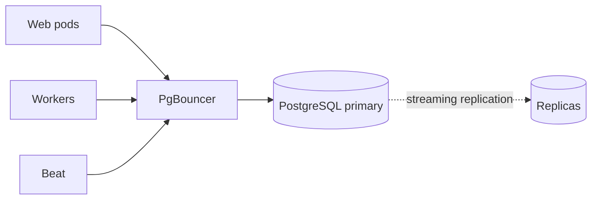

# Backing Stores

Nautobot's two backing stores — Redis and PostgreSQL — carry production-critical workloads but are not surfaced through Nautobot's own `/metrics`. This page covers the Nautobot-specific behaviors that drive their load and the metrics, queries, and probes you should add for each.

!!! note
    - For the basic liveness probes (`pg_isready`, `redis-cli ping`), see [Health Checks](./health-checks.md).
    - For Redis configuration options (broker URL, cache backends), see [Configuration — Redis](../configuration/redis.md).

## Redis

### Key Redis Metrics

Deploy [`redis_exporter`](https://github.com/oliver006/redis_exporter) alongside each Redis instance. Metrics worth alerting on:

| Metric | What it tells you | Suggested threshold |
|---|---|---|
| `redis_memory_used_bytes / redis_memory_max_bytes` | Memory headroom | `> 0.8` for 10 minutes — see [Alerting](./alerting.md) |
| `redis_evicted_keys_total` | Cache eviction rate | rate > 0 on broker DB indicates `noeviction` was wrongly disabled |
| `redis_blocked_clients` | Clients waiting on `BRPOPLPUSH`, etc. | `> 50` for 5 minutes — backlog or broker stuck |
| `redis_rejected_connections_total` | Rejected because `maxclients` hit | any non-zero rate is Tier-1 |
| `redis_keyspace_hits / (hits + misses)` | Cache hit ratio | `< 0.7` on cache DB suggests over-eviction or under-warmed cache |
| `redis_commands_duration_seconds_sum` | Command latency | p99 > 50 ms — investigate slowlog |
| `redis_master_link_status` (replicas) | Replication health | `!= 1` for 1 minute in HA |
| `redis_master_last_io_seconds_ago` (replicas) | Replication lag | `> 30` for 5 minutes |

!!! info "Why Redis memory matters for Nautobot"
    With the default `noeviction` policy, hitting `maxmemory` causes Celery producers to hang on `BRPOPLPUSH` rather than raising an exception. The symptom is "the UI works but Jobs don't run" — there is no log line. Alert on memory headroom *before* it bites.

### Redis Slowlog

**Potential Issue:** Individual Redis commands are running slowly, dragging request and Job latency with them. The most common offender in a Nautobot deployment is an App that uses the Django cache for an unbounded queryset.

**Artifact or data:** The `SLOWLOG` ring buffer and the `LATENCY` history are maintained by Redis itself but are not surfaced by `redis_exporter`'s counters — you have to query Redis directly.

**Query:**

```bash
redis-cli SLOWLOG GET 20            # last 20 slow commands with timing
redis-cli LATENCY DOCTOR            # human-readable latency report
redis-cli CONFIG GET slowlog-log-slower-than    # default 10000 µs (10 ms)
```

**Suggested resolution(s):** Identify the offending App from the slow command text and replace the unbounded cache key with a bounded one (paginate, scope to a tenant, or cache per-object instead of per-collection). To attribute the Redis latency back to the *Nautobot request* that caused it, pair this with [Request Profiling](./request-profiling.md) — `django-silk` records cache calls per request alongside SQL queries.

### HA Considerations

**Potential Issue:** In a Redis Sentinel topology, a replica that has just been demoted (or one that never became master in the first place) still answers `redis-cli ping` with `PONG`, so a basic liveness check passes against a node Nautobot cannot read or write data from.

**Artifact or data:** Redis's `INFO replication` block carries the node's current role.

**Query:**

```bash
redis-cli INFO replication | grep role:master
```

**Suggested resolution(s):** Add the query above as a secondary liveness probe alongside `redis-cli ping`, so a demoted node gets caught at the probe layer rather than after the first failed read or write. See [Health Checks](./health-checks.md) for wiring details.

## PostgreSQL

### Connection Topology



For per-component liveness probes against PgBouncer, the primary, and the replicas, see [Health Checks — PostgreSQL](./health-checks.md#postgresql).

Three observations drive Nautobot-specific PostgreSQL load:

1. **Every Nautobot process holds its own connection pool.** Without PgBouncer, `web pods × workers × concurrency` quickly exceeds Postgres `max_connections`. Use PgBouncer in `transaction` mode.
2. **Workers and Beat connect too.** A common mistake is to size PgBouncer for web traffic only, then starve Celery during sync windows.
3. **Long-running Jobs hold connections open.** A Job that loops over devices for an hour holds a transaction (and a connection) for an hour. Combined with PgBouncer in `transaction` mode, this can pin a backend slot.

### High-Churn Tables

A handful of tables bloat fastest in a typical Nautobot deployment:

- `extras_objectchange` — every model write emits a row. Retention controlled by [`CHANGELOG_RETENTION`](../configuration/settings.md#changelog_retention) (days; default 90, `0` disables retention enforcement).
- `extras_jobresult` — one row per Job invocation. No standalone retention setting; trimmed by the bundled `Logs Cleanup` Job.
- `extras_joblogentry` — every Job emits dozens to thousands of rows. Deleted automatically when the parent `JobResult` is deleted via the cleanup Job above.
- `django_session` if not cache-backed.

**Potential Issue:** Without working retention discipline, these tables grow unboundedly. Autovacuum falls behind the churn, the data volume fills up, and query performance against the bloated tables degrades.

**Artifact or data:** Two complementary signals tell you when growth on these tables is getting away from you — a per-relation bloat ratio (autovacuum lag) and a disk-fill trajectory (cleanup-vs-retention mismatch).

**Query:**

```promql
# Bloat ratio per relation — alert on a sustained value above 0.2
# on extras_joblogentry or extras_objectchange.
pg_stat_user_tables_n_dead_tup / pg_stat_user_tables_n_live_tup
```

For the disk-fill trajectory, see [Disk-Trajectory Monitoring](#disk-trajectory-monitoring) below; for the broader metric catalogue see [Key PostgreSQL Metrics](#key-postgresql-metrics) below.

**Suggested resolution(s):** Set `CHANGELOG_RETENTION` to a value that matches your audit requirements (anything from 30 days to 365 days is typical), and schedule the bundled `Logs Cleanup` Job (under the `System Jobs` group) to run periodically. Its `cleanup_types` argument selects which records to trim (`extras.ObjectChange`, `extras.JobResult`, or both) and `max_age` overrides the default cutoff in days (which falls back to `CHANGELOG_RETENTION`). The defaults err on the side of "keep everything," which is fine until disk fills.

### Key PostgreSQL Metrics

Deploy [`postgres_exporter`](https://github.com/prometheus-community/postgres_exporter) (and [`pgbouncer_exporter`](https://github.com/prometheus-community/pgbouncer_exporter) if you have PgBouncer):

| Metric | What it tells you | Suggested threshold |
|---|---|---|
| `pg_stat_database_numbackends / pg_settings_max_connections` | Connection saturation | `> 0.8` for 5 minutes |
| `rate(pg_stat_database_xact_commit + pg_stat_database_xact_rollback)` | Transaction throughput | sudden drop = workers blocked |
| `rate(pg_stat_database_deadlocks)` | Concurrency contention | any non-zero rate is Tier-2 |
| `pg_stat_replication_replay_lag` | HA replica lag | `> 30 s` for 5 minutes |
| `pg_stat_user_tables_n_dead_tup / n_live_tup` (per-table) | Bloat ratio | `> 0.2` on the high-churn tables above |
| `pg_stat_database_blks_hit / (blks_hit + blks_read)` | Buffer cache hit ratio | `< 0.99` on a warm DB suggests undersized `shared_buffers` |
| `pgbouncer_pools_server_active_connections / max_server_connections` | Pool saturation | `> 0.9` for 5 minutes |

### `pg_stat_statements`

**Potential Issue:** A page or Job is reported as slow and the root cause is one or more queries dominating database time. The biggest offenders are usually filter combinations on large tables without a supporting index, or N+1 query loops in Job code.

**Artifact or data:** The `pg_stat_statements` extension retains aggregated stats per normalized query — total time, mean time, call count, rows. As a SQL artifact, it can be queried from `psql` directly or, in environments where operators don't have direct database access, through `nautobot-server dbshell` (which opens a session using Nautobot's own credentials). It can also be queried from [Grafana](./visualization.md#3-backing-stores).

Enable on the primary:

```sql
-- in postgresql.conf
shared_preload_libraries = 'pg_stat_statements'
pg_stat_statements.track = top

-- then per-database
CREATE EXTENSION IF NOT EXISTS pg_stat_statements;
```

**Query:**

```sql
SELECT
    LEFT(query, 80) AS query,
    calls,
    ROUND(total_exec_time::numeric, 0) AS total_ms,
    ROUND(mean_exec_time::numeric, 1) AS mean_ms
FROM pg_stat_statements
WHERE query NOT LIKE '%pg_stat%'
ORDER BY total_exec_time DESC
LIMIT 20;
```

**Suggested resolution(s):** Add the missing index for filter combinations on large tables; refactor N+1 loops in Job code into a single bulk query using `prefetch_related` or `select_related`. `pg_stat_statements` aggregates across the whole database — when you have not yet identified *which* view is slow, start with the [Visualization — View Latency](./visualization.md#6-view-latency) dashboard to find the slowest view, then attribute its SQL through [Request Profiling](./request-profiling.md) — `django-silk` records each request's SQL queries with timing.

### Long-Running Transactions

**Potential Issue:** Nautobot Jobs that wrap a multi-thousand-row update in `with transaction.atomic():` keep a transaction open for the duration of the loop. That's fine in isolation or for smaller updates, but the transaction holds row locks, prevents the database from cleaning up "dead" rows, and consumes a PgBouncer slot in `transaction` mode.

**Artifact or data:** `pg_stat_activity` exposes the live state of every backend, including `xact_start` (when the current transaction began) and the current query text.

**Query:**

```sql
SELECT
    pid,
    NOW() - xact_start AS xact_duration,
    state,
    LEFT(query, 100) AS query
FROM pg_stat_activity
WHERE state = 'active'
  AND xact_start < NOW() - INTERVAL '10 minutes'
ORDER BY xact_start;
```

**Suggested resolution(s):** Break the Job into smaller transactional batches — a per-chunk `transaction.atomic()` rather than one wrapping the entire loop. For continuous monitoring rather than one-off `psql` checks, wrap the query above in a Grafana panel with a `FOR 5m` alert on any non-zero count.

### HA-Specific Signals

**Potential Issue:** In a Patroni / repmgr / RDS multi-AZ topology, a failed promotion can leave Nautobot pointed at a node that is still in recovery (read-only). A basic connection probe (`pg_isready`) only confirms TCP reachability — it does not check the recovery state — so the first sign of the problem becomes a flood of 5xx after the first write.

**Artifact or data:** PostgreSQL's `pg_is_in_recovery()` function returns `false` on the primary and `true` on any node still in recovery.

**Query:**

```bash
psql -c "SELECT NOT pg_is_in_recovery();"   # returns 't' only on the primary
```

**Suggested resolution(s):** Add the query above as a secondary liveness probe alongside `pg_isready`, so a failed promotion gets caught at the probe layer rather than as a 5xx flood after the first write. See [Health Checks — PostgreSQL](./health-checks.md#postgresql) for wiring details.

### Disk-Trajectory Monitoring

**Potential Issue:** Disk-fill is the slowest-developing PostgreSQL outage and the most catastrophic. By the time the data volume crosses 95%, the on-call engineer is making decisions under time pressure.

**Artifact or data:** `node_exporter` exposes `node_filesystem_avail_bytes` on every host. Prometheus's `predict_linear` extrapolates the trend forward.

**Query:**

```promql
# 30-day forecast — fires when the linear projection of the last 7 days
# of available bytes goes below zero within the next 30 days.
predict_linear(node_filesystem_avail_bytes{mountpoint=~".*postgres.*"}[7d], 30 * 24 * 3600) < 0
```

**Suggested resolution(s):** The growth is almost always traceable to `extras_joblogentry` or `extras_objectchange` outpacing your retention settings — apply tighter retention via the [High-Churn Tables](#high-churn-tables) guidance above. The fix is rarely "add more disk."

!!! tip
    Pair the disk-trajectory alert with periodic table-size queries against `pg_total_relation_size()` to attribute the growth to a specific table.
