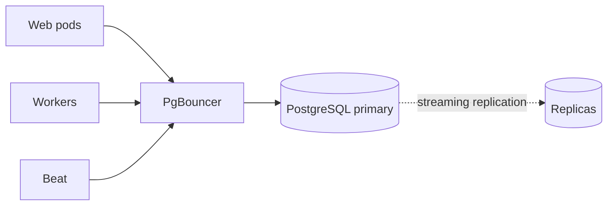

# Backing Stores

Nautobot's two backing stores — Redis and PostgreSQL — carry production-critical workloads but are not surfaced through Nautobot's own `/metrics`. This page covers the Nautobot-specific behaviors that drive their load and the metrics, queries, and probes you should add for each.

For the basic liveness probes (`pg_isready`, `redis-cli ping`), see [Health Checks](./health-checks.md). For Redis configuration options (broker URL, cache backends), see [Configuration — Redis](../configuration/redis.md).

## Redis

### Key Redis Metrics

Deploy [`redis_exporter`](https://github.com/oliver006/redis_exporter) alongside each Redis instance. Metrics worth alerting on:

| Metric | What it tells you | Suggested threshold |
|---|---|---|
| `redis_memory_used_bytes / redis_memory_max_bytes` | Memory headroom | `> 0.8` for 10 minutes — see [Alerting](./alerting.md) |
| `redis_evicted_keys_total` | Cache eviction rate | rate > 0 on broker DB indicates `noeviction` was wrongly disabled |
| `redis_blocked_clients` | Clients waiting on `BRPOPLPUSH`, etc. | `> 50` for 5 minutes — backlog or broker stuck |
| `redis_rejected_connections_total` | Rejected because `maxclients` hit | any non-zero rate is Tier-1 |
| `redis_keyspace_hits / (hits + misses)` | Cache hit ratio | `< 0.7` on cache DB suggests over-eviction or under-warmed cache |
| `redis_commands_duration_seconds_sum` | Command latency | p99 > 50 ms — investigate slowlog |
| `redis_master_link_status` (replicas) | Replication health | `!= 1` for 1 minute in HA |
| `redis_master_last_io_seconds_ago` (replicas) | Replication lag | `> 30` for 5 minutes |

!!! info "Why Redis memory matters for Nautobot"
    With the default `noeviction` policy, hitting `maxmemory` causes Celery producers to hang on `BRPOPLPUSH` rather than raising an exception. The symptom is "the UI works but Jobs don't run" — there is no log line. Alert on memory headroom *before* it bites.

### Redis Slowlog

`redis_exporter` counts slow commands but does not surface their content. To investigate which commands are slow, query Redis directly:

```bash
redis-cli SLOWLOG GET 20            # last 20 slow commands with timing
redis-cli LATENCY DOCTOR            # human-readable latency report
redis-cli CONFIG GET slowlog-log-slower-than    # default 10000 µs (10 ms)
```

The most common offender is an App that uses Django cache for an unbounded queryset. To attribute Redis latency back to the *Nautobot request* that caused it, pair this with [Request Profiling](./request-profiling.md) — `django-silk` records cache calls per request alongside SQL queries.

### HA Considerations

`redis-cli ping` returns `PONG` whether the node is master or replica. In a Sentinel topology, add `redis-cli INFO replication | grep role:master` as a secondary probe so a replica that just got demoted does not pass the liveness check — see [Health Checks](./health-checks.md).

## PostgreSQL

### Connection Topology



For per-component liveness probes against PgBouncer, the primary, and the replicas, see [Health Checks — PostgreSQL](./health-checks.md#postgresql).

Three observations drive Nautobot-specific PostgreSQL load:

1. **Every Nautobot process holds its own connection pool.** Without PgBouncer, `web pods × workers × concurrency` quickly exceeds Postgres `max_connections`. Use PgBouncer in `transaction` mode.
2. **Workers and Beat connect too.** A common mistake is to size PgBouncer for web traffic only, then starve Celery during sync windows.
3. **Long-running Jobs hold connections open.** A Job that loops over devices for an hour holds a transaction (and a connection) for an hour. Combined with PgBouncer in `transaction` mode, this can pin a backend slot.

### High-Churn Tables

These tables bloat fastest in a typical Nautobot deployment:

- `extras_objectchange` — every model write emits a row. Retention controlled by [`CHANGELOG_RETENTION`](../configuration/settings.md#changelog_retention) (days; default 90, `0` disables retention enforcement).
- `extras_jobresult` — one row per Job invocation. No standalone retention setting; trimmed by the bundled `Cleanup System Records` Job.
- `extras_joblogentry` — every Job emits dozens to thousands of rows. Deleted automatically when the parent `JobResult` is deleted via the cleanup Job above.
- `django_session` if not cache-backed.

Set `CHANGELOG_RETENTION` to a value that matches your audit requirements (anything from 30 days to 365 days is typical), and schedule the bundled `Cleanup System Records` Job to run periodically with explicit `cutoff` arguments for `extras.ObjectChange` and `extras.JobResult`. The defaults err on the side of "keep everything," which is fine until disk fills.

### Key PostgreSQL Metrics

Deploy [`postgres_exporter`](https://github.com/prometheus-community/postgres_exporter) (and [`pgbouncer_exporter`](https://github.com/prometheus-community/pgbouncer_exporter) if you have PgBouncer):

| Metric | What it tells you | Suggested threshold |
|---|---|---|
| `pg_stat_database_numbackends / pg_settings_max_connections` | Connection saturation | `> 0.8` for 5 minutes |
| `rate(pg_stat_database_xact_commit + pg_stat_database_xact_rollback)` | Transaction throughput | sudden drop = workers blocked |
| `rate(pg_stat_database_deadlocks)` | Concurrency contention | any non-zero rate is Tier-2 |
| `pg_stat_replication_replay_lag` | HA replica lag | `> 30 s` for 5 minutes |
| `pg_stat_user_tables_n_dead_tup / n_live_tup` (per-table) | Bloat ratio | `> 0.2` on the high-churn tables above |
| `pg_stat_database_blks_hit / (blks_hit + blks_read)` | Buffer cache hit ratio | `< 0.99` on a warm DB suggests undersized `shared_buffers` |
| `pgbouncer_pools_server_active_connections / max_server_connections` | Pool saturation | `> 0.9` for 5 minutes |

### `pg_stat_statements`

The `pg_stat_statements` extension is the standard tool for investigating slow queries on a PostgreSQL instance. Enable on the primary:

```sql
-- in postgresql.conf
shared_preload_libraries = 'pg_stat_statements'
pg_stat_statements.track = top

-- then per-database
CREATE EXTENSION IF NOT EXISTS pg_stat_statements;
```

`pg_stat_statements` retains aggregated stats per normalized query — total time, mean time, call count, rows. When an operator says "the device list page is slow," this is the first place to look:

```sql
SELECT
    LEFT(query, 80) AS query,
    calls,
    ROUND(total_exec_time::numeric, 0) AS total_ms,
    ROUND(mean_exec_time::numeric, 1) AS mean_ms
FROM pg_stat_statements
WHERE query NOT LIKE '%pg_stat%'
ORDER BY total_exec_time DESC
LIMIT 20;
```

The biggest offenders are usually filter combinations on large tables without a supporting index, or N+1 query loops in Job code.

`pg_stat_statements` aggregates across the whole database. To trace a slow query back to the specific *Nautobot view or Job* that issued it, also enable [Request Profiling](./request-profiling.md) — `django-silk` records each request's SQL queries with timing.

### Long-Running Transactions

Nautobot Jobs that wrap a multi-thousand-row update in `with transaction.atomic():` keep a transaction open for the duration of the loop. That's fine in isolation, but it (a) holds row locks, (b) prevents `VACUUM` from reclaiming dead tuples, and (c) consumes a PgBouncer slot in `transaction` mode.

Detect:

```sql
SELECT
    pid,
    NOW() - xact_start AS xact_duration,
    state,
    LEFT(query, 100) AS query
FROM pg_stat_activity
WHERE state = 'active'
  AND xact_start < NOW() - INTERVAL '10 minutes'
ORDER BY xact_start;
```

The fix is almost always to break the Job into smaller transactional batches — a per-chunk `transaction.atomic()` rather than one wrapping the entire loop.

### HA-Specific Signals

`pg_isready` confirms the server is accepting TCP connections; it does **not** check whether the node is in recovery (read-only). In a Patroni / repmgr / RDS multi-AZ topology, a connection probe will pass against a follower that Nautobot cannot write to. Add `psql -c "SELECT NOT pg_is_in_recovery();"` as a secondary probe — it returns `t` only on the primary, so a failed promotion gets caught at the probe layer instead of as a flood of 5xx after the first write. See [Health Checks — PostgreSQL](./health-checks.md#postgresql).

### Disk-Trajectory Monitoring

Disk-fill is the slowest-developing PostgreSQL outage and the most catastrophic. A 30-day forecast catches the trajectory before the 3 AM page:

```promql
predict_linear(node_filesystem_avail_bytes{mountpoint=~".*postgres.*"}[7d], 30 * 24 * 3600) < 0
```

The growth is almost always traceable to `extras_joblogentry` or `extras_objectchange` outpacing your retention settings — see "High-churn tables" above.

!!! tip
    Pair the disk-trajectory alert with periodic table-size queries against `pg_total_relation_size()` to attribute the growth to a specific table. The fix is usually tighter retention, not more disk.
