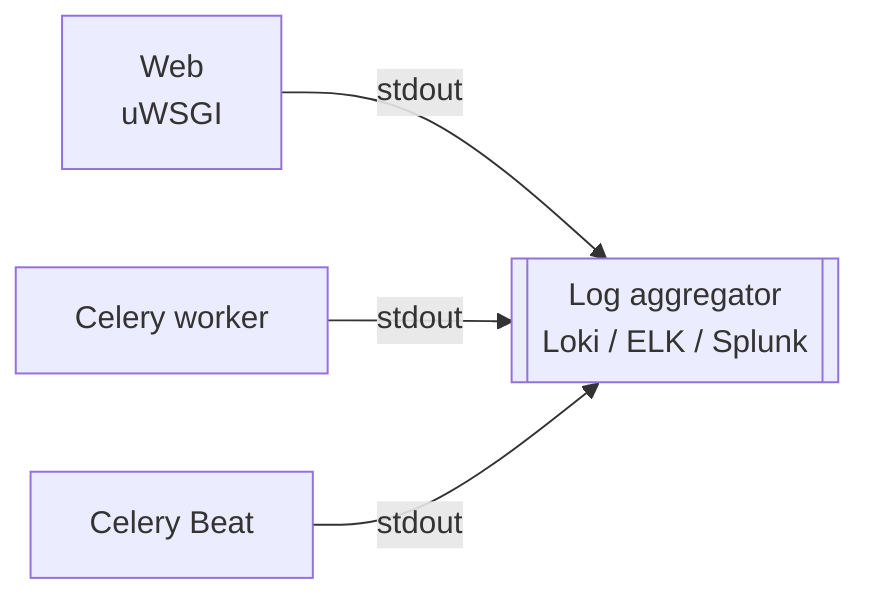
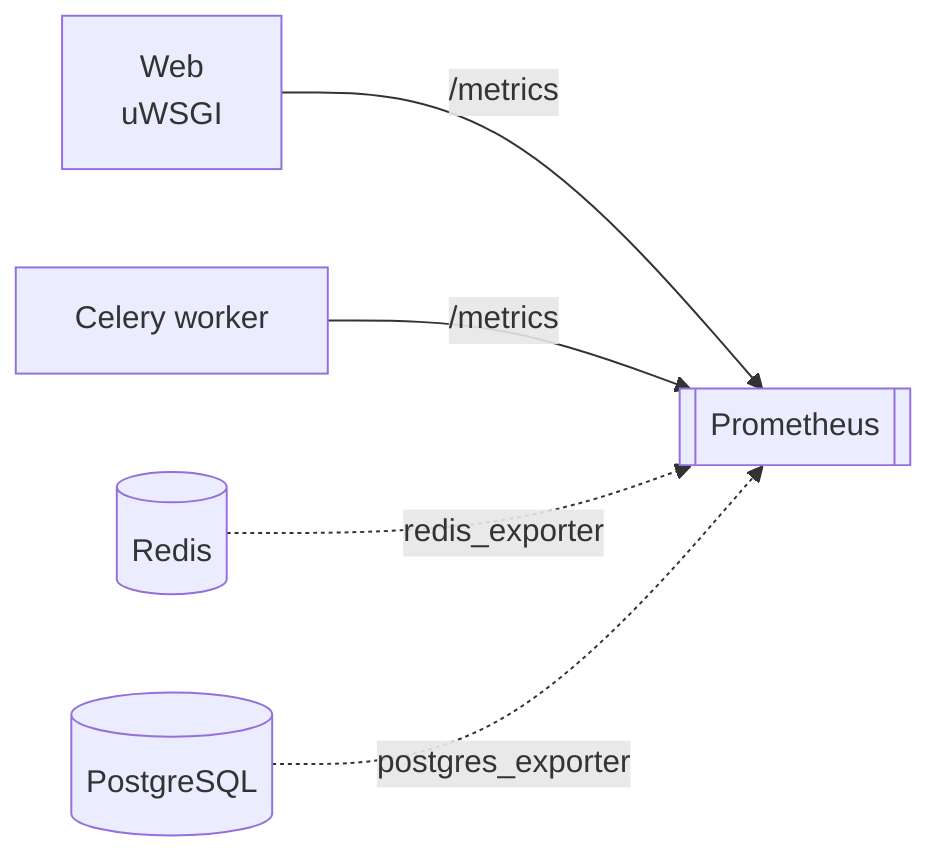
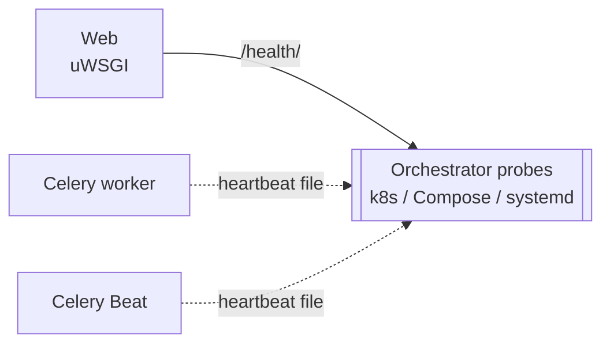

# Monitoring Nautobot

Nautobot is a Django + Celery application backed by PostgreSQL and Redis. It does not produce a proprietary log file or expose a vendor-specific monitoring agent — it surfaces signals through three independent operator-facing channels:

- **Logs** to the standard streams (`stdout`/`stderr`) of each process, where they are picked up by your platform (systemd-journald, Docker, Kubernetes, etc.) and shipped to your aggregator.
- **Metrics** at the [`/metrics`](./alerting.md#prometheus-metrics) endpoint when [Prometheus metrics are enabled](./prometheus-metrics.md), plus complementary metrics from `redis_exporter` and `postgres_exporter` for the backing stores.
- **Health probes** (`/health/`, `nautobot-server health_check`, and Celery heartbeat files), wired into the orchestrator's liveness and readiness probes — see [Health Checks](./health-checks.md).

Each collector answers a different question. Use all three together for complete coverage.

## The three collectors

A monitored Nautobot deployment has three independent collectors, each consuming a different signal from the same set of processes.

**Logs → log aggregator** — *what happened*

Captures exception text, plugin initialization errors, scheduler events. Anchor alert rules on logger name plus level — see [Logging](./logging.md).

**Metrics → Prometheus** — *how often*

Counters and gauges: failure rates, exception classes, health-check booleans, queue depth. See [Prometheus Metrics](./prometheus-metrics.md) for the metric catalogue. Backing-store metrics live outside Nautobot — pair Nautobot's `/metrics` with `redis_exporter` and `postgres_exporter`; see [Backing Stores](./backing-stores.md).

**Health probes → orchestrator** — *should this pod be restarted*

Binary up/down. Use `/health/` for web readiness, `nautobot-server health_check` for liveness, file-based heartbeat for workers and Beat — see [Health Checks](./health-checks.md) for full probe configurations. The Nautobot-specific rationale for file-based worker probes lives in [Celery and Jobs — Worker silent-death](./celery-jobs.md#worker-silent-death).

## Job logs are a fourth, in-product surface

In addition to the three operator channels above, Nautobot persists per-Job structured log entries to the database as [`JobLogEntry`](../../platform-functionality/jobs/models.md#job-log-entry) rows, surfaced in the Job Result UI and the REST API. These are intended for end-users debugging a specific Job run and should generally **not** be shipped to your SIEM — the operator channels above already capture the same information at the worker stdout level.

For guidance on emitting good Job log entries from Job code, see [Job Logging](../../../development/jobs/job-logging.md).

## Where to start

| You want to… | Read |
|---|---|
| Understand the log streams and what to alert on | [Logging](./logging.md) |
| Build a low-noise alert ruleset (Prometheus + log-based) | [Alerting](./alerting.md) |
| Tune Celery for long-running Jobs and avoid the visibility-timeout foot-gun | [Celery and Jobs](./celery-jobs.md) |
| Monitor Redis and PostgreSQL the way Nautobot uses them | [Backing Stores](./backing-stores.md) |
| Wire health probes into Kubernetes / Compose / systemd | [Health Checks](./health-checks.md) |
| Enable and scrape Prometheus metrics | [Prometheus Metrics](./prometheus-metrics.md) |
| Investigate a slow request, page, or Job (per-request SQL / cProfile) | [Request Profiling](./request-profiling.md) |
| Run multiple Celery queues with different worker pools | [Task Queues](../guides/celery-queues.md) |

!!! tip
    A good production deployment turns on metrics (`NAUTOBOT_METRICS_ENABLED=True`), wires `/health/` and the file-based Celery heartbeat probes into the orchestrator, and ships container `stdout` to a log aggregator with the logger name parsed as a structured field. Everything else in this section builds on that foundation.
