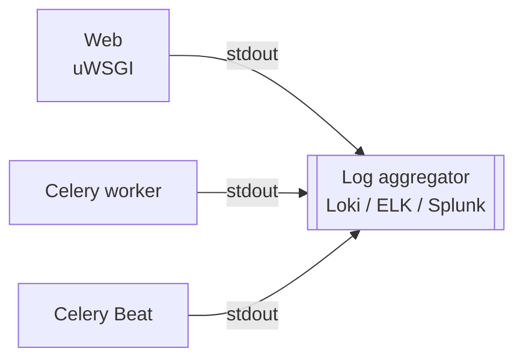
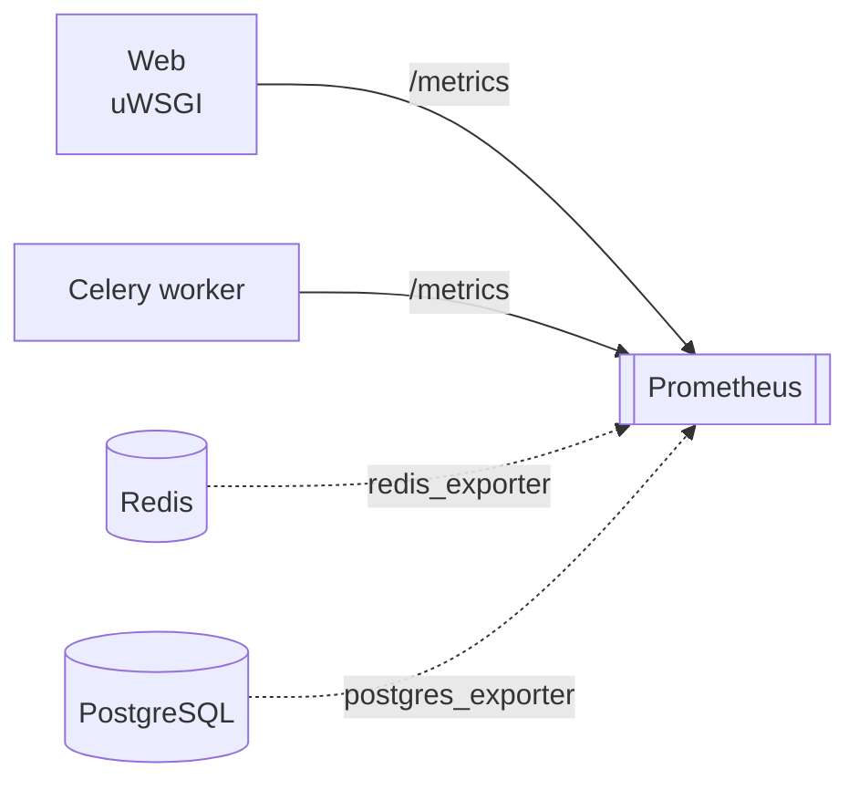
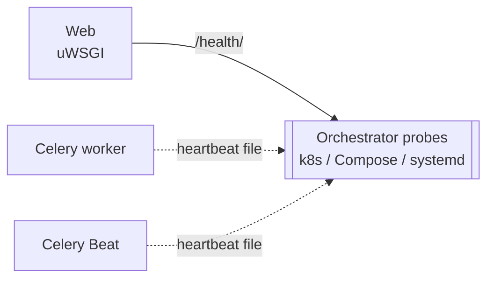

# Monitoring Nautobot

Organizations that have matured in their automation journey often find Nautobot sitting on the critical path — outages, slow Jobs, or silent failures translate directly to network operations being blocked. For these deployments, monitoring Nautobot is operationally critical.

This guide aims to give administrators direction on how to implement monitoring for their Nautobot deployments. It is not a definitive playbook — every environment has its own constraints, tooling, and baseline noise — but it covers the signals, configuration knobs, and integration patterns we have seen work across production deployments.

Nautobot is a Django + Celery application backed by PostgreSQL and Redis. It does not produce a proprietary log file or expose a vendor-specific monitoring agent — it surfaces signals through three independent operator-facing channels:

- **Logs** to the standard streams (`stdout`/`stderr`) of each process, where they are picked up by your platform (systemd-journald, Docker, Kubernetes, etc.) and shipped to your aggregator.
- **Metrics** at the [`/metrics`](./alerting.md#metrics-based-alerts) endpoint when [Prometheus metrics are enabled](./prometheus-metrics.md), plus complementary metrics from `redis_exporter` and `postgres_exporter` for the backing stores.
- **Health probes** (`/health/`, `nautobot-server health_check`, and Celery heartbeat files), wired into the orchestrator's liveness and readiness probes — see [Health Checks](./health-checks.md).

Each collector answers a different question. Use all three together for complete coverage.

## The Three Collectors

**Logs → log aggregator** — *what happened*

Captures exception text, plugin initialization errors, scheduler events. Anchor alert rules on logger name plus level — see [Logging](./logging.md).

**Metrics → Prometheus** — *how often*

Counters and gauges: failure rates, exception classes, health-check booleans, queue depth. See [Prometheus Metrics](./prometheus-metrics.md) for the metric catalogue. Backing-store metrics live outside Nautobot — pair Nautobot's `/metrics` with `redis_exporter` and `postgres_exporter`; see [Backing Stores](./backing-stores.md).

**Health probes → orchestrator** — *should this pod be restarted*

Binary up/down. Use `/health/` for web readiness, `nautobot-server health_check` for liveness, file-based heartbeat for workers and Beat — see [Health Checks](./health-checks.md) for full probe configurations. The Nautobot-specific rationale for file-based worker probes lives in [Celery and Jobs — Worker silent-death](./celery-jobs.md#worker-silent-death).

## In-Product Job Logs

In addition to the three operator channels above, Nautobot persists per-Job structured log entries to the database as [`JobLogEntry`](../../platform-functionality/jobs/models.md#job-log-entry) rows, surfaced in the Job Result UI and the REST API. These rows are intended for end-users debugging a specific Job run — they are **not** a separate log stream from the operator's perspective.

The same lines that land in `JobLogEntry` also reach the worker's `stdout` via the `nautobot.jobs.<module>` logger, so your aggregator is already capturing them from the operator channel. Do not additionally mirror the `JobLogEntry` table to your SIEM — you'll get every Job log line twice.

For guidance on emitting good Job log entries from Job code, see [Job Logging](../../../development/jobs/job-logging.md) and [Celery and Jobs — Logging from Inside Jobs](./celery-jobs.md#logging-from-inside-jobs).

## Where to Start

| You want to… | Read |
|---|---|
| Understand the log streams and what to alert on | [Logging](./logging.md) |
| Build Grafana dashboards that show what "normal" looks like | [Visualization](./visualization.md) |
| Build a low-noise alert ruleset (Prometheus + log-based) | [Alerting](./alerting.md) |
| Define Service Level Indicators and Objectives, and alert on error-budget burn | [SLAs and SLOs](./slas-and-slos.md) |
| Tune Celery for long-running Jobs and avoid the visibility-timeout pitfall | [Celery and Jobs](./celery-jobs.md) |
| Monitor Redis and PostgreSQL the way Nautobot uses them | [Backing Stores](./backing-stores.md) |
| Wire health probes into Kubernetes / Compose / systemd | [Health Checks](./health-checks.md) |
| Enable and scrape Prometheus metrics | [Prometheus Metrics](./prometheus-metrics.md) |
| Investigate a slow request, page, or Job (per-request SQL / cProfile) | [Request Profiling](./request-profiling.md) |
| Run multiple Celery queues with different worker pools | [Task Queues](../guides/celery-queues.md) |

!!! tip
    A good production deployment turns on metrics (`NAUTOBOT_METRICS_ENABLED=True`), wires `/health/` and the file-based Celery heartbeat probes into the orchestrator, and ships container `stdout` to a log aggregator with the logger name parsed as a structured field. Everything else in this section builds on that foundation.

## Production Deployment Checklist

A minimal monitored Nautobot deployment combines all three collectors with a few opinionated defaults. The list below is a starting point; each item links to its dedicated page for the full recipe.

1. **Enable Prometheus metrics.** Set `NAUTOBOT_METRICS_ENABLED=True` and confirm `/metrics` returns data. In Kubernetes, configure a `PodMonitor` so each worker pod is scraped individually — see [Alerting — Kubernetes Scrape-Target Pitfall](./alerting.md#kubernetes-scrape-target-pitfall). Reference: [Prometheus Metrics](./prometheus-metrics.md).
2. **Wire health probes into the orchestrator.** HTTP `/health/` for web readiness/startup, `nautobot-server health_check` for web liveness, file-based heartbeat probes for Celery worker and Beat. Reference: [Health Checks](./health-checks.md).
3. **Ship JSON-formatted logs.** Override `LOGGING` in `nautobot_config.py` so each line is one JSON object, then confirm your aggregator parses `name` (logger), `levelname`, and `message` as queryable fields. Reference: [Logging — Switching to JSON Output](./logging.md#switching-to-json-output).
4. **Schedule retention cleanup.** Run the bundled `Cleanup System Records` Job as a periodic `ScheduledJob` with explicit `cutoff` values for `extras.ObjectChange` and `extras.JobResult`. Tune `CHANGELOG_RETENTION` to match your audit requirements. Reference: [Backing Stores — High-Churn Tables](./backing-stores.md#high-churn-tables).
5. **Raise the Celery broker visibility timeout.** Set `CELERY_BROKER_TRANSPORT_OPTIONS["visibility_timeout"]` above your slowest Job's wall-clock runtime to avoid double-execution of long Jobs. Reference: [Celery and Jobs — Visibility Timeout for Long-Running Jobs](./celery-jobs.md#visibility-timeout-for-long-running-jobs).
6. **Deploy backing-store exporters.** Run `redis_exporter` and `postgres_exporter` alongside your Redis and PostgreSQL instances; add `pgbouncer_exporter` if you front PostgreSQL with PgBouncer. Reference: [Backing Stores](./backing-stores.md).
7. **Pick a Tier-1 alert ruleset and tune it.** Start from the sample rules and walk them against your baseline before committing. Reference: [Alerting](./alerting.md).
