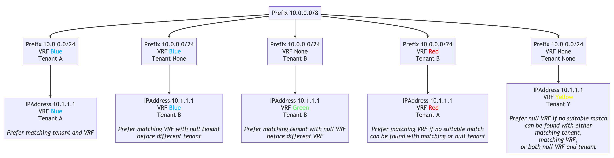

# What's Changed

This section details the high-level changes as it relates to the data modeling for IPAM objects. Some of the sections are repeating content found in the release notes with detail added for improved readability. Additionally, not all changes described will be distinctly related to IPAM, but if there were changes to relationships to or from IPAM data models, the impact of those changes will be described here.

## Namespaces were introduced

The new `Namespace` model expands on the functionality previously provided by `VRF.enforce_unique` and the `ENFORCE_GLOBAL_UNIQUE` setting, both of which have now been removed. Within a Namespace, all VRFs, Prefixes, and IP addresses must be unique. This enables greater flexibility in managing discrete duplicate `VRF`, `Prefix` or `IPAddress` objects, asserting that each set of duplicates will be in a distinct `Namespace`.

For more details please refer to the [Namespace model documentation](../../../../core-data-model/ipam/namespace.md).

### Default Namespace

A default `Namespace` object named "Global" will be created for you. All objects that did not have duplicates found will be found in this Namespace. All new objects will default to this Namespace unless otherwise specified.

## Role model is now Generic across Nautobot

The `DeviceRole`, `RackRole`, `ipam.Role`, and `IPAddressRoleChoices` have all been removed and replaced with an `extras.Role` model. This means that all references to any of the replaced models and choices now points to this generic `Role` model.

In addition, the `role` field of the `IPAddress` model will be changed from a choice field to a foreign key field related to the `extras.Role` model.

For more details please refer to the [documention on Roles](../../../../platform-functionality/role.md).

## Prefix Parenting Concrete Relationship was added

The `Prefix` model was modified to have a self-referencing foreign key as the `parent` field. Parenting of prefixes is now automatically managed at the database level to greatly improve performance especially when calculating tree hierarchy and utilization.

As a result of this change, it is no longer necessary nor possible to disable tree hierarchy using `settings.DISABLE_PREFIX_LIST_HIERARCHY` as this setting has been removed. Additionally it is no longer possible to disable global uniqueness using `settings.ENFORCE_GLOBAL_UNIQUE` as this setting has been removed.

### Prefix Parenting Guidance

The following guidance has been added for the `Prefix` model in order to ensure more accurate network modeling:

- A `Prefix` of type `Container` should only have a parent (if any) of type `Container`
- A `Prefix` of type `Network` should only have a parent (if any) of type `Container`
- A `Prefix` of type `Pool` should only have a parent (if any) of type `Network`
- Any `Prefix` can be a root prefix (i.e. have no parent)

In Nautobot 2.0, creating or updating prefixes that violate this guidance will result in a warning; in a future Nautobot release this will be changed to an enforced data constraint.

## Prefix.is_pool field and "Container" status replaced by new field Prefix.type

A new type field was added to `Prefix` to replace the `is_pool` boolean field and the "Container" `status`. The `type` field can be set to "Network", "Pool" or "Container", with "Network" being the default.

Existing `Prefixes` with a `status` of "Container" will be migrated to the "Container" `type`. Existing prefixes with `is_pool` set are migrated to the "Pool" `type`. Prefixes with both `is_pool set` and a `status` of "Container" are migrated to the "Pool" `type`.

The "Container" `status` will be removed and all prefixes will be migrated to the "Active" `status` if it exists. If the "Active" `status` does not exist, prefixes will instead be migrated to the first available `Prefix` `status` in the database that is not "Container".

## Prefix utilization calculations were revamped

The `get_utilization` method on the `ipam.Prefix` model has been updated in 2.0 to account for the `Prefix.type` field as described above under **Prefix Parenting Guidance**. The behavior is now as follows:

- If the `Prefix.type` is `Container`, the utilization is calculated as the sum of the total address space of all child prefixes.
- If the `Prefix.type` is `Pool`, the utilization is calculated as the sum of the total number of IP addresses within the pool's range.
- If the `Prefix.type` is `Network`:
    - The utilization is calculated as the sum of the total address space of all child `Pool` prefixes plus the total number of child IP addresses.
    - For IPv4 networks with a `prefix_length` larger (lower) than `/31`, if neither the first or last address is occupied by either a pool or an IP address, they are subtracted from the total size of the prefix.

### Example

- 192.168.0.0/16          `Container - 1024/65536 utilization`
    - 192.168.1.0/24      `Network - 1/254 utilization`
        - 192.168.1.1     `IP Address`
    - 192.168.2.0/24      `Network - 4/256 utilization`
        - 192.168.2.0/30  `Pool - 1/4 utilization`
            - 192.168.2.1 `IP Address`
    - 192.168.3.0/24      `Network - 5/254 utilization`
        - 192.168.3.1     `IP Address`
        - 192.168.3.64/30 `Pool - 0/4 utilization`
    - 192.168.4.0/24      `Network - 1/256 utilization`
        - 192.168.4.255   `IP Address`

## IPAddress Parenting Concrete Relationship was added

The `ipam.IPAddress` model has been modified to have a mandatory foreign key to `ipam.Prefix` as the `parent` field. Parenting of IP addresses is now automatically managed at the database level to greatly improve performance especially when calculating tree hierarchy and utilization.

### IPAddress Parenting Guidance

The following guidance has been added to the `IPAddress` model:

- An `IPAddress` should have a parent `Prefix` of type `Network`
- An `IPAddress` should not be created if a suitable parent `Prefix` of type `Network` does not exist
- An `IPAddress` can be a member of a `Pool` but only if the `Pool` is a child of a `Network`
- If an eligible parent `Prefix` cannot be found for an `IPAddress` in a given `Namespace`, creation or update of that `IPAddress` will fail.
- If deleting a parent `Prefix` would result in any child `IPAddress` objects to become orphaned, the delete operation will fail.

As with the [`Prefix` parenting guidance](#prefix-parenting-guidance) above, violating this guidance in Nautobot 2.0 will result in a warning; in a future Nautobot release this will be changed to an enforced data constraint.

## Parenting affinity during the upgrade

A best effort is made to keep `Prefixes` and `IPAddresses` together by shared attributes such as `Tenant`, but this is not always possible for various reasons such as numerous duplicates with identical or too-closely-similar criteria.

When identifying possible ancestors for child `Prefix` or `IPAddress` objects during the reparenting phase of the upgrade process, the following sets of attributes will be compared in order:

- `Tenant` assigned, `VRF` assigned
- `Tenant` null, `VRF` assigned
- `Tenant` assigned, `VRF` null
- `VRF` assigned
- `Tenant` null, `VRF` null
- `VRF` null
- Default ordering

<!-- markdownlint-disable-next-line MD033 -->
<figure markdown>
  
  <!-- markdownlint-disable-next-line MD033 -->
  <figcaption>Tenant affinity decision tree</figcaption>
</figure>

## IPAddress to VRF relationships were changed

The foreign key relationship from `IPAddress` to `VRF` was removed. `IPAddress` objects may no longer have a `VRF` assigned to them. The `VRF` value for an `IPAddress` is now inherited from its parent `Prefix`.

Additionally, some new constraints have been put into place to alleviate issues that existed previously which allowed an Interface to have multiple `IPAddress` assignments each with differing VRFs, which is not technically possible in real-world networking configurations.

The `Interface`/`VMInterface` assignment constraints are as follows:

- If the `VRF` has no `Prefixes` assigned, `IPAddresses` may freely be assigned to the `Interface`/`VMInterface`
- If the `VRF` has `Prefixes` assigned, only child `IPAddresses` of those `Prefixes` may be assigned to the `Interface`/`VMInterface`

## IPAddress prefix_length is now mask_length

The `prefix_length` field on `IPAddress` has been renamed to `mask_length`. This is to enforce that this field is used for documentation purposes only to indicate the mask length that may be used in practice when configuring this address for use on your network.

The `mask_length` field is not used for the parenting algorithm when determining the appropriate parent `Prefix` within a given `Namespace`.

## VRF is no longer used for uniqueness

`VRF` objects can no longer be used for uniqueness boundaries and the `enforce_unique` field has been removed. A new uniqueness constraint has been added to the `VRF` `rd` field, which requires it to be unique for each `Namespace`.

The foreign key relationship from `Prefix` to `VRF` has been inverted and replaced with a many-to-many relationship from `VRF` to `Prefix`. Now each `Prefix` can be assigned to one or more `VRF` object in the same `Namespace`.

Lastly, one or more `Device`/`VirtualMachine` objects can now be assigned to a `VRF`. A `VRF` must be assigned to a `Device`/`VirtualMachine` before it may be assigned to an `Interface`/`VMInterface`. This is the modeling equivalent of creating a `VRF` in the device configuration before it may be used on an interface.

## IPAddress to Interface relationship was inverted

In Nautobot 1.x the relationship from an `IPAddress` to an `Interface`/`VMInterface` was done by way of a foreign key to `Interface`/`VMInterface` on the `IPAddress` object. This implementation was flawed in that if a need arose to assign the same IP address to multiple interfaces, it required the creation of duplicate `IPAddress` objects with the same `host` address in order to assign each one to a different `Interface`/`VMInterface`.

As of Nautobot 2.0, this relationship was inverted. Now an `Interface`/`VMInterface` has a many-to-many relationship to `IPAddresses`. This allows the same `IPAddress` object to be assigned to multiple `Interface`/`VMInterface` objects without the need to create duplicate `IPAddress` objects.

## VRF is now assigned to Interface/VMInterface, not IPAddress

A new foreign key to `VRF` has been introduced to `Interface/VMInterface`.

- A `VRF` must be assigned to a `Device` before it may be assigned to an `Interface`
- A `VRF` must be assigned to a `VirtualMachine` before it may be assigned to an `VMInterface`

This addresses a fundamental flaw in which an Interface could have multiple `IPAddress` objects assigned with conflicting `VRFs`, which is impossible in practice when applied to a network device configuration.

## Primary IPv4/IPv6 no longer unique

On `Device` and `VirtualMachine` objects, the `primary_ip4` and `primary_ip6` fields were changed from a one-to-one field--which is a foreign key with a uniqueness constraint--to a foreign key, dropping the uniqueness constraint.

This was necessary to support the case where the same `IPAddress` object may be assigned to one or more `Interface`/`VMInterface` objects to share a (non-duplicated) primary `IPAddress` record, reducing the need to proliferate duplicate `IPAddress` objects merely for the purpose of facilitating `Interface`/`VMInterface` assignments.
