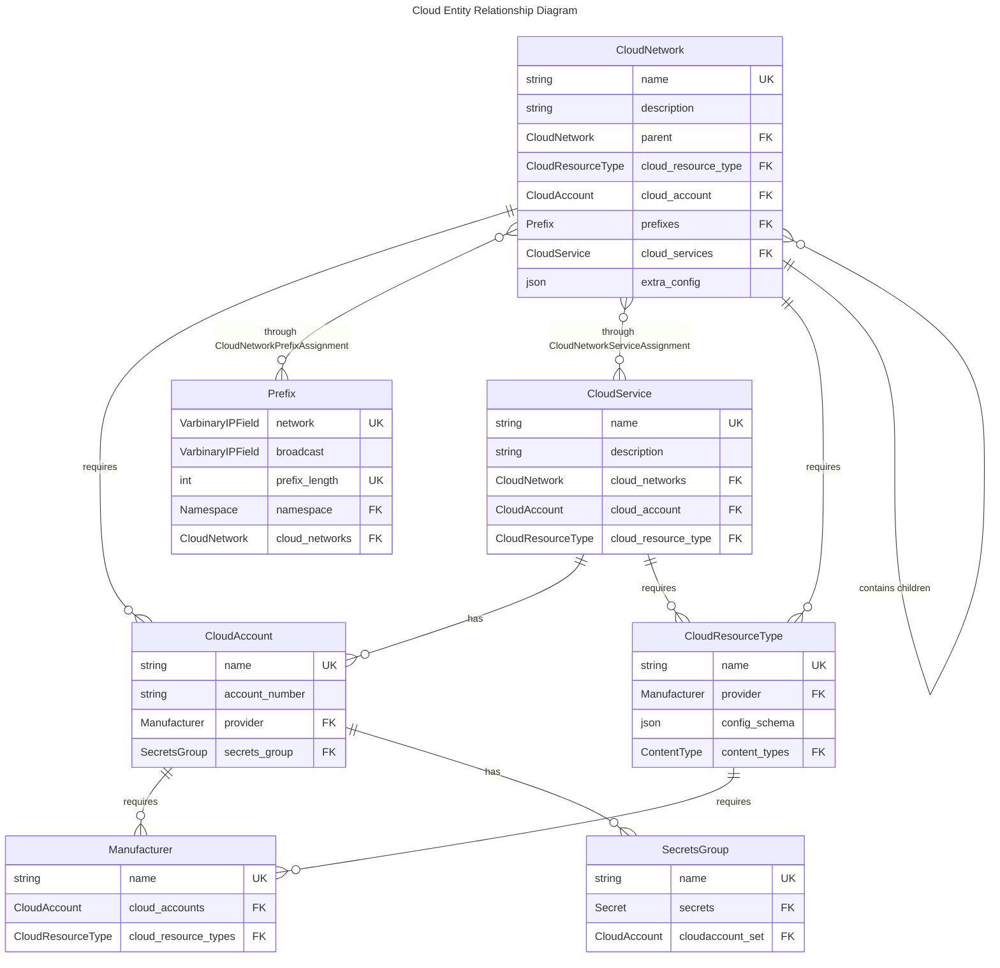

# Cloud

The new Cloud data models allow the modeling of [cloud networks](./cloudnetwork.md) and [cloud services](./cloudservice.md). Here is an example of how these models can be used together to model an AWS Direct Connect.

## Example

### Diagram


### Pseudocode

```yaml
# Pseudocode
manufacturers:
  - name: "Amazon"

cloud_accounts:
  - name: "AWS"
    account_number: "A-123456"
    provider: "Amazon"

cloud_resource_type:
  - name: "VPC"
    provider: "Amazon"
    content_types:
      - cloud:cloud_network

  - name: "S3"
    provider: "Amazon"
    content_types:
      - cloud:cloud_service

cloud_networks:
  - name: "VPC-01"
    cloud_resource_type: "VPC"
    cloud_account: "AWS"
    prefixes: [<prefix:10.1.0.0/16>]

cloud_services:
  - name: "S3 Bucket 3"
    cloud_resource_type: "S3"
    cloud_networks:
      - "VPC-01"

circuits:
  - name: "AWS Direct Connect 1"
    termination_a:
      site: "Customer Office"
    termination_z:
      cloud_network: "VPC-01"

```

## Entity Relationship Diagram

This schema illustrates the connections between related models.


