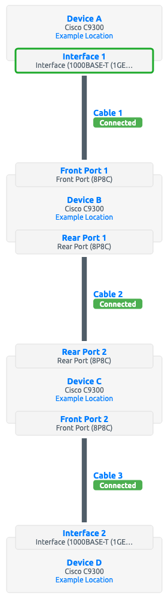
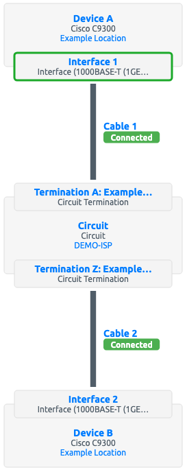

# Cables

All connections between device components in Nautobot are represented using cables. A cable represents a direct physical connection between termination points, such as between a console port and a patch panel port, or between two or more network interfaces.

Each cable may be assigned a type, label, length, and color. Each cable must also be assigned to an operational [status](../../platform-functionality/status.md). The following statuses are available by default:

* Connected
* Planned
* Decommissioning

!!! caution
    The `Connected` status for cables has special significance in Nautobot. A path trace (as described below) considers a given path to be reachable/traversable if and only if all cables in the path have the `Connected` status; if any cable has a different status, the path will be flagged as unreachable. Do not delete or rename the `Connected` status.

The ends of a cable are sometimes referenced as "A" and "B" for clarity, however standard point-to-point cables are direction-agnostic and the order in which terminations are made has no intrinsic meaning. (Breakout cables, see below, use "A" for the "trunk" end with fewer connectors, and "B" for the "breakout" end with more connectors.)

Cables may be terminated to the following "cable termination" objects:

* [Circuit terminations](../circuits/circuittermination.md)
* [Console ports](consoleport.md)
* [Console server ports](consoleserverport.md)
* [Interfaces](interface.md)
* Pass-through ports ([front](frontport.md) and [rear](rearport.md))
* [Power feeds](powerfeed.md)
* [Power outlets](poweroutlet.md)
* [Power ports](powerport.md)

+++ 3.2.0 "Cable to Cable Termination model"
    The database representation of the associations between a cable and its terminations is implemented by the [Cable to Cable Termination](cabletocabletermination.md) model. This intermediary model was introduced in Nautobot 3.2 to support breakout cables (see below) that may have more than two terminations. For backwards compatibility purposes, the cable model still provides some capabilities similar to the previously-present `termination_a` and `termination_b` fields, particularly in the REST API and GraphQL, but code (Apps or Jobs) that interact with cables may need to be updated to account for the changed data model.

## Breakout Cables

+++ 3.2.0

A cable can now optionally be assigned to a defined [cable type](cabletype.md). That model is primarily used to describe breakout cable types, but can also be used to describe types of point-to-point cables as well, in cases where the basic `type` field on a cable is insufficiently detailed.

When a cable is associated with a breakout cable type, it becomes permissible to assign more than two cable termination objects to that cable, up to the limits defined by the cable type. For example, a 1x4 breakout cable type will naturally allow cables of that type to have a single "A" side termination and up to four "B" side terminations. These terminations will each be recorded in the database as distinct [cable to cable termination](cabletocabletermination.md) records.

Note that not all cable termination types are permitted to be associated to breakout cables - specifically, only the following models are supported at this time:

* Circuit terminations
* Interfaces
* Pass-through ports (front and rear)

For more information, see the [Breakout Cables feature guide](../../feature-guides/breakout-cables.md)

## Tracing Cables

A cable may be traced from either of its endpoints by clicking the "trace" button. (A REST API endpoint also provides this functionality.) Nautobot will follow the path of connected cables from this termination across the directly connected cable to the far-end termination. If the cable connects to a pass-through port, and the peer port has another cable connected, Nautobot will continue following the cable path until it encounters a non-pass-through or unconnected termination point. The entire path will be displayed to the user.

In the example below, three individual cables comprise a path between devices A and D:

Traced from Interface 1 on Device A, Nautobot will show the following path:

* Cable 1: Interface 1 to Front Port 1
* Cable 2: Rear Port 1 to Rear Port 2
* Cable 3: Front Port 2 to Interface 2

A cable can also be traced through a [circuit](../circuits/circuit.md).

Traced from Interface 1 on Device A, Nautobot will show the following path:

* Cable 1: Interface 1 to Side A
* Cable 2: Side Z to Interface 2
