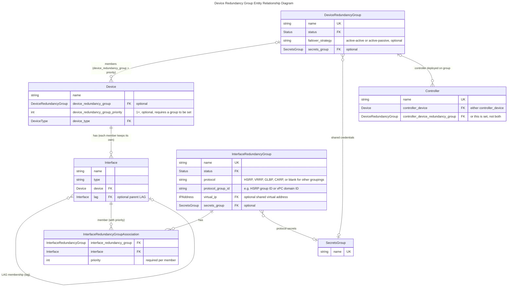

# Device Redundancy Groups

Device Redundancy Groups represent logical relationships between multiple devices. Typically, a redundancy group could represent a failover pair, failover group, or a load sharing cluster.
Device Redundancy Groups are created first, before the devices are assigned to the group.

A failover strategy represents intended operation mode of the group. Supported failover strategy are: Active/Active and Active/Standby.

Secrets groups could be used to store secret information used by failover or a cluster of devices.

Device Redundancy Group Priority is a Device attribute defined during assigning a Device to a Device Redundancy Group. This field represents the priority the device has in the device redundancy group.

## Overview

TODO: Review all of these assertions in detail.

The key piece of Device Redundancy Groups is when multiple physical devices work together to provide high availability while each maintaining its **own control plane and management IP**, such as a firewall HA pair, a vPC/MLAG pair, or a load balancer cluster. The model itself is intentionally simple: a single `DeviceRedundancyGroup` object that member devices point to, with each member optionally recording a priority within the group to convey failover order (e.g. primary vs. secondary). The group itself carries the failover strategy (active/active or active/passive), a status, and optionally a Secrets Group for credentials shared across the members.

!!! note
    Unlike a Virtual Chassis, there is no master concept and interfaces are never surfaced on a peer device. Each member remains a fully independent device in Nautobot — with its own interfaces, inventory, configuration, and primary IP — reflecting that each unit is managed on its own. Which unit is "primary" is conveyed by `device_redundancy_group_priority`; the meaning of the value (whether higher or lower wins) follows vendor behavior, so be consistent across your groups.

LAG interfaces cannot span members of a Device Redundancy Group; a LAG and its member interfaces must belong to the same device (or the same virtual chassis). For multi-chassis technologies such as vPC or MLAG, the recommendation is to model a port channel on each member individually, then tie the pair together with an [Interface Redundancy Group](../core-data-model/dcim/interfaceredundancygroup.md): create one group per multi-chassis port channel, assign each member's LAG interface to it with a priority, and record the vPC/MLAG domain or pair ID in `protocol_group_id`. As users, we recommend giving the LAG the same name on both members (e.g. `Port-Channel10` on each switch) to match how the technology is typically configured, however this is not enforced nor is any configuratoins synced. The Interface Redundancy Group is the only thing in the data model relating them to each other.

An Interface Redundancy Group does not change or take over the interfaces themselves — each member's LAG remains an ordinary, independently configured interface on its own device. What the group models is the real-world relationship between them: the fact that two separately configured interfaces present a single logical entity to the rest of the network. Its protocol fields (HSRP, VRRP, GLBP, CARP), optional shared `virtual_ip`, and Secrets Group exist for the first hop redundancy use case it was originally designed around, but the grouping itself applies to any set of redundant interfaces — pairing the per-member port channels of a vPC/MLAG domain is exactly that.

The device redundancy group model provides the following fields:

| Field | Type | Required | Description |
|---|---|---|---|
| `name` | String | Yes | Unique name identifying the redundancy group |
| `status` | Status | Yes | Lifecycle status of the group (e.g., Planned, Active, Decommissioning) |
| `description` | String | No | Brief human-readable description of the group's purpose |
| `failover_strategy` | Choice | No | How traffic is handled across members: `Active/Active` (both units process traffic simultaneously) or `Active/Passive` (one unit is standby until failover occurs) |
| `comments` | Text | No | Free-form notes about the group |
| `secrets_group` | FK → SecretsGroup | No | Credentials used to access devices in this group (e.g., shared enable password) |

The following fields are on the `Device` model, in support of the Virtual Chassis featureset.

| Field | Type | Required | Description |
|---|---|---|---|
| `device_redundancy_group` | FK → DeviceRedundancyGroup | No | The redundancy group this device belongs to |
| `device_redundancy_group_priority` | Integer (≥ 1) | No | Priority of this device within the group |


## Entity Relationship Diagram

This schema illustrates the connections between the models involved in a device redundancy group.

TODO: Validate AI Generated ERD



## Sample API - TODO:

## Sample Design Builder TODO: validate

The following [Design Builder](https://docs.nautobot.com/projects/design-builder/en/latest/) example models a Cisco ASA 5500 active/standby failover pair (`jcy-fw-01` and `jcy-fw-02`) tied together by a `DeviceRedundancyGroup` named `jcy-fw-failover`, sharing the same `JCY` location and `192.168.1.0/24` management prefix introduced in the Virtual Chassis example above. Unlike a `VirtualChassis` — where the group depends on its master device and forces deferred assignment — a `DeviceRedundancyGroup` is created first as a standalone object, and each `Device` simply references it through `device_redundancy_group`. The active/standby relationship is expressed via `device_redundancy_group_priority` (higher wins primary, so `jcy-fw-01` is primary in this example), and the dedicated heartbeat/sync link is modeled as a `failover-link` virtual interface on each device in its own `/31`.

```jinja2
device_redundancy_groups:
  - "!create_or_update:name": "jcy-fw-failover"
    status__name: "Active"
    failover_strategy: "active-passive"
    description: "ASA 5500 active/standby failover pair for JCY perimeter"
    "!ref": "jcy_fw_drg"

devices:
    # Primary failover unit
  - "!create_or_update:name": "jcy-fw-01"
    location__name: "JCY"
    status__name: "Active"
    device_type__model: "ASA5555-X"
    role__name: "Firewall"
    device_redundancy_group: "!ref:jcy_fw_drg"
    device_redundancy_group_priority: 100
    interfaces:
      - "!create_or_update:name": "Management0/0"
        type: "1000base-t"
        status__name: "Active"
        mgmt_only: true
        description: "Management Interface"
        ip_address_assignments:
          - "!create_or_update:ip_address__address": "192.168.1.20/24"
            ip_address:
              "!create_or_update:address": "192.168.1.20/24"
              "!create_or_update:parent": "192.168.1.0/24"
              status__name: "Active"
              "!ref": "fw01_mgmt_ip"
      - "!create_or_update:name": "GigabitEthernet0/3"
        type: "1000base-t"
        status__name: "Active"
        description: "Failover physical parent"
        "!ref": "fw01_failover_parent"
      - "!create_or_update:name": "failover-link"
        type: "virtual"
        status__name: "Active"
        parent_interface: "!ref:fw01_failover_parent"
        description: "ASA failover link"
        ip_address_assignments:
          - "!create_or_update:ip_address__address": "172.27.48.0/31"
            ip_address:
              "!create_or_update:address": "172.27.48.0/31"
              "!create_or_update:parent": "172.27.48.0/31"
              status__name: "Active"
    primary_ip4:
      "address": "!ref:fw01_mgmt_ip"
      deferred: true

    # Secondary failover unit
  - "!create_or_update:name": "jcy-fw-02"
    location__name: "JCY"
    status__name: "Active"
    device_type__model: "ASA5555-X"
    role__name: "Firewall"
    device_redundancy_group: "!ref:jcy_fw_drg"
    device_redundancy_group_priority: 50
    interfaces:
      - "!create_or_update:name": "Management0/0"
        type: "1000base-t"
        status__name: "Active"
        mgmt_only: true
        description: "Management Interface"
        ip_address_assignments:
          - "!create_or_update:ip_address__address": "192.168.1.21/24"
            ip_address:
              "!create_or_update:address": "192.168.1.21/24"
              "!create_or_update:parent": "192.168.1.0/24"
              status__name: "Active"
              "!ref": "fw02_mgmt_ip"
      - "!create_or_update:name": "GigabitEthernet0/3"
        type: "1000base-t"
        status__name: "Active"
        description: "Failover physical parent"
        "!ref": "fw02_failover_parent"
      - "!create_or_update:name": "failover-link"
        type: "virtual"
        status__name: "Active"
        parent_interface: "!ref:fw02_failover_parent"
        description: "ASA failover link"
        ip_address_assignments:
          - "!create_or_update:ip_address__address": "172.27.48.1/31"
            ip_address:
              "!create_or_update:address": "172.27.48.1/31"
              "!create_or_update:parent": "172.27.48.0/31"
              status__name: "Active"
    primary_ip4:
      "address": "!ref:fw02_mgmt_ip"
      deferred: true
```

## GraphQL

We will demonstrate how to execute the command for Primary Unit only, however you could repeat the process for a secondary unit. An example data returned from Nautobot is presented below.

```python
>>> hostname = "nyc-fw-primary"
>>> gql_data = get_gql_failover_details(hostname).json
```

```json
{
    "data": {
        "devices": [
            {
                "name": "nyc-fw-primary",
                "device_redundancy_group": {
                    "name": "nyc-firewalls",
                    "devices": [
                        {
                            "name": "nyc-fw-primary",
                            "device_redundancy_group_priority": 100,
                            "interfaces": [
                                {
                                    "type": "VIRTUAL",
                                    "name": "failover-link",
                                    "ip_addresses": [
                                        {
                                            "host": "172.27.48.0",
                                            "mask_length": 31
                                        }
                                    ],
                                    "parent_interface": {
                                        "name": "gigabitethernet0/3",
                                        "type": "A_1000BASE_T"
                                    }
                                }
                            ]
                        },
                        {
                            "name": "nyc-fw-secondary",
                            "device_redundancy_group_priority": 50,
                            "interfaces": [
                                {
                                    "type": "VIRTUAL",
                                    "name": "failover-link",
                                    "ip_addresses": [
                                        {
                                            "host": "172.27.48.1",
                                            "mask_length": 31
                                        }
                                    ],
                                    "parent_interface": {
                                        "name": "gigabitethernet0/3",
                                        "type": "A_1000BASE_T"
                                    }
                                }
                            ]
                        }
                    ]
                }
            }
        ]
    }
}
```

## Key Charteristics

- Can you port channel across multiple devices? No, but you can use interface redundancy groups to provide relationships between port channel virtual interfaces on two devices.
- Can you see all interfaces on the Primary? No — the active unit only shows its own interfaces
- Can you see all interfaces on the Backup? No — the standby unit has its own separate interface list
- On Primary, can you tell which interfaces are assigned to which device? N/A — each device is modeled separately in Nautobot
- When do you see all the interfaces on the master device? You do not, each device always shows only its own interfaces
- Can you connect interfaces from master to non-master? The failover and stateful link interfaces connect the two units either directly or via a switch
- What should the naming standard be for the HA pair? A combination of the two devices names (e.g., `ASA01:02` for `ASA01` and `ASA02`)
- Should I use interface named templates? Yes

## Questions to ask of the data model

Given the data model, what questions would a user ask?

- Given a device, I would like to know whether it is part of a redundant deployment (a device redundancy group).
- Given a device in a redundancy group, I would like to know whether it is the primary (per its priority).
- Given a device in a redundancy group, I would like to know which member is next in line to take over.
- Given a device in a redundancy group, I would like to know its sibling members.
- Given a redundancy group, I would like to know all of its member devices and how many there are.
- Given a member device, I would like to know how to connect to its management plane (each member keeps its own primary IP).
- Given a redundancy group, I would like to know whether failover is active/active or active/passive.
- Given a redundancy group, I would like to know which credentials (Secrets Group) to use to access its members.
- Given a member device, I would like to know which interfaces form the HA/failover/peer link, and which port on the peer they connect to (via cables).
- Given a multi-chassis port channel (vPC/MLAG), I would like to know the corresponding LAG on the peer device (via their shared interface redundancy group).  # TODO: confirm
- Given a controller, I would like to know whether it is deployed on a device redundancy group rather than a single device.

## Multi-chassis L2 Pair

Operating systems and technologies include VPC / MLAG (Cisco vPC, Arista MLAG, and Juniper MC-LAG variants).

### Configuration Generation

TODO: Validate these AI Generated configurations

The following example shows a Cisco NX-OS vPC pair (`nyc-nexus-01` and `nyc-nexus-02`) in vPC domain 10, with a vPC (Po10) down to an access switch.

Switch 1:

_Global / vPC Domain_

```
feature vpc
feature lacp
!
vpc domain 10
  role priority 10
  peer-keepalive destination 192.168.100.2 source 192.168.100.1 vrf management
  peer-switch
  peer-gateway
  auto-recovery
```

> Note: The vPC domain ID (10) must match on both peers — this is the value to record in `protocol_group_id` on the Interface Redundancy Group. The peer-keepalive runs between each switch's own management IP, reflecting the two independent control planes that make this a Device Redundancy Group rather than a Virtual Chassis.

_Peer-Link_

```
interface port-channel1
  description vPC Peer-Link to nyc-nexus-02
  switchport mode trunk
  switchport trunk allowed vlan 10,20,30,40
  spanning-tree port type network
  vpc peer-link
!
interface Ethernet1/53
  description vPC Peer-Link member
  switchport mode trunk
  channel-group 1 mode active
!
interface Ethernet1/54
  description vPC Peer-Link member
  switchport mode trunk
  channel-group 1 mode active
```

_vPC to Downstream Device_

```
interface port-channel10
  description vPC 10 to jcy-access-01
  switchport mode trunk
  switchport trunk allowed vlan 10,20
  vpc 10
!
interface Ethernet1/1
  description Member of Po10 (vPC 10)
  switchport mode trunk
  channel-group 10 mode active
```

Switch 2:

_Global / vPC Domain_

```
feature vpc
feature lacp
!
vpc domain 10
  role priority 20
  peer-keepalive destination 192.168.100.1 source 192.168.100.2 vrf management
  peer-switch
  peer-gateway
  auto-recovery
```

> Note: Only the role priority and the peer-keepalive source/destination differ from switch 1; the peer-link and downstream vPC configuration are identical on both peers.

_Peer-Link and vPC to Downstream Device_

```
interface port-channel1
  description vPC Peer-Link to nyc-nexus-01
  switchport mode trunk
  switchport trunk allowed vlan 10,20,30,40
  spanning-tree port type network
  vpc peer-link
!
interface Ethernet1/53
  description vPC Peer-Link member
  switchport mode trunk
  channel-group 1 mode active
!
interface Ethernet1/54
  description vPC Peer-Link member
  switchport mode trunk
  channel-group 1 mode active
!
interface port-channel10
  description vPC 10 to jcy-access-01
  switchport mode trunk
  switchport trunk allowed vlan 10,20
  vpc 10
!
interface Ethernet1/1
  description Member of Po10 (vPC 10)
  switchport mode trunk
  channel-group 10 mode active
```

> Note: The `vpc 10` number must match on both peers. The local port-channel ID is allowed to differ between peers, but keeping them identical (`Po10` ↔ `vpc 10` on both) is strongly recommended — this mirrors the data-model guidance above to give both members' LAG interfaces the same name and relate them with an Interface Redundancy Group.

_Downstream Device (jcy-access-01)_

```
interface Port-channel10
  description Uplink to nyc-nexus-01/nyc-nexus-02 (vPC 10)
  switchport mode trunk
  switchport trunk allowed vlan 10,20
!
interface GigabitEthernet1/0/1
  description Uplink to nyc-nexus-01 Eth1/1
  channel-group 10 mode active
!
interface GigabitEthernet1/0/2
  description Uplink to nyc-nexus-02 Eth1/1
  channel-group 10 mode active
```

> Note: From the downstream device's perspective, vPC is invisible — it is a standard LACP port channel whose member links happen to land on two different switches. In Nautobot the downstream side is modeled as an ordinary LAG on a single device; no special handling is required.

## Firewall HA pair

Operating systems and technologies include PAN, Fortinet, and ASA

### Configuration Generation

_Primary (Active) Unit — Failover Config_

```
failover
failover lan unit primary
failover lan interface FAILOVER GigabitEthernet0/3
failover replication http
failover link STATEFUL GigabitEthernet0/4
failover interface ip FAILOVER 10.1.1.1 255.255.255.252 standby 10.1.1.2
failover interface ip STATEFUL 10.1.2.1 255.255.255.252 standby 10.1.2.2
```

_Interface Standby IPs (on Primary)_

```
interface GigabitEthernet0/0
 nameif outside
 security-level 0
 ip address 203.0.113.1 255.255.255.0 standby 203.0.113.2
!
interface GigabitEthernet0/1
 nameif inside
 security-level 100
 ip address 10.0.0.1 255.255.255.0 standby 10.0.0.2
```

!!! note
    Standby IP is assigned to the secondary unit's corresponding interface automatically

_Secondary (Standby) Unit — Failover Config_

```
failover
failover lan unit secondary
failover lan interface FAILOVER GigabitEthernet0/3
failover link STATEFUL GigabitEthernet0/4
failover interface ip FAILOVER 10.1.1.1 255.255.255.252 standby 10.1.1.2
failover interface ip STATEFUL 10.1.2.1 255.255.255.252 standby 10.1.2.2
```

!!! note
    The secondary unit receives the full running config from the primary after the failover link is established; interface IPs need not be set manually

## HA pairs

Operating systems and technologies include F5 BIG-IP, A10 Thunder, Viptela, Versa, and Silver Peak

### Configuration Generation

_Standard Global Config_

1. Device A (Primary)

    ```
    # Set the sync address (usually the internal or HA self-IP)
    modify cm device f5-01.local { configsync-ip 10.1.1.1 }
    # Add Device B to the trust (performed on Device A)
    run cm add-to-trust wire-address 10.1.1.2 user admin

    # Create the Group (On Primary):
    create cm device-group my_ha_group { devices { f5-01.local f5-02.local } type sync-failover }
    ```

2. Device B (Standby)

    ```
    # Set the sync address
    modify cm device f5-02.local { configsync-ip 10.1.1.2 }
    Create the Group (On Primary):
    ```

_Management Plane_

Each retains its own unique Management IP for individual access, but they share a Floating Self-IP for management traffic that needs to reach the "Active" unit (like SNMP or API calls).

**Device A (Primary)**

    ```
    modify sys global-settings mgmt-dhcp disabled
    create sys management-ip 192.168.1.10/24

    create net self floating_mgmt_ip { address 192.168.1.12/24 vlan internal floating enabled traffic-group traffic-group-1 }
    ```

**Device B (Standby)**

    ```
    create sys management-ip 192.168.1.11/24
    Floating Self-IP (Shared/Active):
    ```

_Data Plane_

Does not support Cross-Chassis EtherChannel. Instead, you build a "Trunk" on each device separately. Redundancy is handled by the Floating IP moving from Device A's Trunk to Device B's Trunk during a failover.

1. Create the Trunk (Do this on both units locally)

    ```
    create net trunk my_trunk { interfaces { 1.1 1.2 } lacp enabled }
    ```

2. Assign VLAN to the Trunk

    ```
    create net vlan internal_vlan { interfaces add { my_trunk { tagged } } }
    ```

3. Create the Floating IP (The "Gateway" for your servers)

    ```
    create net self internal_floating { address 10.10.1.1/24 vlan internal_vlan floating enabled traffic-group traffic-group-1 }
    ```
