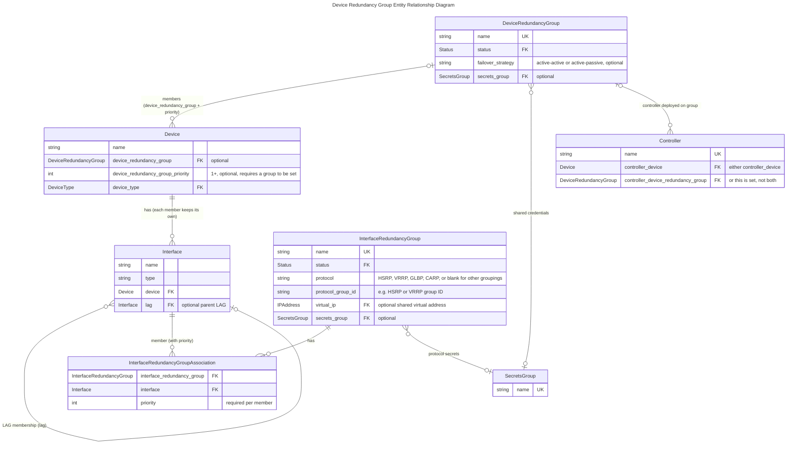

# Device Redundancy Groups

Device Redundancy Groups represent logical relationships between multiple devices. Typically, a redundancy group could represent a failover pair, failover group, or a load sharing cluster.
Device Redundancy Groups are created first, before the devices are assigned to the group.

A failover strategy represents the intended operation mode of the group. Supported failover strategies are:

- Active/Active
- Active/Passive

Secrets groups could be used to store secret information used by failover or a cluster of devices.

Device Redundancy Group Priority is a Device attribute set when assigning a Device to a Device Redundancy Group. This field represents the priority the device has in the device redundancy group.

## Overview

Choosing between this and a [Virtual Chassis](virtualchassis.md) comes down to the management control plane count — use a Device Redundancy Group when each member keeps its **own** control plane, and a Virtual Chassis when they share **one**. See [HA Devices](hadevice.md) for the full comparison.

Use a Device Redundancy Group when multiple physical devices work together to provide high availability while each keeps its **own control plane and management IP**, such as a firewall HA pair, a vPC/MLAG pair, or a load balancer cluster. The model is small: a single `DeviceRedundancyGroup` object that member devices point to, with each member optionally recording a priority within the group to convey failover order (e.g. primary vs. secondary). The group itself carries the failover strategy (active/active or active/passive), a status, and optionally a Secrets Group for credentials shared across the members.

!!! note
    Unlike a Virtual Chassis, there is no master concept and interfaces are never surfaced on a peer device. Each member remains a fully independent device in Nautobot — with its own interfaces, inventory, configuration, and primary IP — reflecting that each unit is managed on its own. Which unit is "primary" is conveyed by `device_redundancy_group_priority`, but Nautobot only stores this integer — it does not elect a primary or define whether higher or lower wins. Your automation assigns the meaning, so pick a convention and document it.

LAG interfaces cannot span members of a Device Redundancy Group; a LAG and its member interfaces must belong to the same device (or the same virtual chassis). For multi-chassis technologies such as vPC or MLAG, model a port channel on each member individually and give it the same name on both members (e.g. `Port-Channel10` on each switch), matching how the technology is typically configured. The pairing is deliberately a naming convention: nothing in the data model links the two port channels, nothing enforces that the names match, and no configuration is synced. Conventions also carry the identifiers config templates need, the per-port-channel vPC/MLAG number is derived from the port channel name (e.g. `Port-Channel10` → `vpc 10`), and the pair-scoped domain ID is recorded in a [config context](../extras/configcontext.md) assigned to the device redundancy group.

If you need an explicit link between the two port channels instead of a convention — for example, when the names cannot be kept identical — create a custom [Relationship](../../platform-functionality/relationship.md) (e.g. "vPC peer", Interface ↔ Interface) and query it alongside the rest of the data. An [Interface Redundancy Group](interfaceredundancygroup.md) can technically group any redundant interfaces, but it was designed for first hop redundancy protocols — a shared `virtual_ip`, an FHRP `protocol`, election priorities — so we do not recommend it for pairing multi-chassis port channels. It remains the right model when those semantics genuinely apply, such as the floating IPs shared by a load balancer pair shown later on this page.

The device redundancy group model provides the following fields:

| Field | Type | Required | Description |
|---|---|---|---|
| `name` | String | Yes | Unique name identifying the redundancy group |
| `status` | Status | Yes | Lifecycle status of the group (e.g., Planned, Active, Decommissioning) |
| `description` | String | No | Brief human-readable description of the group's purpose |
| `failover_strategy` | Choice | No | How traffic is handled across members: `Active/Active` (both units process traffic simultaneously) or `Active/Passive` (one unit is standby until failover occurs) |
| `comments` | Text | No | Free-form notes about the group |
| `secrets_group` | FK → SecretsGroup | No | Credentials used to access devices in this group (e.g., shared enable password) |

The following fields are on the `Device` model, in support of the Device Redundancy Group feature set.

| Field | Type | Required | Description |
|---|---|---|---|
| `device_redundancy_group` | FK → DeviceRedundancyGroup | No | The redundancy group this device belongs to |
| `device_redundancy_group_priority` | Integer (≥ 1) | No | Priority of this device within the group |

## Entity Relationship Diagram

This schema illustrates the connections between the models involved in a device redundancy group.


```mermaid
---
title: Device Redundancy Group Entity Relationship Diagram
---
erDiagram
    DeviceRedundancyGroup {
        string name UK
        Status status FK
        string failover_strategy "active-active or active-passive, optional"
        SecretsGroup secrets_group FK "optional"
    }

    Device {
        string name
        DeviceRedundancyGroup device_redundancy_group FK "optional"
        int device_redundancy_group_priority "1+, optional, requires a group to be set"
        DeviceType device_type FK
    }

    Interface {
        string name
        string type
        Device device FK
        Interface lag FK "optional parent LAG"
    }

    Controller {
        string name UK
        Device controller_device FK "either controller_device"
        DeviceRedundancyGroup controller_device_redundancy_group FK "or this is set, not both"
    }

    InterfaceRedundancyGroup {
        string name UK
        Status status FK
        string protocol "HSRP, VRRP, GLBP, CARP, or blank for other groupings"
        string protocol_group_id "e.g. HSRP or VRRP group ID"
        IPAddress virtual_ip FK "optional shared virtual address"
        SecretsGroup secrets_group FK "optional"
    }

    InterfaceRedundancyGroupAssociation {
        InterfaceRedundancyGroup interface_redundancy_group FK
        Interface interface FK
        int priority "required per member"
    }

    SecretsGroup {
        string name UK
    }

    DeviceRedundancyGroup |o--o{ Device : "members (device_redundancy_group + priority)"
    DeviceRedundancyGroup }o--o| SecretsGroup : "shared credentials"
    DeviceRedundancyGroup |o--o{ Controller : "controller deployed on group"
    Device ||--o{ Interface : "has (each member keeps its own)"
    Interface }o--o| Interface : "LAG membership (lag)"
    InterfaceRedundancyGroup ||--o{ InterfaceRedundancyGroupAssociation : "has"
    Interface ||--o{ InterfaceRedundancyGroupAssociation : "member (with priority)"
    InterfaceRedundancyGroup }o--o| SecretsGroup : "protocol secrets"
```

## Sample API

The below Python snippet is intended to work by dropping it into an IPython shell or file. It leverages the public demo sandbox. In addition, you can update the first set of variables to more easily integrate with other systems.

??? example "Show pynautobot script"

    ```python
    import sys
    import pynautobot

    NAUTOBOT_URL = "http://demo.nautobot.com"
    NAUTOBOT_TOKEN = "aaaaaaaaaaaaaaaaaaaaaaaaaaaaaaaaaaaaaaaa"

    ROLE_NAME = "router"
    ROOT_NAME = "jcy"
    MGMT_PREFIX = "192.168.1.0/24"
    FAILOVER_PREFIX = "172.27.48.0/31"
    EXTERNAL_PREFIX = "203.0.113.0/25"
    INTERNAL_PREFIX = "203.0.113.128/25"
    DEVICE_TYPE_MODEL = "N9K-C9372TX"

    LOCATION_NAME = f"{ROOT_NAME.upper()}"
    DRG_NAME = f"{ROOT_NAME}-drg01:02"
    SECRETS_GROUP_NAME = f"{ROOT_NAME}-drg-credentials"
    DEVICE_1_NAME = f"{ROOT_NAME}-drg01"
    DEVICE_2_NAME = f"{ROOT_NAME}-drg02"

    # Floating (virtual) IPs shared by the pair, modeled as each group's `virtual_ip`.
    VIP_INTERFACES = {
        "external": "203.0.113.20/25",
        "internal": "203.0.113.150/25",
    }

    DEVICES = [
        {
            "name": DEVICE_1_NAME,
            "priority": 100,
            "mgmt_ip": "192.168.1.20/24",
            "failover_ip": "172.27.48.0/31",
            "external_ip": "203.0.113.10/25",
            "internal_ip": "203.0.113.140/25",
        },
        {
            "name": DEVICE_2_NAME,
            "priority": 50,
            "mgmt_ip": "192.168.1.21/24",
            "failover_ip": "172.27.48.1/31",
            "external_ip": "203.0.113.11/25",
            "internal_ip": "203.0.113.141/25",
        },
    ]

    nb = pynautobot.api(url=NAUTOBOT_URL, token=NAUTOBOT_TOKEN)


    def get_or_create(endpoint, lookup, defaults=None):
        """Return (record, created) for the given endpoint, matching pynautobot filter kwargs."""
        record = endpoint.get(**lookup)
        if record:
            return record, False
        return endpoint.create(**{**lookup, **(defaults or {})}), True


    def log(created, kind, name):
        print(f"  {'created' if created else 'exists '}  {kind}: {name}")


    active = nb.extras.statuses.get(name="Active")
    location = nb.dcim.locations.get(name=LOCATION_NAME)
    device_type = nb.dcim.device_types.get(model=DEVICE_TYPE_MODEL)
    namespace = nb.ipam.namespaces.get(name="Global")
    for obj, label in [
        (active, "Status Active"),
        (location, f"Location {LOCATION_NAME}"),
        (device_type, f"DeviceType {DEVICE_TYPE_MODEL}"),
        (namespace, "Namespace Global"),
    ]:
        if obj is None:
            sys.exit(f"Prerequisite not found in {NAUTOBOT_URL}: {label}")

    print("Seeding prerequisites...")
    role = nb.extras.roles.get(name=ROLE_NAME)

    for prefix in (MGMT_PREFIX, FAILOVER_PREFIX, EXTERNAL_PREFIX, INTERNAL_PREFIX):
        _, created = get_or_create(
            nb.ipam.prefixes, {"prefix": prefix, "namespace": namespace.id}, {"status": active.id}
        )
        log(created, "Prefix", prefix)

    secrets_group, created = get_or_create(nb.extras.secrets_groups, {"name": SECRETS_GROUP_NAME})
    log(created, "SecretsGroup", secrets_group.name)

    print("Seeding device redundancy group...")
    drg, created = get_or_create(
        nb.dcim.device_redundancy_groups,
        {"name": DRG_NAME},
        {"status": active.id, "failover_strategy": "active-active", "secrets_group": secrets_group.id},
    )
    log(created, "DeviceRedundancyGroup", drg.name)

    # Pair-scoped identifiers (e.g. the vPC domain ID) live in a config context assigned to the group.
    vpc_context, created = get_or_create(
        nb.extras.config_contexts,
        {"name": f"{DRG_NAME}-vpc"},
        {"data": {"vpc_domain_id": 10}, "device_redundancy_groups": [drg.id]},
    )
    log(created, "ConfigContext", vpc_context.name)

    vip_interface_ids = {}
    for spec in DEVICES:
        print(f"Seeding {spec['name']}...")
        device, created = get_or_create(
            nb.dcim.devices,
            {"name": spec["name"]},
            {
                "device_type": device_type.id,
                "role": role.id,
                "location": location.id,
                "status": active.id,
                "device_redundancy_group": drg.id,
                "device_redundancy_group_priority": spec["priority"],
            },
        )
        log(created, "Device", device.name)

        mgmt, created = get_or_create(
            nb.dcim.interfaces,
            {"device": device.id, "name": "Management0"},
            {"type": "1000base-t", "status": active.id, "mgmt_only": True, "description": "Management Interface"},
        )
        log(created, "Interface", f"{device.name} Management0")

        mgmt_ip, created = get_or_create(
            nb.ipam.ip_addresses, {"address": spec["mgmt_ip"], "namespace": namespace.id}, {"status": active.id}
        )
        log(created, "IPAddress", str(mgmt_ip.address))
        _, created = get_or_create(nb.ipam.ip_address_to_interface, {"interface": mgmt.id, "ip_address": mgmt_ip.id})
        log(created, "IP assignment", f"{mgmt_ip.address} -> {device.name} Management0")
        device.update({"primary_ip4": mgmt_ip.id})

        failover_parent, created = get_or_create(
            nb.dcim.interfaces,
            {"device": device.id, "name": "GigabitEthernet0/3"},
            {"type": "1000base-t", "status": active.id, "description": "Failover physical parent"},
        )
        log(created, "Interface", f"{device.name} GigabitEthernet0/3")

        failover_link, created = get_or_create(
            nb.dcim.interfaces,
            {"device": device.id, "name": "failover-link"},
            {
                "type": "virtual",
                "status": active.id,
                "parent_interface": failover_parent.id,
                "description": "HA failover link",
            },
        )
        log(created, "Interface", f"{device.name} failover-link")

        failover_ip, created = get_or_create(
            nb.ipam.ip_addresses, {"address": spec["failover_ip"], "namespace": namespace.id}, {"status": active.id}
        )
        log(created, "IPAddress", str(failover_ip.address))
        _, created = get_or_create(
            nb.ipam.ip_address_to_interface, {"interface": failover_link.id, "ip_address": failover_ip.id}
        )
        log(created, "IP assignment", f"{failover_ip.address} -> {device.name} failover-link")

        for vip_name in VIP_INTERFACES:
            vip_interface, created = get_or_create(
                nb.dcim.interfaces,
                {"device": device.id, "name": vip_name},
                {"type": "1000base-t", "status": active.id, "description": f"{vip_name.capitalize()} traffic interface"},
            )
            log(created, "Interface", f"{device.name} {vip_name}")
            vip_interface_ids[(device.name, vip_name)] = vip_interface.id

            self_ip, created = get_or_create(
                nb.ipam.ip_addresses, {"address": spec[f"{vip_name}_ip"], "namespace": namespace.id}, {"status": active.id}
            )
            log(created, "IPAddress", str(self_ip.address))
            _, created = get_or_create(
                nb.ipam.ip_address_to_interface, {"interface": vip_interface.id, "ip_address": self_ip.id}
            )
            log(created, "IP assignment", f"{self_ip.address} -> {device.name} {vip_name}")

        po10, created = get_or_create(
            nb.dcim.interfaces,
            {"device": device.id, "name": "Port-Channel10"},
            {"type": "lag", "status": active.id, "description": "Multi-chassis port channel (vPC 10)"},
        )
        log(created, "Interface", f"{device.name} Port-Channel10")

        for member_name in ("Ethernet1/1", "Ethernet1/2"):
            member, created = get_or_create(
                nb.dcim.interfaces,
                {"device": device.id, "name": member_name},
                {"type": "10gbase-x-sfpp", "status": active.id, "lag": po10.id, "description": "Member of Po10"},
            )
            log(created, "Interface", f"{device.name} {member_name}")
            if member.lag is None:
                member.update({"lag": po10.id})

    print("Seeding floating IP interface redundancy groups...")
    for vip_name, vip_address in VIP_INTERFACES.items():
        virtual_ip, created = get_or_create(
            nb.ipam.ip_addresses, {"address": vip_address, "namespace": namespace.id}, {"status": active.id}
        )
        log(created, "IPAddress", str(virtual_ip.address))

        vip_irg, created = get_or_create(
            nb.dcim.interface_redundancy_groups,
            {"name": f"{DRG_NAME}-{vip_name}"},
            {"status": active.id, "virtual_ip": virtual_ip.id},
        )
        log(created, "InterfaceRedundancyGroup", vip_irg.name)

        for spec in DEVICES:
            _, created = get_or_create(
                nb.dcim.interface_redundancy_group_associations,
                {"interface_redundancy_group": vip_irg.id, "interface": vip_interface_ids[(spec["name"], vip_name)]},
                {"priority": spec["priority"]},
            )
            log(created, "IRG association", f"{spec['name']} {vip_name} (priority {spec['priority']})")

    ```

## Sample Design Builder

The following [Design Builder](https://docs.nautobot.com/projects/design-builder/en/latest/) example models the same HA pair as the Sample API above: `jcy-drg01` and `jcy-drg02` tied together by a `DeviceRedundancyGroup` named `jcy-drg01:02`, sharing the same `JCY` location and `192.168.1.0/24` management prefix.

??? example "Show Design Builder YAML"

    ```jinja2
    # Prefixes are created first so the IPs below can parent to them.
    prefixes:
      - "!create_or_update:prefix": "192.168.1.0/24"
        status__name: "Active"
        "!ref": "mgmt_prefix"
      - "!create_or_update:prefix": "172.27.48.0/31"
        status__name: "Active"
        "!ref": "failover_prefix"

    device_redundancy_groups:
      - "!create_or_update:name": "jcy-drg01:02"
        status__name: "Active"
        failover_strategy: "active-active"
        description: "HA pair for JCY"
        "!ref": "jcy_drg"

    devices:
        # Primary unit
      - "!create_or_update:name": "jcy-drg01"
        location__name: "JCY"
        status__name: "Active"
        device_type__model: "C9300"
        role__name: "router"
        device_redundancy_group: "!ref:jcy_drg"
        device_redundancy_group_priority: 100
        interfaces:
          - "!create_or_update:name": "Management0"
            type: "1000base-t"
            status__name: "Active"
            mgmt_only: true
            description: "Management Interface"
            ip_address_assignments:
              - ip_address:
                  "!create_or_update:address": "192.168.1.20/24"
                  "!create_or_update:parent": "!ref:mgmt_prefix"
                  status__name: "Active"
          - "!create_or_update:name": "GigabitEthernet0/3"
            type: "1000base-t"
            status__name: "Active"
            description: "Failover physical parent"
            "!ref": "rt01_failover_parent"
          - "!create_or_update:name": "failover-link"
            type: "virtual"
            status__name: "Active"
            parent_interface: "!ref:rt01_failover_parent"
            description: "HA failover link"
            ip_address_assignments:
              - ip_address:
                  "!create_or_update:address": "172.27.48.0/31"
                  "!create_or_update:parent": "!ref:failover_prefix"
                  status__name: "Active"
        # `!get` looks the address up after the interface and its IP exist; `deferred`
        # waits until the device is saved before assigning it.
        primary_ip4:
          "!get:address": "192.168.1.20/24"
          deferred: true

        # Secondary unit
      - "!create_or_update:name": "jcy-drg02"
        location__name: "JCY"
        status__name: "Active"
        device_type__model: "C9300"
        role__name: "router"
        device_redundancy_group: "!ref:jcy_drg"
        device_redundancy_group_priority: 50
        interfaces:
          - "!create_or_update:name": "Management0"
            type: "1000base-t"
            status__name: "Active"
            mgmt_only: true
            description: "Management Interface"
            ip_address_assignments:
              - ip_address:
                  "!create_or_update:address": "192.168.1.21/24"
                  "!create_or_update:parent": "!ref:mgmt_prefix"
                  status__name: "Active"
          - "!create_or_update:name": "GigabitEthernet0/3"
            type: "1000base-t"
            status__name: "Active"
            description: "Failover physical parent"
            "!ref": "rt02_failover_parent"
          - "!create_or_update:name": "failover-link"
            type: "virtual"
            status__name: "Active"
            parent_interface: "!ref:rt02_failover_parent"
            description: "HA failover link"
            ip_address_assignments:
              - ip_address:
                  "!create_or_update:address": "172.27.48.1/31"
                  "!create_or_update:parent": "!ref:failover_prefix"
                  status__name: "Active"
        # `!get` looks the address up after the interface and its IP exist; `deferred`
        # waits until the device is saved before assigning it.
        primary_ip4:
          "!get:address": "192.168.1.21/24"
          deferred: true
    ```

## GraphQL

The following query retrieves a device redundancy group by name, without needing to know any of the member hostnames up front. It is built to answer the "Questions to ask of the data model" below in a single call.

!!! note
    The `failover_links: interfaces(name__ie: "failover-link")` and `vip_interfaces: interfaces(name: ["external", "internal"])` filters are conventions, these would work in a scenario where you defined your interfaces to use those names. You can choose other methods (such as a tag or role) and would need to update accordingly. The multi-chassis port channels rely on the same idea — identical LAG names on both members pair them, and the pair-scoped vPC domain ID arrives in each device's `config_context` (from the config context assigned to the redundancy group).

```graphql
query ($redundancy_group: [String]) {
  device_redundancy_groups(name: $redundancy_group) {
    name
    failover_strategy
    secrets_group {
      name
    }
    controllers {
      name
    }
    devices {
      name
      device_redundancy_group_priority
      config_context
      primary_ip4 {
        address
      }
      lag_interfaces: interfaces (type: "lag") {
        name
        member_interfaces {
          name
        }
      }
      failover_links: interfaces(name__ie: "failover-link") {
        type
        name
        ip_addresses {
          host
          mask_length
        }
      }
      vip_interfaces: interfaces(name: ["external", "internal"]) {
        name
        ip_addresses {
          address
        }
        interface_redundancy_groups {
          name
          virtual_ip {
            address
          }
        }
      }
    }
  }
}
```

Query variables:

```json
{
  "redundancy_group": "jcy-drg01:02"
}
```

An example of the data returned from Nautobot is presented below.

```json
{
  "data": {
    "device_redundancy_groups": [
      {
        "name": "jcy-drg01:02",
        "failover_strategy": "ACTIVE_ACTIVE",
        "secrets_group": {
          "name": "jcy-drg-credentials"
        },
        "controllers": [],
        "devices": [
          {
            "name": "jcy-drg01",
            "device_redundancy_group_priority": 100,
            "config_context": {
              "vpc_domain_id": 10
            },
            "primary_ip4": {
              "address": "192.168.1.20/24"
            },
            "lag_interfaces": [
              {
                "name": "Port-Channel10",
                "member_interfaces": [
                  {
                    "name": "Ethernet1/1"
                  },
                  {
                    "name": "Ethernet1/2"
                  }
                ]
              }
            ],
            "failover_links": [
              {
                "type": "VIRTUAL",
                "name": "failover-link",
                "ip_addresses": [
                  {
                    "host": "172.27.48.0",
                    "mask_length": 31
                  }
                ]
              }
            ],
            "vip_interfaces": [
              {
                "name": "external",
                "ip_addresses": [
                  {
                    "address": "203.0.113.10/25"
                  }
                ],
                "interface_redundancy_groups": [
                  {
                    "name": "jcy-drg01:02-external",
                    "virtual_ip": {
                      "address": "203.0.113.20/25"
                    }
                  }
                ]
              },
              {
                "name": "internal",
                "ip_addresses": [
                  {
                    "address": "203.0.113.140/25"
                  }
                ],
                "interface_redundancy_groups": [
                  {
                    "name": "jcy-drg01:02-internal",
                    "virtual_ip": {
                      "address": "203.0.113.150/25"
                    }
                  }
                ]
              }
            ]
          },
          {
            "name": "jcy-drg02",
            "device_redundancy_group_priority": 50,
            "config_context": {
              "vpc_domain_id": 10
            },
            "primary_ip4": {
              "address": "192.168.1.21/24"
            },
            "lag_interfaces": [
              {
                "name": "Port-Channel10",
                "member_interfaces": [
                  {
                    "name": "Ethernet1/1"
                  },
                  {
                    "name": "Ethernet1/2"
                  }
                ]
              }
            ],
            "failover_links": [
              {
                "type": "VIRTUAL",
                "name": "failover-link",
                "ip_addresses": [
                  {
                    "host": "172.27.48.1",
                    "mask_length": 31
                  }
                ]
              }
            ],
            "vip_interfaces": [
              {
                "name": "external",
                "ip_addresses": [
                  {
                    "address": "203.0.113.11/25"
                  }
                ],
                "interface_redundancy_groups": [
                  {
                    "name": "jcy-drg01:02-external",
                    "virtual_ip": {
                      "address": "203.0.113.20/25"
                    }
                  }
                ]
              },
              {
                "name": "internal",
                "ip_addresses": [
                  {
                    "address": "203.0.113.141/25"
                  }
                ],
                "interface_redundancy_groups": [
                  {
                    "name": "jcy-drg01:02-internal",
                    "virtual_ip": {
                      "address": "203.0.113.150/25"
                    }
                  }
                ]
              }
            ]
          }
        ]
      }
    ]
  }
}
```

!!! note
    The same data is reachable starting from a member device (e.g. `query { devices(name: ["jcy-drg01"]) { device_redundancy_group { devices { ... } } } }`) when a hostname is what you have in hand.

## Key Characteristics

- **Can you port channel across multiple devices?** No — model a port channel on each member individually and pair them by giving both the same name; add a custom Relationship only if you need an explicit link.
- **Can you see all interfaces on the Primary?** No — the active unit only shows its own interfaces
- **Can you see all interfaces on the Backup?** No — the standby unit has its own separate interface list
- **On Primary, can you tell which interfaces are assigned to which device?** N/A — each device is modeled separately in Nautobot
- **When do you see all the interfaces on the primary device?** You do not, each device always shows only its own interfaces
- **Can you connect interfaces from primary to non-primary?** The failover and stateful link interfaces connect the two units either directly or via a switch
- **What should the naming standard be for the HA pair?** A combination of the two devices names (e.g., `ASA01:02` for `ASA01` and `ASA02`)
- **Should I use interface named templates?** Yes

## Questions to ask of the data model

Given the data model, what questions would a user ask?

- Given a device, I would like to know whether it is part of a redundant deployment (a device redundancy group).
- Given a device in a redundancy group, I would like to know whether it is the primary (per its priority).
- Given a device in a redundancy group, I would like to know which member is next in line to take over.
- Given a device in a redundancy group, I would like to know its sibling members.
- Given a redundancy group, I would like to know all of its member devices and how many there are.
- Given a member device, I would like to know how to connect to its management plane (each member keeps its own primary IP).
- Given a redundancy group, I would like to know whether failover is active/active or active/passive.
- Given a redundancy group, I would like to know which credentials (Secrets Group) to use to access its members.
- Given a member device, I would like to know which interfaces form the HA/failover/peer link, and which port on the peer they connect to (via cables).
- Given a multi-chassis port channel (vPC/MLAG), I would like to know the corresponding LAG on the peer device (by convention, the LAG with the same name).
- Given a redundancy group, I would like to know its pair-scoped identifiers such as the vPC/MLAG domain ID (via the config context assigned to the group).
- Given a member device, I would like to know the floating (virtual) IPs it shares with its peer (via its interfaces' interface redundancy groups).
- Given a controller, I would like to know whether it is deployed on a device redundancy group rather than a single device.

!!! tip
    You can answer all of these questions with the prior defined GraphQL query.

## Configuration Generation

=== "Multi-chassis L2 Pair"

    Operating systems and technologies include VPC / MLAG (Cisco vPC, Arista MLAG, and Juniper MC-LAG variants).

    A config template driven by the GraphQL response above. Each device renders its vPC domain (from the `vpc_domain_id` key in its config context, assigned via the device redundancy group), a peer-keepalive between the two members' management IPs, and each vPC port channel with its member interfaces. The per-port-channel vPC number is derived from the port channel name by convention (`Port-Channel10` → `vpc 10`).

    ```jinja2
    
    
    
    
    # ~~~~~ {{ device.name }} ~~~~~

    # Global / vPC Domain

    feature vpc
    feature lacp
    !
    vpc domain {{ domain_id }}
      role priority {{ device.device_redundancy_group_priority }}
      peer-keepalive destination {{ peer.primary_ip4.address.split("/")[0] }} source {{ device.primary_ip4.address.split("/")[0] }} vrf management
      peer-switch
      peer-gateway
      auto-recovery

    # note: the vPC domain ID ({{ domain_id }}) is pair-scoped, from the group's config context; it must match on both peers

    # Peer-Link Configuration

    interface port-channel1
      description vPC Peer-Link to {{ peer.name }}
      switchport mode trunk
      spanning-tree port type network
      vpc peer-link

    # vPC to Downstream Device Configuration
    
    
    interface {{ lag.name }}
      description vPC {{ vpc_id }} downstream
      switchport mode trunk
      vpc {{ vpc_id }}
    !
    
    interface {{ member.name }}
      description Member of {{ lag.name }} (vPC {{ vpc_id }})
      switchport mode trunk
      channel-group {{ vpc_id }} mode active
    !
    
    
    
    ```

    !!! note
        From the downstream device's perspective, vPC is a standard LACP port channel even though the interface are on two different switches. In Nautobot the downstream side is modeled as an ordinary LAG on a single device; no special handling is required.

=== "Firewall HA pair"

    Operating systems and technologies include Palo Alto, Fortinet, and Cisco ASA. Cisco ASA is shown as the representative example; the same data model drives the equivalent Palo Alto (`high-availability`) and Fortinet (`config system ha`) stanzas.

    ```jinja2
    
    
    
    
    
    # ~~~~~ {{ device.name }} ({{ "Primary/Active" if device.name == primary.name else "Secondary/Standby" }}) ~~~~~

    ## Failover Config

    failover lan unit {{ "primary" if device.name == primary.name else "secondary" }}
    failover lan interface FAILOVER {{ device.failover_links[0].name }}
    failover interface ip FAILOVER {{ primary.failover_links[0].ip_addresses[0].host }} {{ primary.failover_links[0].ip_addresses[0].mask_length | netmask }} standby {{ secondary.failover_links[0].ip_addresses[0].host }}
    failover
    
    ```

    !!! note
        The `failover interface ip` command is identical on both units — the active IP is always the primary's, and `standby` is always the secondary's. Only `failover lan unit` differs per device. Once the failover link is established, the secondary receives the full running config from the primary, so interface IPs need not be set manually.

=== "HA pairs"

    Operating systems and technologies include F5 BIG-IP, A10 Thunder, Viptela, Versa, and Silver Peak. F5 BIG-IP is shown as the representative example.

    A config template driven entirely by the GraphQL response above. Each unit renders its own self IPs from its `vip_interfaces`, the failover link doubles as the ConfigSync/heartbeat/mirroring address, and each floating self IP is read from the interface's interface redundancy group `virtual_ip` — the shared address is modeled once on the group instead of being derived in the template.

    ```jinja2
    
    
    
    
    
    
    
    # ~~~~~ {{ device.name }} ({{ "Primary/Active" if device.name == primary.name else "Secondary/Standby" }}) ~~~~~

    modify sys global-settings hostname {{ device.name }}
    mv cm device bigip1 {{ device.name }}

    create net vlan {{ ha.name }} interfaces add { 1.1 }
    create net self {{ ha.name }}-self address {{ ha_ip }}/{{ ha.ip_addresses[0].mask_length }} vlan {{ ha.name }}
    
    create net vlan {{ interface.name }} interfaces add { 1.{{ loop.index + 1 }} }
    create net self {{ interface.name }}-self address {{ interface.ip_addresses[0].address }} vlan {{ interface.name }}
    

    modify cm device {{ device.name }} configsync-ip {{ ha_ip }}
    modify cm device {{ device.name }} unicast-address { { ip {{ ha_ip }} } { ip {{ device.primary_ip4.address.split("/")[0] }} } }
    modify cm device {{ device.name }} mirror-ip {{ ha_ip }}
    

    modify cm trust-domain Root ca-devices add { {{ peer.primary_ip4.address.split("/")[0] }} } name {{ peer.name }} username admin password <peer-admin-password>
    create cm device-group HA-group devices add { {{ device.name }} {{ peer.name }} } type sync-failover auto-sync enabled network-failover enabled
    run cm config-sync to-group HA-group
    
    create net self {{ interface.name }}-float address {{ interface.interface_redundancy_groups[0].virtual_ip.address }} vlan {{ interface.name }} traffic-group traffic-group-1
    
    

    
    ```

    !!! note
        Device trust, the sync-failover device group, and the floating self IPs are configured on the primary only (highest `device_redundancy_group_priority`) — once trust is established, ConfigSync replicates them to the standby. `mv cm device bigip1 ...` renames the factory-default device object to the unit's hostname, and the VLAN-to-port mapping (`1.1`, `1.2`, ...) is positional by convention — adjust it to your hardware.

## Generating the Configuration

The script below renders the templates against GraphQL query. Paste the GraphQL query from the [GraphQL](#graphql) section into a variable called `GRAPHQL_QUERY`, and one of the three templates above into `CLI_CONFIG_TEMPLATE`. This script is a continuation of the prior script above and assumes the variables `nb`, `NAUTOBOT_URL`, and `NAUTOBOT_TOKEN` are already set.

??? example "Config Generation Script"

    ```python
    GRAPHQL_QUERY = """."""              # Replace with the GraphQL query from above
    CLI_CONFIG_TEMPLATE = """."""         # Replace with one of the three config templates above

    import ipaddress

    from jinja2 import Environment

    REDUNDANCY_GROUP = "jcy-drg01:02"


    def netmask(prefix_length):
        """Render a prefix length (e.g. 31) as a dotted netmask (255.255.255.254)."""
        return str(ipaddress.ip_network(f"0.0.0.0/{prefix_length}").netmask)


    gql = nb.graphql.query(query=GRAPHQL_QUERY, variables={"redundancy_group": REDUNDANCY_GROUP})

    env = Environment(trim_blocks=True, lstrip_blocks=True)
    env.filters["netmask"] = netmask

    print(env.from_string(CLI_CONFIG_TEMPLATE).render(**gql.json))
    ```
