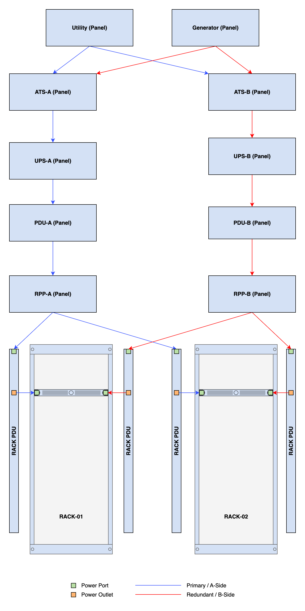

# Power Outlets

Power outlets represent the outlets on a power distribution unit (PDU) or other device that supply power to dependent devices. Each power port may be assigned a physical type, and may be associated with a specific feed leg (where three-phase power is used) and/or a specific upstream power port. This association can be used to model the distribution of power within a device.

For example, imagine a PDU with one power port which draws from a three-phase feed and 48 power outlets arranged into three banks of 16 outlets each. Outlets 1-16 would be associated with leg A on the port, and outlets 17-32 and 33-48 would be associated with legs B and C, respectively.

Cables can connect power outlets only to downstream power ports. (Pass-through ports cannot be used to model power distribution.)

+/- 2.3.0
    This model has been updated to support being installed in [Modules](module.md). As a result, there are now two fields for assignment to a Device or Module. One of the `device` or `module` fields must be populated but not both. If a `module` is supplied, the `device` field must be null, and similarly the `module` field must be null if a `device` is supplied.

## Example Power Topology

{: style="width: 50%"}
