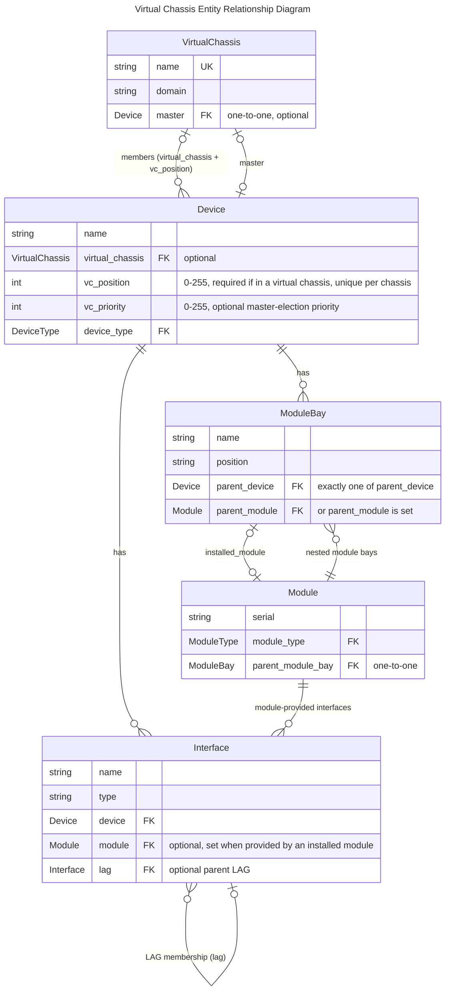

# Virtual Chassis

A virtual chassis represents a set of devices which share a common control plane. A common example of this is a stack of switches which are connected and configured to operate as a single device. A virtual chassis must be assigned a name and may be assigned a domain.

Each device in the virtual chassis is referred to as a VC member, and assigned a position and (optionally) a priority. VC member devices commonly reside within the same rack, though this is not a requirement. One of the devices may be designated as the VC master: This device will typically be assigned a name, services, and other attributes related to managing the VC.

You create your devices, then create the Virtual Chassis and assign the devices to the Virtual Chassis.

!!! note
    It's important to recognize the distinction between a virtual chassis and a chassis-based device. A virtual chassis is **not** suitable for modeling a chassis-based switch with removable line cards (such as the Juniper EX9208), as its line cards are _not_ physically autonomous devices. Chassis should be modeled with module bays and modules.

## Overview

The key piece of Virtual Chassis is when multiple physical devices operate as a **single logical device** with one management IP, such as a switch stack. The model itself is intentionally simple: a single `VirtualChassis` object that member devices point to, with each member recording its position in the stack. One member can be explicitly designated as the master, and Nautobot will surface all ports (interfaces, front ports, rear ports, etc.) from every member on that master device, reflecting how the stack actually presents itself on the network.

!!! note
    Interfaces are not "automatically" numbered. This is similar to the real world, in which when you get a device, the in interfaces presume a `1-slot`, such as `GigabitEthernet1/0/1`, but once you set it as the 3rd slot, the interface would be `GigabitEthernet1/0/1`. You are encouraged to use the Bulk Rename feature to bulk change the device interfaces.

LAG interfaces are supported across devices that have the same parent virtual chassis — this is the one case in Nautobot where a LAG's member interfaces may live on different devices. The LAG will show its member interfaces across the multiple devices on the LAG itself. The recommendation is to create the LAG interface itself (e.g. `PortChannel10`) on the expected master device. Because the chassis is a single logical device, the LAG fully captures the relationship on its own; no additional grouping model (such as an Interface Redundancy Group) is needed.

| Field | Type | Required | Description |
|---|---|---|---|
| `name` | string | Yes | Unique name identifying the virtual chassis |
| `master` | ForeignKey to Device | No | The device that acts as the control plane master for the chassis; all member devices are managed through this device |
| `domain` | string | No | Optional domain name shared across chassis members (used in some vendor implementations for identification) |

The following fields are on the `Device` model, in support of the Virtual Chassis featureset.

| Attribute | Type | Required | Description |
|---|---|---|---|
| `virtual_chassis` | ForeignKey to VirtualChassis | No | The virtual chassis this device belongs to |
| `vc_position` | integer (0–255) | Yes (if in VC) | Slot/position of this device within the virtual chassis; must be unique per chassis |
| `vc_priority` | integer (0–255) | No | Election priority for master role; higher values win (vendor behavior varies) |

## Entity Relationship Diagram

This schema illustrates the connections between the models involved in a virtual chassis.

TODO: Validate AI Generated ERD



## Sample API

```python
import sys
import pynautobot

NAUTOBOT_URL = "http://demo.nautobot.com"
NAUTOBOT_TOKEN = "aaaaaaaaaaaaaaaaaaaaaaaaaaaaaaaaaaaaaaaa"

ROLE_NAME = "router"
ROOT_NAME = "jcy"
MGMT_PREFIX = "192.168.1.0/24"
DEVICE_TYPE_MODEL = "C9300"

LOCATION_NAME = f"{ROOT_NAME.upper()}"
VC_NAME = f"{ROOT_NAME}-vc01"
VC_DOMAIN = f"{ROOT_NAME}-vc01"
DEVICE_1_NAME = f"{ROOT_NAME}-vc01"
DEVICE_2_NAME = f"{ROOT_NAME}-vc01:2"

# Only the master carries a management IP; the chassis is reached through it.
DEVICES = [
    {"name": DEVICE_1_NAME, "position": 1, "priority": 15, "mgmt_ip": "192.168.1.10/24"},
    {"name": DEVICE_2_NAME, "position": 2, "priority": 14, "mgmt_ip": None},
]

# Stack cabling: member 2's stack ports loop back to member 1's (ring topology).
STACK_CABLES = [
    ((DEVICE_2_NAME, "StackPort2/1"), (DEVICE_1_NAME, "StackPort1/2")),
    ((DEVICE_2_NAME, "StackPort2/2"), (DEVICE_1_NAME, "StackPort1/1")),
]

nb = pynautobot.api(url=NAUTOBOT_URL, token=NAUTOBOT_TOKEN)


def get_or_create(endpoint, lookup, defaults=None):
    """Return (record, created) for the given endpoint, matching pynautobot filter kwargs."""
    record = endpoint.get(**lookup)
    if record:
        return record, False
    return endpoint.create(**{**lookup, **(defaults or {})}), True


def log(created, kind, name):
    print(f"  {'created' if created else 'exists '}  {kind}: {name}")


active = nb.extras.statuses.get(name="Active")
connected = nb.extras.statuses.get(name="Connected")
location = nb.dcim.locations.get(name=LOCATION_NAME)
device_type = nb.dcim.device_types.get(model=DEVICE_TYPE_MODEL)
namespace = nb.ipam.namespaces.get(name="Global")
for obj, label in [
    (active, "Status Active"),
    (connected, "Status Connected"),
    (location, f"Location {LOCATION_NAME}"),
    (device_type, f"DeviceType {DEVICE_TYPE_MODEL}"),
    (namespace, "Namespace Global"),
]:
    if obj is None:
        sys.exit(f"Prerequisite not found in {NAUTOBOT_URL}: {label}")

print("Seeding prerequisites...")
role = nb.extras.roles.get(name=ROLE_NAME)

_, created = get_or_create(nb.ipam.prefixes, {"prefix": MGMT_PREFIX, "namespace": namespace.id}, {"status": active.id})
log(created, "Prefix", MGMT_PREFIX)

# The VirtualChassis is created first, without a master; the master is set after
# both member devices exist and have joined (master must be a member).
print("Seeding virtual chassis...")
vc, created = get_or_create(nb.dcim.virtual_chassis, {"name": VC_NAME}, {"domain": VC_DOMAIN})
log(created, "VirtualChassis", vc.name)

interfaces = {}
lag = None
for spec in DEVICES:
    print(f"Seeding {spec['name']}...")
    device, created = get_or_create(
        nb.dcim.devices,
        {"name": spec["name"]},
        {
            "device_type": device_type.id,
            "role": role.id,
            "location": location.id,
            "status": active.id,
            "virtual_chassis": vc.id,
            "vc_position": spec["position"],
            "vc_priority": spec["priority"],
        },
    )
    log(created, "Device", device.name)
    if spec["position"] == 1:
        master = device

    mgmt, created = get_or_create(
        nb.dcim.interfaces,
        {"device": device.id, "name": "GigabitEthernet0/0"},
        {"type": "1000base-t", "status": active.id, "mgmt_only": True, "description": "Management Interface"},
    )
    log(created, "Interface", f"{device.name} GigabitEthernet0/0")

    if spec["mgmt_ip"]:
        mgmt_ip, created = get_or_create(
            nb.ipam.ip_addresses, {"address": spec["mgmt_ip"], "namespace": namespace.id}, {"status": active.id}
        )
        log(created, "IPAddress", str(mgmt_ip.address))
        _, created = get_or_create(nb.ipam.ip_address_to_interface, {"interface": mgmt.id, "ip_address": mgmt_ip.id})
        log(created, "IP assignment", f"{mgmt_ip.address} -> {device.name} GigabitEthernet0/0")
        device.update({"primary_ip4": mgmt_ip.id})

    for port_number in (1, 2):
        stack_port_name = f"StackPort{spec['position']}/{port_number}"
        stack_port, created = get_or_create(
            nb.dcim.interfaces,
            {"device": device.id, "name": stack_port_name},
            {"type": "cisco-stackwise-480", "status": active.id, "description": "Stack ring"},
        )
        log(created, "Interface", f"{device.name} {stack_port_name}")
        interfaces[(device.name, stack_port_name)] = stack_port

    if spec["position"] == 1:
        lag, created = get_or_create(
            nb.dcim.interfaces,
            {"device": device.id, "name": "Port-Channel1"},
            {"type": "lag", "status": active.id, "description": "Cross-stack uplink LAG to upstream distribution"},
        )
        log(created, "Interface", f"{device.name} Port-Channel1")

    uplink_name = f"TenGigabitEthernet{spec['position']}/1/1"
    uplink, created = get_or_create(
        nb.dcim.interfaces,
        {"device": device.id, "name": uplink_name},
        {"type": "10gbase-x-sfpp", "status": active.id, "lag": lag.id, "description": "Uplink (Po1 member)"},
    )
    log(created, "Interface", f"{device.name} {uplink_name}")
    if uplink.lag is None:
        uplink.update({"lag": lag.id})

# Master can only be set once it is a member of the chassis.
if vc.master is None:
    vc.update({"master": master.id})
    log(True, "VC master", f"{vc.name} -> {master.name}")
else:
    log(False, "VC master", f"{vc.name} -> {master.name}")

print("Seeding stack port cables...")
for (a_device, a_name), (b_device, b_name) in STACK_CABLES:
    side_a = nb.dcim.interfaces.get(interfaces[(a_device, a_name)].id)
    if side_a.cable:
        log(False, "Cable", f"{a_device} {a_name} <-> {b_device} {b_name}")
        continue
    nb.dcim.cables.create(
        termination_a_type="dcim.interface",
        termination_a_id=side_a.id,
        termination_b_type="dcim.interface",
        termination_b_id=interfaces[(b_device, b_name)].id,
        status=connected.id,
    )
    log(True, "Cable", f"{a_device} {a_name} <-> {b_device} {b_name}")

```

## Sample Design Builder

The following [Design Builder](https://docs.nautobot.com/projects/design-builder/en/latest/) example models the same two-member virtual chassis as the Sample API above (`jcy-vc01`). It demonstrates the patterns required to handle the circular dependency between a `Device` and its `VirtualChassis`: switch 1 is created first and tagged with `"!ref": "sw1"`, the `VirtualChassis` is then created inline with `master: "!ref:sw1"` and `deferred: true` so the master assignment happens after both objects exist, and the primary IPv4 address is similarly deferred until interface and IP assignments are in place. Switch 2 joins the existing chassis via `"!ref:virtual_chassis"`, and the stack ports between members are wired together using `"!connect_cable"` against the refs on switch 1.

```jinja2
devices:
    # Switch 1 of the stack
  - "!create_or_update:name": "jcy-vc01"
    location__name: "JCY"
    status__name: "Active"
    device_type__model: "C9300"
    role__name: "router"
    "!ref": "sw1"
    # Virtual chassis attributes
    vc_position: 1
    vc_priority: 15
    # Virtual chassis creation with deferred assignment (Device created first then VC created with switch 1 as master)
    virtual_chassis:
      "!create_or_update:name": "jcy-vc01"
      domain: "jcy-vc01"
      master: "!ref:sw1"
      deferred: true
      "!ref": "virtual_chassis"
    # Interfaces (subset for brevity)
    interfaces:
      - "!create_or_update:name": "GigabitEthernet0/0"
        type: "1000base-t"
        status__name: "Active"
        mgmt_only: true
        description: "Management Interface"
        ip_address_assignments:
          - "!create_or_update:ip_address__address": "192.168.1.10/24"
            ip_address:
              "!create_or_update:address": "192.168.1.10/24"
              "!create_or_update:parent": "192.168.1.0/24"
              status__name: "Active"
              "!ref": "sw1_mgmt_ip"
      - "!create_or_update:name": "StackPort1/1"
        type: "cisco-stackwise-480"
        status__name: "Active"
        description: "Stack ring"
        "!ref": "sw1_stackport_1"
      - "!create_or_update:name": "StackPort1/2"
        type: "cisco-stackwise-480"
        status__name: "Active"
        description: "Stack ring"
        "!ref": "sw1_stackport_2"
      - "!create_or_update:name": "Port-Channel1"
        type: "lag"
        status__name: "Active"
        description: "Cross-stack uplink LAG to upstream distribution"
        "!ref": "po1"
      - "!create_or_update:name": "TenGigabitEthernet1/1/1"
        type: "10gbase-x-sfpp"
        status__name: "Active"
        description: "Uplink (Po1 member)"
        lag: "!ref:po1"
    # Deferred IP assignment to avoid dependency issues with interface creation/assignment
    primary_ip4:
      "address": "!ref:sw1_mgmt_ip"
      deferred: true

    # Switch 2 of the stack
  - "!create_or_update:name": "jcy-vc01:2"
    location__name: "JCY"
    status__name: "Active"
    device_type__model: "C9300"
    role__name: "router"
    # VC assignment to existing VC with switch 1 as master
    virtual_chassis: "!ref:virtual_chassis"
    # VC attributes
    vc_position: 2
    vc_priority: 14
    # interfaces (subset for brevity)
    interfaces:
      - "!create_or_update:name": "GigabitEthernet0/0"
        type: "1000base-t"
        status__name: "Active"
        mgmt_only: true
        description: "Management Interface"
      - "!create_or_update:name": "StackPort2/1"
        type: "cisco-stackwise-480"
        status__name: "Active"
        description: "Stack ring"
        "!connect_cable":
          status__name: "Connected"
          to: "!ref:sw1_stackport_2"
      - "!create_or_update:name": "StackPort2/2"
        type: "cisco-stackwise-480"
        status__name: "Active"
        description: "Stack ring"
        "!connect_cable":
          status__name: "Connected"
          to: "!ref:sw1_stackport_1"
      - "!create_or_update:name": "TenGigabitEthernet2/1/1"
        type: "10gbase-x-sfpp"
        status__name: "Active"
        description: "Uplink (Po1 member)"
        lag: "!ref:po1"
    # No primary IP assignment on switch 2 to avoid conflicts with switch 1 management IP
```

## GraphQL

The following query retrieves a virtual chassis by name and uses the master device's `vc_interfaces` field to return every interface across all chassis members in a single flat list. `vc_interfaces` on the VC master expands to the master's own interfaces plus the non-management interfaces of every other member, so there is no need to walk `members -> interfaces` separately.

```graphql
query ($vc_name: [String]) {
  virtual_chassis(name: $vc_name) {
    name
    domain
    members {
      name
      vc_position
      vc_priority
    }
    master {
      name
      primary_ip {
        address
      }
      interfaces: vc_interfaces {
        name
        type
        enabled
        mac_address
        mode
        mgmt_only
        description
        device {
          name
          vc_position
        }
        lag {
          name
        }
        ip_addresses {
          address
        }
      }
    }
  }
}
```

Query variables:

```json
{
  "vc_name": "jcy-vc01"
}
```

```json
{
  "data": {
    "virtual_chassis": [
      {
        "name": "jcy-vc01",
        "domain": "jcy-vc01",
        "members": [
          {
            "name": "jcy-vc01",
            "vc_position": 1,
            "vc_priority": 15
          },
          {
            "name": "jcy-vc01:2",
            "vc_position": 2,
            "vc_priority": 14
          }
        ],
        "master": {
          "name": "jcy-vc01",
          "primary_ip": {
            "address": "192.168.1.10/24"
          },
          "interfaces": [
            {
              "name": "GigabitEthernet0/0",
              "type": "A_1000BASE_T",
              "enabled": true,
              "mac_address": null,
              "mode": null,
              "mgmt_only": true,
              "description": "Management Interface",
              "device": {
                "name": "jcy-vc01",
                "vc_position": 1
              },
              "lag": null,
              "ip_addresses": [
                {
                  "address": "192.168.1.10/24"
                }
              ]
            },
            {
              "name": "TenGigabitEthernet1/1/1",
              "type": "A_10GBASE_X_SFPP",
              "enabled": true,
              "mac_address": null,
              "mode": null,
              "mgmt_only": false,
              "description": "Uplink (Po1 member)",
              "device": {
                "name": "jcy-vc01",
                "vc_position": 1
              },
              "lag": {
                "name": "Port-Channel1"
              },
              "ip_addresses": []
            },
            {
              "name": "StackPort1/1",
              "type": "CISCO_STACKWISE_480",
              "enabled": true,
              "mac_address": null,
              "mode": null,
              "mgmt_only": false,
              "description": "Stack ring",
              "device": {
                "name": "jcy-vc01",
                "vc_position": 1
              },
              "lag": null,
              "ip_addresses": []
            },
            {
              "name": "StackPort1/2",
              "type": "CISCO_STACKWISE_480",
              "enabled": true,
              "mac_address": null,
              "mode": null,
              "mgmt_only": false,
              "description": "Stack ring",
              "device": {
                "name": "jcy-vc01",
                "vc_position": 1
              },
              "lag": null,
              "ip_addresses": []
            },
            {
              "name": "Port-Channel1",
              "type": "LAG",
              "enabled": true,
              "mac_address": null,
              "mode": null,
              "mgmt_only": false,
              "description": "Cross-stack uplink LAG to upstream distribution",
              "device": {
                "name": "jcy-vc01",
                "vc_position": 1
              },
              "lag": null,
              "ip_addresses": []
            },
            {
              "name": "TenGigabitEthernet2/1/1",
              "type": "A_10GBASE_X_SFPP",
              "enabled": true,
              "mac_address": null,
              "mode": null,
              "mgmt_only": false,
              "description": "Uplink (Po1 member)",
              "device": {
                "name": "jcy-vc01:2",
                "vc_position": 2
              },
              "lag": {
                "name": "Port-Channel1"
              },
              "ip_addresses": []
            },
            {
              "name": "StackPort2/1",
              "type": "CISCO_STACKWISE_480",
              "enabled": true,
              "mac_address": null,
              "mode": null,
              "mgmt_only": false,
              "description": "Stack ring",
              "device": {
                "name": "jcy-vc01:2",
                "vc_position": 2
              },
              "lag": null,
              "ip_addresses": []
            },
            {
              "name": "StackPort2/2",
              "type": "CISCO_STACKWISE_480",
              "enabled": true,
              "mac_address": null,
              "mode": null,
              "mgmt_only": false,
              "description": "Stack ring",
              "device": {
                "name": "jcy-vc01:2",
                "vc_position": 2
              },
              "lag": null,
              "ip_addresses": []
            }
          ]
        }
      }
    ]
  }
}
```


!!! note
    Because `vc_interfaces` is a property on the `Device` model, the same query can be run directly against the master device (e.g. `query { devices(name: ["jcy-vc01"]) { vc_interfaces { ... } } }`) without going through `virtual_chassis` at all.

## Key Charteristics

- Can you port channel across multiple devices? Yes — spanned EtherChannel is supported in FTD clustering
- Can you see all interfaces on the Primary (control node)? No — Each node can only see its interfaces, but all cluster interfaces are visible via FMC
- Can you see all interfaces on the Backup (data node)? No — only interfaces physically on that chassis module are visible locally
- On Primary, can you tell which interfaces are assigned to which device? No — Only the FMC can see all interfaces
- When do you see all the interfaces on the master device? You cannot - Only the FMC can see all interface
- Can you connect interfaces from master to non-master? Yes
- What should the naming standard be for the chassis device? Use the shared cluster name / FMC display name (logical single name)
- Should I use interface named templates? Yes

## Questions to ask of the data model

Given the data model, what questions would a user ask?

- Given a device, I would like to know whether it is a member of a virtual chassis.
- Given a device in a virtual chassis, I would like to know whether it is the master.
- Given a device in a virtual chassis, I would like to know its position (slot) within the stack.
- Given a device in a virtual chassis, I would like to know which member would be elected master next.
- Given a device in a virtual chassis, I would like to know its sibling members.
- Given a virtual chassis, I would like to know all of its member devices and how many there are.
- Given a virtual chassis, I would like to know how to connect to its management plane (the master's primary IP — the members do not have one of their own).
- Given a virtual chassis, I would like to know its domain or stack identifier.
- Given a virtual chassis, I would like to know every interface across all of its members.
- Given an interface shown on the master, I would like to know which physical member it actually lives on.
- Given a member device, I would like to know which stack/HA ports connect it to which sibling, and on which port (via cables).  TODO: Confirm
- Given a LAG, I would like to know its member interfaces and which stack member each one lives on.

## Dual-chassis Single Control Plane

Dual-chassis Single Control Plane VSS / StackWise Virtual (Cisco)

### Configuration Generation

_Standard Global Config_

```
!
switch virtual domain 200
  switch 1
!
```

> Note: Switch number is local, domain must match

_Management Plane_

```
int port-channel 201
 switchport
 switch virtual link 1
!
interface TenGigabitEthernet1/1/1
 description VSL Link
 no switchport
 no ip address
 no cdp enable
 channel-group 201 mode on
!
interface TenGigabitEthernet1/1/2
 description VSL Link
 no switchport
 no ip address
 no cdp enable
 channel-group 201 mode on
```

> Note: Port Channel is different on the different switches, e.g. 201 for switch 1 and 202 for switch 2

Switch 2:

_Standard Global Config_

```
switch virtual domain 200
  switch 2
```

_Management Plane_

> Note: Port Channel is different on the different switches, e.g. 201 for switch 1 and 202 for switch 2

```
interface port-channel 202
 switchport
 switch virtual link 1
!
interface TenGigabitEthernet2/1/1
 description VSL Link
 no switchport
 no ip address
 no cdp enable
 channel-group 202 mode on
!
interface TenGigabitEthernet2/1/2
 description VSL Link
 no switchport
 no ip address
 no cdp enable
 channel-group 202 mode on
```

_Data Plane_

Switch 1 & 2

```
interface port-channel2
  description VSL Link
  switchport mode trunk
  switchport trunk allowed vlan 10,20,30,40
!
interface TenGigabitEthernet1/0/1
  switchport mode trunk
  switchport trunk allowed vlan 10,20,30,40
  channel-group 2 mode active
!
interface TenGigabitEthernet2/0/1
  switchport mode trunk
  switchport trunk allowed vlan 10,20,30,40
  channel-group 2 mode active
```

> Note: this config is on a single management IP


## Multi-Chassis Stack

Multi-chassis Stack Stackwise / Virtual Chassis / Arista Stack / HPE IRF / Extreme SummitStack

### Configuration Generation

_Standard Global Config_

1. Master Switch (Primary)
Set a high priority (default is 1, max is 15) to ensure this switch wins the election.

```
switch 1 priority 15
switch 1 renumber 1
```

2. Member Switches (Non-Master)
Keep a lower priority. You should renumber them so their interfaces are easily identifiable (e.g., Member 2 uses 2/0/x).

```
switch 2 priority 1
switch 1 renumber 2
```

_Management Plane_

You only configure this once on the Master; it automatically propagates to all members.

- Option A: Using an SVI (VLAN interface)

```
interface Vlan1
 ip address 192.168.1.10 255.255.255.0
 no shut
```

- Option B: Using the Dedicated Management Port

```
interface Management0/0
 ip address 10.1.1.10 255.255.255.0
 no shut
```

_Data Plane_

Because the stack behaves as one logical switch, the configuration is identical to a standard Port-Channel, except the interface identifiers reflect the different stack members (e.g., 1/0/1 and 2/0/1).

```
interface Port-channel 1
 description Uplink-to-Core
 switchport mode trunk

interface GigabitEthernet 1/0/1 # <== 1 is member 1 of stack.
 channel-group 1 mode active

interface GigabitEthernet 2/0/1 # <== 2 is member 2 of stack.
 channel-group 1 mode active
```

### Firewall Cluster
Firewall Cluster Cisco FXOS / SRX


#### Configuration Generation

_FXOS Chassis — Physical Interface Config_

```
scope eth-uplink
  scope fabric a
    scope interface Ethernet1/1
      set port-type data
      enable
      exit
    scope interface Ethernet1/2
      set port-type data
      enable
      exit
    scope interface Ethernet1/3
      set port-type cluster
      enable
      exit
    scope interface Ethernet1/4
      set port-type cluster
      enable
      exit
    exit
  exit
```

> Note: Interfaces designated `cluster` type are reserved for CCL; `data` interfaces are assigned to logical devices

_FXOS Chassis — CCL Port Channel_

```
scope eth-uplink
  scope fabric a
    create port-channel 48
      set port-channel-mode active
      create member-port Ethernet1/3
      create member-port Ethernet1/4
      exit
    exit
  exit
```

> Note: The CCL port channel ID (48 in this example) must match on both chassis; use dedicated high-bandwidth interfaces

_FXOS Chassis — Logical Device (Cluster Bootstrap)_

```
scope ssa
  scope slot 1
    scope app-instance ftd FTD-CLUSTER
      set cluster-role control
      set cluster-group-id 1
      set ccl-network 192.0.2.0
      set ccl-mask 255.255.255.0
      exit
    exit
  exit
```

> Note: `cluster-role` is set to `control` on the primary chassis slot and `data` on all others; `cluster-group-id` must match across all members

