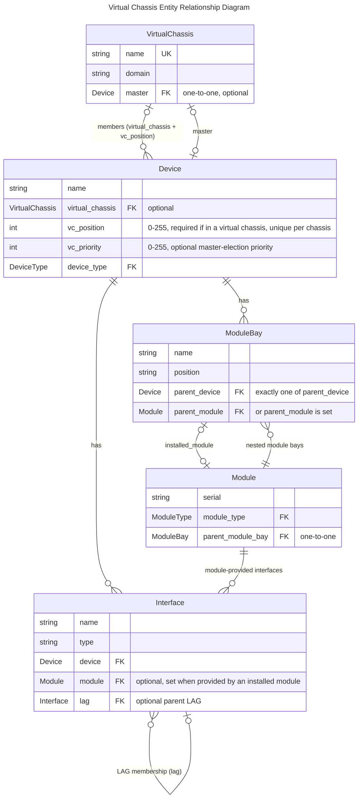

# Virtual Chassis

A virtual chassis represents a set of devices which share a common control plane. A common example of this is a stack of switches which are connected and configured to operate as a single device. A virtual chassis must be assigned a name and may be assigned a domain.

Each device in the virtual chassis is referred to as a VC member, and assigned a position and (optionally) a priority. VC member devices commonly reside within the same rack, though this is not a requirement. One of the devices may be designated as the VC master: This device will typically be assigned a name, services, and other attributes related to managing the VC.

You create your devices, then create the Virtual Chassis and assign the devices to the Virtual Chassis.

!!! note
    It's important to recognize the distinction between a virtual chassis and a chassis-based device. A virtual chassis is **not** suitable for modeling a chassis-based switch with removable line cards (such as the Juniper EX9208), as its line cards are _not_ physically autonomous devices. Chassis should be modeled with module bays and modules.

## Overview

Choosing between this and a [Device Redundancy Group](deviceredundancygroup.md) comes down to the management control plane count — use a Virtual Chassis when the members share **one** control plane, and a Device Redundancy Group when each keeps its **own**. See [HA Devices](hadevice.md) for the full comparison.

Use a Virtual Chassis when multiple physical devices operate as a **single logical device** with one management IP, such as a switch stack. The model is small: a single `VirtualChassis` object that member devices point to, with each member recording its position in the stack. One member can be explicitly designated as the master, and Nautobot will surface all ports (interfaces, front ports, rear ports, etc.) from every member on that master device, reflecting how the stack actually presents itself on the network. The one exception is an interface with `mgmt_only` set, which is not surfaced on the master.

!!! note
    Interfaces are not renumbered automatically. As on real hardware, a device's interfaces default to slot 1 (e.g. `GigabitEthernet1/0/1`); when that device becomes member 3, its interfaces should be `GigabitEthernet3/0/1`. Use the Bulk Rename feature to renumber them.

LAG interfaces are supported across devices that have the same parent virtual chassis — this is the one case in Nautobot where a LAG's member interfaces may live on different devices. The LAG will show its member interfaces across the multiple devices on the LAG itself. The recommendation is to create the LAG interface itself (e.g. `PortChannel10`) on the expected master device. Because the chassis is a single logical device, the LAG fully captures the relationship on its own; no additional grouping model (such as an Interface Redundancy Group) is needed.

| Field | Type | Required | Description |
|---|---|---|---|
| `name` | string | Yes | Unique name identifying the virtual chassis |
| `master` | ForeignKey to Device | No | The device that acts as the control plane master for the chassis; all member devices are managed through this device |
| `domain` | string | No | The vendor's stack/chassis identifier shared across members (e.g. StackWise stack ID, VSS/StackWise Virtual domain, IRF domain ID). Config templates read this as the domain/stack ID. |

The following fields are on the `Device` model, in support of the Virtual Chassis featureset.

| Attribute | Type | Required | Description |
|---|---|---|---|
| `virtual_chassis` | ForeignKey to VirtualChassis | No | The virtual chassis this device belongs to |
| `vc_position` | integer (0–255) | Yes (if in VC) | Slot/position of this device within the virtual chassis; must be unique per chassis |
| `vc_priority` | integer (0–255) | No | Election priority for master role; higher values win (vendor behavior varies) |

## Entity Relationship Diagram

This schema illustrates the connections between the models involved in a virtual chassis.



!!! note
    Prior to 3.2, not every interface had a direct foreign key to its device. An interface installed in a module instead referenced the module, which in turn referenced the device, so the link to the device was indirect.

## Sample API

??? example "Show pynautobot script"

    ```python
    import sys
    import pynautobot

    NAUTOBOT_URL = "http://demo.nautobot.com"
    NAUTOBOT_TOKEN = "aaaaaaaaaaaaaaaaaaaaaaaaaaaaaaaaaaaaaaaa"

    ROLE_NAME = "router"
    ROOT_NAME = "jcy"
    MGMT_PREFIX = "192.168.1.0/24"
    DEVICE_TYPE_MODEL = "C9300"
    # VLANs carried by the cross-stack uplink LAG (so a config template can render the trunk).
    VLAN_IDS = [10, 20, 30, 40]

    LOCATION_NAME = f"{ROOT_NAME.upper()}"
    VC_NAME = f"{ROOT_NAME}-vc01"
    VC_DOMAIN = f"{ROOT_NAME}-vc01"
    DEVICE_1_NAME = f"{ROOT_NAME}-vc01"
    DEVICE_2_NAME = f"{ROOT_NAME}-vc01:2"

    # Only the master carries a management IP; the chassis is reached through it.
    DEVICES = [
        {"name": DEVICE_1_NAME, "position": 1, "priority": 15, "mgmt_ip": "192.168.1.10/24"},
        {"name": DEVICE_2_NAME, "position": 2, "priority": 14, "mgmt_ip": None},
    ]

    # Stack cabling: member 2's stack ports loop back to member 1's (ring topology).
    STACK_CABLES = [
        ((DEVICE_2_NAME, "StackPort2/1"), (DEVICE_1_NAME, "StackPort1/2")),
        ((DEVICE_2_NAME, "StackPort2/2"), (DEVICE_1_NAME, "StackPort1/1")),
    ]

    nb = pynautobot.api(url=NAUTOBOT_URL, token=NAUTOBOT_TOKEN)


    def get_or_create(endpoint, lookup, defaults=None):
        """Return (record, created) for the given endpoint, matching pynautobot filter kwargs."""
        record = endpoint.get(**lookup)
        if record:
            return record, False
        return endpoint.create(**{**lookup, **(defaults or {})}), True


    def log(created, kind, name):
        print(f"  {'created' if created else 'exists '}  {kind}: {name}")


    active = nb.extras.statuses.get(name="Active")
    connected = nb.extras.statuses.get(name="Connected")
    location = nb.dcim.locations.get(name=LOCATION_NAME)
    device_type = nb.dcim.device_types.get(model=DEVICE_TYPE_MODEL)
    namespace = nb.ipam.namespaces.get(name="Global")
    for obj, label in [
        (active, "Status Active"),
        (connected, "Status Connected"),
        (location, f"Location {LOCATION_NAME}"),
        (device_type, f"DeviceType {DEVICE_TYPE_MODEL}"),
        (namespace, "Namespace Global"),
    ]:
        if obj is None:
            sys.exit(f"Prerequisite not found in {NAUTOBOT_URL}: {label}")

    print("Seeding prerequisites...")
    role = nb.extras.roles.get(name=ROLE_NAME)

    _, created = get_or_create(nb.ipam.prefixes, {"prefix": MGMT_PREFIX, "namespace": namespace.id}, {"status": active.id})
    log(created, "Prefix", MGMT_PREFIX)

    # Global VLANs (no location) so they can be assigned to interfaces on any member device.
    vlan_ids = []
    for vid in VLAN_IDS:
        vlan, created = get_or_create(nb.ipam.vlans, {"vid": vid}, {"name": f"vlan{vid}", "status": active.id})
        log(created, "VLAN", str(vid))
        vlan_ids.append(vlan.id)

    # The VirtualChassis is created first, without a master; the master is set after
    # both member devices exist and have joined (master must be a member).
    print("Seeding virtual chassis...")
    vc, created = get_or_create(nb.dcim.virtual_chassis, {"name": VC_NAME}, {"domain": VC_DOMAIN})
    log(created, "VirtualChassis", vc.name)

    interfaces = {}
    lag = None
    for spec in DEVICES:
        print(f"Seeding {spec['name']}...")
        device, created = get_or_create(
            nb.dcim.devices,
            {"name": spec["name"]},
            {
                "device_type": device_type.id,
                "role": role.id,
                "location": location.id,
                "status": active.id,
                "virtual_chassis": vc.id,
                "vc_position": spec["position"],
                "vc_priority": spec["priority"],
            },
        )
        log(created, "Device", device.name)
        if spec["position"] == 1:
            master = device

        mgmt, created = get_or_create(
            nb.dcim.interfaces,
            {"device": device.id, "name": "GigabitEthernet0/0"},
            {"type": "1000base-t", "status": active.id, "mgmt_only": True, "description": "Management Interface"},
        )
        log(created, "Interface", f"{device.name} GigabitEthernet0/0")

        if spec["mgmt_ip"]:
            mgmt_ip, created = get_or_create(
                nb.ipam.ip_addresses, {"address": spec["mgmt_ip"], "namespace": namespace.id}, {"status": active.id}
            )
            log(created, "IPAddress", str(mgmt_ip.address))
            _, created = get_or_create(nb.ipam.ip_address_to_interface, {"interface": mgmt.id, "ip_address": mgmt_ip.id})
            log(created, "IP assignment", f"{mgmt_ip.address} -> {device.name} GigabitEthernet0/0")
            device.update({"primary_ip4": mgmt_ip.id})

        for port_number in (1, 2):
            stack_port_name = f"StackPort{spec['position']}/{port_number}"
            stack_port, created = get_or_create(
                nb.dcim.interfaces,
                {"device": device.id, "name": stack_port_name},
                {"type": "cisco-stackwise-480", "status": active.id, "description": "Stack ring"},
            )
            log(created, "Interface", f"{device.name} {stack_port_name}")
            interfaces[(device.name, stack_port_name)] = stack_port

        if spec["position"] == 1:
            lag, created = get_or_create(
                nb.dcim.interfaces,
                {"device": device.id, "name": "Port-Channel1"},
                {
                    "type": "lag",
                    "status": active.id,
                    "description": "Cross-stack uplink LAG to upstream distribution",
                    # mode + tagged_vlans let a template render `switchport mode trunk` and the allowed VLAN list.
                    "mode": "tagged",
                    "tagged_vlans": vlan_ids,
                },
            )
            log(created, "Interface", f"{device.name} Port-Channel1")

        uplink_name = f"TenGigabitEthernet{spec['position']}/1/1"
        uplink, created = get_or_create(
            nb.dcim.interfaces,
            {"device": device.id, "name": uplink_name},
            {"type": "10gbase-x-sfpp", "status": active.id, "lag": lag.id, "description": "Uplink (Po1 member)"},
        )
        log(created, "Interface", f"{device.name} {uplink_name}")
        if uplink.lag is None:
            uplink.update({"lag": lag.id})

    # Master can only be set once it is a member of the chassis.
    if vc.master is None:
        vc.update({"master": master.id})
        log(True, "VC master", f"{vc.name} -> {master.name}")
    else:
        log(False, "VC master", f"{vc.name} -> {master.name}")

    print("Seeding stack port cables...")
    for (a_device, a_name), (b_device, b_name) in STACK_CABLES:
        side_a = nb.dcim.interfaces.get(interfaces[(a_device, a_name)].id)
        if side_a.cable:
            log(False, "Cable", f"{a_device} {a_name} <-> {b_device} {b_name}")
            continue
        nb.dcim.cables.create(
            termination_a_type="dcim.interface",
            termination_a_id=side_a.id,
            termination_b_type="dcim.interface",
            termination_b_id=interfaces[(b_device, b_name)].id,
            status=connected.id,
        )
        log(True, "Cable", f"{a_device} {a_name} <-> {b_device} {b_name}")

    ```

## Sample Design Builder

The following [Design Builder](https://docs.nautobot.com/projects/design-builder/en/latest/) example models the same two-member virtual chassis as the Sample API above (`jcy-vc01`). It demonstrates the patterns required to handle the circular dependency between a `Device` and its `VirtualChassis`: switch 1 is created first and tagged with `"!ref": "sw1"`, the `VirtualChassis` is then created inline with `master: "!ref:sw1"` and `deferred: true` so the master assignment happens after both objects exist, and the primary IPv4 address is similarly deferred until interface and IP assignments are in place. Switch 2 joins the existing chassis via `"!ref:virtual_chassis"`.

TODO: review `connect_cable` design builder extenstion post

??? example "Show Design Builder YAML"

    ```jinja2
    # Prefixes are created first so the management IPs below can parent to them.
    prefixes:
      - "!create_or_update:prefix": "192.168.1.0/24"
        status__name: "Active"
        "!ref": "mgmt_prefix"

    devices:
        # Switch 1 of the stack
      - "!create_or_update:name": "jcy-vc01"
        location__name: "JCY"
        status__name: "Active"
        device_type__model: "C9300"
        role__name: "router"
        "!ref": "sw1"
        # Virtual chassis attributes
        vc_position: 1
        vc_priority: 15
        # Virtual chassis creation with deferred assignment (Device created first then VC created with switch 1 as master)
        virtual_chassis:
          "!create_or_update:name": "jcy-vc01"
          domain: "jcy-vc01"
          master: "!ref:sw1"
          deferred: true
          "!ref": "virtual_chassis"
        # Interfaces (subset for brevity)
        interfaces:
          - "!create_or_update:name": "GigabitEthernet0/0"
            type: "1000base-t"
            status__name: "Active"
            mgmt_only: true
            description: "Management Interface"
            ip_address_assignments:
              - ip_address:
                  "!create_or_update:address": "192.168.1.10/24"
                  "!create_or_update:parent": "!ref:mgmt_prefix"
                  status__name: "Active"
          - "!create_or_update:name": "StackPort1/1"
            type: "cisco-stackwise-480"
            status__name: "Active"
            description: "Stack ring"
            # `to` is a query that must resolve to exactly one #termination, not a bare ref.
            #"!connect_cable":
            #  status__name: "Connected"
            #  to:
            #    device: "!ref:sw1"
            #    name: "StackPort1/2"
          - "!create_or_update:name": "StackPort1/2"
            type: "cisco-stackwise-480"
            status__name: "Active"
            description: "Stack ring"
            #"!connect_cable":
            #  status__name: "Connected"
            #  to:
            #    device: "!ref:sw1"
            #    name: "StackPort1/1"
          - "!create_or_update:name": "Port-Channel1"
            type: "lag"
            status__name: "Active"
            description: "Cross-stack uplink LAG to upstream distribution"
            # mode + tagged_vlans let a config template render the trunk and its allowed VLAN list
            mode: "tagged"
            tagged_vlans:
              - "!create_or_update:vid": 10
                name: "vlan10"
                status__name: "Active"
              - "!create_or_update:vid": 20
                name: "vlan20"
                status__name: "Active"
              - "!create_or_update:vid": 30
                name: "vlan30"
                status__name: "Active"
              - "!create_or_update:vid": 40
                name: "vlan40"
                status__name: "Active"
            "!ref": "po1"
          - "!create_or_update:name": "TenGigabitEthernet1/1/1"
            type: "10gbase-x-sfpp"
            status__name: "Active"
            description: "Uplink (Po1 member)"
            lag: "!ref:po1"
        # Deferred IP assignment to avoid dependency issues with interface creation/assignment.
        # `!get` looks the address up after the interface and its IP have been created;
        # `deferred` waits until the device is saved before assigning it.
        primary_ip4:
          "!get:address": "192.168.1.10/24"
          deferred: true

        # Switch 2 of the stack
      - "!create_or_update:name": "jcy-vc01:2"
        location__name: "JCY"
        status__name: "Active"
        device_type__model: "C9300"
        role__name: "router"
        # VC assignment to existing VC with switch 1 as master
        virtual_chassis: "!ref:virtual_chassis"
        # VC attributes
        vc_position: 2
        vc_priority: 14
        # interfaces (subset for brevity)
        interfaces:
          - "!create_or_update:name": "GigabitEthernet0/0"
            type: "1000base-t"
            status__name: "Active"
            mgmt_only: true
            description: "Management Interface"
          - "!create_or_update:name": "StackPort2/1"
            type: "cisco-stackwise-480"
            status__name: "Active"
            description: "Stack ring"
          - "!create_or_update:name": "StackPort2/2"
            type: "cisco-stackwise-480"
            status__name: "Active"
            description: "Stack ring"
          - "!create_or_update:name": "TenGigabitEthernet2/1/1"
            type: "10gbase-x-sfpp"
            status__name: "Active"
            description: "Uplink (Po1 member)"
            lag: "!ref:po1"
        # No primary IP assignment on switch 2 to avoid conflicts with switch 1 management IP
    ```

## GraphQL

The following query retrieves a virtual chassis by name and walks each member device and its interfaces. Querying `members { interfaces { ... } }` (rather than the master's `vc_interfaces`) returns *every* device fully — including each member's own management interface, which `vc_interfaces` filters out — so a template can generate the complete configuration for both devices. It returns the chassis `domain`, the `master` (to identify the primary), and per member its `vc_position`/`vc_priority`/`primary_ip4` plus each interface's `type`, `lag` membership, `mode`, and tagged/untagged VLANs.

```graphql
query ($vc_name: [String]) {
  virtual_chassis(name: $vc_name) {
    name
    domain
    master {
      name
    }
    members {
      name
      vc_position
      vc_priority
      primary_ip4 {
        address
      }
      interfaces {
        name
        type
        enabled
        mode
        mgmt_only
        description
        lag {
          name
        }
        untagged_vlan {
          vid
        }
        tagged_vlans {
          vid
        }
        ip_addresses {
          address
        }
      }
    }
  }
}
```

Query variables:

```json
{
  "vc_name": "jcy-vc01"
}
```

```json
{
    "data": {
        "virtual_chassis": [
            {
                "name": "jcy-vc01",
                "domain": "jcy-vc01",
                "master": {"name": "jcy-vc01"},
                "members": [
                    {
                        "name": "jcy-vc01",
                        "vc_position": 1,
                        "vc_priority": 15,
                        "primary_ip4": {"address": "192.168.1.10/24"},
                        "interfaces": [
                            {
                                "name": "GigabitEthernet0/0",
                                "type": "A_1000BASE_T",
                                "enabled": True,
                                "mode": None,
                                "mgmt_only": True,
                                "description": "Management Interface",
                                "lag": None,
                                "untagged_vlan": None,
                                "tagged_vlans": [],
                                "ip_addresses": [{"address": "192.168.1.10/24"}],
                            },
                            {
                                "name": "TenGigabitEthernet1/1/1",
                                "type": "A_10GBASE_X_SFPP",
                                "enabled": True,
                                "mode": None,
                                "mgmt_only": False,
                                "description": "Uplink (Po1 member)",
                                "lag": {"name": "Port-Channel1"},
                                "untagged_vlan": None,
                                "tagged_vlans": [],
                                "ip_addresses": [],
                            },
                            {
                                "name": "StackPort1/1",
                                "type": "CISCO_STACKWISE_480",
                                "enabled": True,
                                "mode": None,
                                "mgmt_only": False,
                                "description": "Stack ring",
                                "lag": None,
                                "untagged_vlan": None,
                                "tagged_vlans": [],
                                "ip_addresses": [],
                            },
                            {
                                "name": "StackPort1/2",
                                "type": "CISCO_STACKWISE_480",
                                "enabled": True,
                                "mode": None,
                                "mgmt_only": False,
                                "description": "Stack ring",
                                "lag": None,
                                "untagged_vlan": None,
                                "tagged_vlans": [],
                                "ip_addresses": [],
                            },
                            {
                                "name": "Port-Channel1",
                                "type": "LAG",
                                "enabled": True,
                                "mode": "TAGGED",
                                "mgmt_only": False,
                                "description": "Cross-stack uplink LAG to upstream distribution",
                                "lag": None,
                                "untagged_vlan": None,
                                "tagged_vlans": [
                                    {"vid": 10},
                                    {"vid": 20},
                                    {"vid": 30},
                                    {"vid": 40},
                                ],
                                "ip_addresses": [],
                            },
                        ],
                    },
                    {
                        "name": "jcy-vc01:2",
                        "vc_position": 2,
                        "vc_priority": 14,
                        "primary_ip4": None,
                        "interfaces": [
                            {
                                "name": "GigabitEthernet0/0",
                                "type": "A_1000BASE_T",
                                "enabled": True,
                                "mode": None,
                                "mgmt_only": True,
                                "description": "Management Interface",
                                "lag": None,
                                "untagged_vlan": None,
                                "tagged_vlans": [],
                                "ip_addresses": [],
                            },
                            {
                                "name": "TenGigabitEthernet2/1/1",
                                "type": "A_10GBASE_X_SFPP",
                                "enabled": True,
                                "mode": None,
                                "mgmt_only": False,
                                "description": "Uplink (Po1 member)",
                                "lag": {"name": "Port-Channel1"},
                                "untagged_vlan": None,
                                "tagged_vlans": [],
                                "ip_addresses": [],
                            },
                            {
                                "name": "StackPort2/1",
                                "type": "CISCO_STACKWISE_480",
                                "enabled": True,
                                "mode": None,
                                "mgmt_only": False,
                                "description": "Stack ring",
                                "lag": None,
                                "untagged_vlan": None,
                                "tagged_vlans": [],
                                "ip_addresses": [],
                            },
                            {
                                "name": "StackPort2/2",
                                "type": "CISCO_STACKWISE_480",
                                "enabled": True,
                                "mode": None,
                                "mgmt_only": False,
                                "description": "Stack ring",
                                "lag": None,
                                "untagged_vlan": None,
                                "tagged_vlans": [],
                                "ip_addresses": [],
                            },
                        ],
                    },
                ],
            }
        ]
    }
}

```

!!! note
    `members { interfaces }` returns each device independently, so it works for any redundant model — including a Device Redundancy Group, which has no master and no `vc_interfaces`. If you only need the flat list of interfaces surfaced on the master, you can instead query `master { vc_interfaces { ... } }`.

## Key Characteristics

- **Can you port channel across multiple devices?** Yes — spanned EtherChannel is supported in FTD clustering
- **Can you see all interfaces on the Primary (control node)?** No — Each node can only see its interfaces, but all cluster interfaces are visible via FMC
- **Can you see all interfaces on the Backup (data node)?** No — only interfaces physically on that chassis module are visible locally
- **On Primary, can you tell which interfaces are assigned to which device?** No — Only the FMC can see all interfaces
- **When do you see all the interfaces on the primary device?** You cannot - Only the FMC can see all interface
- **Can you connect interfaces from primary to non-primary?** Yes
- **What should the naming standard be for the chassis device?** Use the shared cluster name / FMC display name (logical single name)
- **Should I use interface named templates?** Yes

## Questions to ask of the data model

Given the data model, what questions would a user ask?

- Given a device, I would like to know whether it is a member of a virtual chassis.
- Given a device in a virtual chassis, I would like to know whether it is the master.
- Given a device in a virtual chassis, I would like to know its position (slot) within the stack.
- Given a device in a virtual chassis, I would like to know which member would be elected master next.
- Given a device in a virtual chassis, I would like to know its sibling members.
- Given a virtual chassis, I would like to know all of its member devices and how many there are.
- Given a virtual chassis, I would like to know how to connect to its management plane (the master's primary IP — the members do not have one of their own).
- Given a virtual chassis, I would like to know its domain or stack identifier.
- Given a virtual chassis, I would like to know every interface across all of its members.
- Given an interface shown on the master, I would like to know which physical member it actually lives on.
- Given a member device, I would like to know which stack/HA ports connect it to which sibling, and on which port (via cables).
- Given a LAG, I would like to know its member interfaces and which stack member each one lives on.

!!! tip
    You can answer all of these questions with the prior defined GraphQL query.

## Configuration Generation

=== "Dual-chassis Single Control Plane"

    Dual-chassis Single Control Plane VSS / StackWise Virtual (Cisco)


    A config template driven entirely by the GraphQL response above. Each member becomes a virtual-switch identity, and every LAG is rendered as a port channel with its member interfaces.

    ```jinja2
    
    
    # ~~~~~ {{ member.name }} ~~~~~

    ## Standard Global Config

    !
    switch virtual domain {{ vc.domain }}
      switch {{ member.vc_position }}
    !

    ## note: Switch number is local, domain must match

    ## Management Plane Configuration

    int port-channel {{ 200 + member.vc_position }}
     switchport
     switch virtual link {{ member.vc_position }}
    !
    
    interface {{ vsl.name }}
     description VSL Link
     no switchport
     no ip address
     no cdp enable
     channel-group {{ 200 + member.vc_position }} mode on
    !
    

    ## note: Port Channel is different on the different switches

    
    # ~~~~~ Data Plane (all members) ~~~~~

    ## Data Plane Configuration

    
    
    
    
    interface {{ lag.name }}
      description {{ lag.description }}
      switchport mode trunk
      switchport trunk allowed vlan {{ ns.vlans }}
    !
    
    
    
    
    interface {{ port.name }}
      switchport mode trunk
      switchport trunk allowed vlan {{ ns.vlans }}
      channel-group {{ port.lag.name | replace("Port-Channel", "") }} mode active
    !
    
    
    ```

    > Note: this config is on a single management IP

=== "Multi-Chassis Stack"

    Multi-chassis Stack Stackwise / Virtual Chassis / Arista Stack / HPE IRF / Extreme SummitStack

    A config template driven entirely by the GraphQL response above. Member priority drives master election and `vc_position` renumbers each member; management is configured once on the master, and the uplink LAG becomes a trunked port channel.

    ```jinja2
    
    
    # ~~~~~ {{ "Master" if member.name == vc.master.name else "Member" }} Device ({{ member.name }}) ~~~~~

    switch {{ member.vc_position }} priority {{ member.vc_priority }}
    switch {{ member.vc_position }} renumber {{ member.vc_position }}

    
    # ~~~~~ Management Device ~~~~~

    ## Management Plane Configuration

    # note: Configuration is applied to all devices in the stack.

    
    
    interface {{ iface.name }}
     ip address {{ iface.ip_addresses[0].address | ios_ip }}
     no shut
    
    

    ## Data Plane Configuration

    
    
    interface {{ lag.name }}
     description {{ lag.description }}
     switchport mode trunk
    
    
    
    

    interface {{ port.name }} # <== member {{ member.vc_position }} of stack.
     channel-group {{ port.lag.name | replace("Port-Channel", "") }} mode active
    
    
    ```

    > Note: On member, keep a lower priority. You should renumber them so their interfaces are easily identifiable (e.g., Member 2 uses 2/0/x).

=== "Firewall Cluster"

    Firewall Cluster Cisco FTD / SRX

    TODO: Is it FXOS or FTD??

    A config template driven entirely by the GraphQL response above. The chassis `domain` becomes the cluster group id, the lowest-numbered member takes the `control` role, and each LAG becomes a CCL port channel built from its member interfaces.

    ```jinja2
    
    ## Physical Interface Configuration

    scope eth-uplink
      scope fabric a
    
    
        scope interface {{ port.name }}
          set port-type cluster
          enable
          exit
    
    
        exit
      exit
    !
    ## CCL Port Channel Configuration

    
    
    scope eth-uplink
      scope fabric a
        create port-channel {{ lag.name | replace("Port-Channel", "") }}
          set port-channel-mode active
    
    
          create member-port {{ port.name }}
    
    
          exit
        exit
      exit
    
    
    !
    ## Logical Device (Cluster Bootstrap) Configuration

    scope ssa
    
      scope slot {{ member.vc_position }}
        scope app-instance ftd {{ vc.name }}
          set cluster-group-id {{ vc.domain }}
          set cluster-role {{ "control" if member.name == vc.master.name else "data" }}
          exit
        exit
    
      exit
    ```

    > Note: `cluster-role` is set to `control` on the primary chassis slot and `data` on all others; `cluster-group-id` must match across all members

    > Note: The CCL port channel ID must match on both chassis; use dedicated high-bandwidth interfaces

The script below renders the templates against GrpahQl query. Paste the GraphQL query from the [GraphQL](#graphql) section into a variable called `GRAPHQL_QUERY`, and one of the three templates above into `CLI_CONFIG_TEMPLATE`. This script is a continuation of the prior script above and assumes the variables `nb`, `NAUTOBOT_URL`, and `NAUTOBOT_TOKEN` are already set.

??? example "Config Generation Script"

    ```python
    GRAPHQL_QUERY = """."""              # Replace with the GraphQL query from above
    CLI_CONFIG_TEMPLATE = """."""         # Replace with one of the three config templates above

    import ipaddress

    from jinja2 import Environment

    VC_NAME = "jcy-vc01"


    def ios_ip(cidr):
        """Render "10.1.1.10/24" as IOS-style "10.1.1.10 255.255.255.0"."""
        iface = ipaddress.ip_interface(cidr)
        return f"{iface.ip} {iface.netmask}"


    gql = nb.graphql.query(query=GRAPHQL_QUERY, variables={"vc_name": VC_NAME})

    env = Environment(trim_blocks=True, lstrip_blocks=True)
    env.filters["ios_ip"] = ios_ip

    print(env.from_string(CLI_CONFIG_TEMPLATE).render(**gql.json))
    ```
