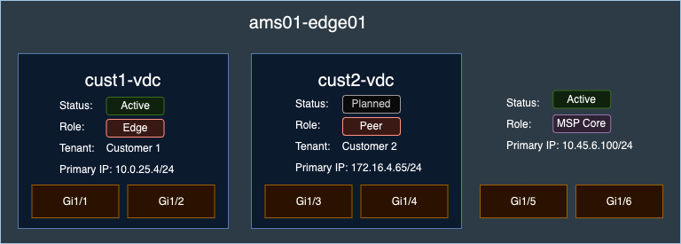

# Virtual Device Context (VDC)

+++ 2.4.0

A Virtual Device Context (VDC) refers to a logical partition of a physical network device, allowing it to function as multiple independent devices. Each VDC operates separately, with its own configuration, interfaces, and IP addresses. VDCs are particularly useful for multi-tenant environments, where different customers or applications require isolated configurations.

## Overview

In the above example, the physical device `ams01-edge01` has been "sliced" into two customer VDCs (`cust1-vdc` and `cust2-vdc`). Each of the VDCs contain much of the same data as regular devices, like roles, statuses, tenant relationships, primary IP addresses, etc. As for interfaces, the host device's interfaces can be assigned to one or more VDCs that live on the device. From the example, devices may also retain interfaces that are not assigned to any VDC.

## Example Use Cases

The VDC concept goes by several different names, depending on the vendor, and like other Nautobot features, there are nuances to a specific implementation, but Nautobot attempts to cover the most broad set of applicable use cases.

Some vendor examples of VDCs include:

1. Cisco Nexus Virtual Device Contexts
2. Juniper Logical Systems
3. Arista Multi-instance EOS
4. Nokia Virtual Service Router
5. F5 Virtual Clustered Multiprocessing

## VDC Fields Overview

| Field         | Type                                              | Description                                          |
|---------------|---------------------------------------------------|------------------------------------------------------|
| `name`        | CharField                                         | Name of the VDC.                                     |
| `device`      | ForeignKey to `dcim.Device`                       | Physical device associated with the VDC.             |
| `identifier`  | PositiveSmallIntegerField (optional)              | Unique identifier for the VDC from the platform.     |
| `status`      | StatusField                                       | Operational status of the VDC.                       |
| `role`        | RoleField (optional)                              | Role assigned to the VDC.                            |
| `primary_ip4` | ForeignKey to `ipam.IPAddress` (optional)         | Primary IPv4 address of the VDC.                     |
| `primary_ip6` | ForeignKey to `ipam.IPAddress` (optional)         | Primary IPv6 address of the VDC.                     |
| `tenant`      | ForeignKey to `tenancy.Tenant` (optional)         | Tenant associated with the VDC.                      |
| `interfaces`  | ManyToManyField through `dcim.InterfaceVDCAssignment` (optional) | Interfaces assigned to the VDC. |
| `description` | CharField (optional)                              | Description of the VDC.                              |
